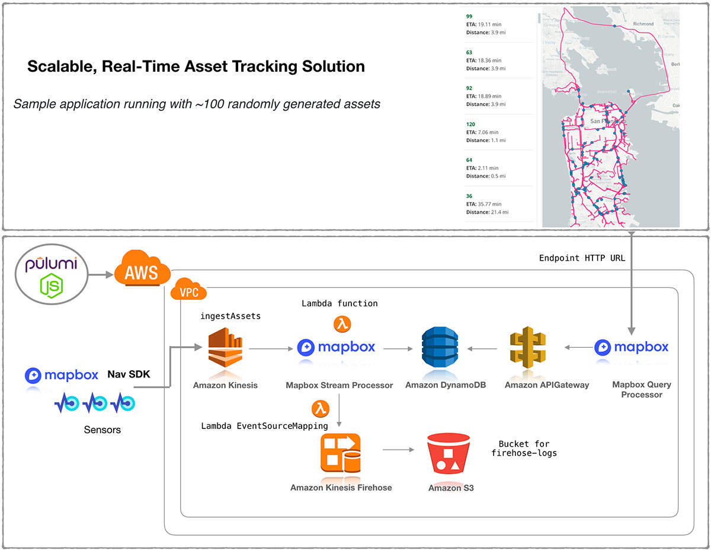

**Guest Author: Chris Toomey, Solution Architect Lead @ Mapbox**

With 8 billion+ connected IoT devices and 2 billion GPS-equipped
smartphones already online, logistics businesses are tracking assets at
every step in the supply chain. At this scale and complexity, it is
imperative to have a flexible way to ingest, process, and act upon this
data, without sacrificing security or best practices.

To meet this need, [Mapbox](https://www.mapbox.com/) has created an
Asset Tracking Solution that uses [Pulumi](/)'s
open source JavaScript libraries (AWS, AWSX) available with
multi-language support with [Pulumi Crosswalk for AWS]().
Pulumi Crosswalk for AWS is an open source framework that streamlines
creation, deployment and management of AWS services with built-in AWS
Best Practices and minimal lines of code in common programming
languages.

In this blog, we will show snippets of the Javascript code that embraces
the power of Pulumi to program AWS service APIs to create the Mapbox
solution. To see the full architecture in action with a live bike race
across America, please refer to this
[webinar](https://www.pulumi.com/webinar/aws-mapbox/?utm_campaign=Partner%20-%20AWS&utm_medium=email&_hsenc=p2ANqtz--wro3maaq0AodmaPINTCc0V7Cpd2xRwWLbVlSOp9d5kwsWV-2sgjVxDyUjeS7FfNinlOk2DKKa6wQ07K0xP-NQ9p1kGA&_hsmi=73158875&utm_content=73158875&utm_source=hs_email&hsCtaTracking=cd221e5f-79fa-4b95-b7e3-43b5a49609b2%7Ccd0a7d93-082a-4572-8e8e-abf1c1b2548f)
recorded on June 13th 2019 and the Mapbox
[whitepaper](https://www.mapbox.com/use-cases/asset-tracking/solutions-white-paper/).
Also refer to this blog of the [Race across America](https://blog.mapbox.com/team-haase-partners-with-mapbox-for-2019-race-across-america-bid-7803a3bdbe49)
showcased live during the webinar tomorrow.
<!--more-->

**Prerequisites:** [Install Pulumi]();
[Install Node.js version 8 or later](https://nodejs.org/en/download/) and
[Setup AWS]()

The diagram represents how Mapbox's solution design on AWS services is
built with Pulumi AWS and AWSX libraries in Javascript. Data is ingested
in the Asset tracking IOT solution with a REST API. Mapbox uses its
stream processor to perform enrichments such as geofencing,
traffic-aware ETA calculations, and high-prevision elevation. This data,
exposed by the API is backed by a high performance database (DynamoDB)
to enable visualization in realtime on the map client.



The fun part -- Pulumi Service console helps you map your cloud
architecture shown above as a connected set of DAG resources so you need
not remember what you deployed as your cloud environments scale:


Lets now work through the solution flow with some sample snippets of
code. To get access to the complete piece of code, please connect with
Mapbox solution team [here](mailto:chris.toomey@mapbox.com) and
Pulumi team [here](mailto:sales@pulumi.com). We will be happy to help you sample test this
solution on AWS!

**STEP 1: Create a Pulumi project using an AWS JavaScript template**

    $ brew install pulumi
    $ mkdir asset-tracking && cd asset-tracking
    $ pulumi new aws-javascript
    $ yarn install
    $ ls
    Pulumi.dev.yaml    Pulumi.yaml       index.js   node_modules    package-lock.json     package.json

**STEP 2: Create the ingestion REST API with AWS Services**

To visualize data the system has to accept large volumes of data from
multiple sources into the rest of the system. Mapbox uses Pulumi's AWS &
AWSX libraries to build an IOT ingestion rule and forwards it to Kinesis
streams. A sample `index.js` looks like this:

```javascript
"use strict";
const pulumi = require("@pulumi/pulumi");
const aws = require("@pulumi/aws");
const awsx = require("@pulumi/awsx");

// Create Kinesis stream for ingestion
const ingestStream = new aws.kinesis.Stream("ingestAssets", {
  shardCount: 1,
  retentionPeriod: 72
});

// Create IoT Rule to push into Kinesis stream
const iotRole = new aws.iam.Role("iotRole", {
  assumeRolePolicy: JSON.stringify({
    Version: "2012-10-17",
    Statement: [
      {
        Effect: "Allow",
        Principal: {
          Service: "iot.amazonaws.com"
        },
        Action: "sts:AssumeRole"
      }
    ]
  })
});

const iotRolePolicy = new aws.iam.RolePolicy("iotRolePolicy", {
  policy: pulumi.interpolate`{
    "Version": "2012-10-17",
    "Statement": [
      {
          "Effect": "Allow",
          "Action": [
              "kinesis:*"
          ],
          "Resource": "${ingestStream.arn}"
      }
    ]
  }`,
  role: iotRole.id
});

const iotRule = new aws.iot.TopicRule("iotTrigger", {
  description: "Pass from IoT Core to Asset Tracking",
  name: "iotAssetIngest",
  enabled: true,
  kinesis: {
    partitionKey: "id",
    roleArn: iotRole.arn,
    streamName: ingestStream.name
  },
  sql: "SELECT * FROM 'topic'",
  sqlVersion: "2015-10-08"
});
```

Kinesis streams are used to ingest data into multiple AWS services
defined as IOT rules, Firehose and Lambda functions. Each ingest stream
has the right IAM role and policy to allow Kinesis to send the data into
these AWS services.

The code above does not shown the Javascript code for Lambda functions
used by Mapbox streamprocessor and Firehose all created with Pulumi AWS
and AWSX libraries.

To get this piece of code, please connect with Mapbox solution team
[here](mailto:chris.toomey@mapbox.com) and Pulumi team
[here](mailto:sales@pulumi.com).

**STEP 3: Create a consumption API for the map client to consume from a
data source**

Once, data is flowing through the system we build another API to query
DynamoDB, transform that data, and provide it to our mapping client in
geojson. With Pulumi AWSX, we create a APIGateway endpoint API that can
query this data out of DynamoDB. The sample code in `index.js` will look
like this:

To get this piece of code, please connect with Mapbox solution team
[here](mailto:chris.toomey@mapbox.com) and Pulumi team
[here](mailto:sales@pulumi.com).

```javascript
// Create DynamoDB Table
const assetTable = new aws.dynamodb.Table("assetTable", {
  attributes: [
    {
      name: "id",
      type: "S"
    },
    {
      name: "ts",
      type: "N"
    }
  ],
  hashKey: "id",
  rangeKey: "ts",
  ttl: {
    attributeName: "expiration",
    enabled: true
  },
    billingMode: "PAY_PER_REQUEST" 
  });

// Create API to read DynamoDB
const endpoint = new awsx.apigateway.API("assetQuery", {
  routes: [
    {
      path: "/",
      method: "GET",
      eventHandler: (request, ctx, cb) => {
        const AWS = require("aws-sdk");
        const ddb = new AWS.DynamoDB.DocumentClient({
          apiVersion: "2012-10-08"
        });
        const tableName = assetTable.name.value;
        const params = {
          TableName: tableName
        };
        ddb.scan(params, (err, data) => {
          const features = data.Items.map(item => {
            const point = turf.point([item.longitude, item.latitude], {
              id: item.id,
              speed: item.speed
            });
            return point;
          });
          const featureCollection = turf.featureCollection(features);
          cb(undefined, {
            statusCode: 200,
            body: Buffer.from(
              JSON.stringify(featureCollection),
              "utf8"
            ).toString("base64"),
            isBase64Encoded: true,
            headers: { "content-type": "application/json" }
          });
        });
      }
    }
  ],
  stageName: "dev"
});
```

Once we've created the API, we start defining our routes and then
in-line we can define a Lambda function. It can use NPM modules and
Pulumi will handle bundling all the dependencies.

This endpoint assumes we are querying Dynamo - and so we are going to
use the DynamoDB Document Client. Using that straightforward scan
syntax, we query the table and then start to parse our results. Since
every data point has a latitude and longitude as GeoJSON, the data is
transformed using [Turf.js](http://turfjs.org/) before sending to the
client. Even more beautiful is how Pulumi handles all the heavy lifting
of packaging, deploying, and giving you the endpoint to query
immediately.

**STEP 4: Hook up a map!**

Now we have data coming and going from our Solution, we just have to
hook it up to a Mapbox map. This is actually quite simple now that
Pulumi has built us a REST API.


Following this
[example](https://docs.mapbox.com/mapbox-gl-js/example/live-geojson/),
we paste in the endpoint from Pulumi and pick our interval.

### Additional Resources

For more solutions, check out the [Mapbox Blog](https://blog.mapbox.com/),
[Pulumi Blog]()) and get started
with more examples in our [Pulumi Examples repository](https://github.com/pulumi/examples) on GitHub. For AWS solutions visit
the AWS partner [blog site](https://aws.amazon.com/blogs/apn/).
