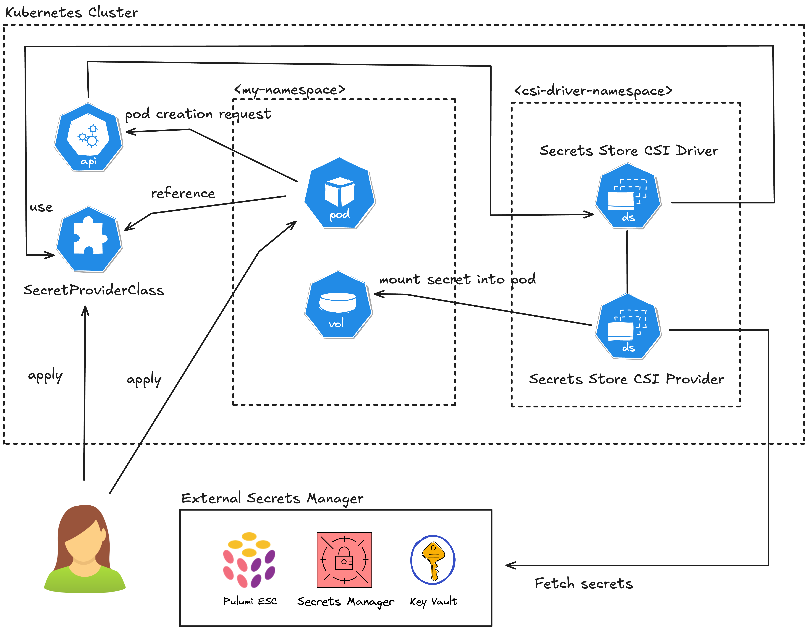
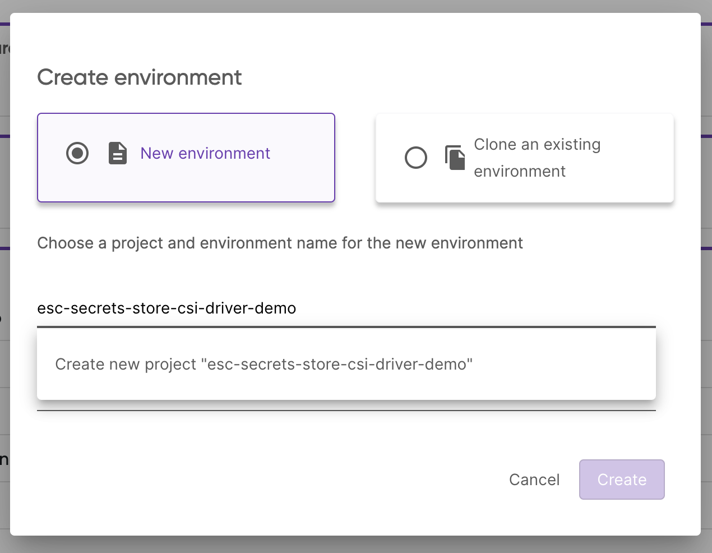
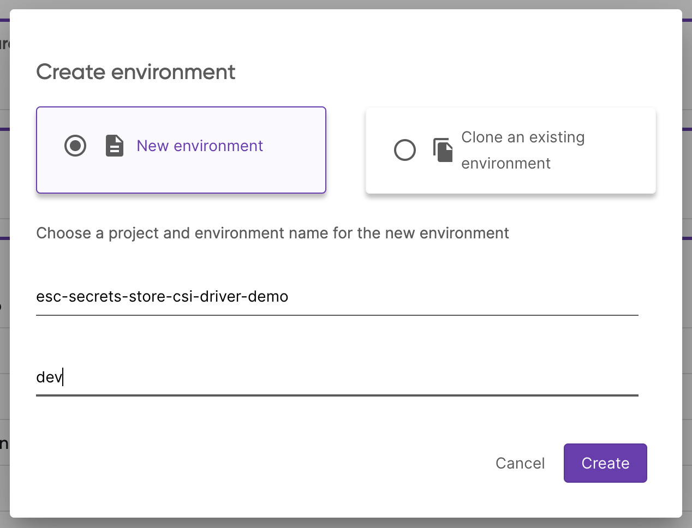
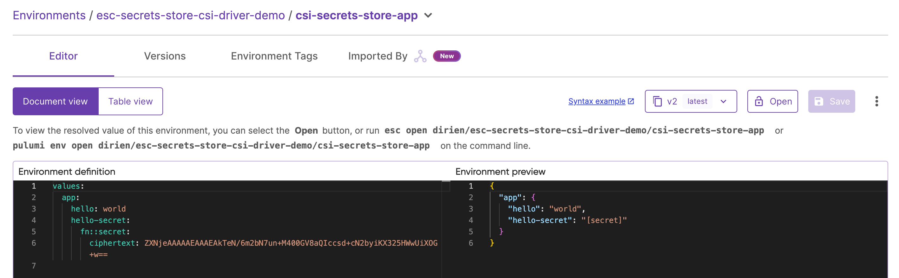

Welcome to the second blog post of the [Pulumi ESC](/product/secrets-management/) and Kubernetes secrets series. If you haven't had the chance to read the first blog post, go ahead and read it [here](/blog/cloud-native-secret-management-with-pulumi-esc-and-external-secrets-operator).

In the previous blog post, we have learned how to manage secrets with Pulumi ESC and the [External Secrets Operator](https://external-secrets.io/latest/). While the External Secrets Operator is a great tool to manage secrets in a cloud-native way, it still creates Kubernetes secrets in the cluster. Depending on your security requirements, you might want to avoid the use of Kubernetes secrets in your cluster at all. This is the point where you hit the limits of the External Secrets Operator.

But don't worry, we also have a solution for this problem. In this blog post, we will introduce the [Secrets Store CSI Driver](https://secrets-store-csi-driver.sigs.k8s.io/).

### TL;DR?

Jump straight to the comparison of the External Secrets Operator and the Secrets Store CSI Driver [here](#comparison-of-the-external-secrets-operator-and-the-secrets-store-csi-driver).

## Refresher: Why Should You Avoid Using Kubernetes Secrets?

Before we dive into the Secrets Store CSI Driver, let's quickly recap why you might want to avoid using native [Kubernetes secrets](https://kubernetes.io/docs/concepts/configuration/secret/). I wrote in depth about this topic in the previous blog post, but here is a quick summary:

- By default, etcd stores them in a base64-encoded format, which is not secure.
- Developers create them either manually by using kubectl commands or by using a manifest file, which makes them hard to manage at scale.
- Hard to manage and synchronise secrets across different environments and clusters.
- There is no default way to rotate secrets automatically.

Point 1 is the most critical one, as there is even a warning in the Kubernetes documentation:



## What is the Secrets Store CSI Driver?

The first thing you may notice is that in the name of the Secret Store CSI Driver, there is a reference to the [Container Storage Interface (CSI)](https://arslan.io/2018/06/21/how-to-write-a-container-storage-interface-csi-plugin/) standard.

*What is CSI and why it is used in the* Secret Store CSI Driver*?*



### Container Storage Interface (CSI)

The Container Storage Interface (CSI) is a standard to unify the interface between container orchestrators (like Kubernetes) and different storage vendors (like NetApp, Ceph, etc.). This helps to guarantee that implementing a CSI for a storage vendor is going to work with all orchestrators that support CSI.

Before CSI, we needed to create volume plugins for every orchestrator and storage vendor. This meant that developers coupled volume plugin development with the Kubernetes version and made it dependent on it. Bugs in volume plugins could break the Kubernetes components, instead of the volume plugin. Besides, volume plugins had full privileges on the Kubernetes components like the kubelet.

### Combining CSI, Kubernetes and Secrets = Secret Store CSI Driver

The Secret Store CSI Driver is a CSI driver that allows you to mount many secrets, certificates, and keys from external secret stores into Kubernetes pods as volumes. After attaching the volume, the system mounts the secrets into the container file system.

The benefits of using the Secret Store CSI Driver are that you manage the lifecycle of the secrets outside of Kubernetes while still providing a Kubernetes-native experience of using the secrets in your pods.

### The Architecture of the Secret Store CSI Driver



The Secret Store CSI Driver is a daemonset that lets all kublets communicate with each other and uses gRPC to talk to a provider. A SecretProviderClass custom resource specifies the definition of the external Secret Store. Then the system mounts a volume in the pod as `tmpfs`, and it injects the secret into the volume. When you delete the pod, the system cleans up the volume and removes the secret from the `tmpfs` volume.

## How to Use the Secrets Store CSI Driver with Pulumi ESC

Before we start, make sure you have the following prerequisites:

- A [Pulumi Cloud](https://app.pulumi.com/) account. If you don't have one, you can create one for free.
- A Kubernetes cluster (I will be using a local [KinD](https://kind.sigs.k8s.io/) cluster, but you can use any
  Kubernetes cluster)
- [Pulumi CLI](/docs/iac/download-install/) installed. You can also use the
  standalone [ESC CLI](/docs/esc/download-install/) to manage secrets and configurations.
- kubectl [CLI installed](https://kubernetes.io/docs/tasks/tools/) for some debugging

### Step 1: Deploy the Secrets Store CSI Driver and Pulumi ESC CSI Provider

We will use Pulumi with the pulumi-kubernetes provider to deploy the Secrets Store CSI Driver and the Pulumi ESC CSI Provider to our Kubernetes cluster.

And here we also use the integration of Pulumi ESC with Pulumi IaC to supply the Pulumi access token in a secure way.

First, we need to create a new Pulumi project:

```bash
# Choose your favorite Pulumi supported language
pulumi new kubernetes-<your-programming-language> --name
```

Before we dig into the code, let's head to the Pulumi Cloud Console and create a new Pulumi ESC project with the name `esc-secrets-store-csi-driver-demo`.



And create the environment `dev`:



In the editor add the following yaml into the `Environment definition`:

```yaml
values:
  pulumiConfig:
    pulumi-pat:
      fn::secret: <your-pulumi-pat>
```

{}

Don't know how to create a PAT? Check out the official Pulumi [documentation](https://www.pulumi.com/docs/pulumi-cloud/access-management/access-tokens/).

{}

If you prefer to use the Pulumi CLI, you can create the environment by running:

```bash
pulumi env init <your-org>/esc-secrets-store-csi-driver-demo/dev
```

And set the configuration by running the `env edit` command and copy the above YAML into the editor:

```bash
pulumi env edit <your-org>/esc-secrets-store-csi-driver-demo/dev
```

Now, we need to link the Pulumi ESC project to the Pulumi IaC project. To do this, we need to add the following to your `Pulumi.dev.yaml`:

```yaml
environment:
- esc-secrets-store-csi-driver-demo/dev
```



{}

```typescript

```

{}

{}

```javascript

```

{}

{}

```python

```

{}

{}

```go


```

{}

{}

```csharp


```

{}

Deploy the stack by running:

```bash
pulumi up
```

And you should see that the secret was created in the Kubernetes cluster and the ESO instance was deployed successfully.

```bash
kubectl get secret pulumi-access-token -o jsonpath='{.data.PULUMI_ACCESS_TOKEN}' | base64 -d
```

### Step 2: Create a SecretProviderClass

Now, we will create a secret in the Pulumi ESC project and synchronize it into the Kubernetes cluster by creating an `SecretProviderClass`:

Create a new ESC environment called `csi-secrets-store-app` in the `esc-secrets-store-csi-driver-demo` project:

```bash
values:
  app:
    hello: world
    hello-secret:
      fn::secret: world
```

If you prefer to use the Pulumi CLI, you can create the environment by running:

```bash
pulumi env init <your-org>/esc-secrets-store-csi-driver-demo/csi-secrets-store-app
```

And set the configuration by running the `env edit` command and copy the above YAML into the editor:

```bash
pulumi env edit <your-org>/esc-secrets-store-csi-driver-demo/csi-secrets-store-app
```

Either way, you should see following environment configuration in the Pulumi Cloud Console:



We can now create the `SecretProviderClass` in the Kubernetes cluster:



{}

```typescript

```

{}

{}

```javascript

```

{}

{}

```python

```

{}

{}

```go

```

{}

{}

```csharp

```

{}

We can check that the secret was successfully synchronized by running:

```bash
kubectl get secretproviderclasses example-provider-pulumi-esc
```



### Step 3: Deploy an Application and Mount the Secret

Now, we can deploy an application that references the secret from the Kubernetes cluster. I am going to use `busybox` that reads mounted file in.



{}

```typescript

```

{}

{}

```javascript

```

{}

{}

```python

```

{}

{}

```go

```

{}

{}

```csharp

```

{}

After deploying the stack, you can get the logs of the `busybox` pod to see that the secret was successfully mounted:

```bash
NAME=$(kubectl get pods -o name | grep example-provider-pulumi-esc | cut -d'/' -f2)
kubectl logs $NAME
```

You should see the following output:

```bash
+ ls /run/secrets
hello
+ find /run/secrets/ -mindepth 1 -maxdepth 1 -not -name '.*'
+ xargs -t -I '{}' sh -c 'echo "$(cat "{}")"'
sh -c echo "$(cat "/run/secrets/hello")"
world
+ tail -f /dev/null
```

Or you can exec into the pod and check the content of the mounted secret:

```bash
kubectl exec -it $NAME -- cat /run/secrets/hello
```

You should see the following output:

```bash
world
```

### Step 4: Clean Up

After you are done with the demo, you can clean up the resources by running:

```bash
pulumi destroy
```

## Conclusion

The Secret Store CSI Driver is a great option for managing secrets in a cloud-native way when the use of Kubernetes secrets is not an option due to enhanced security requirements.

[Below](#comparison-of-the-external-secrets-operator-and-the-secrets-store-csi-driver) is a quick comparison of the External Secrets Operator and the Secrets Store CSI Driver to help you decide which one is the best fit for your use case. As always, the best way to find out is to try both solutions and see which one fits your requirements best.

The good part is, whatever you choose, you can use Pulumi ESC to manage your secrets and avoid any secret sprawl in your organization as both solutions are supported by Pulumi ESC.

### Comparison of the External Secrets Operator and the Secrets Store CSI Driver

| Feature/Aspect                              | External Secrets Operator                                                                                              | CSI Secrets Driver                                                                                                           |
|---------------------------------------------|------------------------------------------------------------------------------------------------------------------------|------------------------------------------------------------------------------------------------------------------------------|
| **Primary Use Case**                        | Synchronizing external secrets into Kubernetes as native secrets.                                                      | Mounting secrets directly to pods as files or environment variables.                                                         |
| **Integration with External Secret Stores** | Supports multiple external secret stores like AWS Secrets Manager, Google Secret Manager, Vault, Azure Key Vault, etc. | Primarily supports integrations defined by the CSI specification (e.g., Vault, AWS, Azure Key Vault, Pulumi ESC).            |
| **Mechanism for Secrets Delivery**          | Secrets are pulled and stored as Kubernetes `Secret` resources.                                                        | Secrets are mounted directly into pods as files or injected as environment variables.                                        |
| **Kubernetes Resource Requirements**        | Requires a custom Kubernetes resource (`ExternalSecret`) and the External Secrets Operator.                            | Relies on the Kubernetes CSI (Container Storage Interface) standard and requires a specific CSI driver.                      |
| **Secret Rotation**                         | Supports automatic rotation by polling the external secret store at defined intervals.                                 | Supports rotation, but the application needs to handle reloading mounted secrets.                                            |
| **Security Considerations**                 | Secrets are stored temporarily in Kubernetes as native secrets, which may pose a risk if not properly managed.         | Secrets are mounted directly and not stored as native Kubernetes secrets, reducing exposure but relying on file permissions. |
| **Customization and Features**              | Highly customizable with fine-grained mappings and transformation options.                                             | Limited customization, focused on mounting secrets as-is.                                                                    |
| **Application Compatibility**               | Applications access secrets as Kubernetes secrets (e.g., via env variables or volumes).                                | Applications access secrets directly via mounted files or injected env variables.                                            |
| **Performance Considerations**              | Potential slight delay due to syncing secrets to Kubernetes secrets.                                                   | Faster access as secrets are directly mounted.                                                                               |
| **Community and Ecosystem**                 | Supported by a growing community; integrates well with diverse secret management solutions.                            | Part of the Kubernetes ecosystem; supports CSI-compliant secret storage solutions.                                           |
| **Best Use Cases**                          | Ideal for scenarios where secrets need to be accessed as Kubernetes native secrets.                                    | Best for applications requiring direct access to secrets without intermediate storage in Kubernetes secrets.                 |

You can find detailed information about all current available Pulumi ESC Kubernetes integrations in the [Pulumi ESC documentation](/docs/esc/integrations/kubernetes/).

Let us know what you think about the `Secret Store CSI Driver` and how you are managing secrets in your Kubernetes clusters. We would love to hear your feedback and experiences.


