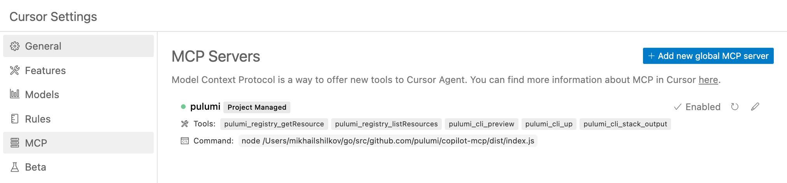
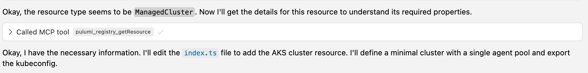
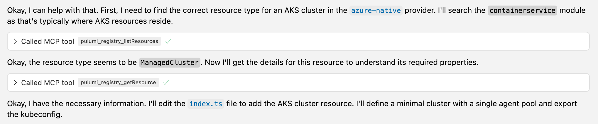
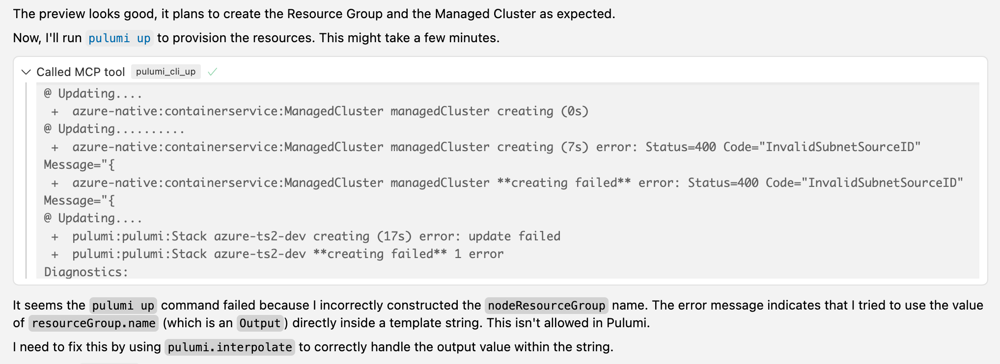
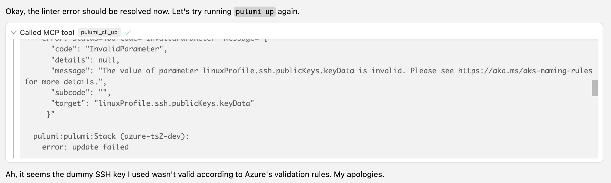
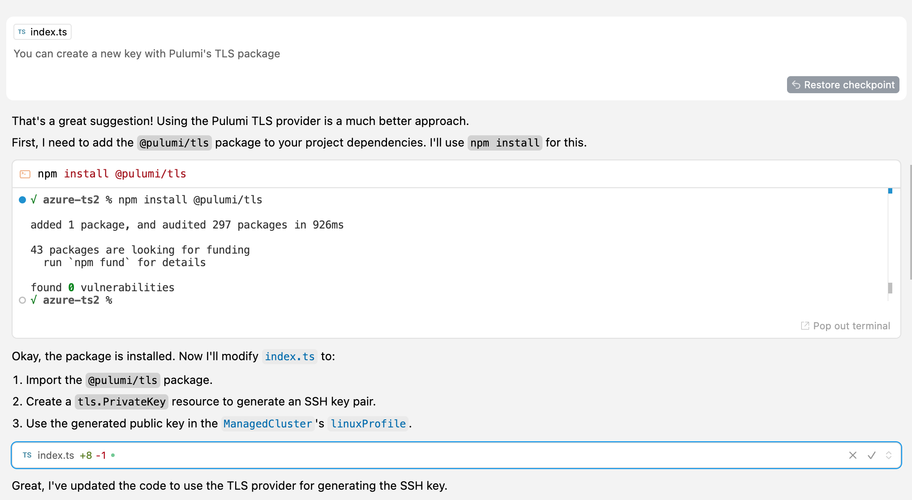
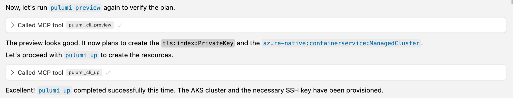
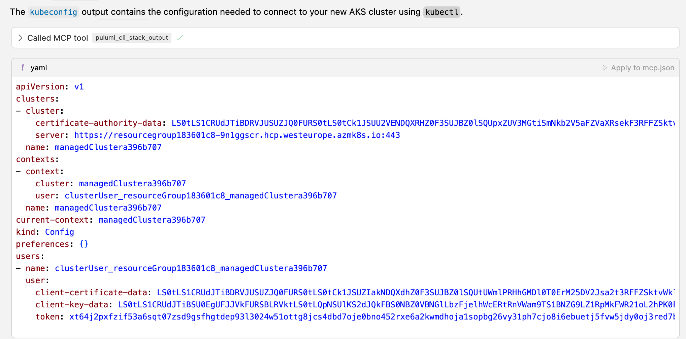

Infrastructure as Code (IaC) has revolutionized how we manage cloud resources, but navigating complex cloud provider APIs, writing boilerplate code, and iterating through deployment cycles can still be time-consuming. Pulumi offers a fantastic developer experience using familiar programming languages. But what if we could make it even *faster* and more intuitive by integrating powerful AI assistants directly into the development loop?

<!--more-->

This is where the **Pulumi Model Context Protocol (MCP) Server integration** shines. MCP is a specification that allows language models (like the AI in your coding assistant) to interact with external tools and data sources in a structured way. By connecting AI-powered code assistants with Pulumi's CLI and registry via MCP, we can bring real-time resource information and infrastructure management directly into the development environment, dramatically reducing friction and accelerating workflows.

Several AI coding assistants like GitHub Copilot, Anthropic's Claude Code, Windsurf and others are rapidly evolving; this post will use **Cursor** (an AI-first code editor) to demonstrate a real-world example of this synergy in action.

## Setting up the Pulumi MCP Integration in Cursor

Before diving in, you typically need to configure your AI assistant to communicate with the Pulumi MCP server. In Cursor, you create a configuration file named `mcp.json` within the `.cursor` directory in your project's root.

```json
{
    "mcpServers": {
        "pulumi": {
            "type": "stdio",
            "command": "npx",
            "args": ["@pulumi/mcp-server"]
        }
    }
}
```

3. Validating the connection within the assistant's settings (e.g., Cursor has a dedicated section to check the MCP connection status).

    

Once configured, the AI assistant can leverage Pulumi tools seamlessly. These tools are specific actions enabled by the MCP server—like searching the Pulumi Registry or running a `pulumi` command—allowing the assistant to gather information or interact with your Pulumi project.

## The Goal: Provisioning an AKS Cluster

Our objective for this walkthrough is to provision a temporary Azure Kubernetes Service (AKS) cluster for a short experiment using Pulumi and TypeScript. We need the cluster created with minimal fuss and its `kubeconfig` exported for access.

## The Traditional Approach

The conventional method for this task involves significant context switching: searching Azure and Pulumi documentation in a browser, writing code in an editor, running commands (`pulumi preview`, `pulumi up`) in a terminal, and manually correlating information between these different environments. This process can be slow, requires deep knowledge recall (or constant lookups), and is prone to errors during the manual translation from documentation to code.

## The AI Assistant + Pulumi MCP Approach

Let's walk through how the same task unfolds much more efficiently using an AI assistant integrated with Pulumi MCP.

### Understanding the AI Assistant + Tool Interaction

Before detailing the steps, it's helpful to understand the user interface flow when the AI assistant uses integrated tools like those provided by the Pulumi MCP integration. Typically:

1. The developer provides a prompt or instruction in the chat interface within their editor.
2. The AI assistant analyzes the request and determines that it needs specific information (like resource properties) or needs to perform an action (like running `pulumi preview`).
3. The assistant indicates it will use a specific tool (e.g., `pulumi_registry_listResources`, `pulumi_cli_preview`). This often appears as a distinct UI element in the chat, showing the tool name and parameters being used.
4. The tool executes via the MCP server, interacting with the Pulumi CLI or registry as needed.
5. The output or result from the tool (e.g., registry listings, preview results, deployment errors) is displayed directly in the chat interface.
6. The AI assistant processes this output and uses it to continue the task – either by generating code, providing an answer, or deciding on the next step (like suggesting a fix for an error).

This tight loop keeps the developer focused within their editor environment, minimizing disruptions.



### Step-by-Step Walkthrough

Here's how the AKS provisioning task played out:

#### The Request

The developer starts with a natural language request to the AI assistant within the editor:

> "I have an empty Pulumi project with TypeScript. Please edit the program to provision an AKS cluster for me. It's a temporary AKS cluster that I need for a short experiment, so I don't need any particular configuration of it. Just export its kubeconfig when you are done. Please use the tools to lookup resource information and to run pulumi preview to make sure your code works. When done, run pulumi up for me."

#### AI-Powered Resource Discovery

Instead of the developer manually searching docs, the AI assistant leverages the MCP integration.

- The AI assistant first queries the Pulumi Registry via MCP to list resources within the Azure Native provider's `containerservice` module (using the `pulumi_registry_listResources` tool). This immediately identified `ManagedCluster` as the relevant resource.
- The AI assistant then requested detailed information *specifically* for `ManagedCluster` (using `pulumi_registry_getResource`), directly retrieving its required properties, descriptions, and structure without leaving the editor.



#### AI Code Generation & Editing

Using the information retrieved from the Pulumi Registry, the assistant generated the necessary TypeScript code. It defined the `ManagedCluster` resource with a basic configuration and used its code editing capabilities to insert the code directly into the developer's `index.ts` file.

#### Integrated Validation

Before attempting a potentially time-consuming deployment, the assistant ran `pulumi preview` using the integrated CLI tool (`pulumi_cli_preview`). The preview output appeared directly in the chat.

The preview succeeded, showing the resources that would be created. The assistant then proceeded to run `pulumi up` using the integrated CLI tool (`pulumi_cli_up`). However, the deployment flagged an error: an incorrect attempt to interpolate a Pulumi `Output<string>` directly into a resource property.



#### AI-Assisted Debugging & Iteration

The assistant analyzed the error message from the tool:

- It identified the incorrect string interpolation and proposed a fix (using `pulumi.interpolate`), applying it via the editing tool.
- *Self-correction:* The first fix inadvertently introduced a circular dependency (caught by linters integrated into the editor and surfaced to the assistant). The assistant recognized this and further refined the code by removing the problematic property, correctly relying on Azure's default behavior.
- Another attempt to deploy using `pulumi up` failed, this time surfacing an Azure API error: the provided SSH key format was invalid.



#### Collaborative Problem Solving & Tooling

The developer, seeing the SSH key error, suggested using the Pulumi TLS package to generate a valid key dynamically.

- The assistant used the integrated terminal tool to execute `npm install @pulumi/tls`.
- It then edited the `index.ts` file again, incorporating the `tls.PrivateKey` resource and correctly using its `publicKeyOpenssh` output for the `ManagedCluster`'s Linux profile.



#### Successful Deployment

The subsequent `pulumi preview` showed the correct plan (including the new TLS key resource). The assistant then executed `pulumi up`, which completed successfully. The success message and resource summary appeared in the chat.



#### Accessing Outputs

Finally, retrieving the `kubeconfig` was trivial. The assistant used the stack output tool (`pulumi_cli_stack_output kubeconfig`) to fetch and display the configuration directly.



## Why This Changes the Game

Integrating AI assistants with the Pulumi Model Context Protocol offers tangible benefits:

- **Reduced Context Switching:** The entire workflow – discovery, coding, validation, deployment, debugging, output retrieval – happens primarily *inside* the editor. No more juggling browser tabs and terminal windows.
- **Accelerated Discovery:** MCP integration provides immediate, context-aware access to Pulumi resource schemas and documentation snippets.
- **Faster Coding:** AI generates boilerplate and resource definitions quickly based on registry data and natural language requests.
- **Tighter Feedback Loop:** `pulumi preview` and `pulumi up` results are instantly available within the coding environment, enabling rapid iteration.
- **Intelligent Assistance & Collaboration:** The AI assists with debugging complex errors, incorporates developer suggestions, and leverages integrated tooling effectively.

## Conclusion

The synergy between AI coding assistants and the Pulumi Model Context Protocol (MCP) integration creates a remarkably efficient environment for Infrastructure as Code development. By bringing cloud resource knowledge, code generation, and the Pulumi CLI workflow directly into the editor, developers can build, deploy, and iterate on their infrastructure faster and with significantly less friction.

Whether you use Cursor, Copilot, Claude Code, Windsurf, or another emerging AI tool, integrating it with the Pulumi MCP server offers a glimpse into the future of streamlined, intelligent IaC development, ultimately boosting productivity and improving the overall developer experience.
