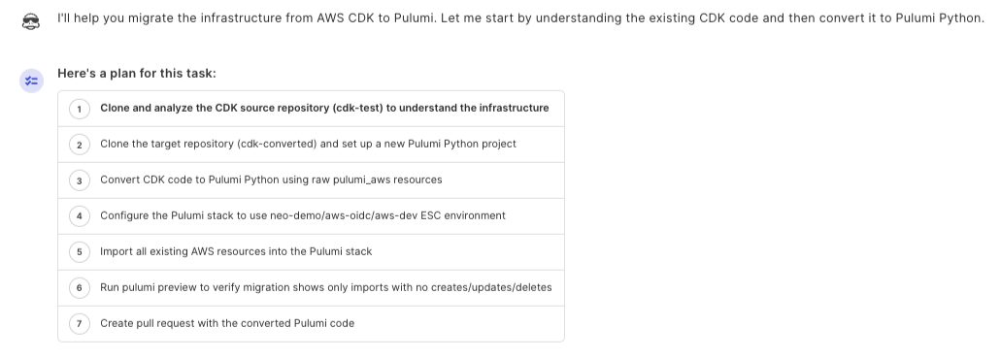
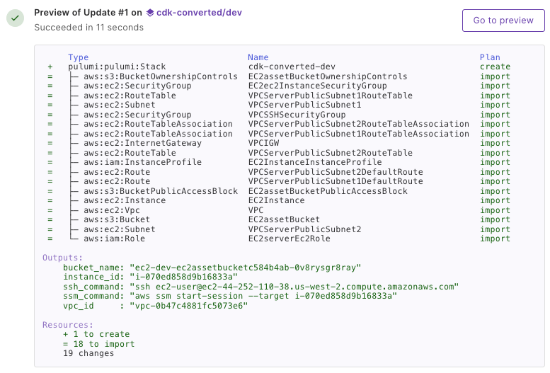

**You chose real programming languages for infrastructure. Here's how to take them multi-cloud.**

CDK got it right: real programming languages instead of YAML, reusable abstractions, infrastructure that feels like software engineering.

When your infrastructure needs grow beyond AWS (multi-cloud, enterprise governance, or faster provider coverage), Pulumi preserves what you've built while removing the constraints.

Neo, Pulumi's AI platform engineer, converts your existing CDK applications to Pulumi. Same languages. Same programming model. Multi-cloud capabilities when you need them.

<!--more-->

## Who Should Migrate

This makes sense if you:

- **Need multi-cloud.** You're adding Azure, GCP, or Kubernetes alongside AWS. CDK can't follow you there.
- **Want broader provider coverage.** Pulumi has native providers for 150+ services (Kubernetes, Datadog, GitHub, Auth0, PagerDuty, etc.) beyond what CloudFormation covers.
- **Need enterprise infrastructure management.** Policy-as-code, drift remediation, compliance frameworks, RBAC, and audit logging aren't available in CDK.
- **Hit CloudFormation limits.** The 500-resource-per-stack limit forces unnatural modularization. Pulumi has no such constraint.
- **Want faster deployments.** CDK's two-phase deployment (synth to CloudFormation, then CloudFormation deploys) adds latency and debugging complexity. Pulumi talks directly to AWS APIs.

This probably isn't for you if:

- You're committed to AWS-only with no multi-cloud roadmap
- Your team has a deep investment in custom L3 construct libraries
- CDK Pipelines is tightly integrated into your deployment workflow

## What Changes

### Programming stays familiar:

- TypeScript or Python (your choice)
- Same patterns: loops, conditionals, classes, functions
- Infrastructure as code, not configuration

### Infrastructure management changes:

- **State backend:** CloudFormation tracking moves to Pulumi's state backend. Pulumi Cloud provides this by default, or you can self-host in S3.
- **Resource model:** Pulumi resources map to CloudFormation L1 constructs (direct AWS resource definitions). When CDK L2 constructs provide implicit defaults (like encryption settings or IAM policies), Pulumi code makes these configurations explicit. You configure what you want rather than accepting curated defaults.
- **Deployment:** Pulumi talks directly to AWS APIs. No CloudFormation intermediary means faster deployments and simpler debugging when things fail.

### You gain:

- Multi-cloud support across AWS, Azure, GCP, and Kubernetes
- Faster access to new AWS services via the Pulumi AWS Classic provider (derived from Terraform AWS provider, typically updated fastest)
- Enterprise capabilities: policy enforcement, drift detection and remediation, compliance scanning, audit logging

## Conversion vs. Migration

**Conversion** generates Pulumi code from your CDK application. Your AWS resources aren't touched. Nothing changes in your account. You get equivalent Pulumi code for inspection and testing.

**Migration** imports your existing AWS resources into Pulumi state. After migration, Pulumi manages those resources. Your infrastructure stays exactly as deployed. Pulumi takes over lifecycle management.

**Start with conversion only.** Neo generates Pulumi code without touching your AWS resources. This works reliably for standard CDK applications. Thoroughly validate the generated code in dev.

Complete state migration (importing existing resources into Pulumi state) is more complex and should only be attempted after conversion succeeds. Migration requires reconciling CloudFormation state with Pulumi's representation, which can involve manual iteration for complex stacks.

## What the Experience Looks Like

Here's a tested conversion workflow from the AWS CDK examples repository.

### Describe what you want

```
We're going to migrate this Python CDK example URL shortener app  
to Pulumi:  
https://github.com/aws-samples/aws-cdk-examples/tree/main/python/url-shortener

Put the migrated code in the subdirectory re-invent-cdk.

- Use the cloud-access/aws-access ESC environment for AWS access
- Create a well-structured README that includes the architecture,  
  program structure, and outputs as well as a guide for using the  
  URL shortener
...
```

### Neo creates a plan and confirms before executing



The conversion analyzes your CDK constructs and generates equivalent Pulumi resources. Where CDK L2 constructs provide implicit defaults (encryption settings, IAM policies), Pulumi code makes those explicit.

**When complete:**



Neo creates a pull request with the converted code and documentation. Run pulumi preview to validate changes before applying anything.

**Note:** This prompt demonstrates Neo's scope beyond code conversion. By requesting a structured README, you get documentation that helps your team understand the migrated infrastructure. The ESC environment reference explains how to securely provide AWS credentials.

## What Works Well, What Needs Attention

### Converts cleanly:

- Standard AWS constructs: EC2, Lambda, S3, DynamoDB, API Gateway, ECS, RDS
- Single-stack applications or multi-stack setups
- Applications using CDK's AWS constructs without heavy customization

### Needs manual attention:

**Custom construct libraries.** If you've built internal L3 constructs encoding organizational patterns, Neo converts the underlying resources but won't automatically create equivalent Pulumi components. Rebuild those abstractions as Pulumi component resources.

When importing state, mapping CloudFormation's physical resources back to the constructs that created them requires additional work. Constructs may create nested resources internally (subnets, route tables, security groups) that don't appear in the original code structure. The CloudFormation stack shows physical resources, but the logical construct that created them isn't directly visible.

**CDK Pipelines.** Set up equivalent CI/CD with Pulumi Deployments or your existing pipeline tooling. Not automatic.

**Construct Hub libraries.** Third-party constructs from Construct Hub require manual translation to equivalent Pulumi components.

**Cross-cutting concerns.** CDK Aspects for patterns like tagging need to be re-implemented, typically through component inheritance or stack transformation functions.

## State Migration: What to Expect

When you migrate, resource management moves from CloudFormation to Pulumi. Your AWS resources don't change. Same VPCs, instances, everything. But the tracking system changes.

Operationally, this means:

- CloudFormation stacks become orphaned (exist but no longer manage resources)
- Pulumi state becomes the source of truth
- Your team learns 'pulumi up', 'pulumi preview', 'pulumi refresh' instead of 'cdk deploy', 'cdk diff'
- You manage state explicitly rather than relying on CloudFormation's automatic rollback

**Migration complexity**: State migration for single-stack CDK applications typically succeeds with iteration. Complex multi-stack applications with custom constructs may require significant manual reconciliation. Start with your simplest stack to build confidence with the process.

Recommended path:

1. Convert (no import) to evaluate the generated code
2. Do a full migration on a dev environment
3. Build confidence before touching production

## Try It Yourself

- Sign up at [pulumi.com/neo](https://pulumi.com/neo)
- Connect your GitHub repository containing your CDK application
- Ask Neo to convert your application (not migrate it). Start with code conversion only.
- Review the pull request and the generated code
- Run 'pulumi preview' against a dev environment to validate
- If conversion succeeds cleanly, explore full state migration on a dev environment

**Safety note**: Configure Neo with read-only AWS credentials for conversion. Read-only access means Neo can analyze infrastructure but can't modify anything. You control when and whether changes happen.

CDK proved that infrastructure belongs in real programming languages. If your needs have grown beyond AWS-only, Pulumi offers a path forward without starting over.

Neo is included in Pulumi Cloud, available in public preview, and free while in preview.
