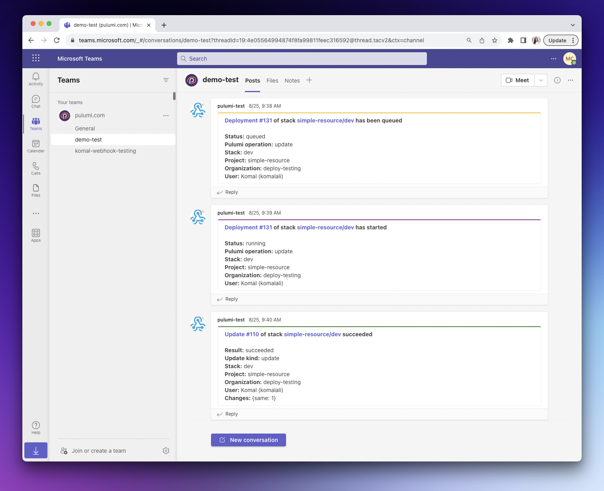

Getting your Pulumi notifications into Microsoft Teams is now easier than ever. Organizations using Pulumi Cloud have previously been setting up Microsoft Teams notifications for their stacks using Pulumi Cloud Webhooks. Webhooks can attach to a Pulumi organization or a Pulumi stack. Starting today, customers can set up a Microsoft Teams integration, for organization or stack notifications, with fewer steps and without needing to host the infrastructure themselves.

<!--more-->

Pulumi Cloud Webhooks, including the Microsoft Teams integration, are available to all Pulumi Cloud organizations.

## See it in action!



Pulumi Microsoft Teams notifications enable central visibility for your team. In addition to getting the notification of a successful or failed update, you will have links to take you directly to the stack and directly to the update itself. You can see which Pulumi operation was being run, which user initiated it and the number of resources changed and unaffected. All of this information in one place lets you spend less time context switching and more time collaborating.

### Setting up the Microsoft Teams Integration

Before today, Pulumi customers used Pulumi Cloud Webhooks to set up generic JSON webhooks. When events occur, we send a HTTP POST request to any registered listeners. Webhooks can then be used to send notifications to an app (like Microsoft Teams), start running automated tests, or [even to update another stack](/blog/dependent-stack-updates)! We have now built support for Microsoft Teams formatted webhooks, which allow you to quickly enable notifications about your Pulumi stacks and organizations into your Microsoft Teams workspace by simply providing a [incoming webhook URL](https://learn.microsoft.com/en-us/microsoftteams/platform/webhooks-and-connectors/how-to/add-incoming-webhook).

By following these steps, which can also be found in [our webhooks documentation](/docs/pulumi-cloud/webhooks), in a few clicks you will have a Microsoft Teams incoming webhook URL which you can use to set up a webhook in [Pulumi Cloud](https://app.pulumi.com), as shown in the GIF below.


There are Pulumi customers with hundreds to thousands of stacks, making setting up webhooks for each via the UI a time consuming task. In order to enable Pulumi notifications at scale, we have added Pulumi Cloud REST API endpoints for creating webhooks as well as [Pulumi Service Provider](https://www.pulumi.com/registry/packages/pulumiservice) support.

### Pulumi Cloud REST API

Create a webhook via the Pulumi Cloud REST API formatted for Microsoft Teams, as shown in the example below.

```bash

curl \
  -H "Accept: application/vnd.pulumi+8" \
  -H "Content-Type: application/json" \
  -H "Authorization: token $PULUMI_ACCESS_TOKEN" \
  --request POST \
  --data '{
      "organizationName": "{organization}",
      "projectName": "{project}",
      "stackName": "{stack}",
      "displayName": "my-display-name",
      "payloadUrl": "https://xxxxx.webhook.office.com/xxxxxxxxx",
      "format": "ms_teams",
      "active": true
  }' \
  https://api.pulumi.com/api/orgs/{organization}/{project}/{stack}/hooks
```

### Pulumi Service Provider

The Pulumi Service provider allows you to create Pulumi Cloud resources via Pulumi. You can provision and manage webhooks, including Microsoft Teams webhooks, using this provider.



{}

```ts
import * as pulumi from "@pulumi/pulumi";
import { Webhook, WebhookFormat, WebhookFilters } from "@pulumi/pulumiservice";

const orgName = "my-org";

const orgWebhook = new Webhook("org-webhook", {
    active: true,
    displayName: "my-teams-channel",
    organizationName: orgName,
    payloadUrl: "https://xxxxx.webhook.office.com/xxxxxxxxx",
    format: WebhookFormat.MicrosoftTeams,
    filters: [
        WebhookFilters.StackCreated,
        WebhookFilters.StackDeleted,
        WebhookFilters.DeploymentSucceeded,
        WebhookFilters.DeploymentFailed,
    ],
});

const stackWebhook = new Webhook("stack-webhook", {
    active: true,
    displayName: "my-teams-channel",
    organizationName: orgName,
    projectName: pulumi.getProject(),
    stackName: pulumi.getStack(),
    payloadUrl: "https://xxxxx.webhook.office.com/xxxxxxxxx",
    format: WebhookFormat.MicrosoftTeams,
});

export const orgWebhookName = orgWebhook.name;
export const stackWebhookName = stackWebhook.name;

```

{}

{}

```yaml

name: webhook-examples
runtime: yaml
description: An example of provisioning a Pulumi Cloud Webhook via Pulumi Service Provider

resources:
  orgWebhook:
    type: pulumiservice:index:Webhook
    properties:
      active: true
      displayName: my-teams-channel
      organizationName: my-org
      payloadUrl: "https://xxxxx.webhook.office.com/xxxxxxxxx"
      format: ms_teams
      filters:
        - stack_created
        - stack_deleted
        - deployment_succeeded
        - deployment_failed
  stackWebhook:
    type: pulumiservice:index:Webhook
    properties:
      active: true
      displayName: my-teams-channel
      organizationName: my-org
      projectName: webhook-examples
      stackName: dev
      payloadUrl: "https://xxxxx.webhook.office.com/xxxxxxxxx"
      format: ms_teams

outputs:
  # export the name of the webhooks
  orgWebhookName: ${orgWebhook.name}
  stackWebhookName: ${stackWebhook.name}
```

{}

{}

```python
import pulumi
import pulumi_pulumiservice as pulumiservice

org_webhook = pulumiservice.Webhook("orgWebhook",
    active=True,
    display_name="my-teams-channel",
    organization_name="my-org",
    payload_url="https://xxxxx.webhook.office.com/xxxxxxxxx",
    format=pulumiservice.WebhookFormat.MICROSOFT_TEAMS,
    filters=[
        pulumiservice.WebhookFilters.STACK_CREATED,
        pulumiservice.WebhookFilters.STACK_DELETED,
        pulumiservice.WebhookFilters.DEPLOYMENT_SUCCEEDED,
        pulumiservice.WebhookFilters.DEPLOYMENT_FAILED,
    ])

stack_webhook = pulumiservice.Webhook("stackWebhook",
    active=True,
    display_name="my-teams-channel",
    organization_name="my-org",
    project_name="webhook-examples",
    stack_name="dev",
    payload_url="https://xxxxx.webhook.office.com/xxxxxxxxx",
    format=pulumiservice.WebhookFormat.MICROSOFT_TEAMS)

pulumi.export("orgWebhookName", org_webhook.name)
pulumi.export("stackWebhookName", stack_webhook.name)
```

{}

{}

```go
package main

import (
	"github.com/pulumi/pulumi-pulumiservice/sdk/go/pulumiservice"
	"github.com/pulumi/pulumi/sdk/v3/go/pulumi"
)

func main() {
	pulumi.Run(func(ctx *pulumi.Context) error {
		orgWebhook, err := pulumiservice.NewWebhook(ctx, "orgWebhook", &pulumiservice.WebhookArgs{
			Active:           pulumi.Bool(true),
			DisplayName:      pulumi.String("my-teams-channel"),
			OrganizationName: pulumi.String("my-org"),
			PayloadUrl:       pulumi.String("https://xxxxx.webhook.office.com/xxxxxxxxx"),
			Format:           pulumiservice.WebhookFormatMicrosoftTeams,
			Filters: pulumiservice.WebhookFiltersArray{
				pulumiservice.WebhookFiltersStackCreated,
				pulumiservice.WebhookFiltersStackDeleted,
				pulumiservice.WebhookFiltersDeploymentSucceeded,
				pulumiservice.WebhookFiltersDeploymentFailed,
			},
		})
		if err != nil {
			return err
		}
		stackWebhook, err := pulumiservice.NewWebhook(ctx, "stackWebhook", &pulumiservice.WebhookArgs{
			Active:           pulumi.Bool(true),
			DisplayName:      pulumi.String("my-teams-channel"),
			OrganizationName: pulumi.String("my-org"),
			ProjectName:      pulumi.String("webhook-examples"),
			StackName:        pulumi.String("dev"),
			PayloadUrl:       pulumi.String("https://xxxxx.webhook.office.com/xxxxxxxxx"),
			Format:           pulumiservice.WebhookFormatMicrosoftTeams,
		})
		if err != nil {
			return err
		}
		ctx.Export("orgWebhookName", orgWebhook.Name)
		ctx.Export("stackWebhookName", stackWebhook.Name)
		return nil
	})
}
```

{}

{}

```csharp
using System.Collections.Generic;
using System.Linq;
using Pulumi;
using PulumiService = Pulumi.PulumiService;

return await Deployment.RunAsync(() =>
{
    var orgWebhook = new PulumiService.Webhook("orgWebhook", new()
    {
        Active = true,
        DisplayName = "my-teams-channel",
        OrganizationName = "my-org",
        PayloadUrl = "https://xxxxx.webhook.office.com/xxxxxxxxx",
        Format = PulumiService.WebhookFormat.MicrosoftTeams,
        Filters = new[]
        {
            PulumiService.WebhookFilters.StackCreated,
            PulumiService.WebhookFilters.StackDeleted,
            PulumiService.WebhookFilters.DeploymentSucceeded,
            PulumiService.WebhookFilters.DeploymentFailed,
        },
    });

    var stackWebhook = new PulumiService.Webhook("stackWebhook", new()
    {
        Active = true,
        DisplayName = "my-teams-channel",
        OrganizationName = "my-org",
        ProjectName = "webhook-examples",
        StackName = "dev",
        PayloadUrl = "https://xxxxx.webhook.office.com/xxxxxxxxx",
        Format = PulumiService.WebhookFormat.MicrosoftTeams,
    });

    return new Dictionary<string, object?>
    {
        ["orgWebhookName"] = orgWebhook.Name,
        ["stackWebhookName"] = stackWebhook.Name,
    };
});
```

{}

{}

```java
package generated_program;

import com.pulumi.Context;
import com.pulumi.Pulumi;
import com.pulumi.core.Output;
import com.pulumi.pulumiservice.Webhook;
import com.pulumi.pulumiservice.WebhookArgs;
import java.util.List;
import java.util.ArrayList;
import java.util.Map;
import java.io.File;
import java.nio.file.Files;
import java.nio.file.Paths;

public class App {
    public static void main(String[] args) {
        Pulumi.run(App::stack);
    }

    public static void stack(Context ctx) {
        var orgWebhook = new Webhook("orgWebhook", WebhookArgs.builder()
            .active(true)
            .displayName("my-teams-channel")
            .organizationName("my-org")
            .payloadUrl("https://xxxxx.webhook.office.com/xxxxxxxxx")
            .format("ms_teams")
            .filters(
                "stack_created",
                "stack_deleted",
                "deployment_succeeded",
                "deployment_failed")
            .build());

        var stackWebhook = new Webhook("stackWebhook", WebhookArgs.builder()
            .active(true)
            .displayName("my-teams-channel")
            .organizationName("my-org")
            .projectName("webhook-examples")
            .stackName("dev")
            .payloadUrl("https://xxxxx.webhook.office.com/xxxxxxxxx")
            .format("ms_teams")
            .build());

        ctx.export("orgWebhookName", orgWebhook.name());
        ctx.export("stackWebhookName", stackWebhook.name());
    }
}
```

{}

## Wrapping up

Our webhooks improvements enable ChatOps workflows and more visibility into your infrastructure. As always, please let us know if you have feedback on the feature by opening an issue in the [Pulumi Cloud requests repository](https://github.com/pulumi/pulumi-cloud-requests/issues/new/choose) or if you have other features you would like to see in Pulumi Cloud.

Happy building! 👷
