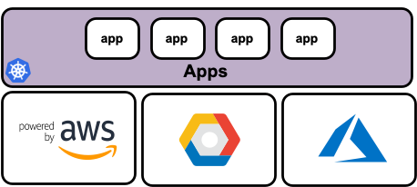
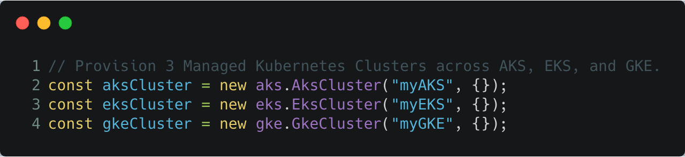
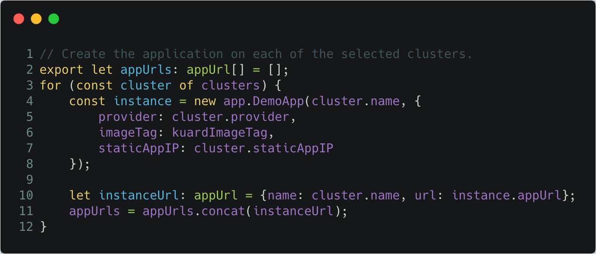

Kubernetes clusters from the managed platforms of AWS Elastic Kubernetes Service (EKS),
Azure Kubernetes Service (AKS), and GCP Google Kubernetes Engine (GKE) all vary in configuration, management, and resource
properties. This variance creates unnecessary complexity in cluster provisioning and application
deployments, as well as for CI/CD and testing.

Additionally, if you wanted to deploy the *same* app across multiple clusters
for specific use cases or test scenarios across providers, subtleties
such as LoadBalancer outputs and cluster connection settings can be a nuisance
to manage.

In this post, we'll see how to use Pulumi to deploy the `kuard` app across EKS,
AKS, GKE and a local Kubernetes cluster, such as Docker Desktop or a self-managed cluster.
We'll spin up the clusters in each provider, launch the app,
and manage both cluster and app using the TypeScript programming language.

<!--more-->

[View the full example and code.][multicloud-example]

## Cluster Provisioning

Provisioning Kubernetes **clusters** and their IaaS resources is made simple
through Pulumi's various SDKs for the cloud providers:

- AWS: [`pulumi/eks`](https://github.com/pulumi/eks)
- GCP: [`pulumi/gcp`](https://github.com/pulumi/gcp)
- Azure: [`pulumi/azure`](https://github.com/pulumi/pulumi-azure)

[Crosswalk for AWS][crosswalk-aws] further allows us to leverage the Pulumi
libraries of common infrastructure for AWS to simplify cloud resource
instantiation and management while gaining best-practices as defaults.
Check out the [`pulumi/awsx`](https://github.com/pulumi/pulumi-awsx) SDK to get
started.

For local clusters such as those that are self-managed, or provisioned by a
tool like Docker Desktop, Pulumi can still deploy workloads to these these
systems given that the [`pulumi/kubernetes`][pulumi-kubernetes] workload SDK only requires a valid `kubeconfig`
file. For more information on Pulumi's Kubernetes support, check out the [Kubernetes reference page]().

We will use the cloud SDKs to provision the managed Kubernetes clusters. Given
that we're working with real code, we are afforded developer benefits such as:
code linting, type checking, IDE hints and completion,
abstractions and inheritance.

Leveraging these development features creates the opportunity to encapsulate
the finer-grained details and settings, and expose the capability to create
clusters as simple as the following code:

## Workload Deployment

Once the clusters are provisioned, we can leverage the
[`pulumi/kubernetes`][pulumi-kubernetes] SDK to manage the Kubernetes
**workloads** that will be deployed into the clusters.

The `pulumi/kubernetes` SDK uses the official Kubernetes [client-go][client-go]
library to interact with Kubernetes. Therefore, Pulumi can work pretty
much anywhere `kubectl` works, even if Pulumi was not used to create the cluster.

## Summary

As shown in the code samples, it becomes relatively easy to provision and
manage Kubernetes clusters across multiple clouds, as well as deploy workloads to the cluster
regardless if they are managed by a cloud provider, or self-managed.

The various SDKS allow you to leverage industry standard best-practices and
defaults, in addition to allowing you to further configure and customize how your clusters
and apps are managed.

Testing apps across various providers in this form allows you to abstract away
the details of provider specific implementations, and focus on how your app
operates in the various contexts.

## Learn More

If you'd like to learn about Pulumi and how to manage your
infrastructure and Kubernetes multi-cloud capabilities through code, [get started today](). Pulumi is open source and free to
use.

For further examples on how to use Pulumi to create Kubernetes
clusters, or deploy workloads to a cluster, check out the rest of the
[Kubernetes tutorials]().

As always, you can check out our code on
[GitHub](https://github.com/pulumi), follow us on
[Twitter](https://twitter.com/pulumicorp), subscribe to our [YouTube
channel](https://www.youtube.com/channel/UC2Dhyn4Ev52YSbcpfnfP0Mw), or
join our [Community Slack](https://slack.pulumi.com/) channel if you have
any questions, need support, or just want to say hello.

If you'd like to chat with our team, or get hands-on assistance with
migrating your existing configuration code to Pulumi, please don't hesitate to [drop us a line]().

We also encourage you to watch Pulumi team member [Levi Blackstone][levi-blackstone]
demo this post in an episode of the [Kubernetes Community Meeting](https://kubernetes.io/community).



<!-- markdownlint-disable url -->
[multicloud-example]: https://github.com/pulumi/examples/tree/master/kubernetes-ts-multicloud
[levi-blackstone]: 
[pulumi-kubernetes]: https://github.com/pulumi/pulumi-kubernetes
[client-go]: https://github.com/kubernetes/client-go
[crosswalk-aws]: 
<!-- markdownlint-enable url -->
