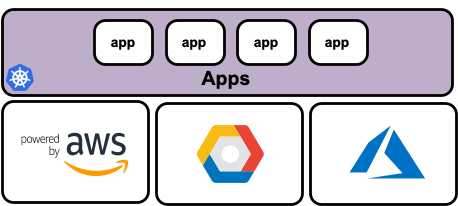

Multi-cloud Kubernetes means running clusters on more than one cloud provider, typically some mix of Amazon EKS, Azure AKS, and Google GKE, and managing them through one consistent workflow instead of three separate ones. Teams take this on to avoid vendor lock-in, meet data-residency requirements, or let each application team run on the cloud that fits its workload.

<!--more-->

The catch is that EKS, AKS, and GKE each provision and configure clusters differently, so treating them as one target complicates cluster provisioning, application deployment, and CI/CD. If you also need to run the *same* application across providers for testing or resilience, details like load balancer outputs and cluster connection settings become one more thing to keep in sync by hand.

This post shows how to provision Kubernetes clusters on EKS, AKS, and GKE with Pulumi, and how to deploy the same application to all three from one codebase. We'll use TypeScript for the full walkthrough, with a Python equivalent for the AWS cluster to show the pattern carries across languages.

<center></center>

## Why run Kubernetes across multiple clouds?

A few situations make multi-cloud Kubernetes worth the extra coordination:

- **Avoiding lock-in.** Workloads that run identically on EKS, AKS, and GKE keep you free to negotiate on price or move a workload if a provider's roadmap or pricing changes.
- **Meeting compliance and data-residency requirements.** Some customers or regulations require workloads to run on a specific provider or in a specific region that only one cloud serves well.
- **Matching teams to the cloud they already use.** In a company built through acquisition, or one where different teams standardized on different clouds, multi-cloud Kubernetes lets each team keep its cloud without forking the deployment pipeline.
- **Testing across environments.** Running the same app on EKS, AKS, and GKE surfaces provider-specific bugs, such as differences in default storage classes or load balancer behavior, before they reach customers.

## What are the challenges of multi-cloud Kubernetes?

Multi-cloud Kubernetes is a real tradeoff, not a free upgrade. Cluster provisioning APIs, IAM models, default networking, and managed add-ons differ across EKS, AKS, and GKE, so a setup that is one API call on one provider can be several resources on another. Application manifests are mostly portable, but anything that touches a provider's native load balancer, storage class, or identity system needs provider-specific configuration. Running clusters on three providers also means three sets of the provider's own operational quirks, upgrade cadences, and support channels to track. Most teams find multi-cloud Kubernetes worth it only once the reason for doing it (compliance, team autonomy, or genuine lock-in risk) is concrete, rather than adopting it as a default posture.

## How do you provision Kubernetes clusters across EKS, AKS, and GKE with Pulumi?

Pulumi provisions each provider's managed Kubernetes clusters using ordinary TypeScript, Python, Go, C#, Java, or YAML, so cluster definitions get the same code review, testing, and reuse as the rest of your infrastructure.

Provision an EKS cluster with the [`@pulumi/eks`](https://www.pulumi.com/registry/packages/eks/) package, which wraps the underlying VPC, IAM, and node group resources behind a single component:

```typescript
import * as eks from "@pulumi/eks";

const eksCluster = new eks.Cluster("eks-cluster", {
    instanceType: "t3.medium",
    desiredCapacity: 2,
    minSize: 1,
    maxSize: 3,
});

export const eksKubeconfig = eksCluster.kubeconfig;
```

Provision an AKS cluster with the [`azure-native`](https://www.pulumi.com/registry/packages/azure-native/) provider, which maps directly onto the Azure Resource Manager API:

```typescript
import * as resources from "@pulumi/azure-native/resources";
import * as containerservice from "@pulumi/azure-native/containerservice";

const resourceGroup = new resources.ResourceGroup("aks-rg");

const aksCluster = new containerservice.ManagedCluster("aks-cluster", {
    resourceGroupName: resourceGroup.name,
    agentPoolProfiles: [{
        name: "agentpool",
        count: 2,
        vmSize: "Standard_DS2_v2",
        mode: "System",
    }],
    dnsPrefix: "multicloudaks",
    identity: { type: "SystemAssigned" },
});
```

Provision a GKE cluster with the [`gcp`](https://www.pulumi.com/registry/packages/gcp/) provider:

```typescript
import * as gcp from "@pulumi/gcp";

const gkeCluster = new gcp.container.Cluster("gke-cluster", {
    initialNodeCount: 2,
    nodeConfig: {
        machineType: "e2-medium",
        oauthScopes: [
            "https://www.googleapis.com/auth/cloud-platform",
        ],
    },
});
```

The same EKS cluster in Python looks like this, using [`pulumi_eks`](https://www.pulumi.com/registry/packages/eks/installation-configuration/?section=python):

```python
import pulumi
import pulumi_eks as eks

cluster = eks.Cluster("eks-cluster",
    instance_type="t3.medium",
    desired_capacity=2,
    min_size=1,
    max_size=3)

pulumi.export("kubeconfig", cluster.kubeconfig)
```

Each block above is a normal Pulumi resource, so it gets the same `pulumi preview`, unit tests, and code review as any other change in the stack, rather than living in a separate cluster-provisioning tool.

## How do you deploy the same application to multiple Kubernetes clusters?

Once the clusters exist, the [`kubernetes`](https://www.pulumi.com/registry/packages/kubernetes/) provider deploys workloads to any of them using the same resource definitions, by pointing a separate provider instance at each cluster's kubeconfig:

```typescript
import * as pulumi from "@pulumi/pulumi";
import * as k8s from "@pulumi/kubernetes";

interface ClusterTarget {
    name: string;
    kubeconfig: pulumi.Output<string>;
}

const clusters: ClusterTarget[] = [
    { name: "eks", kubeconfig: eksCluster.kubeconfig },
    { name: "aks", kubeconfig: aksKubeconfig },
    { name: "gke", kubeconfig: gkeKubeconfig },
];

for (const cluster of clusters) {
    const provider = new k8s.Provider(`${cluster.name}-provider`, {
        kubeconfig: cluster.kubeconfig,
    });

    new k8s.apps.v1.Deployment(`${cluster.name}-kuard`, {
        spec: {
            replicas: 1,
            selector: { matchLabels: { app: "kuard" } },
            template: {
                metadata: { labels: { app: "kuard" } },
                spec: {
                    containers: [{
                        name: "kuard",
                        image: "gcr.io/kuar-demo/kuard-amd64:blue",
                        ports: [{ containerPort: 8080 }],
                    }],
                },
            },
        },
    }, { provider });
}
```

Because the loop body is ordinary code, adding a fourth provider, or a local cluster reachable through a `kubeconfig` file (Docker Desktop, kind, or a self-managed cluster), means adding one more entry to the `clusters` array rather than writing a new deployment pipeline. The full, runnable version of this example, including cluster provisioning for all three providers, is in the [`kubernetes-ts-multicloud`](https://github.com/pulumi/examples/tree/master/kubernetes-ts-multicloud) example.

## Which tools manage multi-cloud Kubernetes fleets?

Provisioning the clusters is one job; keeping workloads scheduled and consistent across them once they exist is another. These are complementary layers, not competing choices:

| Layer | What it does | Example tools | Best for |
| --- | --- | --- | --- |
| Fleet and control-plane federation | Coordinates workload placement and policy across clusters that already exist, from one control plane | [Karmada](https://karmada.io/), Google Anthos, Rancher, Gardener | Teams that already run multiple clusters and want centralized scheduling and policy enforcement |
| Kubernetes-native infrastructure as code | Manages cloud infrastructure through Kubernetes custom resources and controllers | [Crossplane](https://www.crossplane.io/) | Teams standardized on GitOps and the Kubernetes API as the control plane for infrastructure |
| General-purpose infrastructure as code | Provisions the clusters themselves, and every supporting resource around them (networking, IAM, node pools), in the same codebase and language as the rest of your infrastructure | [Pulumi](https://www.pulumi.com/registry/packages/kubernetes/) | Teams that want the clusters, the workloads, and the surrounding cloud resources under one review and testing process |

A fleet tool like Karmada doesn't create the EKS, AKS, and GKE clusters it schedules onto; something has to provision those first. Pulumi is a good fit for that provisioning step, and it can sit alongside a fleet-management tool rather than replacing it. For teams that want to govern policy and cost across the clusters Pulumi provisions, [Pulumi Discovery](https://www.pulumi.com/docs/discovery-governance/) gives visibility into resources across all three providers from one inventory.

## Where to go next

This post covers provisioning and deploying across EKS, AKS, and GKE directly. If your goal is closer to sharing a golden-path Kubernetes setup across teams through a reusable component and the [Automation API](https://www.pulumi.com/docs/iac/concepts/automation-api/), see [Multicloud with Kubernetes and Pulumi](/blog/multicloud-with-kubernetes-and-pulumi/), which walks through building a customizable, self-service Kubernetes provisioning experience for other teams to consume.

To get started with Kubernetes on Pulumi:

- [Get started with Pulumi and Kubernetes](https://www.pulumi.com/docs/iac/get-started/kubernetes/)
- [Kubernetes provider reference](https://www.pulumi.com/registry/packages/kubernetes/)
- [EKS package reference](https://www.pulumi.com/registry/packages/eks/)
- [Manage secrets and configuration across clusters with Pulumi ESC](https://www.pulumi.com/docs/esc/)

## Is multi-cloud Kubernetes worth the added complexity?

It depends on why you're considering it. If the driver is a concrete requirement, such as a customer contract that specifies a provider, a compliance rule tied to a region only one cloud serves, or a team that already standardized on a different cloud after an acquisition, the coordination cost is worth paying. If the driver is "just in case we need to switch providers someday," the ongoing cost of testing and operating three cluster types usually outweighs a lock-in risk that may never materialize. Start with the workloads that actually need to run on more than one cloud, rather than replicating everything by default.

## Can I use the same Kubernetes manifests across EKS, AKS, and GKE?

Mostly. Core Kubernetes resources, such as Deployments, Services of type `ClusterIP`, and ConfigMaps, behave the same way regardless of provider, because they're implemented by Kubernetes itself rather than the cloud. Anything that touches provider-specific infrastructure differs: a Service of type `LoadBalancer` provisions an AWS Network Load Balancer, an Azure Load Balancer, or a Google Cloud Load Balancer depending on the cluster, each with its own annotations for things like internal-only access or SSL termination. Persistent volume storage classes also differ by default (`gp3` on EKS, `managed-csi` on AKS, `standard-rwo` on GKE). Plan for a small provider-specific configuration layer around an otherwise-shared manifest, rather than expecting one manifest to be entirely provider-agnostic.

## Do I still need a tool like Karmada if I'm provisioning clusters with Pulumi?

Only if you need active workload scheduling and policy enforcement across clusters that are already running. Pulumi provisions the clusters and can deploy the same workload definitions to each one, which covers most teams running a handful of clusters with a known, mostly static placement. A fleet-management tool like Karmada earns its keep once you're actively rebalancing workloads between clusters based on capacity or failures, or enforcing cluster-wide policy from a single control plane across a larger fleet. The two aren't mutually exclusive: Pulumi can provision the clusters that Karmada then manages.
