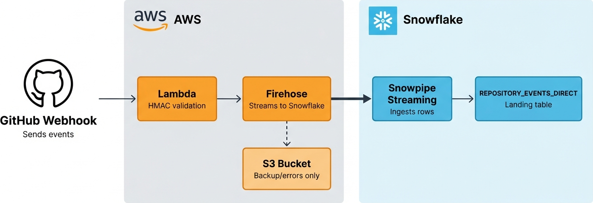
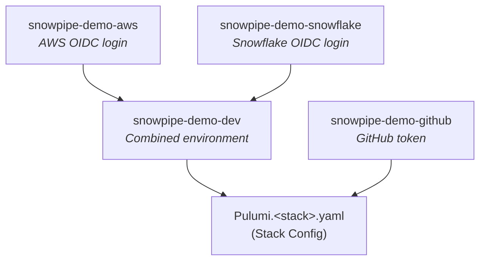

When you manage dozens of data-loading pipelines into Snowflake, copy-pasting resources becomes a maintenance problem: IAM (Identity and Access Management) policies drift, naming conventions diverge, and every new source is a chance to introduce a subtle misconfiguration. This post shows how to encapsulate those patterns into composable components and walks through the production lessons we learned running 25+ pipelines for over three years.

When you manage dozens of data-loading pipelines, copying and pasting IaC configurations between them is a recipe for mishap. IAM policies can drift, naming conventions diverge, and every new source is a new opportunity to make a mistake — not to mention compound the problem of duplication. In this post, we'll show you how you can identify and encapsulate common patterns into composable components and walk through the production lessons we've learned running 25+ pipelines for over three years.

<!--more-->

## What we'll cover

If you're loading data into Snowflake and want reusable, composable infrastructure, this post is for you. Here's what we'll cover:

* Handling and validating GitHub webhooks with AWS Lambda 
* Streaming webhook payloads directly into Snowflake with Amazon Data Firehose 
* Wiring it all up with a reusable Pulumi [`ComponentResource`](/docs/iac/concepts/components/)
 
The [companion template](https://github.com/pulumi-demos/examples/tree/main/python/aws-snowflake-data-loading-real-time) also includes S3 auto-ingest and batch loading patterns, which we'll cover in upcoming posts. We also use Pulumi ESC to handle authentication to both AWS and Snowflake using OpenID Connect.

Our own [Josh Kodroff](/blog/author/josh-kodroff/) wrote an excellent [introduction to Snowpipe with Pulumi](https://medium.com/snowflake/lightning-fast-elt-for-python-devs-with-aws-snowpipe-and-pulumi-4eaf056dd097). This post builds on his work using the newest [Snowflake](https://www.pulumi.com/registry/packages/snowflake/) and [AWS](https://www.pulumi.com/registry/packages/aws/) provider APIs and the direct Firehose-to-Snowflake destination, which wasn't available when Josh wrote his post. Some resource names and grant patterns will also differ if you're comparing the two.

## Architecture overview

The following diagram shows the architecture in more detail:



1. GitHub sends webhook events to a Lambda Function URL.
1. Lambda validates the HMAC (Hash-based Message Authentication Code) signature and forwards the payload to Amazon Data Firehose.
1. Firehose streams records directly into Snowflake via the [Snowpipe Streaming API](https://docs.snowflake.com/en/user-guide/snowpipe-streaming/data-load-snowpipe-streaming-overview). Data appears in Snowflake within seconds.
1. S3 is used only as a backup destination for failed records.

The direct Firehose-to-Snowflake destination is an AWS-native feature that works with any Snowflake account.

## Project setup

Start a new Pulumi Python project and choose [uv](https://docs.astral.sh/uv/) for dependency management when prompted:

```bash
mkdir snowpipe-data-loading && cd snowpipe-data-loading
pulumi new python
```

Notice `Pulumi.yaml` shows `uv` as your selected toolchain:

```yaml
name: snowpipe-data-loading
runtime:
  name: python
  options:
    toolchain: uv
description: Production-grade data loading with Pulumi, AWS, and Snowflake
```

Add the provider dependencies for [AWS](/registry/packages/aws/), [Snowflake](/registry/packages/snowflake/), [GitHub](/registry/packages/github/), and the [Random](/registry/packages/random/) and [TLS](/registry/packages/tls/) providers:

```bash
uv add pulumi-aws pulumi-snowflake pulumi-github pulumi-random pulumi-tls
```

That's it. `uv` creates the virtual environment and lockfile automatically, and Pulumi uses `uv run` under the hood to execute your program.

All examples in this post are in Python, but Pulumi supports multiple languages. You can implement the same components in TypeScript, Go, .NET, Java, or YAML.

## Managing credentials with Pulumi ESC

This project requires credentials for two cloud providers, AWS and Snowflake. To avoid having to manage credentials locally, it uses [Pulumi ESC](/docs/esc/) (Environments, Secrets, and Configuration) to obtain dynamic, short-lived credentials for both providers via OIDC (OpenID Connect). 

If you're not using Pulumi ESC, you can add these credentials directly to your stack configuration file (`Pulumi.<stack>.yaml`) using [`pulumi config set --secret`](https://www.pulumi.com/docs/iac/concepts/secrets/).

### How it works

You define an ESC environment that opens OIDC connections to AWS and Snowflake. When you run `pulumi up`, ESC exchanges a Pulumi-issued OIDC token for short-lived credentials from each provider, then injects them into your stack config automatically. Your Pulumi program doesn't change at all; the providers read their configuration from `pulumiConfig` as usual.

The following diagram shows how this project's ESC environments compose. The stack imports a combined dev environment (which itself imports the AWS and Snowflake base environments) plus a separate GitHub environment:



### One-time Snowflake setup

Follow the [Snowflake OIDC login guide](/docs/esc/integrations/dynamic-login-credentials/snowflake-login/) to create nan integration that trusts Pulumi's OIDC issuer. Replace `<your-pulumi-org>` with your Pulumi organization name:

```sql
-- Run using an administrative role like ACCOUNTADMIN or SYSADMIN
CREATE SECURITY INTEGRATION pulumi_oidc
  TYPE = EXTERNAL_OAUTH
  ENABLED = TRUE
  EXTERNAL_OAUTH_TYPE = CUSTOM
  EXTERNAL_OAUTH_ISSUER = 'https://api.pulumi.com/oidc'
  EXTERNAL_OAUTH_JWS_KEYS_URL = 'https://api.pulumi.com/oidc/.well-known/jwks'
  EXTERNAL_OAUTH_TOKEN_USER_MAPPING_CLAIM = 'snowflake_user'
  EXTERNAL_OAUTH_SNOWFLAKE_USER_MAPPING_ATTRIBUTE = 'login_name'
  EXTERNAL_OAUTH_AUDIENCE_LIST = ('snowflake:<your-pulumi-org>')
  EXTERNAL_OAUTH_ANY_ROLE_MODE = 'ENABLE'
  EXTERNAL_OAUTH_ALLOWED_ROLES_LIST = ('PULUMI_DEPLOYER');
```

Then create a service user and a deployer role for Pulumi:

```sql
-- Deployer role inherits ACCOUNTADMIN privileges but isn't on
-- Snowflake's blocked privileged roles list, so External OAuth accepts it.
CREATE ROLE PULUMI_DEPLOYER;
GRANT ROLE ACCOUNTADMIN TO ROLE PULUMI_DEPLOYER;

CREATE USER ESC_SERVICE_USER
  LOGIN_NAME = 'ESC_SERVICE_USER'
  DEFAULT_ROLE = PULUMI_DEPLOYER
  TYPE = SERVICE;

GRANT ROLE PULUMI_DEPLOYER TO USER ESC_SERVICE_USER;
```

### One-time AWS setup

Follow the [AWS OIDC guide](/docs/esc/guides/configuring-oidc/aws/) for full details. There are two steps: creating an IAM OIDC identity provider and an IAM role with a trust policy.

1. **Create an IAM OIDC identity provider.** In the AWS console (or via CLI/IaC), add a new identity provider with provider URL `https://api.pulumi.com/oidc` and audience `aws:<your-pulumi-org>`. The audience string scopes trust to your specific Pulumi organization, so only OIDC tokens issued for that org are accepted.

1. **Create an IAM role with a trust policy.** The trust policy validates that the OIDC token was issued by Pulumi and carries the correct audience claim before allowing `sts:AssumeRoleWithWebIdentity`:

    ```json
    {
      "Version": "2012-10-17",
      "Statement": [
        {
          "Effect": "Allow",
          "Principal": {
            "Federated": "arn:aws:iam::<your-aws-account-id>:oidc-provider/api.pulumi.com/oidc"
          },
          "Action": "sts:AssumeRoleWithWebIdentity",
          "Condition": {
            "StringEquals": {
              "api.pulumi.com/oidc:aud": "aws:<your-pulumi-org>"
            }
          }
        }
      ]
    }
    ```

    This policy allows any Pulumi ESC environment in your org to assume the role. You can further restrict it using subject claim conditions. The role needs whatever AWS permissions your Pulumi program requires. For this project that means Lambda, Firehose, S3, and IAM.

### The ESC environments

Rather than putting everything in one flat environment, we split credentials by provider and compose them with [`imports`](/docs/esc/environments/imports/). Each base environment is single-concern (one cloud provider) and handles its own credential-to-config mapping. The combined environment merges them and adds cross-cutting config like `aws:region`. This way we can reuse credentials among many stacks, each one only importing what they need. It also makes switching from a development to production environment, for example, much more straightforward.

#### AWS-only environment

This environment handles AWS OIDC login and sets environment variables for CLI operations:

{}
You can run these commands or create your environments [in the Pulumi Cloud Console](https://app.pulumi.com).
{}

```bash
pulumi env init <your-org>/<project>/snowpipe-demo-aws
pulumi env edit <your-org>/<project>/snowpipe-demo-aws
```

```yaml
values:
  aws:
    login:
      fn::open::aws-login:
        oidc:
          duration: 1h
          roleArn: arn:aws:iam::123456789012:role/pulumi-esc-oidc
          sessionName: pulumi-snowpipe-demo
  environmentVariables:
    AWS_ACCESS_KEY_ID: ${aws.login.accessKeyId}
    AWS_SECRET_ACCESS_KEY: ${aws.login.secretAccessKey}
    AWS_SESSION_TOKEN: ${aws.login.sessionToken}
    AWS_REGION: us-west-2
```

#### Snowflake-only environment

This environment handles Snowflake OIDC login:

```bash
pulumi env init <your-org>/<project>/snowpipe-demo-snowflake
pulumi env edit <your-org>/<project>/snowpipe-demo-snowflake
```

```yaml
values:
  snowflake:
    login:
      fn::open::snowflake-login:
        oidc:
          account: <your-snowflake-account>
          user: ESC_SERVICE_USER
    organizationName: <your-org-name>
    accountName: <your-account-name>
  pulumiConfig:
    snowflake:organizationName: ${snowflake.organizationName}
    snowflake:accountName: ${snowflake.accountName}
    snowflake:user: ${snowflake.login.user}
    snowflake:token: ${snowflake.login.token}
    snowflake:authenticator: OAUTH
    snowflake:role: PULUMI_DEPLOYER
```

#### Combined dev environment

Imports both base environments. Since each base already maps its own credentials via `pulumiConfig`, the combined environment only needs to add `aws:region`:

```bash
pulumi env init <your-org>/<project>/snowpipe-demo-dev
pulumi env edit <your-org>/<project>/snowpipe-demo-dev
```

```yaml
imports:
  - <project>/snowpipe-demo-aws
  - <project>/snowpipe-demo-snowflake
values:
  pulumiConfig:
    aws:region: us-west-2
```

The `imports` directive merges values from both base environments into the combined one. Each base environment handles its own provider config: the AWS base uses `environmentVariables` for CLI access, while the Snowflake base uses `pulumiConfig` to map OIDC credentials to Snowflake provider config keys. The combined dev environment only needs to add `aws:region`. This keeps credential configuration DRY; if the AWS role ARN or Snowflake account changes, you update one environment.

### GitHub environment

The webhook pipeline needs GitHub credentials to create repository webhooks via the [`pulumi-github`](https://www.pulumi.com/registry/packages/github/) provider. Pick whichever authentication method fits your security posture.

Create a separate ESC environment for GitHub:

```bash
pulumi env init <your-org>/<project>/snowpipe-demo-github
pulumi env edit <your-org>/<project>/snowpipe-demo-github
```

#### Option 1: Personal access token (recommended for individuals)

Create a [fine-grained PAT](https://github.com/settings/personal-access-tokens/new) scoped to the specific repository with the **Webhooks: Read and write** permission. Fine-grained PATs are repository-scoped and have a configurable expiration. Alternatively, create a [classic PAT](https://github.com/settings/tokens) with the **`admin:repo_hook`** scope (broader access, simpler setup). The ESC configuration is the same for both:

```yaml
values:
  pulumiConfig:
    github:token:
      fn::secret: <your-pat>
    github:owner: <your-github-org-or-user>
```

#### Option 2: GitHub App (best for organizations)

If you'd rather not use a personal token at all, install a [GitHub App](https://docs.github.com/en/apps/creating-github-apps) with the **Webhooks: Read and write** repository permission. GitHub Apps authenticate as the app installation rather than a personal account, get higher rate limits (10,000 requests/hour vs. 5,000 for PATs), and don't break when an employee leaves.

```yaml
values:
  pulumiConfig:
    github:appAuth:
      fn::secret:
        id: "<your-app-id>"
        installationId: "<your-installation-id>"
        pemFile: "<contents-of-your-private-key.pem>"
    github:owner: <your-github-org-or-user>
```

Note: `github:appAuth` and `github:token` are mutually exclusive. Use one or the other. When using a GitHub App, `github:owner` is required (the provider can't infer it from the app installation). As an alternative to any of these approaches, you can also create the webhook manually in GitHub's UI.

We decided to import this environment directly in the stack YAML alongside the dev environment instead of composing through the dev environment because it serves a different concern (GitHub API access vs. cloud provider credentials).

### Referencing ESC environments from your stack

Add the `environment:` block to `Pulumi.<stack>.yaml`. Note two environment imports, one for cloud credentials and one for GitHub:

```yaml
environment:
  - <project>/snowpipe-demo-dev
  - <project>/snowpipe-demo-github
config:
  snowpipe-data-loading:database: LANDING_ZONE_WEBHOOKS
  snowpipe-data-loading:environment: dev
  snowpipe-data-loading:webhook-repo: <your-test-repo-name>
  snowflake:previewFeaturesEnabled:
    - snowflake_table_resource
```

The `snowflake:previewFeaturesEnabled` list is required since `pulumi-snowflake` v2.12.0, which moved [`Table`](https://www.pulumi.com/registry/packages/snowflake/api-docs/table/) among other resources behind a preview feature flag.

That's the entire change. No credentials are stored in the Pulumi configuration yaml; the providers pick up their credentials from ESC-injected config transparently.

## Shared infrastructure

The direct streaming pipeline needs an [S3 bucket](https://www.pulumi.com/registry/packages/aws/api-docs/s3/bucket/) for backup/errors, a Snowflake database, and a schema. Add the following code to `__main__.py`:

```python
import pulumi
import pulumi_aws as aws
import pulumi_snowflake as snowflake

config = pulumi.Config()
database_name = config.get("database") or "LANDING_ZONE_WEBHOOKS"
environment = config.get("environment") or "dev"

# S3 bucket for backup/errors
bucket = aws.s3.Bucket(
    "data-landing-bucket",
    force_destroy=True,  # Demo only - remove in production
)

# Snowflake database and schema
database = snowflake.Database("demo-database", name=database_name)
schema = snowflake.Schema(
    "demo-schema",
    name="GITHUB",
    database=database.name,
)
```

## Building the direct ingestion ComponentResource

Amazon Data Firehose supports [Snowflake as a native destination](https://docs.aws.amazon.com/firehose/latest/dev/create-destination.html#create-destination-snowflake) via the Snowpipe Streaming API. Firehose streams records directly into Snowflake.

### The Lambda handler

The [Lambda function](https://www.pulumi.com/registry/packages/aws/api-docs/lambda/function/) is the entry point for GitHub webhooks. It validates the HMAC-SHA256 signature, wraps the payload in an envelope with the event type, and forwards it to Firehose:

```python
import hashlib
import hmac
import json
import os

import boto3

firehose = boto3.client("firehose")

STREAM_NAME = os.environ["FIREHOSE_STREAM_NAME"]
WEBHOOK_SECRET = os.environ["WEBHOOK_SECRET"]


def handler(event, context):
    body = event.get("body", "")
    signature = (event.get("headers") or {}).get("x-hub-signature-256", "")

    # Validate HMAC-SHA256 signature
    expected = "sha256=" + hmac.new(
        WEBHOOK_SECRET.encode(), body.encode(), hashlib.sha256
    ).hexdigest()

    if not hmac.compare_digest(expected, signature):
        return {"statusCode": 401, "body": "Invalid signature"}

    github_event = (event.get("headers") or {}).get("x-github-event", "unknown")

    # Wrap in envelope - newline-delimited so Firehose can concatenate records
    record = json.dumps({
        "github_event": github_event,
        "payload": json.loads(body),
    }) + "\n"

    firehose.put_record(
        DeliveryStreamName=STREAM_NAME,
        Record={"Data": record.encode()},
    )

    return {"statusCode": 200, "body": "OK"}
```

The envelope format `{"github_event": "<type>", "payload": {...}}\n` is important. The `github_event` field (e.g., `push`, `pull_request`, `star`) comes from the `x-github-event` header and lets downstream queries filter by event type.

### Why direct Firehose to Snowflake?

Data like this is normally written to and loaded from Amazon S3. But with an S3 intermediate path, you must wait for Firehose to buffer records (60 seconds), then for Snowpipe to detect the new file and load it. Total latency: about two minutes. With the direct Snowflake destination, Firehose uses the Snowpipe Streaming API to insert records as soon as they arrive, in seconds.

The direct path also removes the need for S3 event notifications, SQS queues, external stages, and pipe resources. S3 is still used, but only as a backup destination for failed records.

### The DirectSnowflakeIngestion component

The component creates everything needed for the direct path: a TLS key pair for Snowflake authentication, a Snowflake service user with least-privilege grants, the landing table, a Firehose delivery stream with `destination="snowflake"`, and a Lambda function with a public URL.

The `ColumnDef` dataclass is a simple schema definition used across all pipeline components. It lives in `components/snowpipe_pipeline.py`:

```python
@dataclass
class ColumnDef:
    """Column definition for a Snowflake table."""

    name: str
    type: str
    nullable: bool = True
```

```python
import json
from dataclasses import dataclass

import pulumi
import pulumi_aws as aws
import pulumi_snowflake as snowflake
import pulumi_tls as tls

from components.snowpipe_pipeline import ColumnDef


def strip_pem_headers(pem: str) -> str:
    """Remove PEM header/footer lines, returning only the base64 content."""
    lines = pem.strip().split("\n")
    return "".join(lines[1:-1])


@dataclass
class DirectSnowflakeIngestionArgs:
    bucket_arn: pulumi.Input[str]
    bucket_name: pulumi.Input[str]
    database: pulumi.Input[str]
    schema_name: pulumi.Input[str]
    table_name: str
    table_columns: list[ColumnDef]
    snowflake_account_url: pulumi.Input[str]
    snowflake_role_name: str
    lambda_code: pulumi.Archive
    lambda_handler: str
    lambda_environment: dict[str, pulumi.Input[str]]
    table_comment: str = ""
    s3_prefix: str = "direct-webhooks"
    s3_backup_mode: str = "FailedDataOnly"
    buffering_interval: int = 0
    buffering_size: int = 1
    retry_duration: int = 60
    data_loading_option: str = "VARIANT_CONTENT_AND_METADATA_MAPPING"
    content_column_name: str = "CONTENT"
    metadata_column_name: str = "METADATA"
```

The key configuration values: `buffering_interval=0` and `buffering_size=1` tell Firehose to flush immediately (no batching delay), and `VARIANT_CONTENT_AND_METADATA_MAPPING` maps the JSON payload to a `CONTENT` column and Firehose metadata to a `METADATA` column.

```python
class DirectSnowflakeIngestion(pulumi.ComponentResource):
    function_url: pulumi.Output[str]
    firehose_stream_name: pulumi.Output[str]
    snowflake_user_name: pulumi.Output[str]

    def __init__(
        self,
        name: str,
        args: DirectSnowflakeIngestionArgs,
        opts: pulumi.ResourceOptions | None = None,
    ):
        super().__init__(
            "snowpipe:direct:DirectSnowflakeIngestion", name, {}, opts
        )

        # --- TLS key pair for Snowflake auth ---
        key_pair = tls.PrivateKey(
            f"{name}-keypair",
            algorithm="RSA",
            rsa_bits=2048,
            opts=pulumi.ResourceOptions(parent=self),
        )

        # --- Snowflake role, user, and grants ---
        sf_role = snowflake.AccountRole(
            f"{name}-sf-role",
            name=args.snowflake_role_name,
            opts=pulumi.ResourceOptions(parent=self),
        )

        user_name = f"FIREHOSE_{name.upper().replace('-', '_')}_USER"
        sf_user = snowflake.ServiceUser(
            f"{name}-sf-user",
            name=user_name,
            login_name=user_name,
            default_role=sf_role.name,
            rsa_public_key=key_pair.public_key_pem.apply(strip_pem_headers),
            opts=pulumi.ResourceOptions(parent=self),
        )

        # Landing table
        table = snowflake.Table(
            f"{name}-table",
            name=args.table_name,
            database=args.database,
            schema=args.schema_name,
            comment=args.table_comment,
            columns=[
                snowflake.TableColumnArgs(
                    name=col.name, type=col.type, nullable=col.nullable,
                )
                for col in args.table_columns
            ],
            opts=pulumi.ResourceOptions(parent=self),
        )

        # Grants: DB USAGE, schema USAGE, table INSERT+SELECT
        snowflake.GrantPrivilegesToAccountRole(
            f"{name}-grant-db-usage",
            account_role_name=sf_role.name,
            privileges=["USAGE"],
            on_account_object=snowflake.GrantPrivilegesToAccountRoleOnAccountObjectArgs(
                object_type="DATABASE",
                object_name=args.database,
            ),
            opts=pulumi.ResourceOptions(parent=self),
        )

        snowflake.GrantPrivilegesToAccountRole(
            f"{name}-grant-schema-usage",
            account_role_name=sf_role.name,
            privileges=["USAGE"],
            on_schema=snowflake.GrantPrivilegesToAccountRoleOnSchemaArgs(
                schema_name=pulumi.Output.all(
                    args.database, args.schema_name
                ).apply(lambda parts: f'"{parts[0]}"."{parts[1]}"'),
            ),
            opts=pulumi.ResourceOptions(parent=self),
        )

        table_name = args.table_name
        snowflake.GrantPrivilegesToAccountRole(
            f"{name}-grant-table",
            account_role_name=sf_role.name,
            privileges=["INSERT", "SELECT"],
            on_schema_object=snowflake.GrantPrivilegesToAccountRoleOnSchemaObjectArgs(
                object_type="TABLE",
                object_name=pulumi.Output.all(
                    args.database, args.schema_name
                ).apply(
                    lambda parts: f'"{parts[0]}"."{parts[1]}"."{table_name}"'
                ),
            ),
            opts=pulumi.ResourceOptions(parent=self, depends_on=[table]),
        )

        # --- Firehose IAM role (S3 backup write) ---
        firehose_role = aws.iam.Role(
            f"{name}-firehose-role",
            assume_role_policy=json.dumps({
                "Version": "2012-10-17",
                "Statement": [{
                    "Effect": "Allow",
                    "Action": "sts:AssumeRole",
                    "Principal": {"Service": "firehose.amazonaws.com"},
                }],
            }),
            opts=pulumi.ResourceOptions(parent=self),
        )

        aws.iam.RolePolicy(
            f"{name}-firehose-s3-policy",
            role=firehose_role.id,
            policy=args.bucket_arn.apply(
                lambda arn: json.dumps({
                    "Version": "2012-10-17",
                    "Statement": [{
                        "Effect": "Allow",
                        "Action": [
                            "s3:AbortMultipartUpload",
                            "s3:GetBucketLocation",
                            "s3:GetObject",
                            "s3:ListBucket",
                            "s3:ListBucketMultipartUploads",
                            "s3:PutObject",
                        ],
                        "Resource": [arn, f"{arn}/*"],
                    }],
                })
            ),
            opts=pulumi.ResourceOptions(parent=self),
        )

        # --- Firehose delivery stream (Snowflake destination) ---
        stream = aws.kinesis.FirehoseDeliveryStream(
            f"{name}-firehose",
            destination="snowflake",
            snowflake_configuration=aws.kinesis.FirehoseDeliveryStreamSnowflakeConfigurationArgs(
                account_url=args.snowflake_account_url,
                database=args.database,
                schema=args.schema_name,
                table=args.table_name,
                role_arn=firehose_role.arn,
                user=sf_user.name,
                private_key=key_pair.private_key_pem_pkcs8.apply(
                    strip_pem_headers
                ),
                data_loading_option=args.data_loading_option,
                content_column_name=args.content_column_name,
                metadata_column_name=args.metadata_column_name,
                s3_backup_mode=args.s3_backup_mode,
                buffering_size=args.buffering_size,
                buffering_interval=args.buffering_interval,
                retry_duration=args.retry_duration,
                snowflake_role_configuration=aws.kinesis.FirehoseDeliveryStreamSnowflakeConfigurationSnowflakeRoleConfigurationArgs(
                    enabled=True,
                    snowflake_role=args.snowflake_role_name,
                ),
                s3_configuration=aws.kinesis.FirehoseDeliveryStreamSnowflakeConfigurationS3ConfigurationArgs(
                    bucket_arn=args.bucket_arn,
                    role_arn=firehose_role.arn,
                    prefix=f"{args.s3_prefix}/backup/",
                    error_output_prefix=f"{args.s3_prefix}/errors/",
                ),
            ),
            opts=pulumi.ResourceOptions(parent=self, depends_on=[table]),
        )

        # --- Lambda function + Function URL ---
        lambda_role = aws.iam.Role(
            f"{name}-lambda-role",
            assume_role_policy=json.dumps({
                "Version": "2012-10-17",
                "Statement": [{
                    "Effect": "Allow",
                    "Action": "sts:AssumeRole",
                    "Principal": {"Service": "lambda.amazonaws.com"},
                }],
            }),
            opts=pulumi.ResourceOptions(parent=self),
        )

        aws.iam.RolePolicyAttachment(
            f"{name}-lambda-basic-execution",
            role=lambda_role.name,
            policy_arn="arn:aws:iam::aws:policy/service-role/AWSLambdaBasicExecutionRole",
            opts=pulumi.ResourceOptions(parent=self),
        )

        aws.iam.RolePolicy(
            f"{name}-lambda-firehose-policy",
            role=lambda_role.id,
            policy=stream.arn.apply(
                lambda arn: json.dumps({
                    "Version": "2012-10-17",
                    "Statement": [{
                        "Effect": "Allow",
                        "Action": ["firehose:PutRecord"],
                        "Resource": [arn],
                    }],
                })
            ),
            opts=pulumi.ResourceOptions(parent=self),
        )

        env_vars = {
            **args.lambda_environment,
            "FIREHOSE_STREAM_NAME": stream.name,
        }

        fn = aws.lambda_.Function(
            f"{name}-handler",
            runtime="python3.11",
            handler=args.lambda_handler,
            role=lambda_role.arn,
            timeout=30,
            code=args.lambda_code,
            environment=aws.lambda_.FunctionEnvironmentArgs(
                variables=env_vars,
            ),
            opts=pulumi.ResourceOptions(parent=self),
        )

        fn_url = aws.lambda_.FunctionUrl(
            f"{name}-function-url",
            function_name=fn.name,
            authorization_type="NONE",
            opts=pulumi.ResourceOptions(parent=self),
        )

        aws.lambda_.Permission(
            f"{name}-function-url-permission",
            action="lambda:InvokeFunctionUrl",
            function=fn.name,
            principal="*",
            function_url_auth_type="NONE",
            opts=pulumi.ResourceOptions(parent=self),
        )

        # --- Outputs ---
        self.function_url = fn_url.function_url
        self.firehose_stream_name = stream.name
        self.snowflake_user_name = sf_user.name

        self.register_outputs({
            "function_url": self.function_url,
            "firehose_stream_name": self.firehose_stream_name,
            "snowflake_user_name": self.snowflake_user_name,
        })
```

A few things to note:

- **TLS key pair for authentication.** The component generates an RSA key pair using the [`pulumi-tls`](/registry/packages/tls/) provider. The public key is assigned to the Snowflake service user; the private key (PKCS#8 format, base64-encoded) is passed to Firehose. No passwords or OAuth tokens are stored.
- **`ServiceUser` instead of `User`.** Snowflake [service users](https://docs.snowflake.com/en/sql-reference/sql/create-user#service-type) can't log in interactively. They authenticate only via key pair, which is exactly what Firehose needs.
- **`destination="snowflake"` on Firehose.** This tells Firehose to use the Snowpipe Streaming API rather than writing to S3. The `s3_configuration` block is still required, but only for backup/error records.
- **Immediate flushing.** `buffering_interval=0` and `buffering_size=1` ensure records are sent to Snowflake as soon as they arrive, minimizing latency. Tune according to your needs.

{}
Amazon Data Firehose does not connect from fixed IP addresses, so you cannot use Snowflake [network policies](https://docs.snowflake.com/en/user-guide/network-policies) to restrict access by IP. If your Snowflake account uses network policies, you have three options: use [AWS PrivateLink](https://docs.snowflake.com/en/user-guide/admin-security-privatelink) (requires Snowflake Business Critical edition), allow public internet access for the Firehose service user, or switch to *S3 auto-ingest via Snowpipe* which does not require direct network access to Snowflake from Firehose.
{}

## Wiring it together

With the component defined, `__main__.py` wires the direct ingestion pipeline:

```python
import pulumi_github as github
import pulumi_random as random
from components.direct_snowflake_ingestion import (
    DirectSnowflakeIngestion, DirectSnowflakeIngestionArgs,
)
from components.snowpipe_pipeline import ColumnDef

webhook_repo = config.require("webhook-repo")

# Snowflake account URL for Firehose configuration
snowflake_config = pulumi.Config("snowflake")
snowflake_account_url = (
    f"https://{snowflake_config.require('organizationName')}"
    f"-{snowflake_config.require('accountName')}"
    f".snowflakecomputing.com"
)

# Landing table columns: CONTENT (webhook JSON) + METADATA (Firehose metadata)
DIRECT_COLUMNS = [
    ColumnDef(name="CONTENT", type="VARIANT", nullable=True),
    ColumnDef(name="METADATA", type="VARIANT", nullable=True),
]

# Step 1: Generate webhook secret for HMAC validation
direct_webhook_secret = random.RandomPassword(
    "github-direct-webhook-secret", length=32, special=False
)

# Step 2: Direct ingestion pipeline - Lambda validates, Firehose streams to Snowflake
direct = DirectSnowflakeIngestion(
    "github-webhooks-direct",
    DirectSnowflakeIngestionArgs(
        bucket_arn=bucket.arn,
        bucket_name=bucket.bucket,
        database=database.name,
        schema_name=schema.name,
        table_name="REPOSITORY_EVENTS_DIRECT",
        table_columns=DIRECT_COLUMNS,
        table_comment="GitHub webhook events loaded via direct Firehose to Snowflake",
        snowflake_account_url=snowflake_account_url,
        snowflake_role_name="FIREHOSE_DIRECT_LOADER",
        lambda_code=pulumi.AssetArchive({
            "webhook_handler.py": pulumi.FileAsset("lambda/webhook_handler.py"),
        }),
        lambda_handler="webhook_handler.handler",
        lambda_environment={"WEBHOOK_SECRET": direct_webhook_secret.result},
    ),
)

# Step 3: GitHub webhook - sends events to the Lambda Function URL
github.RepositoryWebhook(
    "github-direct-webhook",
    repository=webhook_repo,
    configuration=github.RepositoryWebhookConfigurationArgs(
        url=direct.function_url,
        content_type="json",
        secret=direct_webhook_secret.result,
    ),
    events=["push", "pull_request", "issues", "star"],
)

# Exports
pulumi.export("webhook_url", direct.function_url)
pulumi.export("firehose_stream", direct.firehose_stream_name)
```

That's the entire pipeline. One component, one GitHub webhook, one secret. The `DirectSnowflakeIngestion` component handles the TLS key pair, Snowflake service user, landing table, Firehose stream, and Lambda function internally.

{}
The full code for this example is available at [https://github.com/pulumi-demos/examples/tree/main/python/aws-snowflake-data-loading-real-time](https://github.com/pulumi-demos/examples/tree/main/python/aws-snowflake-data-loading-real-time).
{}

## Testing the pipeline

Deploy the stack:

```bash
pulumi up
```

The entire stack deploys in about two minutes. Immediately after deployment, you'll start seeing GitHub events flowing into Snowflake.

Before querying, grant the `DATA_READER` role to your Snowflake user:

```sql
GRANT ROLE DATA_READER TO USER <your-user>;
```

In production, you can manage this grant through Pulumi, manually, or automatically via SCIM provisioning from your identity provider.

No need to craft test payloads. Just interact with the test repo. Star it, push a commit, or open an issue, then wait about 30 seconds and query Snowflake using the least-privilege reader role:

```sql
USE ROLE DATA_READER;

SELECT CONTENT:github_event::STRING AS event_type,
       CONTENT:payload:repository:full_name::STRING AS repo,
       METADATA:IngestionTime::TIMESTAMP AS ingested_at
FROM LANDING_ZONE_WEBHOOKS.GITHUB.REPOSITORY_EVENTS_DIRECT
ORDER BY ingested_at DESC;
```

You should see rows with event types like `star`, `push`, or `issues`, real GitHub events flowing through the entire pipeline. The `METADATA` column includes Firehose metadata like `IngestionTime`, which you can use to track end-to-end latency.

## Other loading patterns

Direct streaming is the fastest path, but two other patterns are available in the [companion template](https://github.com/pulumi-demos/examples/tree/main/python/aws-snowflake-data-loading-real-time) for different requirements:

- **S3 auto-ingest via Snowpipe.** Firehose buffers to S3, and Snowpipe auto-ingests new files. Latency is about two minutes. Best when you need S3 as the system of record or can't use direct Snowpipe Streaming.
- **Batch loading.** Your orchestrator (Airflow, Prefect, cron, etc.) runs `COPY INTO` on a schedule. Best for full control over timing and deduplication.

We'll walk through both patterns in detail in upcoming posts.

## Production tips

A few things we learned running this at scale:

**Use direct Firehose to Snowflake for lowest latency.** The direct path delivers data in seconds and reduces the number of resources you manage (no stages, pipes, SQS queues, or S3 notifications).

**Use separate ESC environments per deployment target.** Each environment (dev, staging, production) needs its own OIDC role ARN, so create separate ESC environments for each. Use [`imports`](/docs/esc/environments/imports/) to share common settings like provider versions and non-secret configuration:

```yaml
# snowpipe-demo-production
imports:
  - snowpipe-demo-shared-settings
values:
  aws:
    login:
      fn::open::aws-login:
        oidc:
          duration: 1h
          roleArn: arn:aws:iam::111111111111:role/pulumi-esc-production
          sessionName: pulumi-snowpipe-production
  pulumiConfig:
    aws:region: us-west-2
    snowflake:role: PULUMI_DEPLOYER
```

**Generate webhook secrets with Pulumi.** Instead of manually creating a secret and copy-pasting it into both your webhook configuration and your Lambda environment, use `random.RandomPassword` to generate it in Pulumi state. The secret is automatically wired to both the Lambda env var and the GitHub webhook config, and it rotates cleanly if you ever need to replace it.

## Publishing as reusable components

Once your components are battle-tested, you can share them across teams and projects instead of copying files around.

### Git-based sharing

The most straightforward approach: push your components to a Git repository with a `PulumiPlugin.yaml` file at the root:

```yaml
runtime: python
name: snowpipe-components
version: 1.0.0
```

Consumers add the package to their project with [`pulumi package add`](/docs/iac/cli/commands/pulumi_package_add/):

```bash
pulumi package add github.com/your-org/pulumi-snowpipe@v1.0.0
```

Pulumi downloads the package and generates typed SDKs automatically. The consumer's `__main__.py` imports your components as if they were local, but they're versioned and pinned.

### Pulumi Cloud Private Registry

For organization-level discoverability, publish to the [Pulumi Cloud Private Registry](/docs/idp/concepts/private-registry/) with [`pulumi package publish`](/docs/iac/cli/commands/pulumi_package_publish/):

```bash
pulumi package publish ./schema.json
```

This gives you auto-generated API docs, usage tracking across teams, and cross-language SDK generation. Your Python components become usable from TypeScript, Go, and C# without any extra work. Teams browse available components in the Pulumi Cloud console, see who's using what, and get notified when new versions are published. As an additional benefit, [Neo](https://www.pulumi.com/product/neo/) will be able to use these components and build new pipelines in minutes from a natural language request.

## Conclusion

[`ComponentResource`](/docs/iac/concepts/components/) is the key abstraction that makes this architecture scale. Instead of copying and pasting resources for each new data source, you instantiate a component with a handful of configuration parameters.

The `DirectSnowflakeIngestion` component in this post delivers data from GitHub webhooks into Snowflake in seconds: Lambda validates the HMAC signature, Firehose streams directly to Snowflake via the Snowpipe Streaming API, and the TLS key pair is managed entirely within Pulumi. No S3 intermediate, no SQS queues.

The component accepts pluggable Lambda handlers, so swapping GitHub for Stripe webhooks or any other source is just a matter of providing different `lambda_code` and `lambda_environment` arguments. This pattern has been running in production for over three years across dozens of pipelines without significant changes to the infrastructure code. When you're ready to share components across teams, [`pulumi package add`](/docs/iac/cli/commands/pulumi_package_add/) or [`pulumi package publish`](/docs/iac/cli/commands/pulumi_package_publish/) turns them into versioned, cross-language packages. You'll find the complete example in the [GitHub repository](https://github.com/pulumi-demos/examples/tree/main/python/aws-snowflake-data-loading-real-time).
