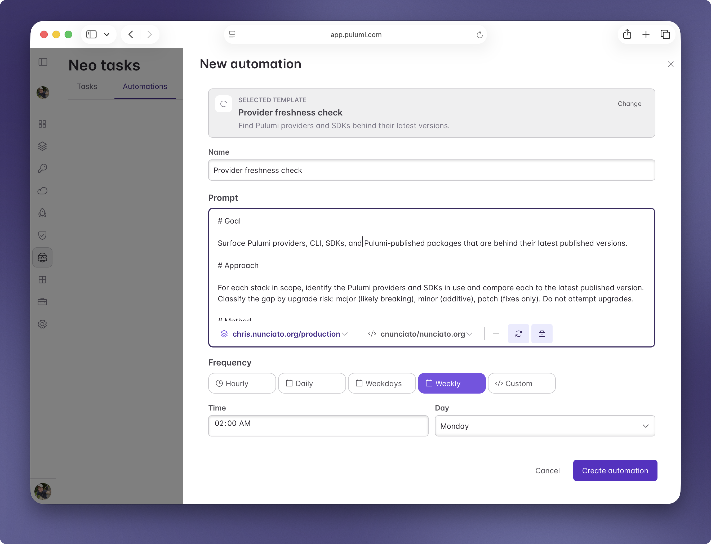

Recurring platform work slips: provider versions fall behind, drift accumulates between checks, and the quarterly audit keeps getting pushed back another month. [Pulumi Neo](/blog/pulumi-neo/) can now run any [task](/docs/ai/tasks/) on a cadence you set, opening a pull request for each run.

<!--more-->

## Automations in action

Your platform team runs stacks across staging and production, and the [AWS](/registry/packages/aws/), [GCP](/registry/packages/gcp/), and [Kubernetes](/registry/packages/kubernetes/) providers keep shipping new versions. Nobody has time to bump them stack by stack.

You write one automation:

> Every Monday at 8 AM, check the `infra/` project for stacks where the AWS, GCP, or Kubernetes provider is more than two minor versions behind. For each one, bump the out-of-date provider, run `pulumi preview`, and open a PR if the preview is clean.

Monday morning, Neo runs the prompt. It finds three stacks behind on the AWS provider, edits each program, runs preview, and opens a PR for each clean run. You review the PRs like you would any other dependency bump, merge them, and Neo runs again next Monday.

## What automations are for

The launch includes four built-in templates: a provider freshness check, an encryption audit, a backup audit, and an activity digest. You can also skip the templates and write your own prompt.

Pick from hourly, daily, weekdays, or weekly cadences. Each automation gets its own page in the **Automations** tab, where you can edit the prompt, change the schedule, run it once on demand, or pause it.

## Safe by default

Automations default to two settings that fit recurring work. Approval mode is [**auto**](/docs/ai/tasks/#task-modes), so a run doesn't wait for human confirmation between steps. Permission mode is [**read-only**](/docs/ai/tasks/#task-modes), so a run can read state and propose changes through pull requests but can't apply changes directly. You can override either default per automation.

## How automations fit with the rest of Neo

A scheduled task uses the same context as an interactive Neo task. [Custom Instructions](/docs/ai/settings/) at the organization and project level apply, so a scheduled run respects the same naming conventions, tagging policies, and architecture rules your team has written down.

[MCP integrations](/docs/ai/integrations/mcp/) and [CLI integrations](/docs/ai/integrations/cli/) work in scheduled tasks the same way they work in interactive ones, so a weekly drift check can query AWS through the `aws` CLI, file [Linear](https://linear.app/) issues, and link related [PagerDuty](https://www.pagerduty.com/) incidents. Scheduled tasks also run with the [RBAC permissions](/docs/administration/access-identity/rbac/) of the user who scheduled them, checked at run time; if permissions change between scheduling and execution, the new permissions apply.

## Try it out

Open Neo in [Pulumi Cloud](/product/pulumi-cloud/), switch to the **Automations** tab, and pick a template or write your own prompt. The [automations docs](/docs/ai/automations/) cover the form, scheduling options, and per-automation overrides.

Today's launch is part of a [bigger story](/releases/agentic-infrastructure-era/). Read our launch-day piece on [the agentic infrastructure era](/blog/the-agentic-infrastructure-era/) for the broader vision, and the [Neo Integrations post](/blog/neo-integrations/) for the third-party tools and CLIs your automations can use.

As always, we'd love to hear what you think — and if you have any suggestions for automations that'd make Neo even better, file an issue in [pulumi-cloud-requests](https://github.com/pulumi/pulumi-cloud-requests/issues/new/choose).
