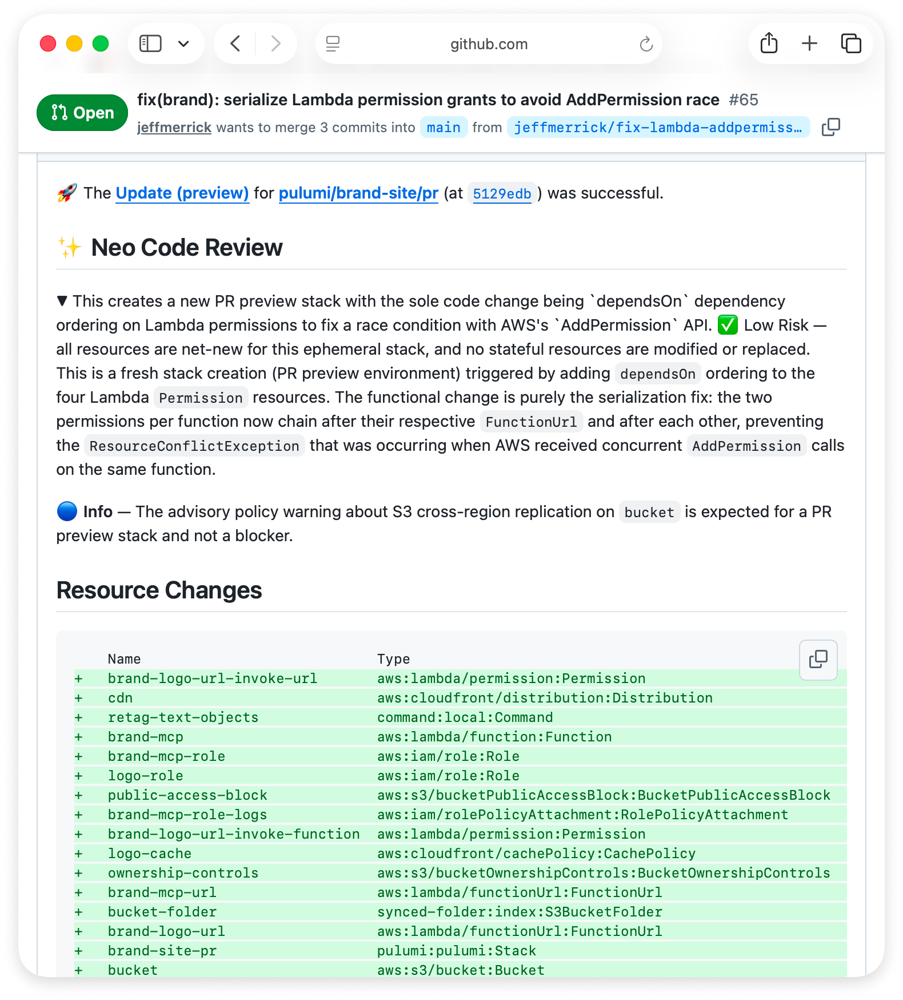

Today we're introducing [Pulumi Neo code reviews](/docs/ai/code-reviews/), now in public preview. Neo code reviews analyze pull request changes in conjunction with what Pulumi Cloud knows about your running infrastructure, providing both high-level and code-level feedback.

<!--more-->

Normal code review agents can't reliably anticipate the impact an infrastructure-as-code change will have. This is because they don't have access to critical aspects of the IaC workflow: the potential impact the update will have, in this case the `pulumi preview` output; and the current state of the cloud infrastructure. Neo not only has access to both of those, but also to the entirety of your other cloud context, such as stack relationships and dependencies.

## Running reviews

Neo can review every pull request automatically, or only when someone mentions `@pulumi-neo`. Either way, it skips draft pull requests and those opened by bots by default.

A review is a comment, so it informs the person approving the merge and sits alongside the required checks and branch protection you already enforce. Neo code reviews run inside the same governance as every other Neo task, with the [RBAC](/docs/administration/access-identity/rbac/), guardrails, and audit logging your organization has set.

## Enable code reviews

Neo code reviews are available on GitHub during public preview. They require Pulumi Neo to be enabled for your organization, the [Pulumi GitHub App](/docs/integrations/version-control/github-app/) installed on the repositories you want reviewed, and a one-time grant from each organization user to access their GitHub account under **Management** > **Version control**. If Neo currently posts preview summaries on your pull requests, code reviews are already enabled, and they take the place of those summaries.

Neo code reviews are free while in public preview. On July 1, 2026, they'll be generally available, and reviews will begin counting toward your organization's Neo token usage, at the same per-token rate as any other Neo task. The [pricing page](/pricing/) shows that rate and the monthly token allotment included with each plan.

## Give it a try

Open a pull request against a stack Pulumi manages and see Neo's review. We want to hear what it catches and what it misses, so hop into the [Pulumi Community Slack](https://slack.pulumi.com/) and tell us.
