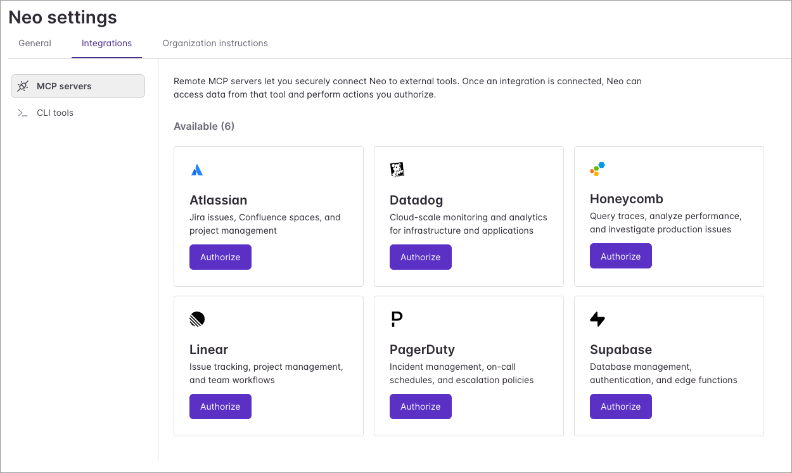
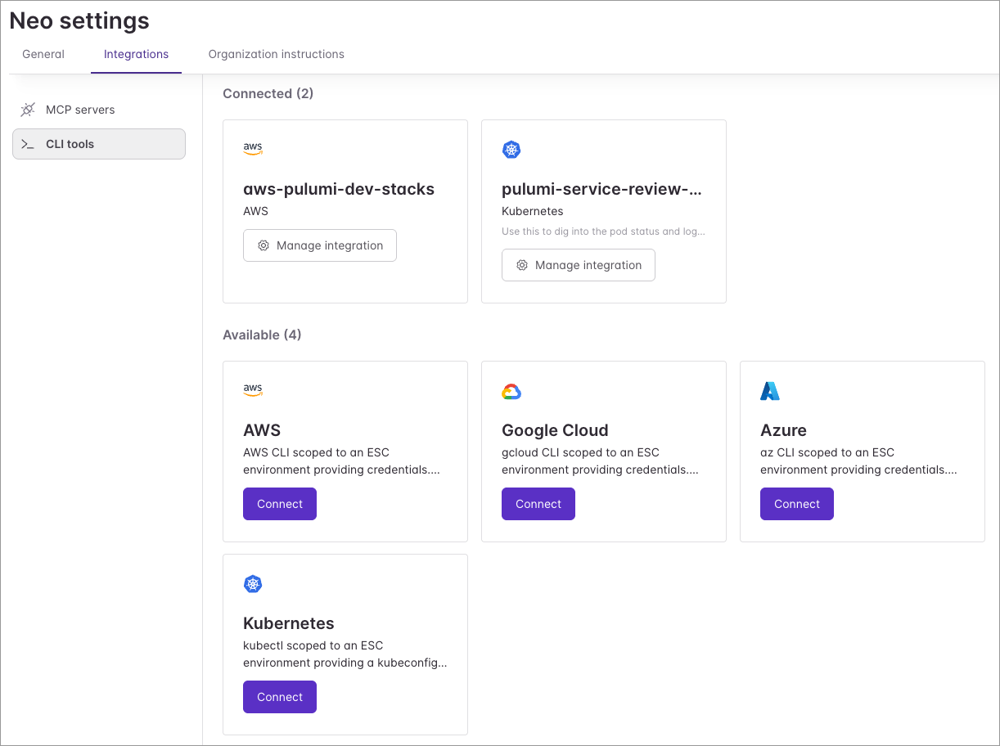
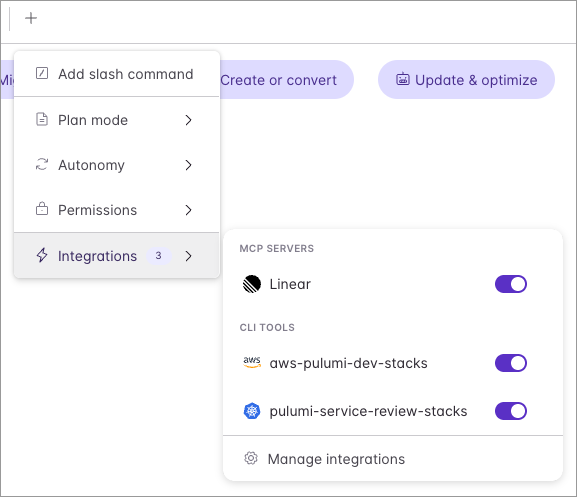

[Pulumi Neo](/product/neo/) already understands your infrastructure: your code, your stacks, your state. Today we're launching new capabilities that extend Neo's reach in two directions: into the third-party systems your team uses to plan and observe, and out to the cloud CLIs that actually drive your infrastructure.

The first half is MCP integrations: connections to [Atlassian](/docs/ai/integrations/mcp/#atlassian-jira-and-confluence), [Datadog](/docs/ai/integrations/mcp/#datadog), [Honeycomb](/docs/ai/integrations/mcp/#honeycomb), [Linear](/docs/ai/integrations/mcp/#linear), [PagerDuty](/docs/ai/integrations/mcp/#pagerduty), and [Supabase](/docs/ai/integrations/mcp/#supabase) that show up as tools Neo can call during a [task](/docs/ai/tasks/). The second half is CLI integrations: scopable access to [`aws`](/docs/ai/integrations/cli/#supported-clis), [`gcloud`](/docs/ai/integrations/cli/#supported-clis), [`az`](/docs/ai/integrations/cli/#supported-clis), and [`kubectl`](/docs/ai/integrations/cli/#supported-clis). Both are configured once at the org level and available to every Neo task in the organization.

<!--more-->

## Integrations in action

A PagerDuty alert just fired: RDS storage on `payments-prod` is at 90% and climbing. You want to know how fast, and whether you can buy yourself any runway before it fills.

> **You:** Neo, RDS storage on `payments-prod` just paged at 90%. How fast is it growing, and what do we have configured?

Neo pulls the active incident from PagerDuty, decides on its own to check Datadog for the storage-utilization curve over the last 30 days, and runs `aws rds describe-db-instances --db-instance-identifier payments-prod` through your `production-aws` CLI integration (the name your org gave its production AWS credentials). The database has been growing about 5 GB a day. The instance has `AllocatedStorage` at 200 GB and `MaxAllocatedStorage` also at 200, so storage autoscaling is effectively disabled. At current growth, the disk fills in three days.

> **You:** Bump max allocated storage to 500. Open a PR.

Neo edits the `payments` stack's Pulumi program to raise `maxAllocatedStorage` from 200 to 500 on the RDS instance, runs `pulumi preview` to confirm the change is scoped to that one resource, and opens a pull request with the diff, the preview output, and links to the PagerDuty incident and the Datadog graph. You review the PR and merge it. Pulumi applies the change, and Neo posts the resolution back to PagerDuty.

With three integrations and one conversation, the change is reviewed, shipped, and the alert resolved a few minutes later.

## MCP integrations: context from your existing tools

The launch catalog covers six services that show up most often in infrastructure investigations: [Atlassian](/docs/ai/integrations/mcp/#atlassian-jira-and-confluence) for Jira issues and Confluence runbooks, [Datadog](/docs/ai/integrations/mcp/#datadog) for metrics and logs, [Honeycomb](/docs/ai/integrations/mcp/#honeycomb) for traces, [Linear](/docs/ai/integrations/mcp/#linear) for issue tracking, [PagerDuty](/docs/ai/integrations/mcp/#pagerduty) for incidents and on-call schedules, and [Supabase](/docs/ai/integrations/mcp/#supabase) for managed database changes. Each connects Neo to a remote MCP server hosted by the provider, so the agent has access to the full set of tools the vendor chooses to expose.

Integrations can be enabled by organization administrators on the Neo Settings page. Once configured, they're available to every Neo task in your organization.

## CLI integrations: live cloud insights

CLI integrations cover what MCP doesn't reach: live cloud insights. With AWS, GCP, Azure, or Kubernetes connected, Neo can check live database utilization, look up the current state of a running service, verify a service quota before scaling, or reach into resources that aren't managed by any Pulumi stack.

An admin enables a CLI integration the same way as an MCP one, from your org's Neo settings. Each integration gets a name your team chooses, like `production-aws` or `staging-gcloud`, and tasks reference that name to tell Neo which environment to reach into. You can connect multiple instances of the same CLI (for example, `production-aws` and `staging-aws`) so Neo can investigate staging without touching production. Credentials are backed by [Pulumi ESC](/docs/esc/) environments your org owns; the [CLI integrations docs](/docs/ai/integrations/cli/) walk through setup.

## Per-task control and failure handling

Both surfaces default to org-wide availability, with per-task overrides. Before starting a task, you can toggle individual MCP integrations off. The toggles only affect that task; the org-level configuration is unchanged.

Failures behave the same way for both. If an integration can't be reached, Neo logs a warning, skips it, and continues with the rest. A single broken integration doesn't stop a task. CLI integration connect and disconnect events go to your organization's audit log, and Neo's individual CLI calls appear in the task transcript alongside its other tool calls.

## Try it out

Both MCP and CLI integrations are available now for Neo-enabled organizations. Open your org's Neo settings, connect the MCP server or CLI of your choice, and let Neo do the next investigation against the tools you already use. The [MCP integrations docs](/docs/ai/integrations/mcp/) and [CLI integrations docs](/docs/ai/integrations/cli/) walk through credential setup for each one, and the [Neo integrations hub](/docs/ai/integrations/) ties it all together.

Today's launch is part of a bigger story. See [the release overview](/releases/agentic-infrastructure-era/) for everything that shipped, our launch-day piece on [the agentic infrastructure era](/blog/the-agentic-infrastructure-era/) for the broader vision, and the [Neo CLI launch post](/blog/pulumi-neo-cli/) for Neo's new home in the terminal.

As always, we'd love to hear what you think — and if you have any suggestions for integrations that'd make Neo even better, file an issue in [pulumi-cloud-requests](https://github.com/pulumi/pulumi-cloud-requests/issues/new/choose).
