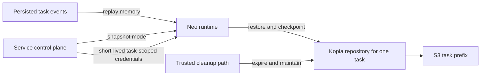
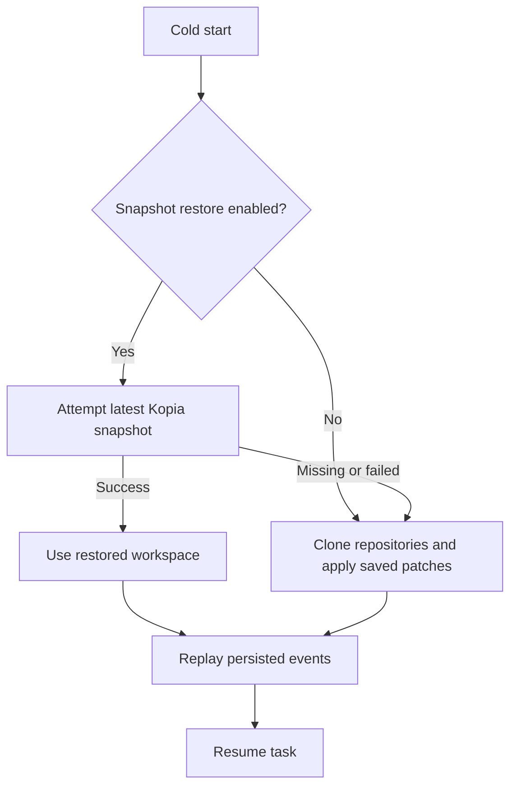

Pulumi Neo works on infrastructure the way an engineer does: it clones repositories, edits files, installs dependencies, runs previews, and produces intermediate work along the way. A task is not only a conversation with a model. It is also a working directory that has to survive long enough for the agent to keep making progress.

Imagine asking an agent to upgrade a Pulumi provider version across a repository, regenerate SDK code, run previews and tests, inspect the failures, and open a pull request. Halfway through, the runtime restarts. Conversation replay can recover what the agent said and which tools it called, but it does not recover the generated files, dependency state, local commits, or scratch output the next step may depend on. Without workspace continuity, the agent can wake up remembering the plan but missing the room it was working in.

For early hosted Neo tasks, workspace recovery started with Git. We persisted enough information to reconstruct repositories later: remotes, branches, commits, and local diffs. This was about the hosted runtime workspace, not a user's local checkout when running `pulumi neo`, where local filesystem and shell tools execute on the user's machine. The Git-based approach worked for simple hosted-runtime cases, but it was the wrong abstraction for long-running agent work. We needed to recover the workspace Neo had actually used.

<!--more-->

This post walks through how we tackled workspace continuity for long-running agent tasks, what we learned along the way, and how the same techniques can help you build more resilient agentic systems of your own. The core primitive we chose was [Kopia](https://kopia.io/), an open source backup tool that creates encrypted, incremental, content-addressed snapshots and stores them in backends such as object storage.

## Git was the wrong recovery boundary

The original persistence model was repository-oriented. After a turn, the hosted agent runtime scanned its own working directory for Git repositories, recorded each remote, branch, commit, and local diff, and stored that representation through our task state API. On a cold start, a new runtime fetched that state, cloned the repositories again, checked out the saved revisions, and reapplied patches.

That was a reasonable first design because most infrastructure work starts in Git. It also kept persisted state relatively small when local changes were simple.

But agent workspaces are not only Git repositories. They contain generated files, scratch files, local commits, package-manager state, tool output, and sometimes files outside any repository. The reconstruction path also depended on everything still being fetchable later: the remote repository had to exist, credentials had to work, the saved revision had to be available, and the patch still had to apply cleanly.

In practice, that showed up in a few painful ways:

- Resumed runtimes could start with incomplete working directories even though the conversation history replayed successfully.
- Tasks could fail to resume with clone errors when a repository was deleted after the task started and no longer existed at its original remote.
- Large diffs could outgrow the payload limit for persisted task state.
- Intentionally skipped directories, such as dependency caches and build output, sometimes contained context the agent had just created.

The distinction that finally clarified the design was simple:

> Replay events to restore what Neo remembers. Restore a snapshot to recover what Neo changed.

Conversation memory and workspace state are separate continuity planes. Event replay rebuilds messages, tool calls, approvals, and compaction state. Filesystem snapshots rebuild the workspace.

## The thing we were not willing to make customers run

The deciding question was not "what can back up a directory?" Lots of things can back up a directory. The deciding question was "what are we willing to make every Pulumi Cloud and self-hosted customer operate so Neo can resume a task?"

That ruled out more than you might expect.

EFS plus AWS Backup is lovely if your answer to every deployment question is "be on AWS." Ours is not. Self-hosted Pulumi has to work in customer environments, and those environments already have a portable storage requirement: blob storage. The snapshot system needed to ride on that, not introduce an AWS-shaped trapdoor.

A Git server had a similar problem. Neo workspaces often include Git repositories, but the workspace is not itself a Git repository. Turning recovery into "run a Git service, maybe with many repositories per task, plus enough conventions to capture non-Git files" would have given us another product to operate and another thing for self-hosted customers to debug.

Direct object storage sync looked better from the portability angle, but it was still the wrong abstraction. A sync can copy files, but it does not naturally give us point-in-time restore, efficient rename-heavy history, retention, or a clean recovery model after partially failed writes. Block-volume snapshots had the opposite problem: strong recovery semantics, but the wrong deployment and cost model for task-scoped workspaces.

That left us looking for a boringly useful shape: an encrypted, task-scoped snapshot repository over generic object storage.

Kopia gave us the closest match to the unit of recovery: the task workspace. It supports incremental snapshots, point-in-time restore, encryption, content-addressed storage, object storage backends, and practical cleanup. Renames and moves generally change metadata rather than rewriting all bytes. Frequent temporary-file churn still matters, which is why ignores and retention policy are part of the design rather than afterthoughts.

The repository layout is intentionally task-scoped:

```text
s3://<task-backup-bucket>/
  tasks/
    <task-id>/
      kopia/
        ...encrypted repository data...
```

That gives up cross-task deduplication, but it aligns the storage boundary with the security and lifecycle boundary. A task ID names the storage prefix; it is not the access-control boundary by itself. The service still has to authenticate the task before minting temporary credentials, those credentials are scoped to that task's prefix, and the Kopia repository is encrypted with a per-task password. One task's runtime must never be able to read another task's snapshot history.

## Split the control plane from the data plane

The next decision was where the bytes should move. We wanted the service to authorize recovery, not become the storage proxy for every dependency tree, generated artifact, and scratch file an agent might create.

Our service remains the control plane. It authenticates the task, decides whether snapshotting is `disabled`, `shadow`, or `enabled`, and mints temporary credentials scoped to that task's storage prefix. The runtime remains the data plane for its own local workspace: it restores and checkpoints directly against object storage instead of streaming large filesystem payloads through the service.

That split is also the multi-tenant security boundary. The runtime gets only the storage authority for the task it is currently serving, and the encrypted repository it opens is protected by that task's repository password. A different task would need both a different storage grant and a different repository password to read its snapshots.



This split matters. If the service were the only storage principal, every snapshot and restore would have to flow through the application service. That would turn the service into a high-volume data path for dependency trees, generated artifacts, and arbitrary workspace state. Instead, the service authorizes access, while the runtime moves bytes directly to and from storage.

Isolation has several layers:

- The service only issues credentials after authenticating the task.
- Credentials are short-lived and scoped to a single task prefix, not just a bucket.
- Runtime credentials can read and write only that task's snapshots, but cannot delete durable history.
- Each task has its own Kopia repository password, so object access and repository decryption are separate checks.
- Cleanup runs through a trusted path with delete authority.

Kopia's retention model also helped us keep delete permission out of the runtime. Snapshot expiration removes references, and maintenance later reclaims unreferenced encrypted blobs. The agent-controlled runtime can create recoverable history without being able to erase it.

## Roll out the escape hatch first

We did not want a single switch that made a new persistence layer authoritative on day one. The rollout used three modes:

| Mode | Legacy repo reconstruction | Snapshot writes | Snapshot restores |
|---|---:|---:|---:|
| `disabled` | Authoritative | No | No |
| `shadow` | Authoritative | Yes | No |
| `enabled` | Fallback | Yes | Yes |

`shadow` mode was the key. It let us write snapshots, observe latency and storage behavior, and validate that repositories could be initialized and updated without changing task recovery. Only after that did `enabled` make snapshots the primary cold-start restore path.

Even in `enabled` mode, we continued writing the legacy Git repository state. That gave us a real rollback path instead of a ceremonial one. If we needed to turn snapshot restores back off, existing tasks would still have the old recovery data available, so rollback would not degrade into "resume, but with half the workspace missing."

The restore path is deliberately asymmetric:



If a snapshot restore fails, Neo can still fall back to the old repository reconstruction path while that path exists. Snapshot failure is observable, but it does not automatically make a task unrecoverable.

Checkpointing is also best effort. The runtime returns the final response for the turn, then starts a background checkpoint. If that checkpoint fails, the completed response is still completed. The tradeoff is a bounded durability gap: the conversation may contain a completed turn whose latest filesystem changes are newer than the latest successful snapshot. On the next cold start, Neo restores the latest known-good snapshot rather than pretending a partial checkpoint exists.

## Snapshot the work, not the noise

An agent workspace has both signal and noise. The signal is user-relevant work: source changes, generated configuration, local commits, tool output, and files the agent may need on the next turn. The noise is everything a package manager, compiler, or test runner can recreate.

The runtime snapshots existing workspace roots such as:

- `/workspace`
- `/tmp-workspace`
- `/var-workspace`

Regenerable caches and short-lived dependency or build trees are ignored where appropriate. This is an engineering tradeoff for the team operating the agent. Snapshot too much and storage plus request volume become noisy. Snapshot too little and the workspace stops representing what the agent actually saw.

The boundary we cared about was user-relevant continuity. Source changes, generated configuration, local commits, and tool output should be there after recovery. A dependency cache or build directory that can be recreated may not be. In practice, that means a recovered task might spend extra time reinstalling packages or rebuilding generated artifacts, but it should not lose the work the agent produced or the files it needs to decide what to do next.

## Pay for isolation on purpose

The big cost decision was choosing one repository per task. A shared repository might deduplicate identical content across tasks, but it would also create the wrong cleanup and isolation model. We chose to pay some extra storage cost so the security and lifecycle boundary matched the product boundary: one task, one encrypted snapshot repository.

With a task-scoped repository, deletion, retention, credential scope, and auditability all line up.

That means cost management depends on four practical controls:

1. **Incremental snapshots.** Kopia avoids re-uploading unchanged content inside a task repository.
1. **Ignore policy.** High-churn generated trees should not dominate every checkpoint.
1. **Retention windows.** The initial design assumed short default retention for completed tasks, with room for longer retention by policy.
1. **Trusted maintenance.** Expiring snapshots removes references; repository maintenance later reclaims unreferenced physical data.

In the planning model, blob-backed Kopia repositories were dramatically cheaper than direct object storage sync for our benchmark workload. The reason was request shape more than raw storage. A sync-based mirror looks simple, but rename-heavy and small-file-heavy workloads turn into large numbers of write, list, and delete operations. Snapshot repositories have their own metadata and maintenance costs, but they preserve history and behave much better under repeated workspace churn.

## Make failures diagnosable, not mysterious

Snapshotting added a new storage system, so we instrumented recovery as a sequence of named phases instead of one "persistence failed" bucket. For each task, we wanted the logs and metrics to answer:

- Was the invocation warm or a cold start?
- Was the task in `disabled`, `shadow`, or `enabled` mode?
- Did task authorization and credential issuance succeed?
- Did Kopia connect to the expected task repository?
- Which workspace roots existed, and which completed?
- Did restore fall back to repository reconstruction?
- Was the restored snapshot older than the latest completed turn?
- Did event replay succeed independently of filesystem recovery?
- Did cleanup expire snapshots or reclaim physical blobs?

The takeaway is to make recovery observable at the same boundaries where it can fail. A task can restore files but fail to replay model history. It can replay history but fall back to a stale or reconstructed workspace. Those are different incidents with different remediations, so the logs and metrics need to preserve the distinction.

## Workers made ordering matter

Our initial Kopia snapshot path recovered a task when a runtime cold-started. The next step was making the same continuity model work as Neo moved tool execution into managed workers.

Worker mode was a separate change to how Neo executes tools: instead of every tool running inside the runtime process, a managed worker can own the workspace and execute the tool calls. Because recovery had already moved from "rebuild Git repositories" to "restore the task workspace," the migration did not need a second persistence model. The main new problem was ordering: making sure the tool result and the snapshot pointer advanced together.

In worker mode, a separate process owns the task workspace, runs tool calls against that workspace, snapshots it after each completed tool call, and reports both the tool result and the latest recovery pointer back to the service.

A recovery pointer is small metadata: effectively the Kopia snapshot object ID for one logical workspace root. We store the pointer in the service database, while the encrypted snapshot data stays in object storage.

The important invariant is:

> Only the current worker can commit the tool result and the snapshot pointer that becomes the next restore source.

The service uses a worker lease to keep snapshot pointers ordered. At any point, one worker lease is current for the task. If that worker stalls, dies, or stops heartbeating, the service can assign a replacement worker with a newer lease. If the old worker later wakes up and tries to report a tool result with an older snapshot pointer, the stale lease prevents that pointer from becoming the next restore source.

That matters because the result and the snapshot describe the same moment in the task. If Neo records "the command finished" but restores the next worker from an older snapshot, the agent can continue from a workspace that does not contain the files produced by the completed tool call. The lease check makes the persisted tool result and the authoritative recovery pointer advance together.

Worker snapshots also have failure fuses. A restore failure resets the workspace and marks the next result so the agent knows local filesystem continuity was lost. Repeated snapshot failures disable further snapshot attempts for that worker process rather than blocking tool execution.

## What users got back

The user-visible goal was not "backups." It was continuity.

During our internal stress testing for agent tasks, legacy recovery often took around two minutes and repeatedly reported failed repository recovery for extremely large repositories with extensive history. The same tasks restored from Kopia snapshots in roughly half that time with a 100% success rate. More importantly, the snapshot path avoided failure modes the old model could not solve, such as deleted remotes, oversized diffs, and non-repository workspace state.

Restores became faster and much more stable, but the write path did get slower. Kopia checkpoints cost seconds, not milliseconds, because they preserve the workspace rather than a reconstruction recipe. We mitigated that by making turn-level checkpoints non-blocking: the task can return its completed response, then checkpoint the workspace in the background. For our tasks, a few seconds of asynchronous durability work was the right tradeoff for reliable recovery.

## What's worth stealing from this design

If you are building long-running agents, the storage question is easy to underestimate. It can look like an implementation detail: clone the repository again, replay the conversation, rehydrate some state, and keep going. But agents do not only produce messages. They produce working directories.

The most useful lesson for us was to persist the abstraction the product depends on. Neo does not resume into a Git diff. It resumes into a workspace. Once we made the workspace the persistence boundary, the rest of the design became clearer: task-scoped repositories, short-lived credentials, runtime-owned data transfer, trusted cleanup, and an incremental rollout.

The second lesson was to separate memory from files. Event replay and filesystem restore are both required for a healthy resume, but they are not the same recovery operation. A task can remember the conversation and lose local filesystem continuity. It can restore files and still fail to rebuild model history. Treating those as separate planes made the system easier to reason about, easier to observe, and easier to repair.

The final lesson was to make rollback part of the design, not an emergency plan. `shadow` mode let us learn before relying on snapshots. Fallback kept early restore issues from becoming task-ending incidents. Continuing to write legacy Git state meant `enabled` mode was still reversible. The storage engine mattered, but the rollout shape mattered just as much.

The durable takeaway is this: agent continuity is a product feature, not a backup feature. Users do not care whether a checkpoint succeeded in the abstract. They care whether the agent comes back with the same context, the same files, and the same ability to keep working. Kopia gave us the snapshot primitive, but the real design was choosing the right boundary for recovery.
