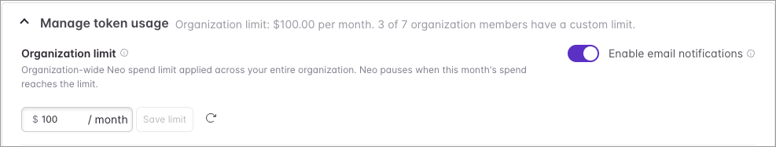
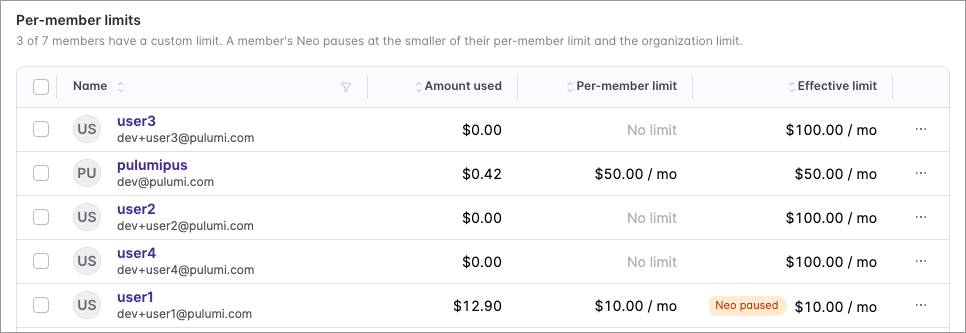

[Pulumi Neo](/docs/ai/) is an AI agent that takes on real infrastructure work, and it's natural to want to hand it more and more. Usage limits give you control so you can do exactly that: set a monthly dollar limit, and Neo pauses when your organization reaches it.

<!--more-->

## How usage limits work

Your organization limit is a single monthly dollar amount covering all Neo usage across the org. To set one:

1. In the Pulumi Cloud console, navigate to **Settings → Billing & usage → Neo token usage**.
1. In the **Manage token usage** panel, enter an organization limit.
1. Save your changes.

When usage reaches the limit, Neo pauses for the rest of the billing period and resumes automatically at the start of the next one. An Admin or Billing Manager can raise the limit to resume before then.

Enforcement happens at a natural boundary in Neo's work, so a task already in progress finishes its current step before pausing. As a result, usage can go a few dollars over the set limit.

## Per-member limits and alerts

You can also set a separate limit for each member. A member is paused at whichever limit is smaller: their own or the organization's. For example, a member with a $200 limit under a $150 organization limit pauses at $150, because the organization limit is smaller.

Turn on **Enable email notifications** to get a heads-up before you reach the limit. Billing admins are alerted at 50%, 80%, and 95% of the organization limit, with a final notice at 100% when Neo pauses.

## Get started

Set your usage limits and stay in control as your organization hands Neo more and more work. Usage limits are available today for organizations on a paid plan, and an **Admin** or **Billing Manager** can set them.

- [Sign in to Pulumi Cloud](https://app.pulumi.com/signin) and set your first organization limit
- [Read the Neo usage limits documentation](/docs/ai/usage-limits/) for per-member limits, alerts, and enforcement details
- [Join the Community Slack](https://slack.pulumi.com/) to share your feedback
