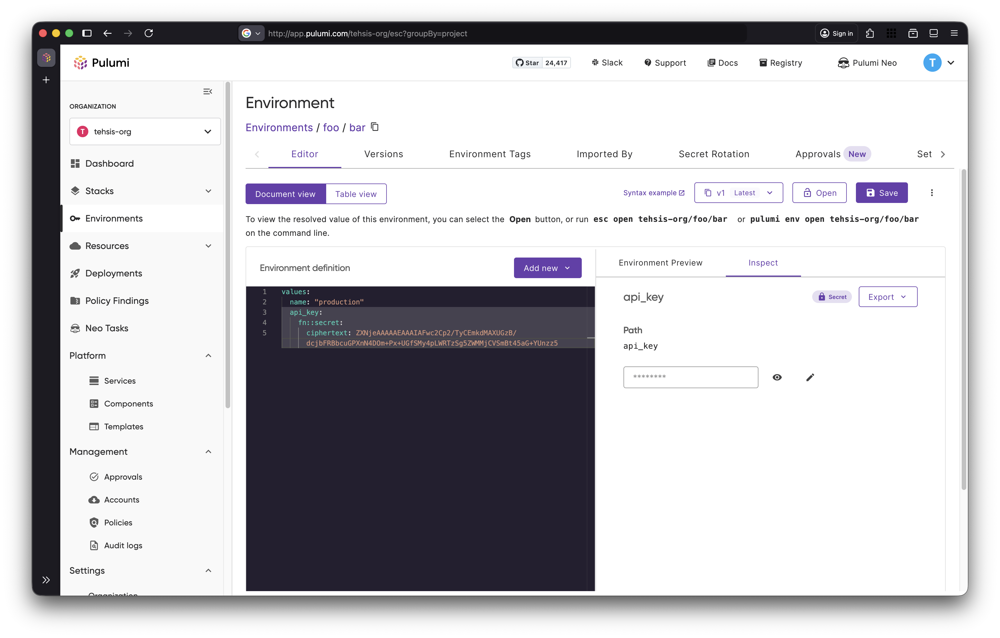

Pulumi ESC is Pulumi Cloud’s centralized solution for managing secrets and configuration across every vault and cloud provider you use. It helps teams secure their configuration while adopting modern best practices like short-lived credentials with OIDC and automated secret rotation.

Whether you’re configuring Pulumi programs, powering applications and services, or managing credentials for tools like the AWS CLI, ESC provides a single, consistent way to do it safely and at scale.

Behind the scenes, ESC integrates with multiple cloud providers and secret managers, supports composable environments, and offers rich built-in functions, from simple value transformations to encoding files as Base64.

With this level of power, usability matters more than ever.
That’s why today we’re introducing the new and improved Pulumi ESC Web Editor, designed to make managing secrets and configuration easier, faster, and more intuitive.

<!--more-->

Today, you can create and manage your Pulumi ESC configuration in multiple ways—using the CLI `set` and `edit` commands, or through our VS Code extension. For many users, however, their first experience with ESC happens in the Pulumi Cloud web console.

We know that most of our users are comfortable writing code and editing ESC YAML directly, and our previous Web Editor supported that workflow well. However, using ESC only as a place to store configuration and secrets means missing out on much of the power built into the platform. To address this, we introduced a Table View that allowed users to manage environments through convenient UI elements, exposing a broader set of capabilities without requiring direct YAML edits.

While this abstraction made ESC more approachable, it also introduced its own drawbacks. In particular, it could be difficult to understand how UI actions mapped to the underlying YAML, and we heard clear feedback from users that this created confusion.

The new Pulumi ESC Editor brings these two approaches together. You can now freely switch between writing YAML and using rich UI elements to manipulate your environment—while always having clear, in-context information about what you’re doing and what’s possible.

Let’s explore some of these use cases.

## Setting a secret



## Using built-int functions

## Exporting configurations

## Setting up integrations

## Writing the Post

For help assembling the content of your post, see [BLOGGING.md](https://github.com/pulumi/docs/blob/master/BLOGGING.md). For general formatting guidelines, see the [Style Guide](https://github.com/pulumi/docs/blob/master/STYLE-GUIDE.md).

## Code Samples

```typescript
let bucket = new aws.s3.Bucket("stuff");
...
```

## Images


## Videos



Note the `?rel=0` param, which tells YouTube to suggest only videos from same channel.
