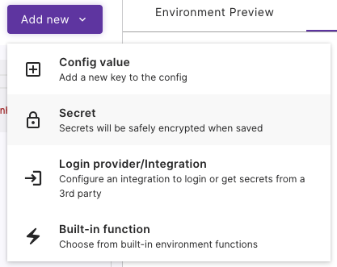
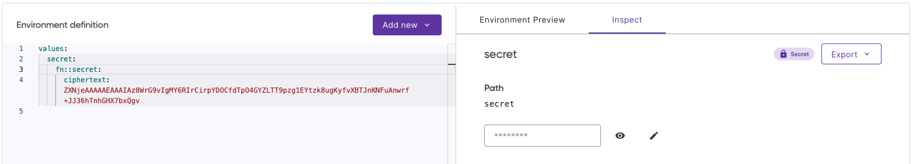
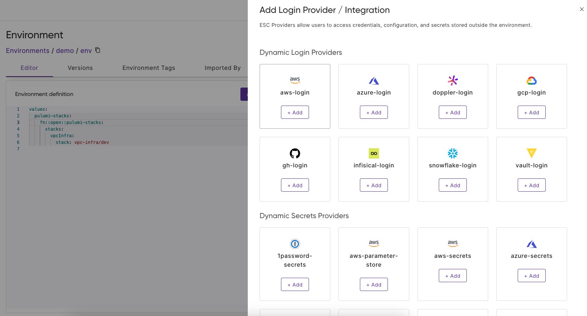
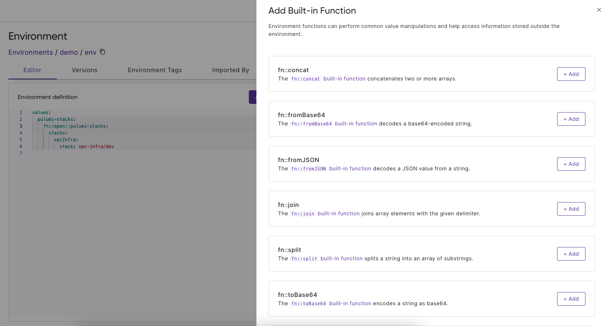
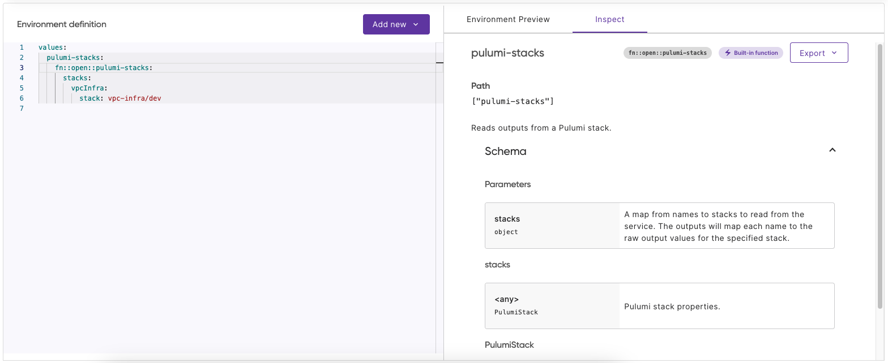
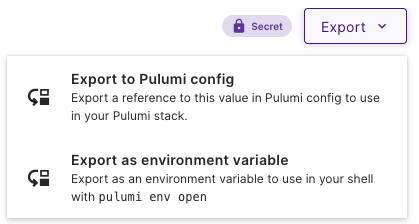

Pulumi ESC is Pulumi Cloud’s centralized solution for managing secrets and configuration across every vault and cloud provider you use. It helps teams secure their configuration while adopting modern best practices like short-lived credentials with OIDC and automated secret rotation.

Whether you’re configuring Pulumi programs, powering applications and services, or managing credentials for tools like the AWS CLI, ESC provides a single, consistent way to do it safely and at scale.

Behind the scenes, ESC integrates with multiple cloud providers and secret managers, supports composable environments, and offers rich built-in functions, from simple value transformations to encoding files as Base64.

With this level of power, usability matters more than ever.
That’s why today we’re introducing the new and improved Pulumi ESC Web Editor, designed to make managing secrets and configuration easier, faster, and more intuitive.

<!--more-->

Today, you can create and manage your Pulumi ESC configuration in multiple ways, such as using the CLI `set` and `edit` commands, or through our [VS Code extension](/docs/esc/development/vs-code-extension/). For many users, however, their first experience with ESC happens in the Pulumi Cloud Console.

Based on feedback from users of both our YAML Document view and Table view in the Console, we've been working hard to create a new and improved unified editor experience that makes ESC even easier to work with. One of the most notable improvements is a brand new **Inspect** tab that lets you easily edit secrets and gain deeper insights into your configuration. With this new UI, you can now freely switch between writing YAML and using rich UI elements to manipulate your environment—and the editor keeps everything in sync, with clear, in-context information about what you're doing and what's possible at every step.

Let’s explore some of these use cases!

## Adding and editing secrets

Adding secrets is now as simple as selecting **Secret** from the **Add new** menu.

The **Inspect** tab lets you view and edit your secret securely, automatically encrypting it as ciphertext in your environment definition. No more worrying about accidentally exposing sensitive values!

## Using providers and built-in functions

ESC offers a large library of [providers](/docs/esc/integrations/) and [built-in functions](/docs/esc/environments/syntax/builtin-functions/) to use in your environment. The new editor makes discovering and using them effortless.

  

  

When you add a provider or function, the editor inserts it with example values to get you started quickly. The **Inspect** tab provides instant access to documentation, so you can more easily configure the integrations.

## Exporting configurations

Consuming your configuration where you need it is now easier than ever. The **Export** menu in the **Inspect** sidebar lets you quickly expose values as Pulumi config for your stacks, or as environment variables in your shell.

## Conclusion

The new Pulumi ESC Editor brings together the best of both worlds: the power of the YAML editor with the ease of UI controls. Try it out today in the Pulumi Cloud Console and let us know what you think!
