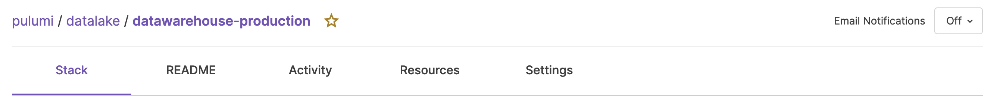

The [Pulumi Service](/product/pulumi-service/) is the easiest way to use Pulumi’s open source, universal infrastructure as code SDK at scale and provides a fully managed experience. It handles infrastructure state and secrets, sets up SAML SSO, integrates with CI/CD pipelines, and enforces compliance rules.

It’s been nearly four years since the Pulumi Service launched back in 2018. In these last four years, our customer base has grown significantly and as a result, the Service’s features and capabilities have grown with it.

<!--more-->

We’ve added features like [audit logs](/docs/pulumi-cloud/audit-logs/), [SAML SSO](/docs/pulumi-cloud/access-management/saml/) and [SCIM](/docs/pulumi-cloud/access-management/scim/), [Teams](/docs/pulumi-cloud/access-management/teams/), [Organization](/docs/pulumi-cloud/access-management/organization-access-tokens/) and [Team Access Tokens](/docs/pulumi-cloud/access-management/team-access-tokens/), and much more! But throughout all these changes, the look and feel of the Service has largely stayed the same—until now! Today we’re excited to launch a set of improvements to the overall user experience of the Pulumi Service. These updates include:

- Increased organizational insights on the Service Dashboard
- Quick access to stacks with a new Stack Favorites feature
- Easier navigation around the Service with a new left navigation pane

These changes came directly from consultation with our users and we've spent time with customers in the past few weeks refining it. One of these customers was [dutchie](https://dutchie.com), an all-in-one technology platform powering the cannabis industry with Point of Sale, Ecommerce, Payments, and more. "The new Pulumi Service console is a change we are really excited to see, literally. It has better use of white space and an improved balance of information on the Dashboard at the same time and that shows a real and welcome focus on user experience. It is a genuine quality of life improvement in a portion of the product that we use daily." said Jordan Rinke, Infrastructure Architect at dutchie.



Want to try these features out for yourself? [Sign in](https://app.pulumi.com) to your Pulumi Service account or if you are new to Pulumi, [create a free account](https://app.pulumi.com/signup).

## Increased organizational insights on the Service Dashboard

Lastly, we’ve made significant changes to the Pulumi Service dashboard. Now you can access more information to help survey your operations at a glance.

Organizations can access some quick usage statistics at the top of their dashboards:

- Member count and +/- change in the past week
- Total stack count and percent change in the past week
- Total resource count and percent change in the past week
- Number of successful updates in the past day, week, month, and year

If you're part of an organization, you'll also see a “Members” card that tracks recently joined members. If you're an admin, you can manage any pending invites from this card.

We've also exposed more operation updates in the “Latest Stack Activity” card. You can see up to ten most recent updates and favorite those stacks directly from the dashboard card.

## Quick access to stacks with a new Stack Favorites feature

Many Pulumi users have access to dozens of hundreds of stacks. But only a few of those stacks may require regular interaction. We've introduced a new Stack Favorites feature to let you flag the stacks that are most important. This way you can access those stacks from anywhere in the Service.

Your favorites list is your own. Even if you're part of an organization, your favorites won't be shared with anyone other than you. And you can have as many favorites as you like!

Look for the star icon next to any stack name and select it to start building your favorites list.

You can access the favorites list from two key locations in the Service: the left navigation pane and the dashboard. All your favorites will appear in the navigation pane under the “Stacks” heading. You'll also have your list of favorites in a new dashboard card.

## Easier navigation around the Service with a new left navigation pane

Among the biggest changes to the feel of the Service is our new left navigation pane. Navigation items like your Dashboard, Stacks, and Settings are accessible in the new pane from anywhere in the Service.

The navigation pane consolidates actions and information so it's easy for you to find common items. You'll find options in the pane to:

- Switch between your individual account and any other organizations you're part of
- Create new organizations
- Access Stack Favorites
- Directly access sub-pages like Billing or Access Tokens
- Send us your feedback!

These changes will help you move through the Pulumi Service without losing your place and to ensure convenient access to key pages. You can even collapse the navigation pane for more screen real estate and still access any page you need.

If you're looking for your account details, they have moved into the black utility toolbar. To access your account settings or logout of the Pulumi Service, select your profile image at the top right of your browser window.

## Try out the Pulumi Service today

We'd love for you to try out the new and improved Pulumi Service console!  Don't hesitate to reach out on the [Pulumi Community Slack](https://slack.pulumi.com/?_gl=1*abbv2y*_ga*MTgxNzE0MTI3LjE2NDM3MzcwNTU.*_ga_FQHG5CVY2D*MTY1NzY0ODc4NC4xMzMuMC4xNjU3NjQ4Nzg0LjYw) about any thoughts and feelings you have about these changes or any and all things Pulumi! We also have a [public GitHub repo](https://github.com/pulumi/pulumi-cloud-requests/issues) to track any requests related to the Service.

These changes wouldn’t be possible without the users who generously gave their time to have a conversation with us. We'll continue to translate user feedback into a better Pulumi experience.

We look forward to hearing what you think of these changes!
