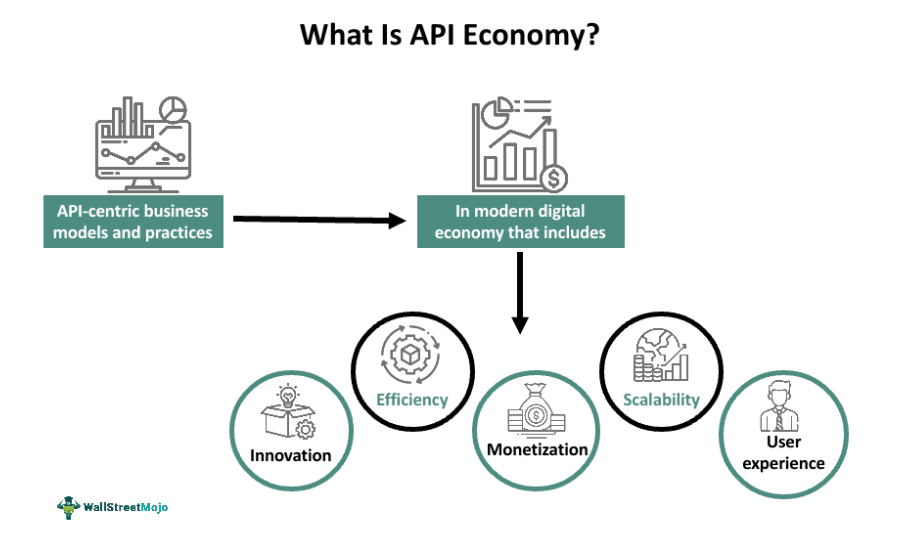
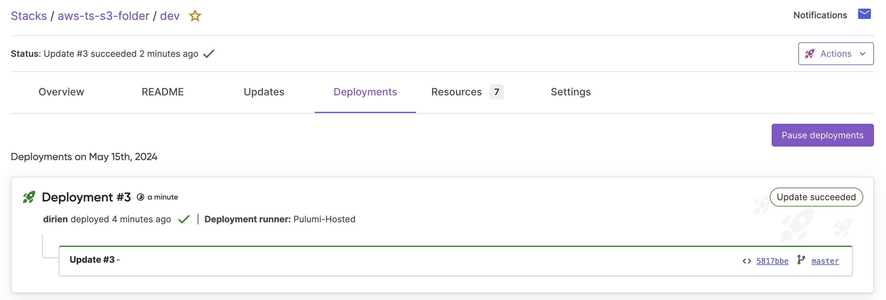
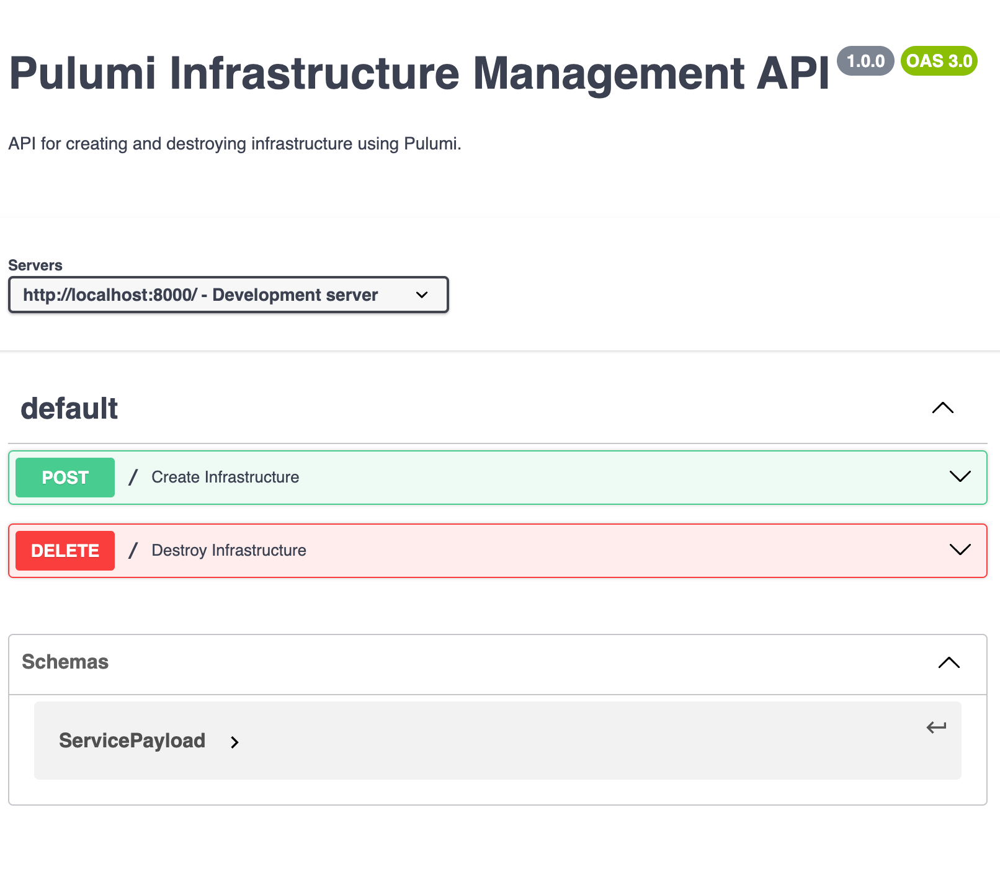

When I am talking with community members, who are not using Pulumi yet, I often get asked what would be a good way to include their Infrastructure as Code (IaC) into existing software like a REST API. And my answer is always the same: Use our [Pulumi Automation API](/docs/using-pulumi/automation-api/).

With the Pulumi Automation API you can include Pulumi IaC into your existing software, and this for any of the Pulumi supported programming languages like TypeScript, Python, Go, or C#. This gives you a greater flexibility and control, which you will not have with other IaC tools like CloudFormation or Terraform.

This opens up many doors of opportunity to expose your services as an API, whether internally to your organization or externally to your potential customers. This opportunity for innovation fuels what is known as the [API Economy](https://konghq.com/blog/enterprise/api-economy).

## What is API Economy?



As a matter of fact: — APIs enable innovation.

> Over [40% of large organizations](https://www.forbes.com/sites/patricksalyer/2021/05/04/api-stack-the-billion-dollar-opportunities-redefining-infrastructure-services--platforms/?sh=2d6c47f043f9) have 250+ APIs. And 71% plan to use even more APIs this year.

API Economy is a term that is used to describe the way that organizations are using APIs to create new business models and revenue streams. APIs are the building blocks of modern software development, and they allow developers to build on  top of existing services and create new services that are greater than the sum of their parts.

Major international corporations leveraging the API economy through robust API strategies include Google, Amazon, Stripe, Twilio, Slack, and many other renowned brands. Google's initial Maps service, for instance, has evolved into a comprehensive platform offering Maps, Routes, and Places APIs and SDKs. These tools enable companies to incorporate both dynamic and static maps into their applications and websites, offer navigational guidance, access 360° Street View images, utilize geolocation services, and more. This transformation exemplifies the concept of value multiplication in the API economy, as described by [Gartner Vice President Kristin Moyer](https://www.gartner.com/smarterwithgartner/welcome-to-the-api-economy):

> "The API economy is an enabler for turning a business or organisation into a platform. Platforms multiply value creation because they enable business ecosystems inside and outside of the enterprise to consummate matches among users and facilitate the creation and exchange of goods, services and social currency so that all participants are able to capture value."

## What is Pulumi Automation API in a nutshell?

Pulumi Automation API is a set of SDKs that allow you to interact with your Pulumi stacks programmatically. This means that you can use the Automation API to create, update, and delete stacks, as well as to query their current state. The Automation API is built on top of the Pulumi engine, which means that it is fully compatible with all of the existing Pulumi providers and resources.

And it is this capability that allows you to build your own Service API on top of Pulumi. We can now build a REST or gRPC API endpoint that, depending on the request parameters, will create, update, or delete a Pulumi stack. This API can then be exposed to the rest of the organization, allowing developers to interact with their infrastructure in a programmatic way.

## How to build your own Service API with Pulumi Automation API?

Let's take a look at how you can build your own Service API with Pulumi Automation API.

For this purpose, we will build two basic REST services written in [TypeScript](https://www.typescriptlang.org/) and in [Python](https://www.python.org/).



{}

```typescript
import express from "express"
import * as dotevnv from "dotenv"
import cors from "cors"
import helmet from "helmet"
import {fullyQualifiedStackName, RemoteWorkspace} from "@pulumi/pulumi/automation";

dotevnv.config()

if (!process.env.PORT) {
    console.log(`No port value specified...`)
}

const PORT = parseInt(process.env.PORT as string, 10)

const app = express()

app.use(express.json())
app.use(express.urlencoded({extended: true}))
app.use(cors())
app.use(helmet())

// Define the payload interface
interface ServicePayload {
    name: string;
    org: string;
    project: string;
    stack: string;
    region: string;
}

// Define a helper function to set up the Pulumi program
async function setUpPulumiProgram(payload: ServicePayload) {
    const org = payload.org;
    const project = payload.project;
    const stackName = fullyQualifiedStackName(org, project, payload.stack);
    const awsRegion = payload.region;

    // Using the Pulumi Automation API to create or select a stack in the remote workspace
    // and set the stack's configuration and secrets. This will use Pulumi Deployments to
    // deploy the stack to the specified AWS region.
    return await RemoteWorkspace.createOrSelectStack({
        stackName,
        url: "https://github.com/pulumi/examples.git",
        branch: "refs/heads/master",
        projectPath: project,
    }, {
        envVars: {
            AWS_REGION: awsRegion,
            AWS_ACCESS_KEY_ID: process.env.AWS_ACCESS_KEY_ID ?? "",
            AWS_SECRET_ACCESS_KEY: {secret: process.env.AWS_SECRET_ACCESS_KEY ?? ""},
            AWS_SESSION_TOKEN: {secret: process.env.AWS_SESSION_TOKEN ?? ""},
        },
    });
}

// Define the API endpoint for creating a new stack in the remote workspace.
app.post('/', async (req, res) => {
    const payload: ServicePayload = req.body;

    if ((payload.name) || !payload.org || !payload.project || !payload.stack || !payload.region) {
        res.status(400).send('Name, org, project, stack and region are required');
        return;
    }
    // Create a new stack in the remote workspace and set the stack's configuration and secrets.
    const stack = await setUpPulumiProgram(payload);

    // Deploy the stack to the specified AWS region. We'll print the stack's outputs to the console.
    const upRes = await stack.up({onOutput: console.log});
    res.status(200).send(`url: ${upRes.outputs.websiteUrl.value}`);
});

// Define the API endpoint for destroying a stack in the remote workspace.
app.delete('/', async (req, res) => {
    const {name, org, project, stack, region} = req.query;

    if (!name || !org || !project || !stack || !region) {
        res.status(400).send('Name, org, project, stack, and region are required');
        return;
    }

    const payload: ServicePayload = {
        name: name as string,
        org: org as string,
        project: project as string,
        stack: stack as string,
        region: region as string
    }

    // Define the stack and set the stack's configuration and secrets.
    const prog = await setUpPulumiProgram(payload);
    // Destroy the stack in the remote workspace. We'll print the stack's outputs to the console.
    await prog.destroy({onOutput: console.log});
    res.status(200).send('Stack destroyed');
});


app.listen(PORT, () => {
    console.log(`Server is listening on port ${PORT}`)
})
```
{}

{}

```python
import os
import pulumi.automation as auto
from fastapi import FastAPI
from pydantic import BaseModel

app = FastAPI()


# Define the payload that the API will receive. This payload will contain the name of the stack
# to create, the organization and project to use, the stack name, and the AWS region to deploy the stack to.
class ServicePayload(BaseModel):
    name: str
    org: str
    project: str
    stack: str
    region: str


# Define a helper function that will create a new stack in the remote workspace and set the stack's configuration
def setup_pulumi_program(payload: ServicePayload):
    org = payload.org
    project = payload.project
    stack_name = auto.fully_qualified_stack_name(org, project, payload.stack)
    aws_region = payload.region

    # Using the Pulumi Automation API to create or select a stack in the remote workspace
    # and set the stack's configuration and secrets. This will use Pulumi Deployments to
    # deploy the stack to the specified AWS region.
    return auto.create_or_select_remote_stack_git_source(
        stack_name=stack_name,
        url="https://github.com/pulumi/examples.git",
        branch="refs/heads/master",
        project_path=project,
        opts=auto.RemoteWorkspaceOptions(
            env_vars={
                "AWS_REGION": aws_region,
                "AWS_ACCESS_KEY_ID": os.environ["AWS_ACCESS_KEY_ID"],
                "AWS_SECRET_ACCESS_KEY": auto.Secret(os.environ["AWS_SECRET_ACCESS_KEY"]),
                "AWS_SESSION_TOKEN": auto.Secret(os.environ["AWS_SESSION_TOKEN"]),
            },
        ),
    )


# Define the API endpoints for creating and deleting a stack in the remote workspace.
@app.post("/")
async def create(payload: ServicePayload):
    # Create a new stack in the remote workspace and set the stack's configuration and secrets.
    stack = setup_pulumi_program(payload)
    # Deploy the stack to the specified AWS region. We'll print the stack's outputs to the console.
    up_res = stack.up(on_output=print)
    return {"url": up_res.outputs['websiteUrl'].value}


# Define the API endpoint for deleting a stack in the remote workspace.
@app.delete("/")
async def delete(name: str, org: str, project: str, stack: str, region: str):
    payload = ServicePayload(name=name, org=org, project=project, stack=stack, region=region)
    # Define the stack and set the stack's configuration and secrets.
    stack = setup_pulumi_program(payload)
    # Destroy the stack in the remote workspace. We'll print the stack's outputs to the console.
    stack.destroy(on_output=print)
    return {"message": "Stack destroyed"}
```
{}

Let us run the above Python example in a FastAPI server to see how the Automation API works in practice.

Let's start by creating a new Python file called `main.py` and pasting the above code into it. Next, we need to install the required dependencies:

```bash
python3 -m venv ven
source venv/bin/activate
```
Create a new file called `requirements.txt` and paste the following dependencies into it:

```bash
pulumi
fastapi
pydantic
```

We need to install the dependencies using the following command:

```bash
pip install -r requirements.txt --force-reinstall
```

Finally, we can run the FastAPI server using the following command:

```bash
fastapi dev main.py
```

This will start the FastAPI server on port 8000.

```bash
INFO     Using path main.py
INFO     Resolved absolute path /private/tmp/automation-api-example/python/main.py
INFO     Searching for package file structure from directories with __init__.py files
INFO     Importing from /private/tmp/automation-api-example/python

 ╭─ Python module file ─╮
 │                      │
 │  🐍 main.py          │
 │                      │
 ╰──────────────────────╯

INFO     Importing module main
INFO     Found importable FastAPI app

 ╭─ Importable FastAPI app ─╮
 │                          │
 │  from main import app    │
 │                          │
 ╰──────────────────────────╯

INFO     Using import string main:app

 ╭────────── FastAPI CLI - Development mode ───────────╮
 │                                                     │
 │  Serving at: http://127.0.0.1:8000                  │
 │                                                     │
 │  API docs: http://127.0.0.1:8000/docs               │
 │                                                     │
 │  Running in development mode, for production use:   │
 │                                                     │
 │  fastapi run                                        │
 │                                                     │
 ╰─────────────────────────────────────────────────────╯

INFO:     Will watch for changes in these directories: ['/private/tmp/automation-api-example/python']
INFO:     Uvicorn running on http://127.0.0.1:8000 (Press CTRL+C to quit)
INFO:     Started reloader process [55849] using WatchFiles
INFO:     Started server process [55851]
INFO:     Waiting for application startup.
INFO:     Application startup complete.
```

To test the REST services, you can use a tool like `curl` or Postman. Here is an example of how you can create a new stack using `curl`:

```bash
curl -X POST -H "Content-Type: application/json" -d '{"name": "myexample", "org": "myorg", "project": "myproject", "stack": "mystack", "region": "us-west-2"}' http://localhost:3000
```

In the logs of the FastAPI server, you should see following output from the Automation API:

```bash
INFO: Create stack
Preparing deployment...

View Live: https://app.pulumi.com/dirien/aws-ts-s3-folder/dev/deployments/3

Setup:
Preparing environment
Pulling container image "pulumi/pulumi:3.115.2"
3.115.2: Pulling from pulumi/pulumi
Digest: sha256:a7b9022d7c1a40d81adeca30a21eb1cd49add474e3de923ade663db046e7ee1a
Status: Downloaded newer image for pulumi/pulumi:3.115.2
Starting container
Container created (6b92928bdcdfe6e54286dcdcb622480004f18c98b23b5b60775f71959a423708)
Container started (6b92928bdcdfe6e54286dcdcb622480004f18c98b23b5b60775f71959a423708)

Download deployment executor:
$ curl --retry 5 -H "Authorization: token $PULUMI_ACCESS_TOKEN" "$PULUMI_SERVICE_URL/deployments/executor" -o /pulumi-deploy-executor.gz && gzip -d /pulumi-deploy-executor.gz && chmod +x /pulumi-deploy-executor
  % Total    % Received % Xferd  Average Speed   Time    Time     Time  Current
                                 Dload  Upload   Total   Spent    Left  Speed
100 15.9M    0 15.9M    0     0  42.2M      0 --:--:-- --:--:-- --:--:-- 42.4M

Get source:
$ /pulumi-deploy-executor getsource git --repoURL="https://github.com/pulumi/examples.git" --workDir="/deployment" --branch="refs/heads/master" --repoDir="aws-ts-s3-folder"
Successfully cloned: https://github.com/pulumi/examples.git

Download dependencies:
$ /pulumi-deploy-executor dependencies download --workDir="/deployment/aws-ts-s3-folder"
npm WARN deprecated @opentelemetry/api-metrics@0.32.0: Please use @opentelemetry/api >= 1.3.0

added 294 packages, and audited 295 packages in 14s

43 packages are looking for funding
  run `npm fund` for details

found 0 vulnerabilities
npm notice
npm notice New major version of npm available! 9.6.7 -> 10.7.0
npm notice Changelog: <https://github.com/npm/cli/releases/tag/v10.7.0>
npm notice Run `npm install -g npm@10.7.0` to update!
npm notice

pulumi update:
$ /pulumi-deploy-executor pulumi update --stackIdentity="dirien/aws-ts-s3-folder/dev" --workDir="/deployment/aws-ts-s3-folder"
Updating (dev)

View Live: https://app.pulumi.com/dirien/aws-ts-s3-folder/dev/updates/3


 +  pulumi:pulumi:Stack aws-ts-s3-folder-dev creating (0s)
 +  aws:s3:Bucket s3-website-bucket creating (0s)
 +  aws:s3:Bucket s3-website-bucket created (4s)
 +  aws:s3:BucketObject favicon.png creating (0s)
 +  aws:s3:BucketObject index.html creating (0s)
 +  aws:s3:BucketPublicAccessBlock public-access-block creating (0s)
 +  aws:s3:BucketObject index.html created (0.98s)
 +  aws:s3:BucketObject favicon.png created (1s)
 +  aws:s3:BucketPublicAccessBlock public-access-block created (1s)
 +  aws:s3:BucketPolicy bucketPolicy creating (0s)
 +  aws:s3:BucketPolicy bucketPolicy created (0.83s)
 +  pulumi:pulumi:Stack aws-ts-s3-folder-dev created (18s)
Outputs:
    bucketName: "s3-website-bucket-d55e9bd"
    websiteUrl: "s3-website-bucket-d55e9bd.s3-website.eu-central-1.amazonaws.com"

Resources:
    + 6 created

Duration: 20s

Result: succeeded
INFO:     127.0.0.1:49220 - "POST / HTTP/1.1" 200 OK
```

You should see the URL of the created infrastructure in the response from the FastAPI server. If you head over to the [Pulumi console](https://app.pulumi.com/), you should see the created stack and the resources that were created and also that [Pulumi Deployments](/docs/pulumi-cloud/deployments/) were used to deploy the stack to the specified AWS region.



And here is an example of how you can delete a stack using `curl`:

```bash
curl -X DELETE "http://localhost:8000/?name=myexample&org=myorg&project=myproject&stack=mystack&region=us-west-2"
```

In the logs of the FastAPI server, you should see the following output from the Automation API:

```bash
INFO: Deleting stack
Preparing deployment...

View Live: https://app.pulumi.com/dirien/aws-ts-s3-folder/dev/deployments/4

Setup:
Preparing environment
Pulling container image "pulumi/pulumi:3.115.2"
3.115.2: Pulling from pulumi/pulumi
Digest: sha256:a7b9022d7c1a40d81adeca30a21eb1cd49add474e3de923ade663db046e7ee1a
Status: Downloaded newer image for pulumi/pulumi:3.115.2
Starting container
Container created (26af871d4e26a6dab5656a1c8dc8a7e87bf247f42bde77e2269c269f15054e73)
Container started (26af871d4e26a6dab5656a1c8dc8a7e87bf247f42bde77e2269c269f15054e73)

Download deployment executor:
$ curl --retry 5 -H "Authorization: token $PULUMI_ACCESS_TOKEN" "$PULUMI_SERVICE_URL/deployments/executor" -o /pulumi-deploy-executor.gz && gzip -d /pulumi-deploy-executor.gz && chmod +x /pulumi-deploy-executor
  % Total    % Received % Xferd  Average Speed   Time    Time     Time  Current
                                 Dload  Upload   Total   Spent    Left  Speed
100 15.9M    0 15.9M    0     0  43.5M      0 --:--:-- --:--:-- --:--:-- 43.5M

Get source:
$ /pulumi-deploy-executor getsource git --repoURL="https://github.com/pulumi/examples.git" --workDir="/deployment" --branch="refs/heads/master" --repoDir="aws-ts-s3-folder"
Successfully cloned: https://github.com/pulumi/examples.git

Download dependencies:
$ /pulumi-deploy-executor dependencies download --workDir="/deployment/aws-ts-s3-folder"
npm WARN deprecated @opentelemetry/api-metrics@0.32.0: Please use @opentelemetry/api >= 1.3.0

added 294 packages, and audited 295 packages in 14s

43 packages are looking for funding
  run `npm fund` for details

found 0 vulnerabilities
npm notice
npm notice New major version of npm available! 9.6.7 -> 10.7.0
npm notice Changelog: <https://github.com/npm/cli/releases/tag/v10.7.0>
npm notice Run `npm install -g npm@10.7.0` to update!
npm notice

pulumi destroy:
$ /pulumi-deploy-executor pulumi destroy --stackIdentity="dirien/aws-ts-s3-folder/dev" --workDir="/deployment/aws-ts-s3-folder"
Destroying (dev)

View Live: https://app.pulumi.com/dirien/aws-ts-s3-folder/dev/updates/4


 -  aws:s3:BucketPolicy bucketPolicy deleting (0s)
 -  aws:s3:BucketPolicy bucketPolicy deleted (1s)
 -  aws:s3:BucketPublicAccessBlock public-access-block deleting (0s)
 -  aws:s3:BucketObject favicon.png deleting (0s)
 -  aws:s3:BucketObject index.html deleting (0s)
 -  aws:s3:BucketObject index.html deleted (0.61s)
 -  aws:s3:BucketObject favicon.png deleted (0.73s)
 -  aws:s3:BucketPublicAccessBlock public-access-block deleted (0.77s)
 -  aws:s3:Bucket s3-website-bucket deleting (0s)
 -  aws:s3:Bucket s3-website-bucket deleted (0.79s)
 -  pulumi:pulumi:Stack aws-ts-s3-folder-dev deleting (0s)
 -  pulumi:pulumi:Stack aws-ts-s3-folder-dev deleted (0.10s)
Outputs:
  - bucketName: "s3-website-bucket-d55e9bd"
  - websiteUrl: "s3-website-bucket-d55e9bd.s3-website.eu-central-1.amazonaws.com"

Resources:
    - 6 deleted

Duration: 7s

The resources in the stack have been deleted, but the history and configuration associated with the stack are still maintained.
If you want to remove the stack completely, run `pulumi stack rm dev`.
Result: succeeded
INFO:     127.0.0.1:51509 - "DELETE /?name=my-test&org=dirien&project=aws-ts-s3-folder&stack=dev&region=eu-central-1 HTTP/1.1" 200 OK
```

## Next Steps

Now that we have our basic REST services, we can deploy them on a server (using a service like AWS Lambda, Google Cloud Functions, or Azure Functions) and expose them to the rest of the organization via an API Gateway. In parallel you can publish release notes and documentation to your organization, so that they can start using your new Service API.

One way could be to create an OpenAPI specification for your Service API and use a tool like Swagger to generate a client library for your organization. This way, developers can interact with your Service API in a programmatic way, without having to write any code.

Here is an example of an OpenAPI specification for our Service API:

```yaml
openapi: 3.0.0
info:
  title: My Organization Service API
  description: API for creating and destroying a specific piece of infrastructure
  version: 1.0.0
servers:
- url: 'http://localhost:8000/'
  description: Development server
paths:
  /:
    post:
      summary: Create Infrastructure
      operationId: createInfrastructure
      requestBody:
        required: true
        content:
          application/json:
            schema:
              $ref: '#/components/schemas/ServicePayload'
      responses:
        '200':
          description: Infrastructure successfully created
          content:
            application/json:
              schema:
                type: object
                properties:
                  url:
                    type: string
                    description: URL of the created infrastructure
        '400':
          description: Bad request if the input payload is incorrect
        '500':
          description: Internal server error
    delete:
      summary: Destroy Infrastructure
      operationId: destroyInfrastructure
      parameters:
      - in: query
        name: name
        schema:
          type: string
        required: true
        description: Name of the service
      - in: query
        name: org
        schema:
          type: string
        required: true
        description: Organization in Pulumi
      - in: query
        name: project
        schema:
          type: string
        required: true
        description: Project name in Pulumi
      - in: query
        name: stack
        schema:
          type: string
        required: true
        description: Stack name in Pulumi
      - in: query
        name: region
        schema:
          type: string
        required: true
        description: AWS region where the service will be deployed
      responses:
        '200':
          description: Infrastructure successfully destroyed
          content:
            application/json:
              schema:
                type: object
                properties:
                  message:
                    type: string
                    description: Confirmation message of the destruction
        '400':
          description: Bad request if the required parameters are missing
        '500':
          description: Internal server error
components:
  schemas:
    ServicePayload:
      type: object
      required:
      - name
      - org
      - project
      - stack
      - region
      properties:
        name:
          type: string
          description: Name of the service
        org:
          type: string
          description: Organization in Pulumi
        project:
          type: string
          description: Project name in Pulumi
        stack:
          type: string
          description: Stack name in Pulumi
        region:
          type: string
          description: AWS region where the service will be deployed
```

Navigate to the [Swagger Editor](https://editor.swagger.io/) and paste the above OpenAPI specification to see how it looks.



## Conclusion


In this blog post, we've explored how Pulumi's Automation API can be used to build and expose a Service API within your organization. By embedding Pulumi as a library in any application, you can drive your Infrastructure as Code (IaC) deployments directly through code. This sets Pulumi apart from other tools like Terraform, which relies on static configuration files and a command-line interface.

Additionally, we touched on the concept of the API economy, where APIs are leveraged to connect services, accelerate product delivery, and drive business value through the possibilities of creating new touchpoints. The Pulumi Automation API is the perfect piece of technology, which makes it now possible to define, deploy, and manage infrastructure programmatically as part of your API strategy.

I hope this blog post has inspired you with ideas on how to take your IaC to the next level, making it more accessible and practical for your organization.

## Next Steps

If you haven't already, [install Pulumi][pulumi-install] today, and follow our self-directed [Getting Started guides][pulumi-start] to learn more about making the most of Pulumi's next-level infrastructure management features at your organization.

To learn more, you can watch the following video which provides a high level overview of how Pulumi works:

<div class="rounded-md shadow border border-gray-300 w-3/4 mx-auto my-4" style="position: relative; padding-bottom: 40.25%; height: 0; overflow: hidden;">
    <iframe
        src="//www.youtube.com/embed/Q8tw6YTD3ac?rel=0"
        style="position: absolute; top: 0; left: 0; width: 100%; height: 100%; border:0;"
        allowfullscreen=""
        title="Introduction to Pulumi in Three Minutes"
        srcdoc="<style>*{padding:0;margin:0;overflow:hidden}html,body{height:100%}img{position:absolute;width:100%;top:0;bottom:0;margin:auto}</style><a href=https://www.youtube.com/embed/Q8tw6YTD3ac?autoplay=1></a>">
    </iframe>
</div>

## Pulumi Cloud

The Pulumi Cloud is a fully managed service that helps you adopt Pulumi’s open source SDK with ease. It provides built-in state and secrets management, integrates with source control and CI/CD, and offers a web console and API that make it easier to visualize and manage infrastructure. It is free for individual use, with features available for teams.

<a class="btn btn-secondary" href="https://app.pulumi.com/signup" target="_blank">Create an Account</a>

[pulumi-install]: https://www.pulumi.com/docs/install/
[pulumi-start]: https://www.pulumi.com/start
