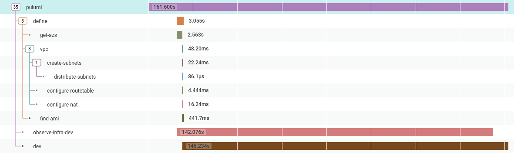
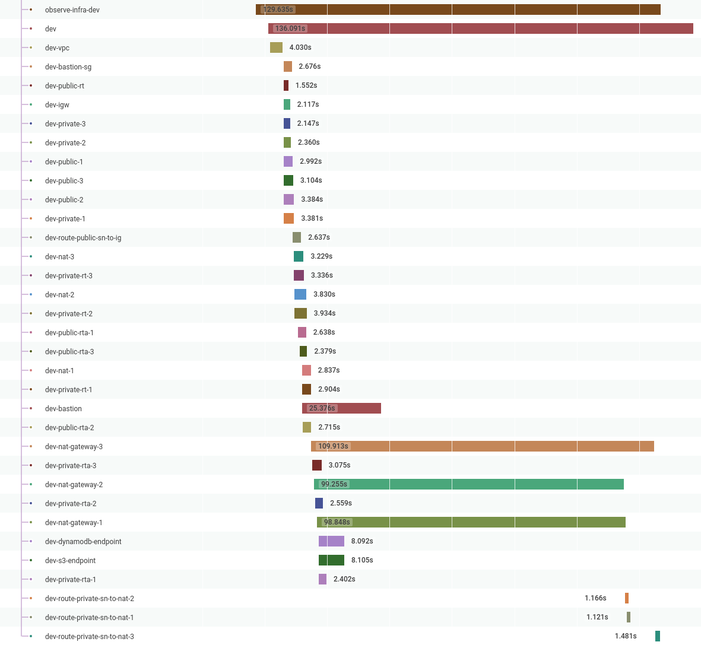

**Guest Article:** [Andy Davies](https://andydote.co.uk) is a Senior Software Developer at [Reaktor](https://reaktor.com),
a tech company based in Amsterdam, New York, and Finland, writing about using the Pulumi Automation API to add
observability to infrastructure provisioning.

<!--more-->

When using the [Pulumi Automation API](https://www.pulumi.com/blog/tag/automation-api/) to create applications that
provisions infrastructure, it is very handy to use observability techniques to ensure the application functions
correctly and to find where performance bottlenecks are.

One of the applications I work on creates a VPC and Bastion host and then stores the credentials in a Vault instance.
The problem is that the 'create infrastructure' part is an opaque blob, in that I can see it takes 129 seconds to create,
but I can’t see what it’s doing or why it takes this amount of time.



So can I do better?

### The Initial Application

In this example, I use [Honeycomb's](https://honeycomb.io/) [Go Beeline](https://github.com/honeycombio/beeline-go/) to
capture all the data I care about; durations, errors, and any context which is 'interesting':

```go
func main() {

	beeline.Init(beeline.Config{
		WriteKey: os.Getenv("HONEYCOMB_API_KEY"),
		Dataset:  "pulumi-demo",
	})
	defer beeline.Close()

	ctx, span := beeline.StartSpan(context.Background(), "basic-vpc")
	defer span.Send()

	name := auto.FullyQualifiedStackName(os.Getenv("PULUMI_USERNAME"), "basic-vpc", "dev")
	stack, err := auto.UpsertStackInlineSource(ctx, name, "basic-vpc", func(pc *pulumi.Context) error {

		azs, err := getAvailabilityZones(ctx)
		if err != nil {
			beeline.AddField(ctx, "err", err)
			return err
		}

		v, err := vpc.NewVpc(ctx, pc, "dev", &vpc.VpcArgs{
			Description:           "dev",
			BaseCidr:              "192.168.0.0/16",
			AvailabilityZoneNames: azs,
			S3Endpoint:            true,
			DynamoEndpoint:        true,
		})
		if err != nil {
			beeline.AddField(ctx, "err", err)
			return err
		}
	})

	if err != nil {
		beeline.AddField(ctx, "err", err)
		os.Exit(1)
	}

	if err := stack.SetConfig(ctx, "aws:region", auto.ConfigValue{Value: os.Getenv("PULUMI_REGION")}); err != nil {
		beeline.AddField(ctx, "err", err)
		os.Exit(1)
	}

	ws := stack.Workspace()
	if err := ws.InstallPlugin(ctx, "aws", "v3.23.0"); err != nil {
		beeline.AddField(ctx, "err", err)
		os.Exit(1)
	}

	if _, err := stack.Refresh(ctx); err != nil {
		beeline.AddField(ctx, "err", err)
		os.Exit(1)
	}

	stream := optup.ProgressStreams(os.Stdout)
	if _, err := stack.Up(ctx, stream); err != nil {
		beeline.AddField(ctx, "err", err)
		os.Exit(1)
	}

	//vault code

}
```

### Adding Infrastructure Observability

To get a handle on what happens when `stack.Up()` runs, I have implemented a custom `io.Writer`, which is
passed into the `ProgressStream` constructor.

The custom progress stream's `Write` method is called once for each line emitted, which allows us to start new spans
when a resource starts being constructed, and send them when construction completes. This is currently achieved by
parsing the console output text, but I gather in the future, it will be possible to get streamed JSON blobs that can
be unmarshaled into go structs.

```go
type pulumiBeeline struct {
	ctx      context.Context
	contexts map[string]func()
}

func NewPulumiBeeline(ctx context.Context) *pulumiBeeline {
	return &pulumiBeeline{
		ctx:  	ctx,
		contexts: map[string]func(){},
	}
}

func (cw *pulumiBeeline) Write(p []byte) (n int, err error) {

	// todo: make more robust, support modifications, deletions etc.
	line := strings.TrimSpace(string(p))
	parts := strings.Split(line, " ")
	if len(parts) < 5 {
		return len(p), nil
	}

	//+  aws-vpc dev creating
	//+  <type> <name> <action>
	resourceType := parts[2]
	resourceName := parts[3]
	resourceAction := parts[4]

	if resourceAction == "creating" {
		c, s := beeline.StartSpan(cw.ctx, resourceName)
		beeline.AddField(c, "type", resourceType)
		// add other things here

		cw.contexts[resourceName] = s.Send
	}

	if resourceAction == "created" {
		cw.contexts[resourceName]()
	}

	return len(p), nil
}
```

Modifying the `optup.ProgressStreams` is the only change needed to the original application:

```go
stream := optup.ProgressStreams(os.Stdout, NewPulumiBeeline(ctx))
if _, err := stack.Up(ctx, stream); err != nil {
	beeline.AddField(ctx, "err", err)
	os.Exit(1)
}
```

When I rerun this program, I can see a lot more information in my Honeycomb traces, which shows me
that Pulumi is _highly_ parallelized and provides a better idea of where the time is spent when creating
infrastructure. In this example, it’s the NAT Gateways:



In the future, I want to expand this to cover far more details. Among those details are why resources were
created/modified/destroyed and collecting more information on what causes resources to fail.

## Wrapping Up

In the end, this turned out to be much easier to achieve than I had hoped. Using Pulumi programmatically was a huge
productivity boost, instead of running `os.Exec` directly.

I am looking forward to all the new kinds of tooling I can build to solve my user's problems by continuing to utilize
Honeycomb for my observability and Pulumi for my infrastructure.
