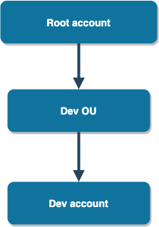
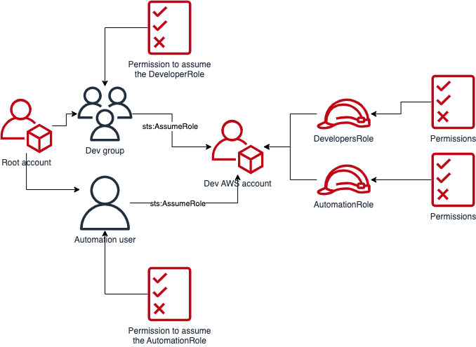
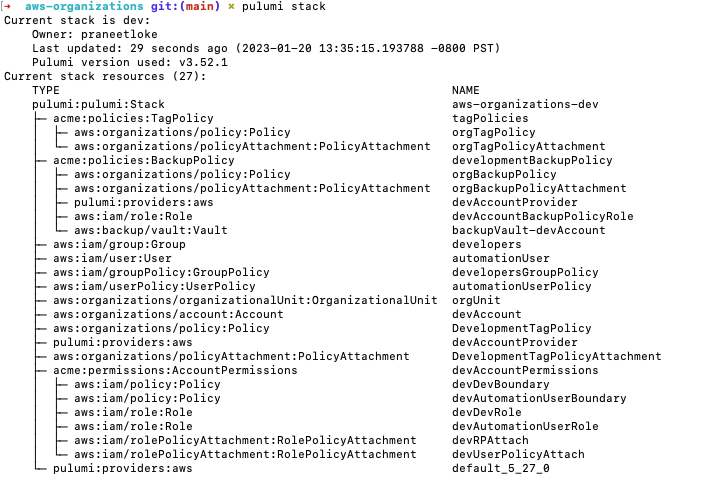
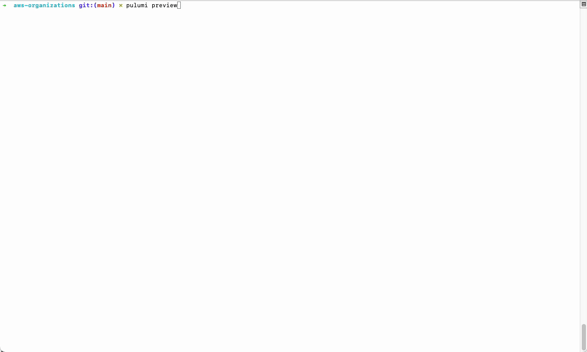

In an enterprise organization, an IT self-service "vending machine" allows employees to quickly and easily request and receive access to pre-approved cloud resources. Behind the scenes, Pulumi programs may orchestrate any of the requisite resources. We will look at an example of using Pulumi to create an AWS child account, within an AWS Organization.

<!--more-->

One might envision a developer requesting a new AWS account to be added entirely through a Pull Request in a git repository either for their own use or on behalf of a team. This scenario is not just for enterprises, however. Teams of any size should organize their AWS accounts using the least-privileged access principle.

Here’s the Organization structure we are looking to build with Pulumi. It just has one organizational unit (OU) with one member account under it to demonstrate how teams can construct the structure that works best for them or follow AWS’ recommendations on this topic. Depending on your team size you may want to keep this simple or you may need something that can handle multiple teams each with multiple accounts. The decision is yours.



For the above organization structure, we want the following operational model:

1. The user accounts for developers will be provisioned (either manually or automatically through SSO depending on your HR systems) in the root account. Developers will only be able to assume a specific role in the target accounts that have a trust boundary with the root account.
1. Developers will be added to a group and the group should be granted access to assume a role.
1. An IAM user meant for automation (eg. CI/CD pipelines) in the root account should have access to assume a role in the target account in order to manage resources. No developer should have access to assume the role meant for the automation user.
1. An org unit-level (OU) backup policy that backs-up resources tagged with a specific key/value pair.
1. An org unit-level (OU) tagging policy that enforces tag-casing and the default tags that resources should have.

The component resources mentioned in this post are for demonstration and to show you how you can use the expressiveness found only in the Pulumi programming model. Some details are omitted in this post for brevity. Please see the [source repository](https://github.com/pulumi/examples/tree/master/aws-ts-organizations) for the complete source code.
In order to modify the organization resources you’ll need credentials to an admin IAM user from your management account. Create an IAM user specifically to run this infrastructure app. These elevated credentials should not be used for anything else.

Once the member accounts have been created, in order to operate in those accounts using your preferred CI/CD service, we’ll create an automation user that will specifically have the permissions to assume a role in the member account. So you should use the credentials of that user for any other resources the team would want to deploy. For example, the team might want to deploy a new ECS cluster, along with Managed Redis instances and perhaps an RDS cluster too. These are resources specific to the team and what they want to use the account for.

{}
If you are using one of the supported CI/CD services you might be able to use federated credentials using OIDC. So if you are going to use that auth mechanism, you can skip creation of the fixed automation user account since you will not need its
credentials.
{}

## Organizational Unit (OU)

An org unit can represent anything. In our example it represents the development team. You could also have multiple OUs and even nest them to create sub-hierarchies, depending on your use-case.

The `organizations` module in the AWS provider package contains the resources we need in order to create an OU and an account.

```typescript
// If you've already created an organization in your root account
// and don't want it to be managed by Pulumi then simply retrieve
// it using the `getOrganization` function.
const organization = aws.organizations.getOrganization({});

// Otherwise, create an organization and let Pulumi manage it.
// If you are going to create the organization using the following
// construction, you should remove the call to getOrganization above.
//
// const organization = new aws.organizations.Organization("");

const devOrgUnit = new aws.organizations.OrganizationalUnit("orgUnit", {
    parentId: organization.then((o) => o.roots[0].id),
    name: "Development",
});

const devAccount = new aws.organizations.Account(
    "devAccount",
    {
        name: "DeveloperAccount",
        parentId: devOrgUnit.id,
        email: devAccountEmailContact,
	    // This role can be used by this Pulumi app to execute
	    // an AssumeRole action on this new member account.
        // This role is automatically created in every new
        // account created in an Organization. The name
        // `OrganizationalAccountAccessRole` is the default
        // name. You may choose a different name.
        // https://docs.aws.amazon.com/organizations/latest/userguide/orgs_manage_accounts_access.html
        roleName: "OrganizationalAccountAccessRole",
        // IMPORTANT! Set this to `false` if you do not wish to have
        // accounts closed when the account resource is removed from
        // your Pulumi app.
        closeOnDeletion: true,
    },
    // This flag tells Pulumi to protect this resource from being deleted
    // during a `pulumi destroy` operation. It also means you need to
    // first unprotect it if you do wish to delete it using Pulumi.
    // https://www.pulumi.com/docs/concepts/options/protect/
    { protect: true }
);
```

{}
An important note about the `Account` resource and destroying them. Notice how we set the `closeOnDeletion` to `true`. Closing accounts on deletion will only succeed if you have not exceeded the quotas set by AWS for account closure. So set that flag accordingly. If you expect to be closing many accounts frequently (perhaps for an ephemeral use-case), you may want to set the flag to `false` so you can close them manually or have some other sort of asynchronous automation do it for you. Otherwise, your Pulumi execution will fail when AWS returns an error code due to the quota being exceeded.
{}

## Developers’ Access

We’ll create an IAM group for developers and assign a group policy that allows its members to perform the `sts:AssumeRole` on any AWS account but only using a specific role.

```typescript
const devGroup = new aws.iam.Group("developers", {
    name: "developers",
});

new aws.iam.GroupPolicy("developersGroupPolicy", {
    group: devGroup.name,
    policy: {
        Statement: [
            {
                Effect: "Allow",
                Action: "sts:AssumeRole",
                // This role will be created by the AccountPermissions component resource
                // introduced in the next section of this post.
                Resource: `arn:aws:iam::*:role/DeveloperRole`,
            },
        ],
        Version: "2012-10-17",
    },
});
```

Next, we'll create the IAM user that we’ll use for automation purposes. Again, you don’t need to do this if you plan to use OIDC federation for your CI/CD service.

```typescript
const automationUser = new aws.iam.User("automationUser", {
    name: "cicd-automation",
});

new aws.iam.UserPolicy("automationUserPolicy", {
    policy: {
        Statement: [
            {
                Effect: "Allow",
                Action: "sts:AssumeRole",
                // This role will be created by the AccountPermissions component resource
                // introduced in the next section of this post.
                Resource: `arn:aws:iam::*:role/AutomationRole`,
            },
        ],
        Version: "2012-10-17",
    },
    user: automationUser.name,
});
```

## Member/Target Account Permissions

We’ve created the base infrastructure in our root (aka management) account. We now need to create roles in the target account that allows users in the management account to assume.



We’ll use a component resource to set up the necessary roles and policies in the target account. If you recall, when the target account was created, we specified a role name. That role name is the initial role that AWS creates on our behalf in the brand new account with admin privileges. The credentials we are using currently to execute our Pulumi app is assumed to be an admin user in the root account since we are dealing with highly-privileged operations here. We will need to create an explicit provider for our target account that can assume that automatically-created role.

```typescript
const devAccountProvider = new aws.Provider("devAccountProvider", {
    allowedAccountIds: [devAccount.id],
    assumeRole: {
        roleArn: pulumi.interpolate`arn:aws:iam::${devAccount.id}:role/OrganizationalAccountAccessRole`,
    },
});
```

Now, whenever we want to modify resources in the target account in this app, we’ll use that provider. We’ll pass this provider to the component mentioned above, so that the roles and policies created by that component are performed using this provider instance. The component resource code is not included in this post for brevity. It provides a nice way to encapsulate the roles and policies we want to bootstrap our brand new account with. Of course, you can customize those roles and what permissions they get based on your use-case.

```typescript
const devAccountPermissions = new AccountPermissions(
    "devAccountPermissions",
    {
        automationUser,
        managementAccountId: pulumi.Output.create(
            aws.getCallerIdentity().then((i) => i.accountId)
        ),
        // The prefix that will be used to name the child resources created by this component
        // since we expect to create a new instance of this component for every new member
        // account.
        resourceNamesPrefix: "dev"
    },
    { provider: devAccountProvider }
);
```

## Backup Policies

[Backup policies](https://docs.aws.amazon.com/organizations/latest/userguide/orgs_manage_policies_backup.html) are strictly not required in order to create new member accounts in an OU. However, many teams have a requirement to have a backup policy for certain resources. Aside from the compliance requirement, it’s a good idea to ensure that your DBs, EBS volumes etc. are properly backed-up. AWS Backup is a managed backup service that allows you to define backup plans and create vaults in primary (where your resources reside) and a secondary (backup/copy region). AWS will execute your backup plans and create backups in the vaults.

We’ll once again use a component resource to encapsulate the creation of a backup vault in each of our member accounts. AWS recommends that we attach the backup policy to the organizational unit so that all member accounts inherit the policy implicitly.

AWS needs to know which resources to target to perform the backup. We provide that information using the `selections` property in the backup policy. The `selections` property allows you to specify tags that can be used as backup targets. In other words, compatible resources that have that tag will be targeted by this backup policy. In our example, the tag key is `BackupType` and the value is `MONTHLY`. This tag is optional, of course, since we don't need every resource to have this tag; just the ones that need to be backed-up. You can enforce required tags too, which is a nice segue to our next topic.

```typescript
const vault = new aws.backup.Vault(
    `backupVault-${accountName}`,
    // We rely on the vault name staying consistent across AWS accounts
    // for the purposes of the backup policy that is attached to the
    // organizational unit.
    { name: "Default" },
    { provider: accountProvider, parent: this }
);

// Create the IAM role in the target account that allows AWS Backup to execute backup plans.
const backupPolicyRole = new aws.iam.Role(
    `${accountName}BackupPolicyRole`,
    {
        // This name has to stay consistent across all member accounts
        // since we will reference this role in the actual backup policy.
        name: "MyMonthlyBackupIamRole",
        assumeRolePolicy: {
            Statement: [
                {
                    Effect: "Allow",
                    Action: "sts:AssumeRole",
                    Principal: {
                        Service: "backup.amazonaws.com",
                    },
                },
            ],
            Version: "2012-10-17",
        },
        managedPolicyArns: [
            "arn:aws:iam::aws:policy/service-role/AWSBackupServiceRolePolicyForBackup",
        ],
    },
    { provider: accountProvider, parent: this }
);
```

The actual backup policy is a JSON document with a special syntax. In our example, the monthly plan looks like this:

```typescript
Monthly_Backup_Plan: {
    regions: {
        "@@assign": this.primaryRegions,
    },
    rules: {
        Monthly: {
            schedule_expression: {
                "@@assign": "cron(0 5 1 * ? *)",
            },
            start_backup_window_minutes: { "@@assign": "480" },
            target_backup_vault_name: { "@@assign": "Default" },
            lifecycle: {
                move_to_cold_storage_after_days: {
                    "@@assign": "30",
                },
                delete_after_days: { "@@assign": "365" },
            },
            copy_actions: backupVaultCopyAction,
        },
    },
    selections: {
        tags: {
            Backup_Assignment: {
                iam_role_arn: {
                    "@@assign": `arn:aws:iam::$account:role/${this.monthlyBackupPolicyIamRoleName}`,
                },
                tag_key: { "@@assign": "BackupType" },
                tag_value: { "@@assign": ["MONTHLY"] },
            },
        },
    },
},
```

## Tagging Policies

Similar to backup policies, [tag policies](https://docs.aws.amazon.com/organizations/latest/userguide/orgs_manage_policies_tag-policies.html) are also not required to create member accounts in an OU. But it's a good idea to define one. In keeping with our general theme here, we’ll encapsulate our tagging policy with yet another component resource so that we can easily include future org units. Similar to the backup policy syntax, the tag policy syntax uses JSON with some special placeholder variables.

Let’s take a look at the consumer point-of-view for this component. We want users of this component to pass in a list of allowed cost centers for a certain org unit. Say, if a team wants to have multiple org units and therefore different cost centers for each of them, this model allows those teams to use the `TagPolicies` component for each org unit separately and assign the allowed cost center values accordingly.

```typescript
const tagPolicies = new TagPolicies("tagPolicies", {
    costCenters: [
        {
            // The component accepts an array of allowed cost center
            // values that can be used as values in tags.
            // This is just an example of how you can restrict what values
            // tags can be assigned.
            allowedCostCenters: ["Development", "Testing"],
            ou: devOrgUnit,
        },
    ],
    orgId: organization.then((o) => o.roots[0].id),
});
```

The tag policy for our example looks like this:

```typescript
{
    type: "TAG_POLICY",
    content: JSON.stringify({
        tags: {
            CostCenter: {
                tag_value: {
                    // The allowed cost center values that we passed
                    // to the TagPolicy component as an arg.
                    "@@assign": costCenter.allowedCostCenters,
                },
            },

            // Add tags that are enforceable only to the OU.
            Owner: {
                tag_key: {
                    "@@assign": "Owner",
                    // Don't allow any child policies from changing the key of this tag.
                    "@@operators_allowed_for_child_policies": [
                        "@@none",
                    ],
                },
            },
        },
    }),
}
```

And that’s about it as far as setting up the simple org unit and member account structure shown at the beginning of this post.
View the [full source-code](https://github.com/pulumi/examples/tree/master/aws-ts-organizations) for the component resources in the `pulumi/examples` repository.

Here's how the stack looks once the organizational unit and the development AWS account in it have been created.



Suppose there is a need to add a new AWS account for a test account in addition to the development account.
We just need a new `Account` resource, the backup policy and the permissions for it.

```typescript
const testAccount = new aws.organizations.Account(
    "testAccount",
    {
        name: "SharedTestAccount",
        parentId: devOrgUnit.id,
        email: testAccountEmailContact,
        roleName: initialRoleName,
        closeOnDeletion: true,
    },
    { protect: true }
);

const testAccountProvider = new aws.Provider("testAccountProvider", {
    allowedAccountIds: [testAccount.id],
    assumeRole: {
        roleArn: pulumi.interpolate`arn:aws:iam::${devAccount.id}:role/${initialRoleName}`,
    },
});

const testAccountPermissions = new AccountPermissions(
    "testAccountPermissions",
    {
        automationUser,
        managementAccountId: pulumi.Output.create(
            aws.getCallerIdentity().then((i) => i.accountId)
        ),
        resourceNamePrefix: "test",
    },
    { provider: testAccountProvider }
);
```

And with those additions, we get this preview:



This post demonstrates how you could use the Pulumi programming model to encapsulate and account for the hierarchical organization structure that your team desires or is required to have for any number of reasons. While an enterprise organization might be interested in this sort of a setup to ensure multiple teams in the organization operate in a similar way, smaller teams should also strongly consider organizing their AWS accounts in a way that enforces the principle of least privileged access. Especially, if you are looking to get SOC2 certified and need to ensure strict isolation of resources that hold any kind of real-world customer data.

## Next Steps

There’s so much more you can do with AWS Organizations and Pulumi.

* Learn about [service control policies](https://docs.aws.amazon.com/organizations/latest/userguide/orgs_manage_policies_scps.html) and how you can centrally control the maximum available permissions in a member account, for example.
* These Pulumi features could be combined to provide a powerful self-service mechanism for your organization: [Automation API](https://www.pulumi.com/docs/using-pulumi/automation-api/), [Policy-as-Code](https://www.pulumi.com/docs/using-pulumi/crossguard/get-started/) (similar in its principle to AWS SCPs but operates at the Pulumi resource-level so you can validate every resource created using Pulumi)
* [Best practices for your management account](https://docs.aws.amazon.com/organizations/latest/userguide/orgs_best-practices_mgmt-acct.html)
* [Best practices for your member accounts](https://docs.aws.amazon.com/organizations/latest/userguide/best-practices_member-acct.html)
