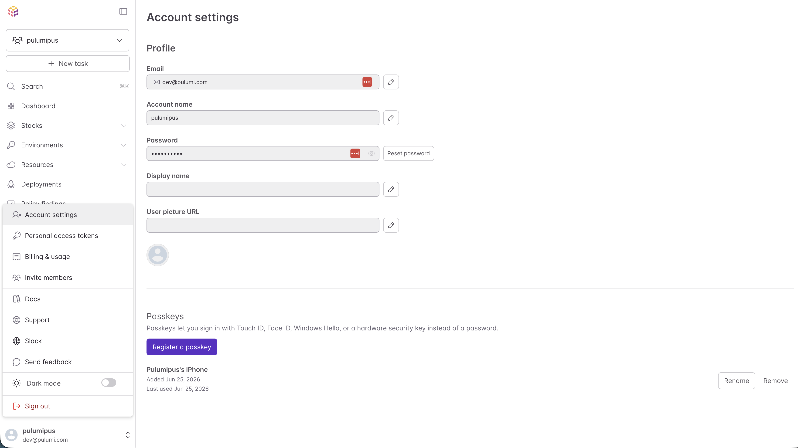

If you sign in to Pulumi Cloud with an email and password, you now have a faster, more secure option: passkeys. Click a button, approve with Touch ID, Face ID, Windows Hello, or your hardware key, and you're signed in. No password typed, no phishable secret exchanged.

A passkey is a public-key credential stored on your device: your phone, your laptop, a hardware key (YubiKey, Google Titan, etc.), or your password manager can all function as the authenticator. When you sign in, your device authenticates you locally and signs a challenge from Pulumi Cloud with the private key. The private key never leaves your device, and Pulumi Cloud never sees a secret it could leak in a breach. Passkeys are built on the [WebAuthn](https://www.w3.org/TR/webauthn-3/) standard, so they're already supported on every major browser and operating system.

<!--more-->

## Who this is for

This release applies to users who sign in to Pulumi Cloud with an **email address and password**. If you sign in through an identity provider (IdP), such as GitHub OAuth, GitLab, Bitbucket, Google, or your organization's SAML SSO, your existing flow is unchanged. Use the same provider you always have; your IdP remains the source of truth for those accounts.

## Why passkeys

Passwords have always been the weakest link in account security. Since they are shared secrets, they are vulnerable to phishing attacks, and every place you type one is a place that can be impersonated or a data store that can be leaked. Passkeys swap that out for a per-site key pair that lives on your device:

- **Phishing-resistant by design.** A passkey is bound to the exact origin it was registered for. A look-alike domain can't trigger your authenticator. There is no equivalent of "tricking the user into typing their password into a clone."
- **Synced across your devices.** Apple iCloud Keychain, Google Password Manager, 1Password, Dashlane, Bitwarden: most credential managers now sync passkeys end-to-end-encrypted to every device you've signed in on. Register once, sign in anywhere.
- **Discoverable.** Pulumi Cloud doesn't need to know which user you are before you authenticate. Just click "Sign in with a passkey" and your device offers the right credential, no email field required.
- **Nothing to remember.** A passkey lives on your device. There's no string to memorize, and nothing for someone else's breach to expose.

## Setting up a passkey

The next time you sign in with a password, you will be automatically prompted to ask if you'd like to configure a passkey.

If you dismiss the prompt and would like to add one later, or want to add multiple passkeys, navigate to **Account Settings → Passkeys** under your user profile. Click **Register a passkey**, complete the OS-level prompt (Touch ID, Face ID, Windows Hello, or your hardware key), and you're done. Pulumi Cloud will pick a sensible default name like `"iCloud Keychain"` or `"Chrome on macOS"` based on the authenticator, but you can rename it inline anytime under **Account Settings → Passkeys**.

You can register as many passkeys as you want. Typical setups are one per personal device, or one synced credential plus a hardware key as backup. Removing a passkey takes effect immediately; deleted credentials cannot be used to sign in.

## Signing in

Two flows, depending on how you arrive:

- **Explicit sign-in.** On the sign-in page, click **Sign in with a passkey**. Your browser opens the passkey picker, you authenticate, and you're in. No email, no password.
- **Autofill.** If your browser supports [conditional mediation](https://web.dev/articles/passkey-form-autofill) (Chrome, Safari, Edge, recent Firefox), the email field on the sign-in page proactively offers your registered passkeys as autofill suggestions. Pick one and you're signed in, no button click needed.

Right after sign-in with a password, if you don't have a passkey yet, Pulumi Cloud offers to enroll one. It's a single-step prompt so you can take advantage of passkeys on every subsequent sign-in.

## What about my existing password and MFA?

**Your password still works.** Passkeys are an additional sign-in option, not a replacement, and they don't disable password sign-in on your account. If you lose access to every registered passkey (phone wiped, hardware key misplaced, browser profile reset), you can sign in with your email and password as you always have, then register a new passkey from settings.

**Other 2FA still applies.** If you have TOTP-based MFA enabled on your Pulumi account, a passkey sign-in will still prompt for your second factor. WebAuthn doesn't tell us *how* you unlocked the passkey on your device (biometric, PIN, or something weaker), so we can't safely treat the passkey itself as proof of two factors. Your existing MFA configuration remains the boundary it always was.

## Try it out

Passkey support is generally available today for every Pulumi Cloud user who signs in with email and password, at no additional cost and with no configuration. Visit [your account settings](https://app.pulumi.com/account/profile) to register your first passkey, and let us know what you think on [our community Slack](https://slack.pulumi.com/) or [GitHub](https://github.com/pulumi/pulumi/issues).
