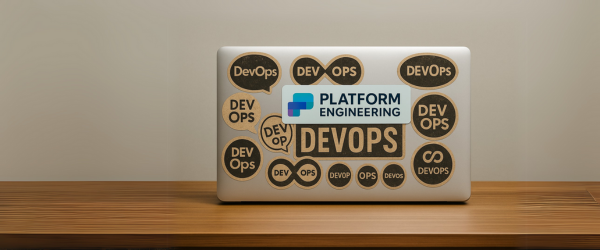

 

2 Months ago, user `deacon91`, after years of working in the industry has declared DevOps to be a dead end on Reddit's `r/devops`. And I've been thinking about his thoughts on the industry since then.

> My personal hot take is that DevOps (in the truest sense of the word) is a dead end.
>
> `u/deacon91` on Reddit `/r/devops`

His point was that DevOps, the breaking down of silos between development and operations, had been tried. We learned the lessons of this approach and need to do something better: Platform Engineering.

And platform engineering has certainly emerged as a new hot area. But is it truly an evolutionary step toward a greater way of developing and operating software? Or is it, as others in that same Reddit group declare, merely a fad and a rebranding of existing ideas?

That's what I want to explore: is platform engineering a rebrand or a genuine evolution?

Let's start by summarizing the cynical case - that it's merely a rebrand.

## The Rebrand Case

### Title Drift

> I've been a SysAdmin, DevOps Engineer, Platform Engineer, and Cloud Engineer. The only difference to me has been the tech stack.
>
> u/hajimenogio92

This title drift happens in many fields. Just as the garbage man becomes the sanitation worker so does the sysadmin becomes the DevOps engineer.

This creates title inflation in our competitive industry. People who job-hop regularly update their LinkedIn profiles from "business analyst" to "product manager." Meanwhile, the person who stays put for years might still be called a "programmer" while everyone around them becomes a "Staff-plus Senior Backend Engineer."

That ops wizard who's been at the same company for eight years? Still an "Operations Engineer." Their friend who switches jobs every 18 months? Now a "Senior SRE" making 50% more money.

Title drift becomes a self-reinforcing cycle. When the recruiter discovers that the best DevOps candidates now call themselves "Platform Engineers," your company's job postings change overnight—even if no one plans to build an actual platform.

This is how you end up with people like `u/hajimenogio92` doing the exact same sysadmin work they've always done, just with "Platform Engineer" on their LinkedIn profile.

This is one aspect of what people mean why they say "platform engineering is just a rebrand." The other thing they sometimes mean is that it's a fad everyone is chasing.

### Hype Cycle Reboot

> There were fad chasers yesterday, there are fad chasers today, and there will be fad chasers tomorrow until the sun burns out
>
> u/deacon91

Tech movements decay in predictable ways. Remember Extreme Programming? It began as a revolution to empower developers. Then it morphed into Agile, and in some places, into the 12 steps, 7 competencies, and many processes of SAFe.

> The Scaled Agile Framework® (SAFe®) is a set of organization and workflow patterns for implementing agile practices at enterprise scale.

Maybe SAFe makes sense for your work place, but it's certainly a lot more complex than it's root and this pattern is what skeptics see in platform engineering.

DevOps started at grassroots conferences with a simple message: "Let's tear down the wall between developers and operations." But once it peaked, everyone scrambled to slap "DevOps" on whatever they were already doing. Just like companies today adding "AI" to their products.

Eventually, the original movement gets so diluted that we need a fresh start. New terminology. New conferences. New keynote speakers recycling old ideas with updated slides. New vendors selling solutions to problems you didn't know you had.

In this view, platform engineering isn't revolutionary—it's just the next square on the buzzword bingo card. DevOps plateaued. SRE plateaued. The Kubernetes experts ran out of things to say. So the industry needed something new to hype.

There's some truth to this cynicism, but it blinds us to what platform engineering actually offers. More importantly, this view misses something crucial: where a platform approach succeeds, it reveals fundamental flaws in the original DevOps vision.

## The Case for Evolution

The original DevOps movement introduced valuable ideas about breaking down silos and encouraging collaboration. However, its purest vision—where "everybody does everything"—faces practical limitations at scale.

Totally cross-functional teams work well at small organizations but struggle when engineering teams grow beyond 20 people because:

- People naturally have different specializations and preferences
- Few individuals want to perform both development and operations roles
- Staying current on everything in your Ops and Dev stack is often unrealistic

But most importantly, as organizations grow, specializations natuarally emerge. Goverance and corporate policies often force the issue. A platform team is one such specialization and a powerful one if done right.

Instead of focusing on eliminating silos, it focuses on creating productive abstractions and interfaces between application teams and operating services. The platform functions as an abstraction layer (similar to how a database abstracts data storage), with dedicated teams treating it as a product with clear boundaries.

This approach contradicts the original DevOps vision but represents a necessary evolution. Platform Engineering acknowledges inevitable organizational divisions while still enabling collaboration. It leverages skills and organizational workflows from application development and product management to build a way to operate software effectively.

## Why not both?

So yeah, title drift is a thing. And the hype cycle is real. But the idea of a dedicated team removing frictions by building tools and resuable abstractions is an idea that's here to stay.

In fact, it's just a way to scale the principles inherent in the original ideas of DevOps. In other words, it may technically diverge from the literal principles of DevOps, but it is most definitely true to the spirit.

Or at least that is my take after thinking long and hard about [deacon91's comment on r/devops](https://old.reddit.com/r/devops/comments/1izpca1/platform_engineering_fad/)

If you'd like to here more about Platform Engineering, check out [this platform engineering series](/blog/tag/platform-engineering-pillars/). And also this great ebook on using Pulumi to build [IaC platform components](https://info.pulumi.com/ebook/platform-engineering-iac-recommended-practices).
