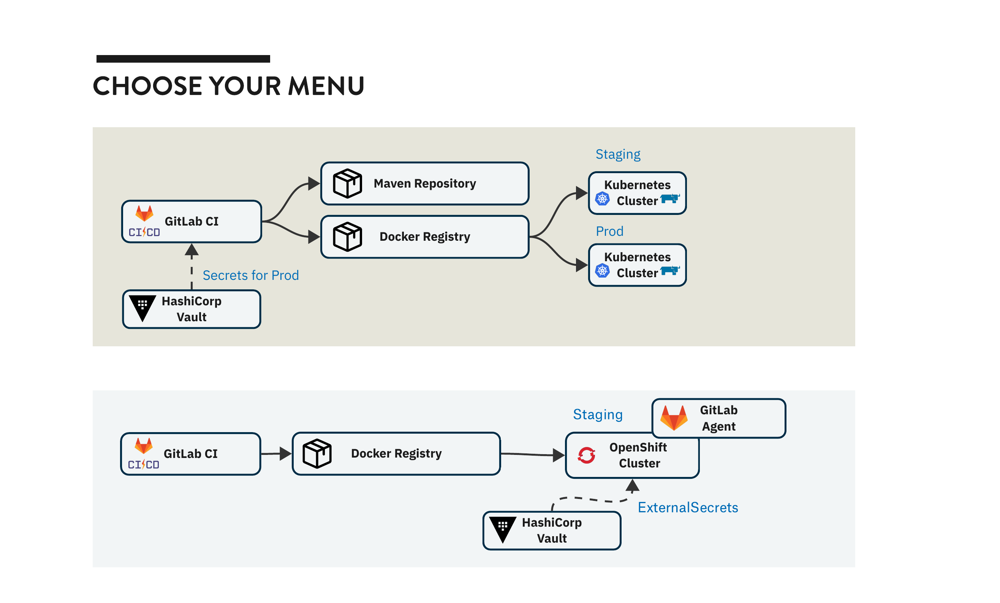

*This post is based on my video interview with Nico Thomas, a platform engineer at SEITENBAU. In this article, Nico shares how he and his team built a flexible, reusable platform to support 20+ diverse projects using Pulumi. Watch the video below or read on for Nico’s take on building an infrastructure buffet. - Adam Gordon Bell*



Imagine your company isn't Spotify with one product pipeline, but 20 independent government projects running on Ansible-provisioned VMs—some on Kubernetes, some delivered into other customer data centers, some operated by clients themselves. Each team is building its own CI/CD, secrets management, and integrations. You’re left with a million reinvented wheels.

That was the situation my team and I faced at SEITENBAU, a German software company specializing in custom development for both public and private sectors. Unlike the typical platform engineering stories—where teams build infrastructure for a single product with multiple microservices—we had a fundamentally different challenge: **How do you build a platform that serves dozens of completely independent projects, each with their own technology choices, deployment targets, and operational models?**

The answer? Stop trying to force everyone onto the same plate. Instead, build a buffet.

## The Buffet Philosophy

Think of a traditional platform as a set menu—also known as prix fixe—where everyone gets the same courses, prepared the same way, in the same order. But what if your diners include vegans, carnivores, and people with various dietary restrictions? What if some want a quick snack while others need a seven-course meal?

That was exactly the situation we faced. We had:

* Government projects that needed to run on-premises due to data sovereignty requirements.
* Modern cloud-native applications leveraging Kubernetes and GitOps.
* Legacy systems still operating on virtual machines managed with Ansible.
* Projects we ran as managed services and others we simply delivered to customers.
* Teams using various CI/CD tools, artifact repositories, and deployment strategies.

A one-size-fits-all platform would have been a disaster. Instead, my team built a platform offering a rich selection of pre-configured, production-ready components. Teams could mix and match according to their specific needs, creating their own unique infrastructure combinations.

## The Challenge: Beyond Microservices

Most platform engineering resources assume you're building infrastructure for a single product – Spotify's Backstage, for example. But what happens when you're dealing with over 20 completely independent projects, each with distinct requirements?

Each project is distinct, featuring its own:

* Technology stack (Java predominates, but we support various frameworks and languages).
* Infrastructure requirements (cloud, on-premises, or hybrid setups).
* Security and compliance constraints.
* Operational models (managed by us, the client, or jointly).
* Release cadences and deployment strategies.

Initially, this diversity seemed chaotic, but we quickly noticed that underneath these variations, common patterns emerged. Every project consistently required source control, CI/CD pipelines, artifact storage, secrets management, and deployment targets. The critical realization was that **we didn't need to standardize what teams chose—we needed to standardize how they connected these building blocks.**

That's where Pulumi became essential. Its flexibility allowed us to construct an infrastructure buffet that genuinely accommodated the diverse appetites and needs of every team.

## Building the Kitchen: Architecture with Pulumi

Behind every great buffet is a well-organized kitchen. For our infrastructure, that kitchen is powered by Pulumi and Python, orchestrating a complex web of infrastructure services, configurations, and deployments. Using Pulumi together with Python has proven extremely valuable—it makes our day-to-day tasks easier to maintain and understand.

### The Multi-Stack Approach

Rather than creating a single monolithic infrastructure program, we adopted a modular approach with multiple Pulumi stacks. This decision was essential for managing complexity and empowering team autonomy.

Our architecture comprises several specialized Pulumi programs:

* **GitLab System**: Manages installations and configurations of GitLab.
* **Project Configuration**: Sets up team-specific GitLab groups, CI/CD runners, and agents.
* **Cluster Management**: Provisions Kubernetes clusters complete with standard add-ons.
* **VM Infrastructure**: Manages traditional VM-based deployments utilizing Ansible.
* **Platform Services**: Configures shared services such as artifact repositories and identity providers.

Each program can maintain multiple stacks (dev, staging, prod), allowing us to manage various environments independently while leveraging shared infrastructure code.

## From Ingredients to Ready-Made Dishes: Reusable Components

The real magic happens in our component library. Just as a buffet offers complete dishes rather than raw ingredients, we've built high-level components that encapsulate complex infrastructure patterns.

### Example: The Kubernetes Storage Component

Consider our Longhorn storage component. Instead of requiring teams to understand Helm charts, storage classes, and snapshot configurations, they simply declare they need persistent storage.

The component handles all the complexity: installing Longhorn, configuring appropriate replication for test vs. production environments, setting up snapshot classes, and integrating with our internal certificate authority.

## Two Years Later: The Buffet is Open

After two years of running this platform in production, we've learned what works and what we'd do differently.

Building a platform for diverse, independent projects requires a different mindset than traditional platform engineering. Instead of forcing standardization, we've embraced flexibility while maintaining consistency where it matters.

The buffet approach—powered by Pulumi's flexibility and Python's expressiveness—has allowed us to serve 20+ different projects efficiently while giving teams the autonomy they need. It's not about having one perfect dish; it's about having a kitchen flexible enough to satisfy everyone.

If you're facing similar challenges with diverse project requirements, consider building a buffet instead of a prix fixe menu. Your teams will thank you for it.

*Want to build your own infrastructure buffet? [Get started with Pulumi](https://www.pulumi.com/docs/get-started/) and join [our community Slack](https://slack.pulumi.com/) to connect with engineers solving similar challenges.*
