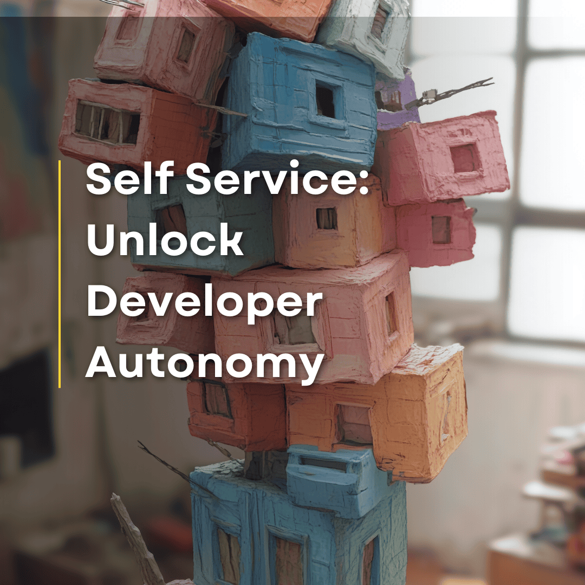
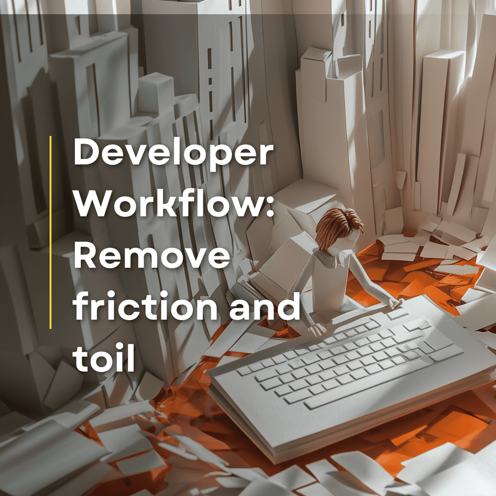

Software drives innovation. Development teams face pressure to ship features faster. But speed collides with infrastructure complexity. Developers struggle with cloud setups, juggle scattered tools, and wait on operations teams for resources. The result is friction and slower innovation.

This is where [Platform Engineering](https://www.pulumi.com/what-is/what-is-platform-engineering/) comes in. It helps developers move faster by creating tools that actually work. A good internal platform lets teams self-serve infrastructure, find documentation, follow best practices, and focus on what they do best: writing useful software.

Building a platform isn't about finding one perfect tool. It's about assembling the right pieces, or pillars. These pillars define what every successful internal developer platform needs.

[This series](/blog/tag/platform-engineering-pillars/) explores these key pillars of Platform Engineering, offering a practical guide to building platforms that remove barriers to developer speed. Each pillar addresses a specific challenge organizations face when scaling developer productivity. The first challenge is overcoming infrastructure chaos.

<!--more-->

### **Problem: Infrastructure chaos and bottlenecks**

Developers face many pain points with manual provisioning, which is why [Infrastructure as Code](https://www.pulumi.com/what-is/what-is-infrastructure-as-code/) has become so essential:

* **Inconsistent environments**: Dev, staging, and production drift apart. "Works on my machine" becomes everyone's excuse.
* **Slow processes**: Console clicking and waiting on ops creates bottlenecks. Developers wait days for basic infrastructure.
* **Configuration drift**: Manual configs lead to errors. Quick production fixes become undocumented mysteries that cause problems later.
* **Lack of repeatability**: Spinning up new environments or replicating existing ones is a complex, time-consuming, and often unreliable process.

That's why provisioning is the first pillar to master if you want to build a successful developer platform.

### **Problem: Dependency bottlenecks and limited developer autonomy**

Even with automated provisioning, another challenge emerges - developers still struggle when tools are provided without considering usability.

* **Hard to find what you need**: Developers waste time hunting for the right infrastructure modules. They end up searching docs, bothering colleagues, or rebuilding something that already exists.
* **Too much complexity**: Most developers aren't infrastructure experts. Learning all the options and parameters creates hesitation and mistakes.
* **Lack of real autonomy**: Developers have the tools but not the confidence to use them. They still need approvals or fear breaking production.
* **Inconsistent workflows**: Teams create their own ways of using infrastructure, making collaboration harder.

By implementing self-service infrastructure provisioning, you transform your platform from a centrally controlled system to a developer-centric environment. You unlock developer autonomy, accelerate development cycles, and free up operations teams to focus on higher-value activities.

### **Problem: Inefficient and fragmented development processes**

Infrastructure is just one piece of the puzzle. Developers still face daily friction moving code to production.

A typical developer's day is full of frustrations:

* **Inconsistent local environments**: Variations in local setups, dependency conflicts, and operating system differences lead to debugging headaches and wasted time getting started.
* **Slow CI/CD pipelines**: Long builds, flaky tests, and mysterious pipeline configs block progress. Developers stare at progress bars instead of writing code.
* **Cumbersome testing and staging setups**: Provisioning environments for testing and staging can be a manual process. Environments may not accurately mirror production, leading to surprises and integration issues late in the development cycle.
* **Lack of discoverability and reusability**: Nobody knows what code already exists, so everyone rebuilds it. Duplication becomes the norm.
* **Developer toil and context switching**: Developers spend more time on environment setup and troubleshooting than on writing features.

These inefficiencies add up, creating significant friction in the developer workflow. Developers spend more time wrestling with processes and less time focused on building and innovating. A Platform approach can help solve these challenges.

### **Problem: Security as a bottleneck and source of friction**

Speed and efficiency matter, but security can't be compromised. Traditionally, security acts as a gate – a necessary hurdle before releasing software. Platform Engineering aims to transform security from a bottleneck into an enabler.

For many developers, security feels like a roadblock, leading to common friction points:

* **Last-minute security**: Checks happen at the end of development, causing costly rework when issues are found.
* **Restrictive policies**: Security rules feel arbitrary and unclear, slowing down deployments.
* **The "No" department**: Security teams are seen as blockers who enforce policies without offering solutions.
* **Speed vs. security mindset**: Everyone believes you must choose between going fast and being secure.
* **Security is "Someone else's job"**: Developers think security is only the security team's responsibility.

This "security as a gate" approach not only slows things down but leads to workarounds as developers try to bypass security to meet deadlines.

By integrating security into your platform, you transform security from a gatekeeper into a built-in feature of the development process. Security becomes an enabler of trust and speed, letting developers innovate with confidence.

### **Problem: Data overload without insights**

Developers in modern cloud environments often find themselves in a paradox: they are drowning in data, yet starving for actionable information. Monitoring systems pump out metrics, logs, and traces, but finding what matters feels impossible. An ideal internal developer platform shifts the focus from data collection to actionable insights.

Here's what developers typically experience:

* **Tool sprawl**: Teams use different tools for metrics, logs, and traces. Developers waste time jumping between dashboards and manually connecting the dots.
* **Alert noise**: Developers get bombarded with alerts lacking context or clear next steps. Important signals get buried in the noise.
* **Dashboard overload**: Existing dashboards overwhelm developers with granular metrics that are hard to connect to application behavior.
* **Reactive debugging**: Troubleshooting becomes a time-consuming fire drill. Developers spend hours sifting through logs to pinpoint issues.
* **Missing proactive insights**: Observability is only used for firefighting. Developers lack insights to optimize performance or prevent issues before they affect users.
* **Disconnected from production**: Many developers feel blind to how their code actually runs in production, limiting their ability to improve it.

This data flood without clear insights leaves developers reactive rather than proactive, hampering their ability to build reliable applications.

By improving observability in your platform, you transform it from an operations function into a developer superpower. Developers gain the insights they need to build better applications with greater confidence, using AI to focus on what truly matters.

### **Problem: Balancing autonomy with control and cost efficiency**

Empowering developers with self-service is essential, but unchecked autonomy leads to chaos. As platform adoption grows, organizations need to maintain control without creating bottlenecks. This is where Governance as Code becomes critical, establishing guardrails while preserving speed.

Self-service creates new challenges:

* **Configuration drift**: In decentralized environments, infrastructure setups diverge from standards, creating security risks.
* **Cloud cost explosion**: Without proper controls, self-service can lead to wasted resources and budget overruns. Teams over-provision or forget to clean up unused environments.
* **Compliance headaches**: Meeting regulatory requirements becomes harder when infrastructure is created in an uncontrolled way.
* **Audit gaps**: Without clear governance, tracking who created what and when becomes nearly impossible.
* **Manual governance slows everything**: If governance relies on approvals and tickets, it defeats the purpose of self-service.

These challenges highlight the need for automated governance that scales with your platform, ensuring control without slowing developers down.

By implementing Governance as Code, you ensure that self-service doesn't conflict with security, compliance, and cost efficiency. Governance becomes an automated part of your platform, enabling responsible scaling.

## **Conclusion**

These six challenges represent the core obstacles standing between your organization and true developer velocity. When properly addressed, each transforms into a capability that empowers developers and accelerates innovation.

The upcoming articles in this series will explore each area in depth, with practical strategies and real-world examples to help you build an effective internal developer platform.

Ready to implement these principles in your organization? Check out "Platform Engineering: Recommended Practices for Infrastructure as Code". It provides detailed guidance on building scalable internal developer platforms.

* How to structure infrastructure code for scalability
* Managing development environments with developer stacks and Git branches
* Designing modular and reusable Pulumi projects
* Implementing cross-stack dependencies with stack references
* Setting up RBAC, security, and governance at scale
* Automating infrastructure management with stack orchestration

[**Get the Free Platform Engineering Ebook →**](https://info.pulumi.com/ebook/platform-engineering-iac-recommended-practices)

And don't miss the next article in this series, where we'll explore provisioning as the foundation of your developer platform journey.
