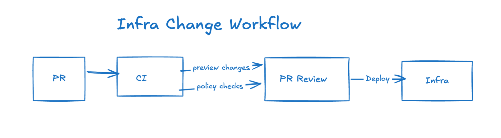
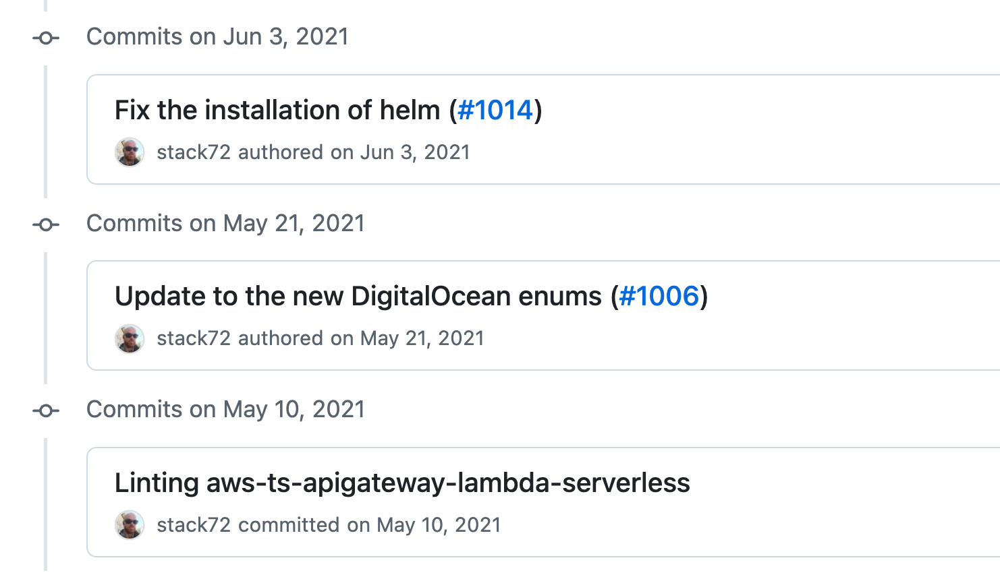
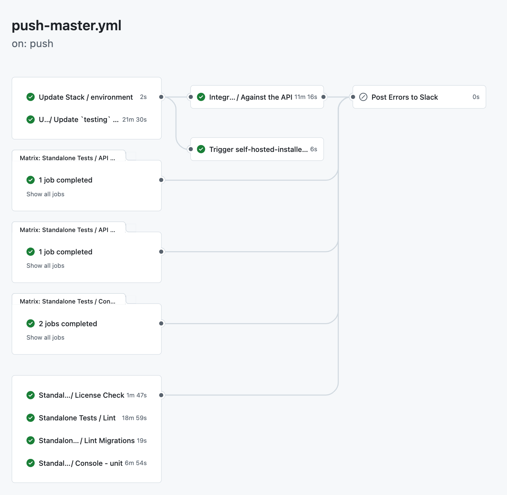
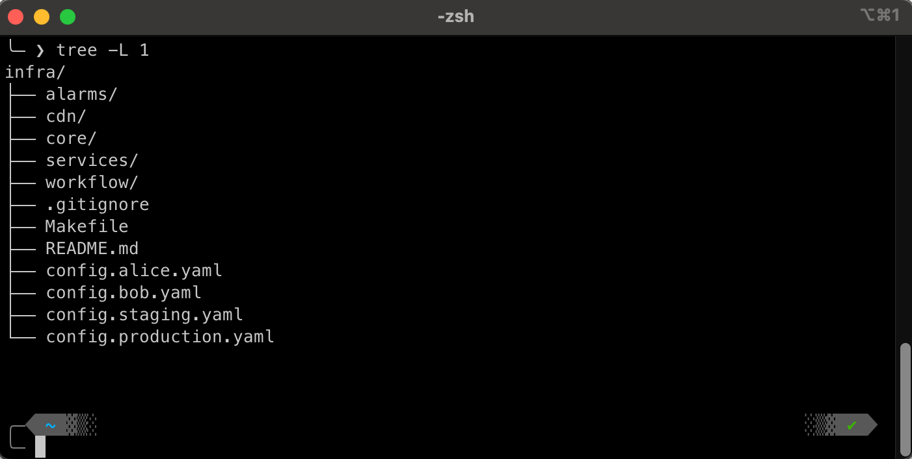
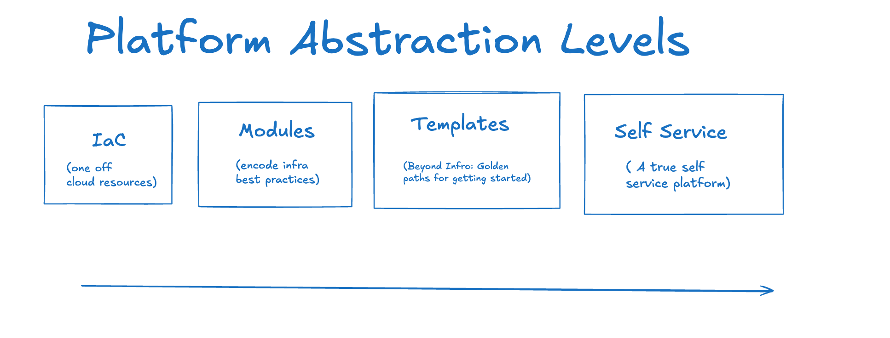
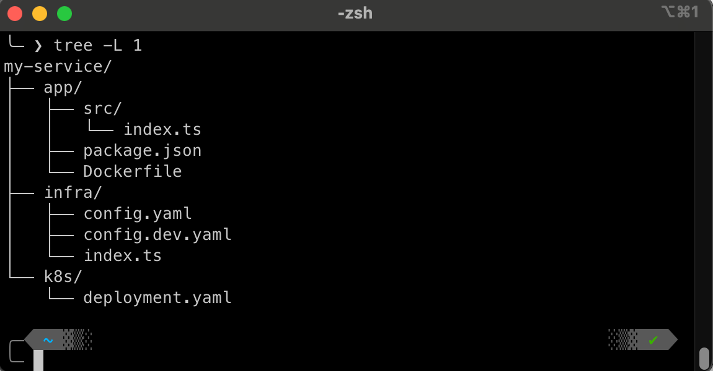

Provisioning is the first [pillar of platform engineering](/blog/tag/platform-engineering-pillars/). Without consistent infrastructure provisioning – the automated creation and management of the underlying cloud resources – the rest of the platform suffers. Self-service, governance, and streamlined developer workflows all depend on it. Ultimately, a self-service layer on top of your cloud infrastructure is the goal, enabling developers to quickly and safely provision the resources they need, while adhering to organizational best practices and policies. But before self-service, the foundation of a good IDP is a robust and reliable provisioning system.

By defining cloud resources as code and automating deployments, platform engineering teams ensure every environment – development, staging, and production – stays consistent and maintainable. This cuts down on configuration drift, reduces manual work, and supports auditable, collaborative workflows for every change.

Let’s explore how platform engineering teams can achieve this by version-controlling infrastructure, automating deployments, separating environments properly, and limiting console interventions. By applying these principles, teams can create a platform where developers can move fast without breaking things, and where infrastructure supports innovation rather than slowing it down.

<!--more-->
{}

### Top 5 IaC anti-patterns

* **Console-Only Changes:** Making "quick fixes" in production without updating IaC leads to drift, confusion, and hidden risks.
* **Hard-Coded Secrets:** Sensitive values in code or config files are a security liability. Use encrypted state or a secrets manager.
* **Copy-Paste Config:** Reusing half-baked snippets across projects creates cruft. Break out shared modules or templates.
* **No Clear File Structure:** Throwing all configs into a single file or folder obscures dependencies. Organize by environment, service, or module.
* **Skipping Peer Reviews:** Infrastructure mistakes can be costly. A simple pull request process can catch errors before deployment.

#### 💡 Tip: Read our list of [IaC Best Practices](/blog/iac-recommended-practices-code-organization-and-stacks/) 💡

{}

## Building a reliable IaC foundation

It’s not enough to simply define your resources in code. A reliable IaC foundation should ensure that infrastructure changes move smoothly from idea to production, without surprising developers or straining operations. Here’s how to structure these workflows so they’re both transparent and resilient:

## Version control as the single source of truth

Whether you’re using GitHub, GitLab, or something else, every infrastructure definition needs to live in version control. This is just the basics – and hopefully, you are already doing this, as you have been for years. Version-controlled changes allow you to track history, compare revisions, and peer review. A pull request might catch a misconfigured subnet or a database that was accidentally left publicly accessible, mistakes that could be catastrophic if they slip into production. This also means anyone can propose improvements or bug fixes, expanding the pool of expertise beyond a single “infrastructure guru.”

## Automating changes with CI/CD

Next, consider how to apply infrastructure modifications after they’re merged into main. A CI pipeline can automatically run a “plan” or “preview,” then only proceed with the actual update if no blockers appear. Policy checks can also be added, enforcing rules such as “no public S3 buckets” or “use encrypted volumes only.” By codifying these conditions, you avoid manual verification steps and reduce the chance of risky configurations slipping past manual review.

{}

### Trunk-based infrastructure workflow

* **Protected main Branch:** No direct commits
* **Pull Request Merges:** Integrate changes via Pull Requests
* **Automated PR Checks:** Previews and Policy-as-Code run on every PR
* **Merge:** Merge to main triggers automated deployments
{}

## Distinguish each environment

Not all environments have the same requirements or budgets, so it’s wise to separate dev, staging, and production configurations. You might share core modules across these environments, but keep each environment’s parameters and secrets in independent config files or stack definitions. This deliberate separation ensures that dev changes are tested in a realistic but contained environment before they can impact production. As a result, teams can experiment more confidently without risking live workloads.

## Modularity and reusability

A key principle of effective IaC, and a cornerstone of any good Internal Developer Platform, is reusability. You shouldn't be copying and pasting large chunks of infrastructure code. Instead, you should build reusable components (or modules, or constructs, depending on the tool's terminology) that encapsulate best practices and can be easily consumed by developers. This achieves several critical goals:

* **Consistency:** Ensures that similar resources are provisioned in the same way, reducing configuration drift.
* **Abstraction:** Hides complexity from developers. They don't need to know how a secure, compliant database is created, just that it is.
* **Maintainability:** Changes to the underlying implementation of a component can be rolled out to all consumers of that component.
* **Speed:** Developers can provision infrastructure faster by using pre-built components.
* **Reduced Errors:** Standard components means that there will be less opportunities to make mistakes.

Think of these reusable components as the "building blocks" of your IDP. Your platform team creates and maintains them, and developers use them to assemble their applications.

Regardless of the specific IaC tool you choose, reusable components generally share these characteristics:

* **Parameterized Inputs:** Components accept inputs (parameters, properties, configuration – the term varies) that allow users to customize their behavior. For example, a "database" component might accept a database_size parameter.
* **Defined Outputs:** Components expose outputs that other parts of the infrastructure can consume. For example, a "database" component might output the database's connection string.
* **Encapsulation:** The internal implementation details of the component are hidden from the consumer. The consumer interacts with a well-defined interface (inputs and outputs).
* **Versioned:** Components should be versioned (e.g., using semantic versioning) to allow for controlled updates and rollbacks.
* **Discoverable:** Components should be easily discoverable by developers, often through a central catalog or registry.

### Example: An IAM roles component

IAM roles are one of the most commonly misconfigured AWS resources, making them a perfect candidate for abstraction into a reusable component. Developers frequently make mistakes when setting up roles, leading to overly permissive access, broken permissions, or operational headaches.

### Common IAM role mistakes

1. **Overly Broad Permissions** – Developers often grant `*` permissions instead of following the principle of least privilege.
2. **Missing Assume Role Policies** – Without a proper trust policy, services may not be able to use the role at all.
3. **Directly Attaching Policies to Users** – Instead of assigning roles to groups, users might manually attach policies, leading to hard-to-audit permission structures.
4. **Lack of Naming Conventions & Tagging** – Unstructured role names and missing tags make governance difficult.

#### How a reusable IAM module fixes this

A platform team can provide a self-service IAM role module that enforces best practices while still allowing customization. This module would:

✅ **Require a Least Privilege Policy** – The module only allows explicitly defined permissions, preventing wildcards. \
✅ **Auto-Generate Trust Policies** – Ensures correct settings, reducing misconfigurations. \
✅ **Enforce Naming Standards & Tagging** – Ensures roles are easily identifiable and trackable.

By using a reusable IAM role module, developers can self-service their permissions while the platform team ensures security, consistency, and maintainability. This removes a major source of security risk and operational overhead.

## No console interventions

No matter how carefully IaC is managed, emergencies may occasionally necessitate direct console changes. However, such interventions are strictly forbidden except under an official “break glass” procedure. If a quick fix is applied in the cloud console, it’s critical that the change is immediately documented and returned to code. Regular drift detection can help with this: once a day or once a week, automated scans can compare actual cloud resources to your declared infrastructure. When it detects a mismatch, you decide whether the code or the running resource is the correct version. Either way, human “hotfixes” never linger as hidden surprises for long.

By combining version control, automation pipelines, environment-based configs, and drift checks, you build a solid provisioning foundation. Once you have that in place, the next step is making these patterns easy to use, so teams can start new services without reinventing the wheel.

But first, let's cover some metrics and roadblocks.

{}

### Metrics that matter

The classic [DORA metrics](https://dora.dev/guides/dora-metrics-four-keys/) focus on software delivery. Adapting and modifying them for infrastructure provisioning can help measure how effectively your platform delivers reliable, self-service cloud resources:

* **Lead Time for Infrastructure Changes:** How fast does a merged PR turn into running infrastructure? Shorter indicates efficient automation and fewer manual steps.
* **Infrastructure Drift Frequency:** Are developers constantly making console tweaks, or does your infrastructure stay in sync with code? A low drift rate means your code and actual resources stay aligned.
* **Infrastructure Change Failure Rate:** What percentage of infrastructure changes result in incidents or rollbacks? A low failure rate indicates a robust, well-tested infrastructure pipeline, reducing wasted effort and potential outages.
* **Platform Self-Service Rate:** What percentage of provisioning changes are implemented by the requesting team (without needing to involve a central operations team)? A high self-service rate shows that your platform empowers developers and reduces bottlenecks.
{}

## Common roadblocks

Adopting Infrastructure as Code helps teams automate provisioning, but common pitfalls can slow progress before they see results. Left unaddressed, problems hidden configuration tweaks, scattered code, or reliance on a single "infrastructure hero" make it hard to keep environments consistent and secure.

By spotting these roadblocks early, teams can build a stronger foundation for a repeatable, collaborative IaC workflow.

* **Knowledge silos:** Relying on just one person ("Go ask Sarah") for all infrastructure tasks creates a risky bottleneck. The broader team can't replicate or improve the process, slowing new initiatives and leaving you vulnerable if that individual is out of office or leaves the company. Moving to a collaborative, version-controlled IaC model ensures that no single engineer is a gatekeeper for new environments or configuration changes.

* **Overly complex or unstructured IaC:** Bloated or disorganized infrastructure code leads to confusion, duplication, and frequent errors. Engineers might copy-paste configurations from previous projects or cram all resources into a single file. By refactoring IaC into smaller modules, adopting a clear folder structure, and removing dead code, teams gain consistency and accelerate ramp-up times for new services.

* **Learning curves:** Teams new to IaC often encounter a steep learning curve. There is initially a lot to learn, and resistance from people used to quickly working through cloud UI can slow down full adoption. But time invested in learning tools and setting cultural norms pay off in agility and a platform strategy with guidance and golden paths can help reduce the burden.

* **Cultural inertia:** The adoption of a platform engineering approach is a shift in how organizations manage infrastructure, and like all, change is not merely technical but also organizational. Resistance to change and organizational inertia can make it difficult to implement new ways of getting work done. Expecting, understanding, and working through this resistance is key to overcoming it.

* **Lack of comprehensive approach:** IaC tools are great for provisioning, but without a full platform approach, covering monitoring, logging, and the full life cycle of cloud resources, provisioning efforts may fall short. We will see in this series how the pillars of a comprehensive approach strengthen themselves.

These roadblocks highlight why a thoughtful, well-structured approach to provisioning is essential.  But that’s not enough because the next step is to make these consistent patterns easily accessible so teams can spin up entire services without starting from scratch.  And that’s where “golden path” templates come in.

{}

### Platform team provisioning responsibilities

* Setting up the initial IaC foundation
* Creating and maintaining templates
* Automating workflows
* Monitoring usage and compliance
* Internal Platform Evangelism
{}

## Service templates

Even with a solid IaC foundation and reusable modules, spinning up a brand-new service can still require developers to understand how to pull in the underlying infrastructure components and how to use them. That’s where templates come in.

These are pre-vetted, ready-to-use blueprints that capture your organization’s best practices for a complete service or application, including infrastructure, application, and security components. They are the key to enabling true self-service.

Think of service templates as the next step up from the reusable components we discussed earlier. While a component might represent a single "building block" (like a secure S3 bucket or a database), a service template represents an entire structure built from those blocks (like a complete web application with a database, load balancer, and containerized application). They combine those building blocks with sensible default configurations and best practices for things like logging, Kubernetes setup, and security baked in.

Beyond bundling your organization’s best practices into a single repository, these service templates can also include a preconfigured CI/CD pipeline.

This means that when a team spins up a new service from the template, they inherit not just the infrastructure modules and best-practice configurations, but a fully operational CI/CD workflow. No extra setup is required. Developers get immediate feedback on their changes, and the merge to main triggers automatic deployments that keep every environment consistent.

Instead of cobbling together snippets from old repos, teams can scaffold out a service by simply selecting the template that fits their need – whether it’s a containerized web app, a serverless function, or a data-processing pipeline – and providing a few key parameters.

These curated paths cut onboarding time, reduce configuration missteps, and ensure that the IaC modules are used in new services. If developers don’t have to remember which tags to apply or how to route logs, or even where to import infrastructure modules from, they can focus on delivering features rather than wrestling with infrastructure details. And as your platform matures, and new versions of your modules are introduced, you can update these templates, automatically sharing improvements with every new project.

## Bringing it all together: The impact of effective provisioning

With reusable modules and service templates in place, and a deployment workflow that takes changes from git commits all the way to your cloud account, your platform engineering team creates a foundation that transforms how developers interact with infrastructure. This transformation yields measurable benefits:

* **Lower Infrastructure Change Failure Rate:** Automated validations and peer reviews catch issues early, reducing the number of failed deployments.
* **Increased Platform Self-Service Efficiency:** Developers can provision resources in minutes instead of days, boosting productivity and reducing bottlenecks.
* **Reduced Lead Time for Infrastructure Changes:** Streamlined automation shortens the time from code commit to deployed infrastructure.
* **Minimized Infrastructure Drift:** Fewer manual console interventions mean your actual infrastructure stays aligned with what’s declared in code.

(In the upcoming article, we’ll dig deeper into how governance guards these golden paths, ensuring that new projects comply with security and corporate policies right from day one.)

## Managing infrastructure provisioning with Pulumi

As you build out your platform engineering plan, consider how Pulumi might fit in. With Pulumi, you get:

* [Infrastructure as Code](https://www.pulumi.com/what-is/what-is-infrastructure-as-code/) in the language of your choice.
* [Component resources](https://www.pulumi.com/docs/iac/concepts/resources/components/) for creating reusable infrastructure modules that encapsulate best practices.
* [Pulumi Deployments](https://www.pulumi.com/docs/pulumi-cloud/deployments/) for a fully managed infrastructure deployment solution.
* And a [Platform in the box](https://www.pulumi.com/docs/pulumi-cloud/deployments/) experience.

Reliable infrastructure provisioning is the cornerstone that supports your entire platform engineering initiative. By implementing the practices outlined in this article – version-controlled IaC, automated CI/CD workflows, environment separation, and golden-path templates – you establish a foundation that enables consistency, speed, and trust.

But provisioning alone isn’t enough. In upcoming articles, we’ll explore how policy-as-code and broader governance tie into this foundation, ensuring that all those newly created services meet security and compliance standards from the moment they’re deployed. But first, we’ll look at expanding the provisioning foundation covered here into a true self-service platform, so teams can quickly spin up services without risking the organizational chaos that often accompanies speed.

Provisioning is the foundation – [next in this series](/blog/tag/platform-engineering-pillars/) we’ll build on it.
