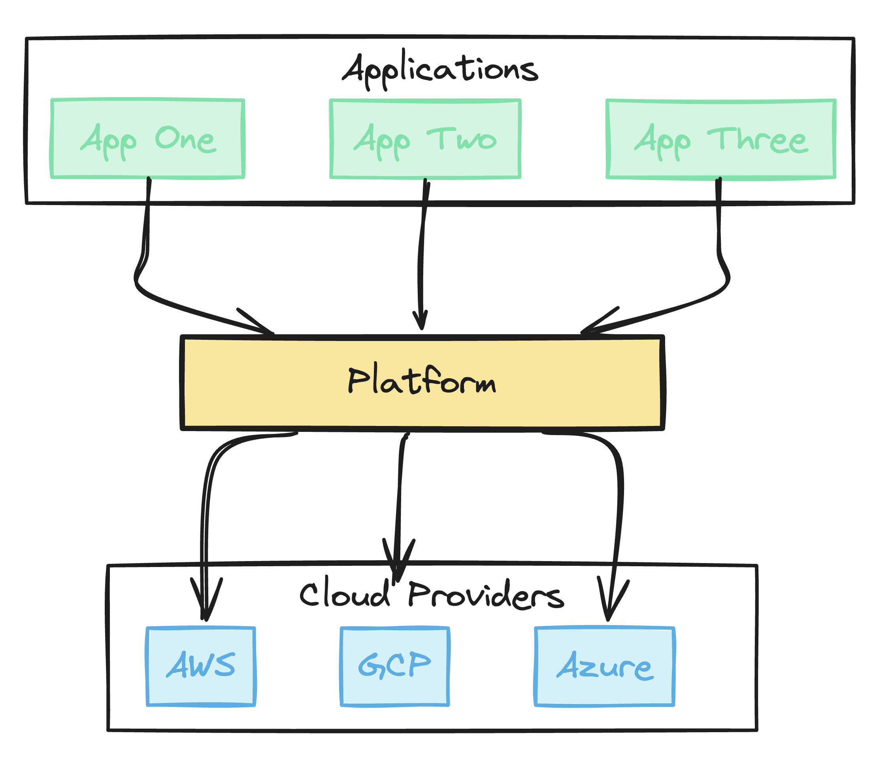
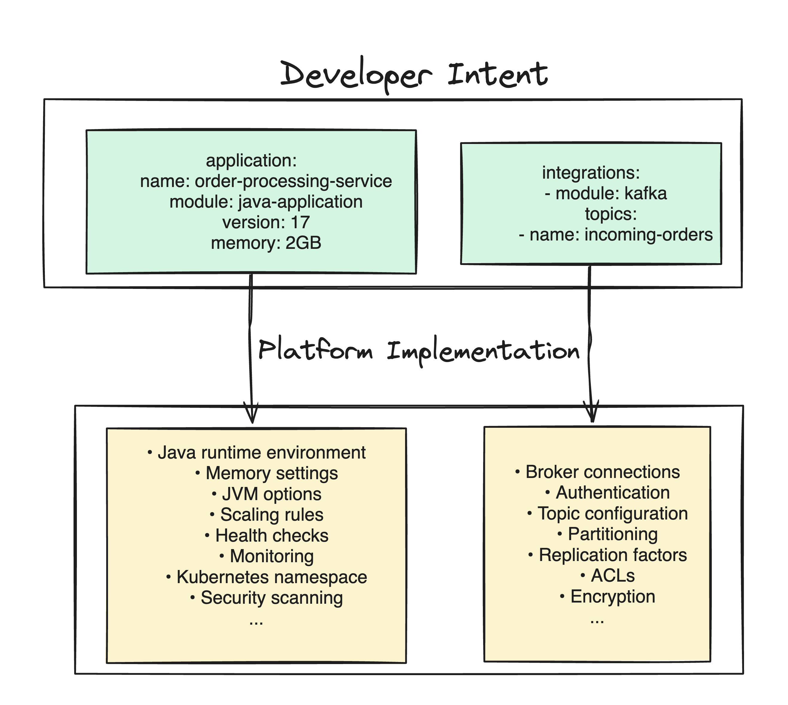

[Previous articles](/blog/tag/platform-engineering-pillars/) in this series explored [platform engineering](https://www.pulumi.com/what-is/what-is-platform-engineering/) principles and how Infrastructure as Code creates a solid foundation. But there's still an important challenge to address: the infrastructure provisioning process itself. Without proper modularity and a clear separation between intent and infrastructure details, things get messy—leading to friction, delays, and unnecessary complexity.

<!--more-->

## The Missing Layer: Abstraction Through Modularity

The root issue here is how teams define and work with infrastructure. Without good abstraction layers, infrastructure code typically becomes unwieldy and complex.

You end up with

- Highly detailed specifications that require deep domain knowledge
- Environment-specific configurations with subtle variations across resources
- Complex interdependencies that are difficult to trace and verify

This approach burdens developers with low-level details they don’t need to worry about, while platform teams become gatekeepers, reviewing intricate configurations. Alternatively, a traditional ticketing model takes over, discarding the benefits of modern practices.

<div style="text-align: center; width: 100%; margin: 0 auto;">
    
    <figcaption>
        <i>Solution: A Platform Engineering Approach</i>
    </figcaption>
</div>

What’s missing is a proper abstraction layer between raw infrastructure code and developer needs. **That layer is the platform. A Platform for self-service infrastructure.** Without modular, reusable infrastructure patterns, every new application deployment becomes an exercise in starting from scratch and defining every detail instead of just stating what the application requires and deferring details to the platform.

### Common Anti-Patterns Without Proper Abstraction

Without this modular platform approach to cloud infrastructure, organizations typically fall into one of two problematic patterns.

**The Copy-Paste Anti-Pattern**

Developers copy infrastructure code from previous projects. They find something similar, duplicate large chunks of configuration, make a few changes, and hope everything is right, and submit it for review. This leads to a brittle system with siloed knowledge. Security fixes must be applied manually across every instance – no one has a full picture of the infrastructure – and Day 2 Operations become error prone.

And this isn't limited to infrastructure: CI scripts get copied and modified, Dockerfiles and Kubernetes manifests get copied and modified.

It feels like control, but it's not. Developers still rely on platform specialists to validate changes and catch mistakes.

**The Ticketing Anti-Pattern**

Alternatively, some organizations rely on rigid ticketing systems for infrastructure changes. A platform specialist applies writes and applies all changes, ensuring consistency — but also creating bottlenecks. Developers might wait days or weeks for simple modifications, leaving the process entirely unfinished.

This guarantees expert oversight but strips developers of autonomy, making the platform team a bottleneck for every deployment.

Neither anti-pattern strikes a balance between standardization and autonomy, leading to either sloppy infrastructure (copy-paste) or slow deployments (ticketing).

### The Resulting Problems

#### Day 1 Bottleneck: Slow, Manual Infrastructure = Developer Gridlock

When provisioning becomes a bottleneck, developers with finished code wait days for infrastructure. This disrupts focus and forces frequent context switching. They juggle tasks to stay productive and then have to rebuild focus when the requested infrastructure is ready.

These delays slow the entire delivery pipeline. Teams add buffer time for infrastructure delays, projects slip, and the business sees technology as slow-moving. Meanwhile, the real culprit is slow provisioning that kills momentum.

#### Day 2 And Beyond Chaos: Sprawling, Unpredictable Infrastructure = Operational Nightmare

Day 1 bottlenecks frustrate developers, but the real long-term cost is patching hell. Copy-paste infrastructure creates hundreds of snowflakes, each needing manual attention for every security fix or version bump. One-off configurations and custom environments pile up, creating technical debt no one fully understands.

Operations teams are overwhelmed by the basic, critical task of simply keeping the lights on across a sprawling, inconsistent landscape.

## The Solution: A Platform of Options and Self Service

A Self-service platform is the solution to these problems. The platform is this curated list of modules, providing application developers with a set of pre-built options that let them work at a higher level of abstraction. By choosing from these modules, developers express their intent for infrastructure, leaving the platform to handle the implementation details. Let me explain.

A strong self-service approach divides responsibilities into two clear layers:

**Level 1: Platform Team (Module Definition)**

- Builds and updates reusable infrastructure modules
- Bakes in security, compliance, and best practices
- Hides complexity so developers don’t need to worry about copy and pasting low-level details
- Sets guardrails for scalability, security, and compliance
- Updates modules as technologies and needs change

**Level 2: Application Developers (Module Consumption)**

- Browse a catalog of ready-made modules
- Compose pre-built modules to set up application infrastructure
- Spend time on code, not cloud configurations
- Operate within built-in guardrails
- Deploy applications faster using standardized components

This setup keeps things fast and flexible. Developers get the autonomy to build without reinventing infrastructure, while platform teams maintain control where it matters.

## The Power of Intent-Based Specification

<div style="text-align: center; width: 100%; margin: 0 auto;">
    
    <figcaption>
        <i>Layer of Abstraction to the Rescue</i>
    </figcaption>
</div>

The two-level approach works by replacing over-specification with intent-based design.

Over-specification happens when developers specify too many infrastructure details that:

- Require expertise they might not have
- Tightly coupled infrastructure to specific implementations
- Make future changes hard or even impossible

Intent-based specification means developers state what their app needs, not how to implement it, meaning:

- Platform teams can update underlying infrastructure without breaking applications
- New capabilities can be added without disrupting existing applications

Focusing on what developers need, not how it's built, creates a system that’s easier to maintain and evolve for both platform teams and developers.

Let's walk through an example.

## Practical Example: Java Application with Kafka, PostgreSQL, and Redis

The platform team provides reusable modules:

### Java Application Module

This module handles everything needed to run a Java app. It covers the Java runtime, memory settings, JVM options, scaling rules, health checks, monitoring, and Kubernetes namespacing. It also manages containers, security scans, resource limits, and logging integration—so developers don’t have to.

#### Kafka Integration Module

Similarly, this module simplifies Kafka integration, handling broker connections, authentication, topics, and security. It takes care of SASL/SSL authentication, replication factors, ACLs, and encryption. Developers just specify topics and schemas.

And so on for common infrastructure components used in the org.

### Level 2: Developer Implementation

Developers use a simpler interface. To deploy a new Java service with Kafka, PostgreSQL, and Redis, they only need to specify the required input parameters in the platform-defined modules:

```yaml
# Developer's intent-based configuration
application:
  name: order-processing-service
  module: java-application
  version: 17
  memory: 2GB
  scaling:
    min: 2
    max: 10
  
integrations:
  - module: kafka
    topics:
      - name: incoming-orders
        partitions: 5
      - name: processed-orders
        partitions: 3
    consumer_group: order-processors
  
  - module: postgresql
    database: orders_db
    size: medium
    backup: enabled
  
  - module: redis
    size: small
    ttl: 3600
```

( Note: YAML not required. This pseudo-code could be UI driven, or it could be written in your programming language of choice. The point is it specifies intent and defers specifics to the platform. )

## Solving Day 1 and Day 2 Challenges

The intent-based specification solves immediate and long-term problems:

**The Self-Service Transformation in Action:**

| Developer Experience | Platform Response |
|---|---|
| Submits simple intent-based configuration | Expands into complete infrastructure |
| Focuses on application needs, not infrastructure details | Provisions resources with appropriate sizing and security controls |
| Specifies "what" is needed, not "how" to configure it | Handles networking, monitoring, backups, and credentials |
| Limited expertise required in Kubernetes, networking, or security | Implements best practices automatically across all deployments |
| | Maintains and updates the underlying implementation over time |

This approach transforms infrastructure from a developer burden into an organizational asset that becomes more valuable over time, rather than decaying into technical debt.

### **Developer Interaction Models: Choosing Your Platform Interface**

Hopefully, now you are bought in on the value of separate layers of abstraction and building a platform to expose those.

The next key decision is how developers will actually *use* this platform.  The ideal interface balances ease of use with the necessary flexibility.  Organizations and requirements vary, so a spectrum of interaction models exists, each with its own trade-offs. Tree common approaches are: CLI-Driven Infrastructure as Code, the Self-Service Portal, and a Hybrid model.

| Aspect | CLI-Driven | Self-Service Portal | Hybrid Approach |
|--------|------------|---------------------|-----------------|
| **Developer Experience** | Code-based, using IaC modules and components directly | Click-based UI with forms and catalogs | Portal for common tasks, code for customization |
| **Code Visibility** | Full visibility and control | Limited or no visibility | Visible but with varying levels of access |
| **Governance** | Trust-based or PR reviews | Enforced through portal constraints | Guided paths with managed exceptions |
| **Learning Curve** | Higher (requires IaC knowledge) | Lower (minimal infrastructure knowledge) | Moderate (basic UI with optional advanced use) |
| **Best For** | Experienced teams needing flexibility | Teams prioritizing speed and standardization | Organizations with diverse skill levels |

#### **1. CLI-Driven Infrastructure as Code: Empowering Developers with Familiar Tools**

In this approach, platform teams build reusable infrastructure modules while developers consume them directly through code. Developers use familiar IaC tools like Pulumi CLI to instantiate these modules, with changes flowing through version control like any other code.

The key strength is transparency and familiarity. Developers maintain visibility and ownership of their intent-based defintions. This code-centric workflow integrates naturally with existing development practices.

However, this flexibility creates governance challenges and requires either strong trust or approval processes that might reintroduce bottlenecks. The approach also assumes developers have some IaC knowledge, making it best suited for organizations with mature DevOps practices and experienced teams.

#### **2. Self-Service Portal: Click-Ops Simplicity for Rapid Provisioning**

The self-service portal approach creates a web interface where developers provision infrastructure without writing code. They simply browse a catalog, fill out forms, and click buttons to deploy standardized resources—all pre-configured by the platform team.

This approach keeps infrastructure code completely centralized and hidden from developers. The portal translates simple selections ("Add Database: Medium Size") into the appropriate underlying configurations, ensuring perfect compliance with organizational standards.

The result is dramatically reduced friction and learning curve, enabling even infrastructure novices to deploy resources in minutes. However, this simplicity comes at the cost of flexibility. Customizations and unique needs typically require platform team involvement, making this model ideal for organizations with predictable workloads or where standardization outweighs customization needs.

#### **3. Hybrid Approach: Code-Backed Self-Service**

The hybrid approach generates and modifies infrastructure code via pull requests from UI interactions. When developers configure resources through the portal, the system commits code to repositories automatically, creating a transparent workflow where changes are visible, reviewable, and auditable through standard Git processes.

This model provides both simplicity and flexibility. Routine tasks remain point-and-click while complex scenarios allow direct code editing within the same PR workflow. The approach maintains a complete audit trail through commit history while giving platform teams visibility into all changes.

A significant tradeoff is implementation complexity: building a system that generates commits and PRs based on version control integration requires substantial investment. Organizations must weigh this upfront cost against the long-term benefits of combining UI simplicity with code transparency.

#### Lifecycle Management

More effective lifecycle management is an advantage of a platform approach. Consider migrating from Kafka to AWS Kinesis. Traditionally, this would involve significant application developer effort, including updating connection details, authentication, and application logic. However, with the two-level abstraction and intent-based approach described earlier, this migration becomes simpler. Platform teams introduce a new Kinesis module matching the existing Kafka module's intent-based interface. Data is mirrored, and developers can plan a switchover. Migration will not be free, but efforts and coordination will be reduced.

Life-Cycle management is a huge topic in Day 2 operations and outside the scope of what can be covered here, but introducing abstractions and a platform of modules will pay off long term.

### Looking Ahead: Operational Excellence and Beyond

The two-level abstraction model does not just simplify provisioning. It also lays a strong foundation for operational excellence. By standardizing infrastructure through reusable modules and intent-based specifications, we create consistency and visibility that significantly simplify critical operational concerns such as:

- **Drift Detection and Reconciliation:** Standardized modules make it easier to detect and correct deviations from desired state.
- **Continuous Compliance and Security:** Centralized module definitions allow security and compliance controls to be consistently enforced and audited.
- **Cost Management and FinOps:** Intent-based specifications enable clearer cost attribution and optimization opportunities.
- **Observability and Incident Response:** Consistent infrastructure patterns simplify monitoring, alerting, and troubleshooting.

Later articles in this series will explore each of these areas in greater depth, demonstrating how a platform approach provides a powerful foundation for addressing them effectively.

## Self-Service with Pulumi

The two-level architecture of IDP self-service creates a powerful interface between platform teams and application developers. By embracing intent-based specification, this approach enables developers to clearly express what they need with minimal complexity while giving platform teams the flexibility to implement and evolve the underlying infrastructure.

As you build out your self-service approach, consider how Pulumi might fit in. With Pulumi, you get:

- [Component resources](https://www.pulumi.com/docs/iac/concepts/resources/components/) for creating reusable infrastructure modules that encapsulate best practices.
- [Organization templates](https://www.pulumi.com/docs/pulumi-cloud/developer-portals/templates/) for building a catalog of infrastructure templates.
- [Packages](https://www.pulumi.com/product/packages/) in your language of choice for a code-first self-service workflow.
- A [Platform-in-the-box](https://www.pulumi.com/product/internal-developer-platforms/) experience for those who want a portal-first experience for self-service infrastructure.
- [A Backstage plugin](https://www.pulumi.com/docs/pulumi-cloud/developer-portals/backstage/) for those who prefer to use Backstage for an IDP.

A great self-service workflow and abstraction layer are key to making platform engineering work. [Next in this series](/blog/tag/platform-engineering-pillars/), we’ll tackle developer experience directly.
