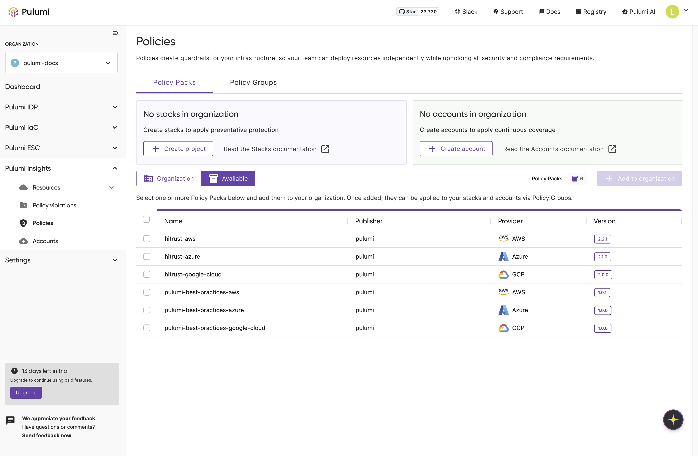
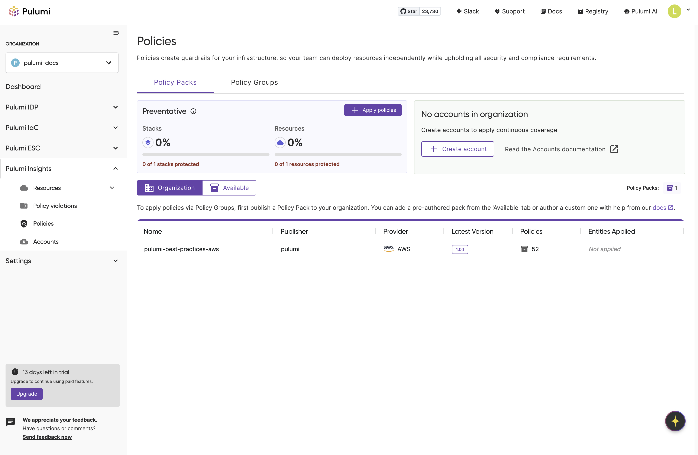
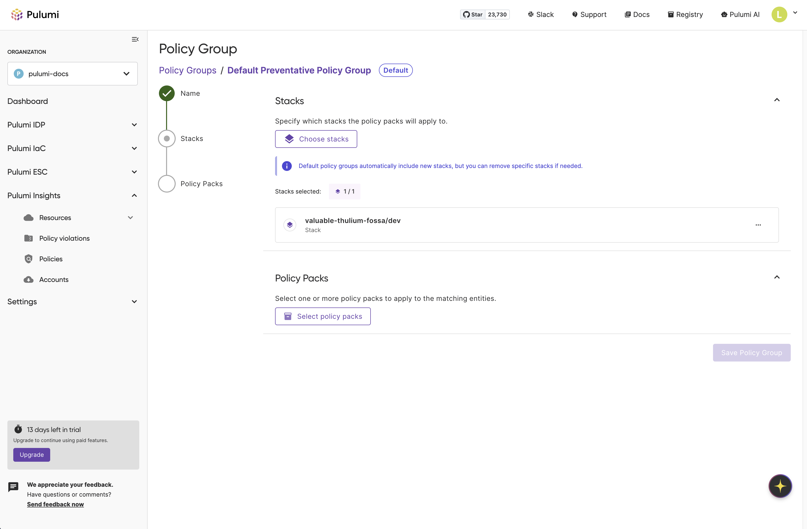

Yesterday, we introduced [Pulumi Neo](/blog/pulumi-neo/), our new AI platform engineer. As we showed in the [launch video](https://www.youtube.com/watch?v=9GB9M2l1OgY), Neo can automate complex infrastructure tasks, dramatically increasing a platform team's velocity. But with this new power comes a critical need for safety and control. You wouldn't give an AI agent the keys to your production cloud without robust, non-bypassable guardrails.

That’s why today, we're excited to announce a fundamentally redesigned policy management experience and new pre-built policy packs. These enhancements provide the essential guardrails for AI, making it easier than ever to enforce compliance, security, and best practices across your infrastructure.

<!--more-->

## A New, Simplified Approach

While [Pulumi Policy](/docs/iac/crossguard/) has always allowed you to enforce compliance using TypeScript and Python, the existing workflow could be cumbersome—discovering policies required switching between the console and CLI, and applying them involved multiple steps.

To provide the seamless guardrails needed for an AI-driven world, we've removed that friction. The new experience is built around a streamlined, in-console workflow for discovering, applying, and managing your policies.

### In-Console Discoverability

We are making it easier to find and understand policy packs. You can now browse a rich set of pre-built policy packs directly within the Pulumi Cloud console—no CLI or context switching required.

You’ll find:

* **A rich browsing experience:** See all available policy packs in one place.
* **Detailed information:** Each pack comes with a clear description of the policies included and usage instructions.
* **Organization-approved packs:** Org admins can curate a list of approved policy packs, ensuring your teams—and AI agents like Neo—are using a vetted set of policies.

### New Pre-Built Policy Packs

To help you establish guardrails immediately, we have authored several [pre-built policy packs](/docs/insights/pre-built-packs/). We are excited to highlight two that are available today:

* **Pulumi Best Practices:** A foundational set of recommended governance and security controls that serves as a strong starting point for any organization.
* **HITRUST CSF v11.5:** Provides predefined controls that help align cloud resources with HITRUST CSF requirements.

### Streamlined Policy Management and Application

The new policy management experience dramatically simplifies policy application:

* **Intuitive Interface:** Browse, select, and apply policies through a streamlined workflow using **Policy Groups** to bundle related policies and apply them to your stacks or cloud accounts.
* **Expanded Scale:** We've eliminated the 4,000 stack UI limit on policy groups, allowing you to scale policies across your entire infrastructure.
* **Granular Enforcement:** Configure the enforcement level (`advisory` or `mandatory`) for policies to either warn developers or block non-compliant deployments entirely.

### Understanding Policy Approaches

The new UI simplifies the two powerful enforcement approaches Pulumi supports:

* **Preventative policies**: Block non-compliant deployments during `pulumi up`, providing real-time guardrails for developers and AI agents.
* **Audit policies**: Continuously scan existing resources for ongoing compliance monitoring, giving you a complete picture of your cloud security posture.

This dual approach ensures new deployments meet standards while maintaining visibility across your entire infrastructure. Learn more in our [Preventative vs. Audit Policies](/docs/insights/preventative-vs-audit-policies/) guide.

## How to Get Started

Getting started with the new policy management experience is straightforward:

1. **Browse Policy Packs:** Navigate to the Policies tab in your Pulumi Cloud console to discover pre-built policy packs like Pulumi Best Practices and HITRUST CSF. Learn more about [Policy as Code](/docs/insights/policy-as-code/) configuration and setup.

1. **Choose Your Approach:** Decide whether you need preventative policies (to block non-compliant deployments during `pulumi up`) or audit policies (for continuous compliance monitoring across all cloud resources).

1. **Create Policy Groups:** Set up policy groups to bundle related policies and apply them to your stacks or cloud accounts.

1. **Configure Enforcement:** Set enforcement levels (advisory, mandatory, or remediate) for each policy based on your requirements.

### Now Available To Team and Enterprise Customers

To ensure every organization can build with confidence, these policy management enhancements and the `pulumi-best-practices` policy packs are **now available to Team and Enterprise customers**. Checkout our [pricing](/pricing) page for more information.

### Conclusion

The enhanced Pulumi Policy experience and new pre-built packs are a major step forward in making governance accessible, scalable, and easy to use. By focusing on discoverability and a simplified workflow, we've delivered the essential guardrails needed to confidently adopt AI automation.

Yesterday, we introduced a powerful AI agent. Today, we've delivered the foundation to ensure it operates safely and within your organization's standards.

We'd love for you to try out the new experience in the Pulumi Cloud\! Don't hesitate to reach out on the [Pulumi Community Slack](https://slack.pulumi.com/) to share your thoughts.
