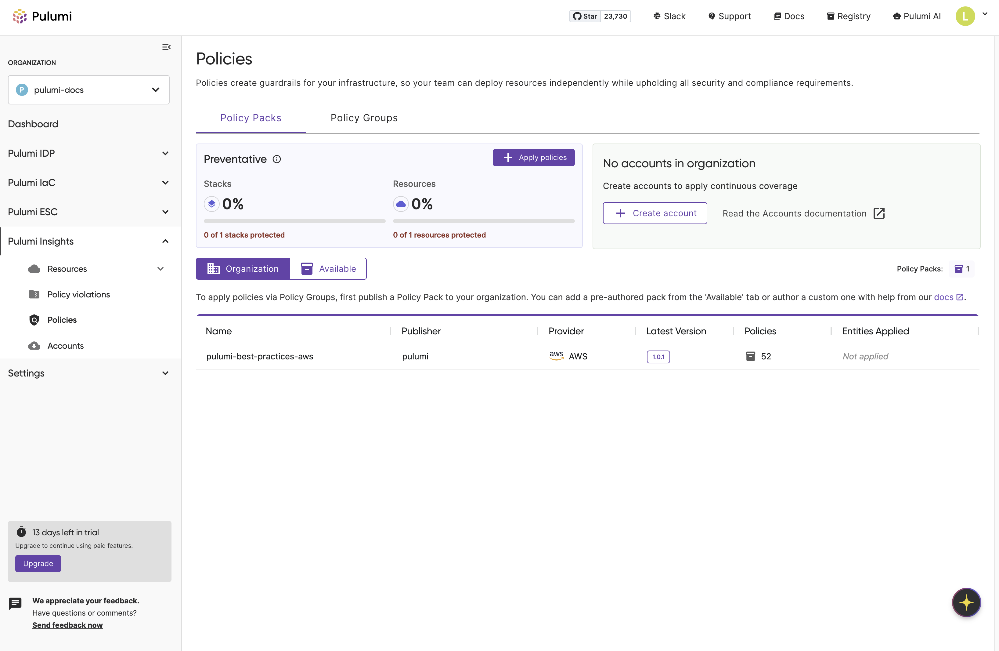

Pulumi Policy lets you enforce compliance, security, cost, and best practices across your infrastructure using TypeScript and Python. However, the existing workflow was cumbersome—discovering policies required switching between console and CLI, and applying them involved multiple complex steps.

Today, we're announcing a fundamental redesign that makes policy management intuitive, discoverable, and scalable. We're also launching two new enhanced policy packs.

<!--more-->

## A New, Simplified Approach

Our primary goal is to make policies easier to work with. The new experience is built around a simple principle: a streamlined, in-console experience for discovery and management.
Enhanced Pre-Built Policy Packs
To help you get started immediately, we have authored several [pre-built policy packs](/docs/insights/pre-built-packs/) that codify industry best practices. We are excited to highlight two of them that you can use today:

Pulumi Best Practices: A foundational set of recommended governance and security controls that serves as a strong starting point for any organization.
HITRUST CSF v11.5: Provides predefined controls that help align cloud resources with HITRUST CSF requirements, assisting organizations in enforcing security and compliance baselines.
The best part? Our new user experience makes discovering and applying these packs—and others—incredibly simple.

## How to Get Started

Getting started with the new policy management experience is straightforward:

1. **Browse Policy Packs:** Navigate to the Policies tab in your Pulumi Cloud console to discover pre-built policy packs like Pulumi Best Practices and HITRUST CSF. Learn more about [Policy as Code](/docs/insights/policy-as-code/) configuration and setup.

1. **Choose Your Approach:** Decide whether you need preventative policies (to block non-compliant deployments during `pulumi up`) or audit policies (for continuous compliance monitoring across all cloud resources).

1. **Create Policy Groups:** Set up policy groups to bundle related policies and apply them to your stacks or cloud accounts.

1. **Configure Enforcement:** Set enforcement levels (advisory, mandatory, or remediate) for each policy based on your requirements.

### In-Console Discoverability

We are making it easier to find and understand policy packs. You can now browse a rich set of pre-built policy packs directly within the Pulumi Cloud console—no CLI or context switching required.

You’ll find:

* **A rich browsing experience:** See all available policy packs in one place, including our Best Practices and HITRUST packs, in one place.
* **Detailed information:** Each pack comes with a detailed description, the policies included, configuration options, and usage instructions.
* **Organization-approved packs:** Org admins can curate a list of approved policy packs for your organization, ensuring that your teams are using a vetted set of policies.

### Streamlined Policy Management

The new policy management experience removes previous limitations and dramatically simplifies policy application:

* **Expanded scale**: Eliminated the 4,000 stack limit, allowing you to scale policies across your entire infrastructure
* **Intuitive interface**: Browse, select, and apply policies through a streamlined workflow that replaces the complex multi-step process
* **Better visibility**: Administrators can quickly see available policies and curate approved policies for their teams
* **Simplified workflow**: Adding policies to Policy Groups and applying them to stacks is now more straightforward and less error-prone

## Management and Permissions

The new experience also comes with improved management and permission features:

* **Enhanced Search and Interface:** We've improved the policy management experience with powerful search capabilities and a clean, intuitive interface that makes finding and managing policies effortless.
* **Granular Enforcement Configuration:** You can now configure the enforcement level for each individual policy in a policy pack, giving you precise control over how policies are applied.

## Understanding Policy Enforcement Approaches

Pulumi supports two enforcement approaches:

* **Preventative policies**: Block non-compliant deployments during `pulumi up` (ideal for critical security rules)
* **Audit policies**: Continuously scan existing resources for ongoing compliance monitoring

This dual approach ensures new deployments meet standards while maintaining visibility across your entire infrastructure. Learn more in our [Preventative vs. Audit Policies](/docs/insights/preventative-vs-audit-policies/) guide.

## Now Available To Team and Enterprise Customers

We are excited to announce that the new policy management experience and `pulumi-best-practices` policy packs are now available to Team and Enterprise customers.

## Conclusion

The new Pulumi Policy experience and the new pre-built policy packs are a major step forward in making Policy accessible, scalable, and easy to use. By focusing on discoverability and a simplified workflow, we've removed major points of friction that stood in the way of adopting a secure-by-default infrastructure.

We'd love for you to try out the new Pulumi Service console! Don't hesitate to reach out on the [Pulumi Community Slack](https://slack.pulumi.com/) to share your thoughts. We look forward to hearing what you think of these changes!
