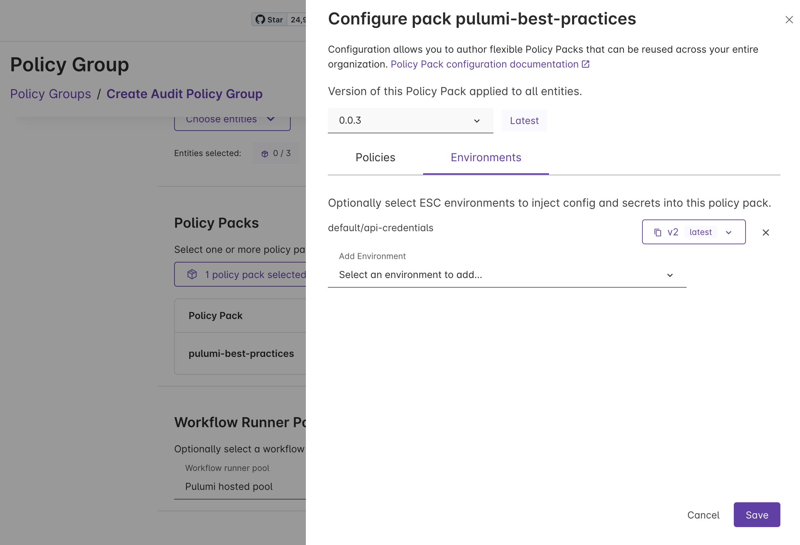

Policy authors who need external credentials or environment-specific configuration have had to hardcode values or manage them outside of Pulumi. Policy packs can now reference [Pulumi ESC](/product/secrets-management/) environments, bringing centralized secrets and configuration management to your policies.

<!--more-->

## The problem

Pulumi [policy packs](/docs/insights/policy/policy-packs/) let you enforce rules across your infrastructure, but some policies need more than just the resource inputs they evaluate. A policy that validates resources against an external compliance API needs an API token. A cost-enforcement policy might need different spending thresholds for development and production environments. An access-control policy might need to reference an internal service registry.

Until now, these values had to be hardcoded in your policy group configuration or managed through a separate process entirely. This created several problems:

- **Security risk**: Credentials stored in plain text in policy group config
- **Operational burden**: Updating a credential meant touching every policy group that used it
- **No environment separation**: The same values applied everywhere, with no way to vary configuration across environments

## What's new

Policy packs can now reference ESC environments, just like [stacks already do](/docs/esc/environments/syntax/reserved-properties/pulumi-config/). When you attach an ESC environment to a policy pack in a policy group, the values from that environment are available to your policies at runtime — whether you're running preventative or audit policies.

This means your policy packs can use ESC for:

- **Secrets**: API tokens, service credentials, and other sensitive values managed through ESC's secrets management, including dynamic credentials from providers like AWS, Azure, and GCP
- **Configuration**: Environment-specific thresholds, allowed regions, service allowlists, and other policy parameters that vary across environments



## How it works

You configure ESC environment references on a policy pack within a policy group. At runtime, the values from those environments are resolved and made available to your policies through the policy pack's configuration.

Here's an example ESC environment that provides configuration to a compliance policy pack:

```yaml
values:
  compliance:
    apiToken:
      fn::secret: xxxxxxxxxxxxxxxx
    costThreshold: 5000

  policyConfig:
    cost-compliance:
      maxMonthlyCost: ${compliance.costThreshold}
      apiEndpoint: https://compliance.example.com
      apiToken: ${compliance.apiToken}
```

The [`policyConfig`](/docs/esc/environments/syntax/reserved-properties/policy-config/) property works just like [`pulumiConfig`](/docs/esc/environments/syntax/reserved-properties/pulumi-config/) does for stacks. Values nested under each policy name are made available as configuration to that policy at runtime. Secrets remain encrypted and are only decrypted when the environment is resolved.

You can also use the `environmentVariables` property to inject values as environment variables into the policy runtime, following the same pattern as [stack environment variables](/docs/esc/environments/syntax/reserved-properties/environment-variables/).

## Example: compliance API validation

Consider a policy that validates every new resource against an external compliance API before it can be provisioned. The API requires an authentication token and returns whether the resource configuration meets your organization's compliance standards.

**Before**, the API token lived in the policy group configuration in plain text. Rotating the token meant updating every policy group. There was no audit trail for who accessed the credential, and no way to use different API endpoints for staging and production compliance checks.

**After**, the API token lives in an ESC environment. You get:

- **Centralized rotation**: Update the token in one place and every policy group that references the environment picks up the change
- **Access controls**: ESC's role-based access controls govern who can view or modify the credential
- **Audit trail**: Every access to the environment is logged
- **Environment separation**: Use different ESC environments for different policy groups, so staging policies validate against a staging compliance endpoint while production policies use the production endpoint

## Get started

To start using ESC environments with your policy packs:

1. [Create an ESC environment](/docs/esc/environments/working-with-environments/) with your policy configuration and secrets
1. Attach the environment to a policy pack in your policy group through the Pulumi Cloud console
1. Update your policies to read from the configuration values provided by the environment

To learn more:

- [`policyConfig` reference](/docs/esc/environments/syntax/reserved-properties/policy-config/)
- [Pulumi ESC documentation](/docs/esc/)
- [Policy packs documentation](/docs/insights/policy/policy-packs/)
- [Get started with Pulumi ESC](/docs/esc/get-started/)
