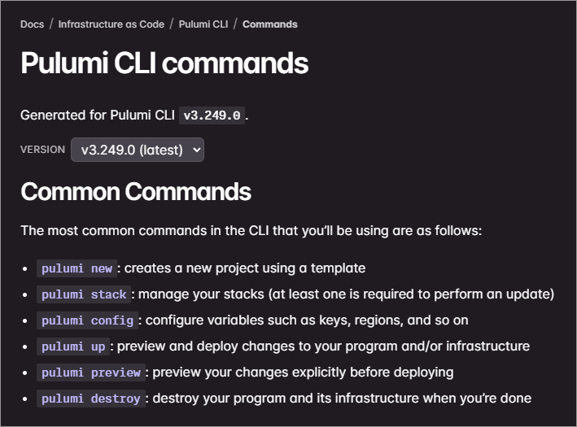
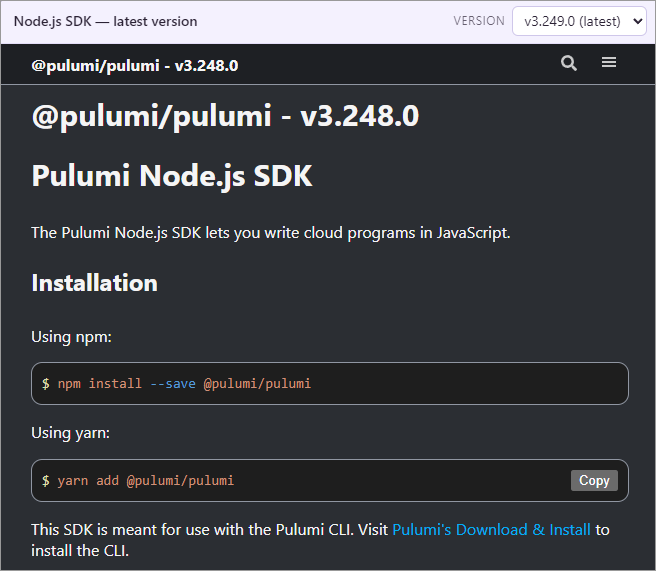

Pinned to an older Pulumi CLI or SDK version and finding that the docs describe a newer release? The [Pulumi CLI command reference](/docs/iac/cli/commands/) and the SDK API docs now include a version selector, so the documentation you're reading matches the version you're actually running.

<!--more-->

## How it works

When you open the [CLI command reference](/docs/iac/cli/commands/), you'll see a version dropdown near the top of the page, below the title. The SDK API docs carry the same dropdown in the upper-right corner. Choose a release, and the page loads the documentation generated for that exact version.

## What's available

Alongside the latest release, we keep immutable snapshots of previous versions. The CLI command reference and the Node.js, Python, .NET, and Java SDK API docs are all covered, so the matching docs are always a dropdown away.

History reaches back to around v3.150.0 (early 2025); older CLI releases already prompt you to upgrade, so that makes a sensible floor. The Go SDK is versioned on [pkg.go.dev](https://pkg.go.dev/github.com/pulumi/pulumi/sdk/v3), so its documentation lives there rather than on the docs site.

## Get started

Head to the [CLI command reference](/docs/iac/cli/commands/) or the [SDK API docs](/docs/reference/) and try the version dropdown. If your projects pin specific releases, select your version and read the docs that match.

Have feedback? Let us know in the [Pulumi Community Slack](https://slack.pulumi.com) or by opening an issue on [GitHub](https://github.com/pulumi/docs).


