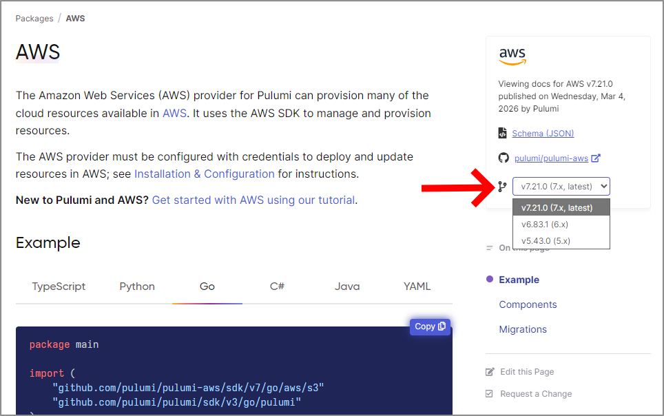

The [Pulumi Registry](/registry/) now supports browsing documentation for previous versions of first-party Pulumi providers. If you've ever needed to look up the API docs for an older provider version, you no longer have to dig through Git history or guess at changes — the docs are right there in the Registry. These docs also help [Pulumi Neo](/docs/ai) and other agents more accurately assist you with your Pulumi code and operations.

<!--more-->

## How it works

When you visit a first-party provider's page in the Pulumi Registry, you'll now see a version dropdown selector that lets you switch between the current version and previous versions.

Select a previous version from the dropdown, and the Registry loads the full API documentation for that version.

## What's available

This feature currently includes documentation for the latest release of each previous major version, going back two major versions. For example, if a provider is on v7.x, you'll be able to view docs for the latest v6.x and v5.x releases in addition to the current version.

## Get started

Head over to the [Pulumi Registry](/registry/) and try it out. Pick any first-party provider with multiple major versions and use the version dropdown to browse its history.

We'd love to hear your feedback — let us know what you think in the [Pulumi Community Slack](https://slack.pulumi.com) or by opening an issue on [GitHub](https://github.com/pulumi/registry).


