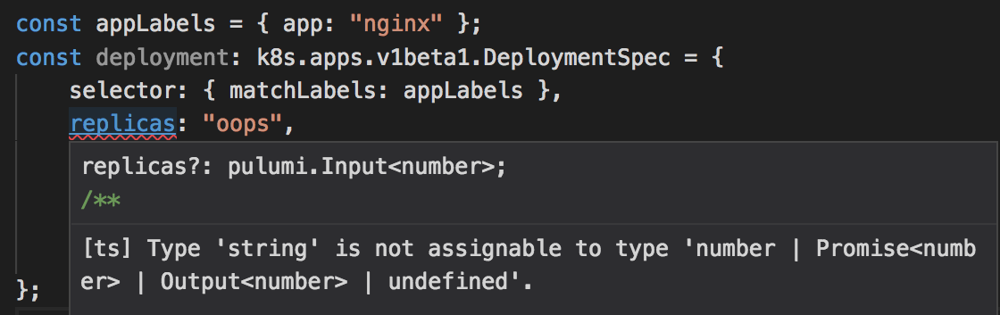
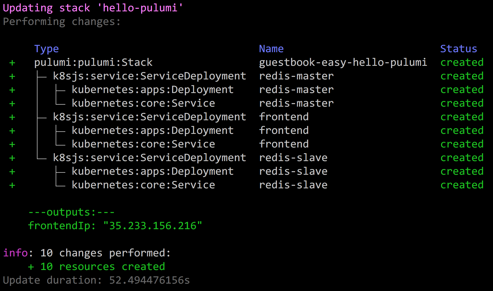
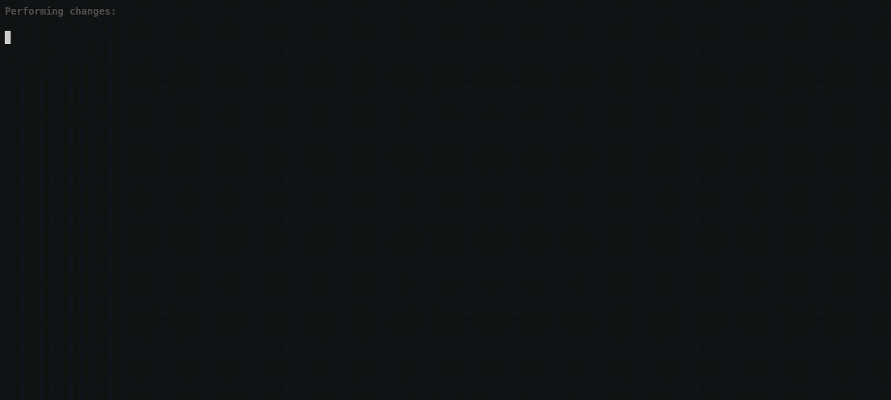

In this post, we'll take a look at 11 "pearls" -- bite-sized code
snippets -- that demonstrate using Pulumi to build and deploy Kubernetes
applications using cloud native infrastructure as code. These pearls are
organized into three categories, each demonstrating a unique scenario:

- **Config as Real Code:** Use your favorite language for authoring
  applications and configuration, eliminating toil and YAML.
- **Multi-Cloud Infrastructure:** Mix cloud services alongside
  Kubernetes resources and manage them using one set of tools and
  workflows.
- **Software Delivery as Code:** Perform sophisticated continuous
  delivery of your Kubernetes deployments -- including canaries,
  staged rollouts, leveraging cloud native projects like Envoy and
  Prometheus -- authored in real code.
<!--more-->

Here is a complete index of the pearls below, in case you want to jump
around a little:

<!-- just links to this same post -->
**[Config as Real Code](#config-as-real-code)**

- [Define Kubernetes Applications in a Real Language](#1-define-kubernetes-applications-in-a-real-language)
- [More Expressiveness, Less Boilerplate](#2-more-expressiveness-less-boilerplate)
- [Inject Envoy Sidecars Using Abstraction](#3-inject-envoy-sidecars-using-abstraction)
- [Adopt Existing Kubernetes YAML](#4-adopt-existing-kubernetes-yaml)
- [Programmatically Deploy Helm Charts as Code](#5-programmatically-deploy-helm-charts-as-code)

**[Multi-Cloud Infrastructure](#multi-cloud-infrastructure)**

- [Declare Cloud Resources Alongside Kubernetes Ones](#6-declare-cloud-resources-alongside-kubernetes-ones)
- [Provision and Use Kubernetes Clusters in Any Cloud](#7-provision-and-use-kubernetes-clusters-in-any-cloud)
- [Build and Deploy Container Images Alongside Configuration Updates](#8-build-and-deploy-container-images-alongside-configuration-updates)

**[Software Delivery as Code](#software-delivery-as-code)**

- [Robust and Repeatable Deployments, with a Notion of "Done"](#9-robust-and-repeatable-deployments-with-a-notion-of-done)
- [Trigger Cascading Rollouts from Dependent Updates](#10-trigger-cascading-rollouts-from-dependent-updates)
- [Staged Application Rollouts Gated by Prometheus Checks](#11-staged-application-rollouts-gated-by-prometheus-checks)

## Config as Real Code

The default authoring experience for Kubernetes applications is in YAML,
similar to other infrastructure as code solutions. These configuration
files can [quickly grow out of hand](https://twitter.com/jbeda/status/1023294262740365312) due to the
lack of basic facilities like for loops, functions, and classes, leading
to copy-and-paste, lots of boilerplate, and plenty of frustration.

YAML is a fine "assembly language" for computers to read -- but it was
never meant to be a programming language for humans to write. After even
the most basic level of complexity, you'll soon have accidentally
encoded critical software architecture decisions in YAML, where as
software developers we prefer to write and maintain such things in code.

Using a real language brings productivity and joy to development, but
more concretely also unlocks the ability to codify and enforce best
practices, and to share and reuse them within your team or the
community. This is something that simply isn't possible with YAML.

Pulumi supports the full Kubernetes API and lets you author and deploy
resources in code.

## 1. Define Kubernetes Applications in a Real Language

[
[Code](https://github.com/pulumi/examples/tree/master/kubernetes-ts-nginx) |
[Tutorial]() ]

Let's begin by seeing what defining Kubernetes applications in a real
language looks like. The full Kubernetes API is available, just in code
instead of YAML. A simple program looks like so:

```typescript
import * as k8s from "@pulumi/kubernetes";

const appLabels = { app: "nginx" };
const deployment = new k8s.apps.v1.Deployment("nginx-deployment", {
    spec: {
        replicas: 1,
        selector: { matchLabels: appLabels },
        template: {
            metadata: { labels: appLabels },
            spec: { containers: [{ name: "nginx", image: "nginx:1.7.9" }] }
        }
    }
});
```

Indeed, if you run the `pulumi new kubernetes-typescript` command to
create a basic project from the Kubernetes TypeScript template, this is
what you'll get.

With this program in hand, we can run `pulumi up` and it will evaluate
our program to compute the desired outcome, show us a preview, and then
make it so. Remember, Pulumi is based on the concept of infrastructure
as code; despite us using an imperative language, the code declares a
goal state that Pulumi understands and converges towards, in a reliable
way:


Notice we are using TypeScript. This gives us great IDE support and
compile-time checking for common mistakes. (Pulumi is multi-language and
doesn't mind what language runs at runtime.) For example, if I
accidentally enter a string for the replica count, I get instant IDE
feedback:



From here, we can make changes to our program -- like changing Nginx
from 1.7.9 to 1.8 -- and then rerun `pulumi up` . It will compute the
minimal set of changes to bring the running application in line with our
new desired state, show us a diff, and ask if we'd like to proceed:


Selecting yes will carry out the update:


At this point, we've seen that we can gain some advantages from
infrastructure as real code (like good IDE support and the use of a
variable to avoid repeating ourselves for appLabels ). But let's now see
some more compelling reasons why this is so great.

## 2. More Expressiveness, Less Boilerplate

[ [Code](https://github.com/pulumi/examples/tree/master/kubernetes-ts-guestbook/components) ]

We've all seen [the canonical Kubernetes guestbook application](https://kubernetes.io/docs/tutorials/stateless-application/guestbook/)
that uses PHP, Nginx, and Redis. We have
[the same tutorial written in Pulumi]().
But the basic conversion from YAML to TypeScript leaves something to be
desired; namely, it's equally as verbose, feels a little too "low level"
for an application definition, and misses opportunities to reduce
repetition.

This is where languages can rescue us. We can recognize the common
pattern of a Deployment for a container followed by a Service to expose
that container, optionally behind a load balancer with a stable IP
address. This has led us to define
[the simple ServiceDeployment class](https://github.com/pulumi/examples/blob/master/kubernetes-ts-guestbook/components/k8sjs.ts).

The definition of this class is interesting to ponder -- particularly
because, being a language, we can define arbitrary functions and classes
to encode our own best practices and common patterns -- however,
[the vast simplification to the guestbook itself](https://github.com/pulumi/examples/blob/master/kubernetes-ts-guestbook/components/index.ts)
is the best part:

```typescript
import * as k8sjs from "./k8sjs";

let redisMaster = new k8sjs.ServiceDeployment("redis-master", {
    image: "k8s.gcr.io/redis:e2e",
    ports: [ 6379 ]
});

let redisSlave = new k8sjs.ServiceDeployment("redis-slave", {
    image: "gcr.io/google_samples/gb-redisslave:v1",
    ports: [ 6379 ]
    });

let frontend = new k8sjs.ServiceDeployment("frontend", {
    replicas: 3,
    image: "gcr.io/google-samples/gb-frontend:v4",
    ports: [ 80 ],
    loadBalancer: true,
});

export let frontendIp = frontend.ipAddress;
```

The end result of having three Deployments, three Services, the frontend
being load balanced, is the same. But we have gone from the original
guestbook YAML of 147 lines down to 20. Not only that, but the code is
much simpler to understand, and easier to maintain and evolve.

The deployment workflow is similar to using the raw resources, with a
simple `pulumi up`, and we can see the underlying resources expanded in
a tree view during our update:



Notice that the frontend's allocated IP is printed here thanks to the
`export` line:

    $ curl http://$(pulumi stack output frontendIp)
    <html ng-app="redis">
      <head>
        <title>Guestbook</title>
    ...

## 3. Inject Envoy Sidecars Using Abstraction

Before moving on, let's see another powerful example of how abstraction
can help us to do useful things. In this pearl, we'll see how to inject
sidecars. A sidecar is a microservices pattern whereby a container runs
alongside another collection of containers to add some kind of value,
like logging, proxying, or gathering and reporting on performance
information. The sidecar pattern is particularly powerful in Kubernetes
thanks to its Pod abstraction.

Sidecars, and other best practices and standard patterns, are easy to
express in code. This is a simple extension of pearl #2 above, where we
can use abstraction to hide complex details.

To see this in action, let's define a simple `EnvoyDeployment` class
that adds a sidecar to any Kubernetes Deployment object:

```typescript
export class EnvoyDeployment extends k8s.apps.v1.Deployment {
    constructor(name: string,
                args: k8stypes.apps.v1.Deployment,
                opts?: pulumi.CustomResourceOptions) {
        const pod = args.spec.template.spec;

        // Add an Envoy sidecar container.
        pod.containers = pod.containers || [];
        pod.containers.push({
            name: "envoy",
            image: "lyft/envoy:latest",
            command: ["/usr/local/bin/envoy"],
            args: [
                "--concurrency 4",
                "--config-path /etc/envoy/envoy.json",
                "--mode serve"
            ],
            ports: [{ containerPort: 80, protocol: "TCP" }],
            resources: {
                limits: { cpu: "1000m", memory: "512Mi" },
                requests: { cpu: "100m", memory: "64Mi" }
            },
            volumeMounts: [{ name: "envoy-conf", mountPath: "/etc/envoy" }]
        });

        // Add an associated Volume for Envoy's config, mounted as a ConfigMap.
        pod.volumes = pod.volumes || [];
        pod.volumes.push({
            name: "envoy-conf", configMap: { name: "envoy" },
        });

        super(name, args, opts);
    }
}
```

Now, anytime we create an EnvoyDeployment , we will automatically get an
Envoy sidecar attached to it, and we don't need to remember every time
how to properly configure it:

```typescript
const appLabels = { app: "nginx" };
const deployment = new EnvoyDeployment("nginx", {
    spec: {
        selector: { matchLabels: appLabels },
        template: {
            metadata: { labels: appLabels },
            spec: { containers: [{ name: "nginx", image: "nginx" }] }
        }
    }
});
```

Of course, we can do the same with Prometheus or any other project
requiring sidecars, and we envision possibly having a more general
sidecar injection mechanism, thanks to real languages. In fact, we could
define a base class that our entire organization uses with certain
sidecars baked in, updated easily in one place and rolled out using
package managers.

## 4. Adopt existing Kubernetes YAML

It's wonderful that we can use real languages, but there's already lots
of YAML in the world. Pulumi lets us process that YAML dynamically, and
adopt it on the fly to become part of our Pulumi program, without even
needing to change it. This enables multi-cloud and advanced delivery
scenarios, in addition to being a great way to incrementally convert
your existing code.

For instance, let's imagine we want to deploy the standard
[Kubernetes Guestbook example](https://kubernetes.io/docs/tutorials/stateless-application/guestbook/)
directly from the official YAML files, and make its public IP easily
accessible:

```typescript
import * as k8s from "@pulumi/kubernetes";

// Create resources from standard Kubernetes Guestbook YAML example.
const guestbook = new k8s.yaml.ConfigGroup(
    "guestbook", { files: "guestbook/*.yaml" });

// Export the (cluster-private) IP address of the Guestbook frontend.
export const frontendIp =
    guestbook.getResource("v1/Service", "frontend").
    spec.apply(spec => spec.clusterIP);
```

This slurps up all the YAML files underneath the `guestbook` directory,
creates the desired goal state out of them, and gives the same CLI
experience shown earlier with diffs and deployments.

## 5. Programmatically Deploy Helm Charts as Code

The same is true of Helm Charts, an increasingly popular way to
distribute entire Kubernetes applications. Let's say we want to deploy
the latest stable Wordpress Helm Chart, and, again, expose its public IP
so that it's easily accessible to us after deployment:

```typescript
import * as k8s from "@pulumi/kubernetes";

// Deploy the latest version of the stable/wordpress chart.
const wordpress = new k8s.helm.v2.Chart("wordpress", {
    repo: "stable",
    version: "2.1.3",
    chart: "wordpress"
});

// Export the public IP for Wordpress.
export const frontendIp =
    wordpress.getResource("v1/Service", "wpdev-wordpress").
    status.apply(status => status.loadBalancer.ingress[0].ip);
```

The resulting Pulumi program can be deployed using `pulumi up` in the
usual way:


An even more exciting example that highlights mixing cloud resources
alongside a Helm Chart, check out [our example](https://github.com/pulumi/examples/tree/master/azure-ts-aks-mean)
that creates a MEAN stack that uses Azure CosmosDB as the storage layer
for an otherwise ordinary Helm Chart, alleviating the burden of needing
to worry about persistent volumes, stateful services, and the associated
backup and operational difficulties.

For added fun, we can even inspect or rewrite the resulting resource
graph on the fly, using the `transforms` parameter, for both YAML
configuration and Helm Charts. This lets us validate conforming
configuration, inject sidecars automatically, and more.

## Multi-Cloud Infrastructure

Kubernetes applications seldom live on an island by themselves. They
typically rely on other cloud infrastructure, as we've just seen. This
spans a long list of possibilities, for instance:

- **Data services**: AWS S3, Google BigTable, Azure CosmosDB
- **AI services**: speech recognition, image classification, training
  algorithms
- **Hosted services**: MySQL, Redis, Map/Reduce
- **Container registries**: ECR, ACR, GCR, Docker Hub, JFrog
  Artifactory

In addition to the very infrastructure hosting the underlying Kubernetes
cluster itself, such as the underlying networking and cluster resources
(AKS, EKS, GKE), or compute resources for on-premise clusters (VMWare,
OpenStack, etc).

Most of us today use different YAML dialects for Kubernetes applications
and the other cloud infrastructure, and then end up needing to stitch
together different tools using ad-hoc Bash or Python scripts. This is
hardly robust and leads to significant toil and tricky failure modes.

Pulumi, on the other hand, can provision and manage the full set of
resources mentioned in the above examples, using the same programming
model, language, and tools and workflow.

## 6. Declare Cloud Resources Alongside Kubernetes Ones

Let's say that we want an AWS S3 Bucket for our Kubernetes application
to use. This sounds basic -- and indeed happens all the time -- but is
surprisingly difficult with today's tools.

Normally we'd find ourselves clicking around in the AWS console to
create one, writing AWS CloudFormation YAML and deploying it using AWS,
or cobbling together Terraform DSL scripts that are deployed
independently from our Kubernetes object definitions themselves. This
leaves us having to orchestrate multiple tools and services that were
never designed to work together.

Instead of doing that, we can simply author a single TypeScript program
that does it all in one go. Pulumi offers packages for AWS, Azure,
Google Cloud, and other clouds. We can then use a single CLI invocation,
`pulumi up`, to provision and update all of it:

```typescript
import * as aws from "@pulumi/aws";
import * as k8s from "@pulumi/kubernetes";

const appName = "nginx";

// nginx config stored in an S3 bucket.
const config = new aws.s3.Bucket(`${appName}-config`);

// nginx container, replicated 1 time.
const appLabels = { app: appName };
const nginx = new k8s.apps.v1beta1.Deployment(appName, {
    spec: {
        selector: { matchLabels: appLabels },
        replicas: 1,
        template: {
            metadata: { labels: appLabels },
            spec: {
                initContainers: [nginxConfigPuller(config.bucketDomainName)],
                containers: [{ name: appName, image: "nginx:1.15-alpine" }]
            }
        }
    }
});
```

Pulumi understands the full dependency graph between resources, and so
the deployment of the AWS bucket will be orchestrated properly with
respect to the Kubernetes resources. In the event that a subsequent
update alters the bucket -- for instance, perhaps a new domain name is
assigned -- Pulumi will know how to cascade those changes to Kubernetes
automatically.

## 7. Provision and Use Kubernetes Clusters in Any Cloud

[ [Code](https://github.com/pulumi/examples/tree/master/gcp-ts-gke) ]

In addition to all the usual resources your application might use, you
can also provision actual Kubernetes clusters using Pulumi programs.
This has become much easier recently thanks to Google's Kubernetes
Engine (GKE), Azure's Kubernetes Service (AKS), and AWS's Elastic
Kubernetes Service (EKS), which offer hosted solutions at a reasonable
cost. Of course, it's possible to use Pulumi programs to provision
custom and on-premise clusters too.

Another thing Pulumi can do is manage an actual cluster and its
application resources in a single program. It's common to separate
programs into low-level infrastructure and higher-level applications in
the move to production -- especially for cost, team roles and
responsibilities, etc. -- but it's a game changer for simple cases where
as a developer you just want to get up and running quickly without
thinking deeply about the clustering underneath. More importantly, you
have one set of languages, tools, and workflows for all application
infrastructure.

For example, here is a program that deploys a GKE cluster with
configurable settings:

```typescript
import * as gcp from "@pulumi/gcp";
import { nodeCount, nodeMachineType, password, username } from "./config";

export const k8sCluster = new gcp.container.Cluster("gke-cluster", {
    initialNodeCount: nodeCount,
    nodeVersion: "latest",
    minMasterVersion: "latest",
    masterAuth: { username, password },
    nodeConfig: {
        machineType: nodeMachineType,
        oauthScopes: [
            "https://www.googleapis.com/auth/compute",
            "https://www.googleapis.com/auth/devstorage.read_only",
            "https://www.googleapis.com/auth/logging.write",
            "https://www.googleapis.com/auth/monitoring"
        ],
    },
});
```

Imagining that this was defined in a `cluster.ts` module, we can deploy
a canary deployment on top of that cluster using the same program:

```typescript
import * as k8s from "@pulumi/kubernetes";
import * as pulumi from "@pulumi/pulumi";
import { k8sProvider, k8sConfig } from "./cluster";

// Create a canary deployment to test that this cluster works.
const name = `${pulumi.getProject()}-${pulumi.getStack()}`;
const canaryLabels = { app: `canary-${name}` };
const canary = new k8s.apps.v1beta1.Deployment("canary", {
    spec: {
        selector: { matchLabels: canaryLabels },
        replicas: 1,
        template: {
            metadata: { labels: canaryLabels },
            spec: { containers: [{ name, image: "nginx" }] },
        },
    },
}, { provider: k8sProvider });

// Export the Kubeconfig so that clients can easily access our cluster.
export let kubeConfig = k8sConfig;
```

The incredible thing about this example is that, with it, we simply run
pulumi up, and a little over two minutes later, we have a fully
functioning GKE cluster with a canary deployment up and running:


In addition to the GKE example, our examples repo also has fully
functioning examples for doing the same thing with
[Azure's AKS](https://github.com/pulumi/examples/tree/master/azure-ts-aks-helm)
and [AWS's EKS](https://github.com/pulumi/examples/tree/master/aws-ts-eks). A
Kubernetes cluster for everybody!

## 8. Build and Deploy Container Images Alongside Configuration Updates

One scenario we often encounter in practice is the need to coordinate
Docker registry provisioning and management (using one set of tools),
with building and pushing new Docker images (using another set of
tools), with updating Kubernetes configuration to consume said images
(using yet another set of tools). Pulumi can handle doing all three
things in code, using just the `pulumi up` command to manage your
container registry infrastructure, build and push images, and update
your Kubernetes objects to consume those freshly published images.

This example builds and pushes a custom Nginx image to the Docker Hub
and then consumes it from a Kubernetes Deployment:

```typescript
import * as docker from "@pulumi/docker";
import * as k8s from "@pulumi/kubernetes";
import * as pulumi from "@pulumi/pulumi";

const config = new pulumi.Config();

// Build a Dockerfile located at ./mynginx in my project.
// Publish it to the Docker Hub using the configured username/password.
const mynginx = new docker.Image("mynginx", {
    build: "./mynginx",
    imageName: "hekul/mynginx:v1",
    registry: {
        server: "docker.io",
        username: config.require("dockerUsername"),
        password: config.require("dockerPassword"),
    },
});

// Deploy an app container that consumes the resulting image name.
const appLabels = { app: appName };
const nginx = new k8s.apps.v1beta1.Deployment(appName, {
    spec: {
        selector: { matchLabels: appLabels },
        replicas: 1,
        template: {
            metadata: { labels: appLabels },
            spec: {
                // Use the app container at the specific SHA pushed.
                containers: [{
                    name: appName,
                    image: mynginx.imageName,
                }],
            }
        }
    }
});
```

Although this example uses the Docker Hub, this technique works great
for all of the major cloud providers' container registries: Amazon ECR,
Azure ACR, and Google GCR. Keep an eye out on our examples repo for
examples of these soon, or let us know what you'd like to see.

## Software Delivery as Code

In this final section, we'll turn our attention away from authoring, and
towards operating. Namely, how to achieve robust continuous deployment
(CD) of your Kubernetes applications.

Pulumi takes an "everything is code" approach so, in addition to your
infrastructure being written in real code, your software delivery
pipeline is too. In fact, each Pulumi program really is a deployment
workflow expressed in code. The Pulumi CLI is responsible for evaluating
programs, producing goal states, diffing states to produce plans, and
carrying them out. The Pulumi hosted service at
[https://app.pulumi.com](https://app.pulumi.com) is used for robust concurrency
and state management so that deployments can be done continuously in a
team environment, with perfect auditability of who changed what and
when, and so that deployments are repeatable and failures recoverable.

Let's look at a few particularly useful scenarios when using Pulumi for
Kubernetes deployments.

## 9. Robust and Repeatable Deployments, with a Notion of "Done"

[ [Code](https://github.com/pulumi/examples/tree/master/kubernetes-ts-exposed-deployment) ]

Kubernetes is amazing at container orchestration and running reliable
distributed systems. Its primary CLI, kubectl, offers many features for
doing basic deployments and rollouts, and the cluster management
software itself handles rolling updates. kubectl deliberately leaves
more sophisticated deployment "policy" as an exercise outside of the
core system, however. This is a noteworthy and agreeable decision,
because the foundational CLI must provide robust mechanisms based on
eventual consistency and fault tolerance, its most critical
underpinnings.

For practical deployments, we often need more opinionated policy on top
of these mechanisms, and that is where a tool like Pulumi that does
deployment orchestration can help. Pulumi adds the ability to preview
updates before applying them (with full diffing); the ability to know
when a deployment has succeeded or failed and why; canaries, blue/green,
flighting-based rollouts, and more. Pulumi's CLI has been developed with
real world scenarios in mind.

Let's consider the following program, which deploys Nginx to a
Kubernetes cluster using the standard Kubernetes object model, and
allocates a public IP address to it:

```typescript
import * as k8s from "@pulumi/kubernetes";

// nginx container, replicated 1 time.
const appName = "nginx";
const appLabels = { app: appName };
const nginx = new k8s.apps.v1beta1.Deployment(appName, {
    spec: {
        selector: { matchLabels: appLabels },
        replicas: 1,
        template: {
            metadata: { labels: appLabels },
            spec: { containers: [{ name: appName, image: "nginx:1.15-alpine" }] }
        }
    }
});

// Allocate a public IP to the nginx Deployment.
const frontend = new k8s.core.v1.Service(appName, {
    metadata: { labels: nginx.spec.apply(spec => spec.template.metadata.labels) },
    spec: {
        type: "LoadBalancer",
        ports: [{ port: 80, targetPort: 80, protocol: "TCP" }],
        selector: appLabels
    }
});

// When "done", this will print the public IP.
export const frontendIp = frontend.status.apply(
    status => status.loadBalancer.ingress[0].ip);
```

This code looks a lot like the prior examples, but let's double click
into the CLI experience when deploying it. Out of the box, Pulumi
provides several real world niceties.

First, `pulumi up` will wait for all resources to be initialized before
completing. This gives a notion of done, and allows us to see status
updates and any errors that result. kubectl intentionally doesn't do
this because it relies on eventual consistency and the idea that
deployments will eventually converge. This is a robust and reliable
foundation, but as developers, we often want richer monitoring. This
leads to bash scripts and frequent polling, with hard to diagnose
events.

For instance, if we specify an invalid image, we'll see fine-grained
status errors as they arise:



This allows us to "export" values from the completed resources, which
gives a way to elevate the most important output values. In the last
line, we see that we're exporting the public IP address allocated to the
Nginx Pod. This allows us to use this IP address as a value:


Finally, in true infrastructure as code fashion, Pulumi works on the
notion of goal states. This means it can always diff the desired goal
state with whatever is currently deployed to a cluster. That is shown as
part of the typical `pulumi up` sequence, but the
`pulumi preview --diff` command shows a more "Git-like" diff of the full
resource graph. In this example, we've changed our container image from
`nginx:15-alpine` to `nginx:16-alpine`:


The ability to look at previews before making an update ensures mistakes
don't get made and that deployments don't have unanticipated impacts.
There is even a [Pulumi GitHub App]() that will show such
diffs inside of pull requests before they've been deployed, so you know
the impact of configuration changes before code even makes its way to
master.

## 10. Trigger Cascading Rollouts from Dependent Updates

[ [Code](https://github.com/pulumi/examples/tree/master/kubernetes-ts-configmap-rollout) ]

Although it's not strictly "deployment orchestration", there are some
useful things Pulumi does out of the box when deciding how and when to
update resources. Namely, its engine has a full understanding of the
resource graph (technically, a DAG), which lets it cascade updates to
multiple resources that depend on one another. This is often be as
simple as feeding the output of some Kubernetes object as input to
another programmatically, so that when you update one you don't also
forget to update the other. Pulumi orchestrates operations in the right
order.

In this example, however, we'll look at a specific example, where this
cascading can be useful. Imagine we are using a ConfigMap to store the
value for an Nginx Deployment's config file. There are various ways we
could map that ConfigMap and do hot reloads of it, but let's say we just
want to do the simpler thing of triggering a deployment anytime that
config changes. Pulumi can handle this automatically, simply based on
the dependencies between resources:

```typescript
import * as fs from "fs";
import * as k8s from "@pulumi/kubernetes";

const appName = "nginx";
const appLabels = { app: appName };

// nginx Configuration data to proxy traffic to `pulumi.github.io`.
// Read from `default.conf` file.
const nginxConfig = new k8s.core.v1.ConfigMap(appName, {
    metadata: { labels: appLabels },
    data: { "default.conf": fs.readFileSync("default.conf").toString() }
});
const nginxConfigName = nginxConfig.metadata.apply(m => m.name);

// Deploy 1 nginx replica, mounting the configuration data into the container.
const nginx = new k8s.apps.v1beta1.Deployment(appName, {
    metadata: { labels: appLabels },
    spec: {
        replicas: 1,
        template: {
            metadata: { labels: appLabels },
            spec: {
                containers: [{
                    name: "nginx",
                    image: "nginx:1.13.6-alpine",
                    volumeMounts: [{
                        name: "nginx-configs",
                        mountPath: "/etc/nginx/conf.d",
                    }].
                }],
                volumes: [{
                    name: "nginx-configs",
                    configMap: { name: nginxConfigName },
                }],
            },
        },
    }
});
```

Notice here that we're just reading a file from our local project
workspace to supply as the default.conf data. The end result is that all
we need to do is update that config file, rerun pulumi up , and it will
detect that the ConfigMap changed, perform those changes, and then
cascade the updates to the Deployment such that it ingests those
changes:


## 11. Staged Application Rollouts Gated by Prometheus Checks

[ [Code](https://github.com/pulumi/examples/tree/master/kubernetes-ts-staged-rollout-with-prometheus) ]

As we start to go deeper into these scenarios, we're beginning to see
that Pulumi is useful not only for expression of application
configuration, but also for deployment orchestration. Because a Pulumi
program is arbitrary code, we can do useful things in the middle of
updates.

In this example, we'll use this capability to rendezvous with Prometheus
to gate our deployment with health checks. In particular, we will first
deploy a basic 3-replica canary, ask Prometheus to check health metrics,
and then once the P90 response time is looking good, we'll advance our
deployment to a full blown 10-replica deployment.

Let's check out the code. It looks like a usual Pulumi program, except
that we use a promise from the Prometheus health checks as input to the
staging ring deployment, which has the effect of making it dependent on
the resolution of said health checks:

```typescript
// Canary ring. Replicate instrumented Pod 3 times.
const canary = new k8s.apps.v1beta1.Deployment(
    "canary-example-app",
    { spec: { replicas: 1, template: instrumentedPod } },
    { dependsOn: p8sDeployment }
);

// Staging ring. Replicate instrumented Pod 10 times.
const staging = new k8s.apps.v1beta1.Deployment("staging-example-app", {
    metadata: {
        annotations: {
            // Check P90 latency is < 20,000 microseconds. Returns a `Promise<string>` with the P90
            // response time. It must resolve correctly before this deployment rolls out. In
            // general any `Promise<T>` could go here.
            "example.com/p90ResponseTime": util.checkHttpLatency(canary, containerName, {
                durationSeconds: 30,
                quantile: 0.9,
                thresholdMicroseconds: 20000,
                prometheusEndpoint: `localhost:${localPort}`,
            })
        }
    },
    spec: { replicas: 1, template: instrumentedPod }
});
```

If we run this with a `pulumi up`, the deployment will proceed as usual,
but we will see intermediate output telling us at what stage our
deployment is at any given time. Most of the time will be spent waiting
on Prometheus, but then we'll see the final deployment scale out --
assuming our canary passed the health checks, of course!


## Wrapping Up

In this post, we've seen some of the exciting things you can do with
Pulumi's Cloud Native SDK for Kubernetes. We've been having a great time
working with the community over the past couple months to get all of
these goodies ready to go, are thrilled to ship, and we look forward to
hearing about your ideas and scenarios about where to take things from
here.

To get started, head over to the [Pulumi Quickstart](),
meet us over on GitHub where all the goodies are open source <https://github.com/pulumi/pulumi>, and/or join our
[Pulumi Community Slack](https://slack.pulumi.io). We can't wait to hear
from you. Happy hacking!
