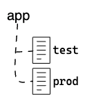
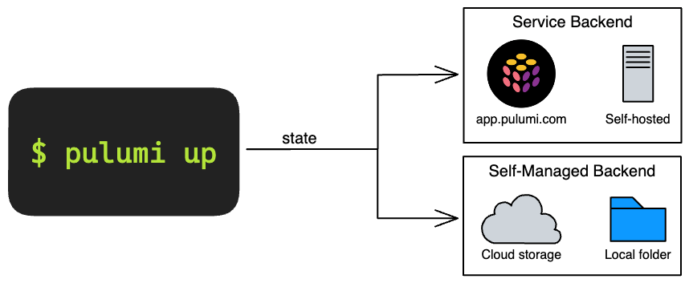
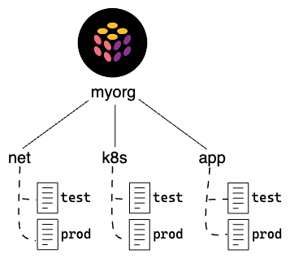
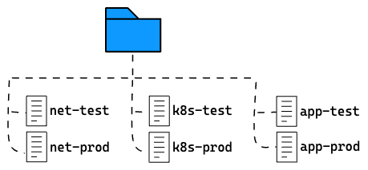
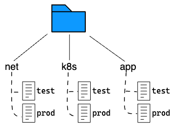
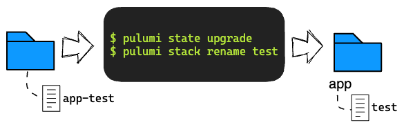

At Pulumi, our goal is to offer the best Infrastructure as Code experience for all cloud developers.
From the very beginning, we've believed that the best IaC experience is made possible by combining a great open source SDK and CLI with a great backend management service.
This is why we built [Pulumi Cloud](/product/pulumi-service/), a rich management platform for your Infrastructure as Code, which includes a forever free option for individuals, a generous free tier for teams, and critical tools for enterprises to manage IaC at scale.

Over the last few years, we've continued to expand the features of the Pulumi Service - with [Deployments](/blog/pulumi-deployments/),  [Audit Logs](/docs/pulumi-cloud/audit-logs/), [SAML SSO](/docs/pulumi-cloud/access-management/saml/) and [SCIM](/docs/pulumi-cloud/access-management/scim/), [Teams](/docs/pulumi-cloud/access-management/teams/), [Stack Transfers](/blog/stack-transfers/), [Favorites](/blog/new-improved-pulumi-service-console/), [Organization](/docs/pulumi-cloud/access-management/organization-access-tokens/) and [Team Access Tokens](/docs/pulumi-cloud/access-management/team-access-tokens/) and much more.

While the majority of Pulumi users do choose to use the Pulumi Service, we also know that there are good reasons why some organizations would prefer to use Pulumi IaC alone without the Pulumi Service.  And so we support and continue to invest in enabling a variety of additional [backends](/docs/iac/concepts/state-and-backends/) that allow the Pulumi CLI to be used with state stored in the local filesystem or in cloud storage like S3, Azure Blob Storage, or Google Cloud Storage.

Historically the Pulumi Service backend and the DIY backend have differed in their handling of "projects". The Pulumi Service stores state for a Pulumi stack in a seperate namespace per project. The DIY backends have historically stored all stacks in a single namespace across all projects.  This inconsistency has been a common source of confusion for users getting started with Pulumi when using the file storage backends.

Today, we are aligning how projects are managed across all backends, adding **Project-Scoped Stacks** support to DIY backends.

<!--more-->

## Background

This section goes over some of the background necessary
to understand project-scoping and why it's important.
Feel free to skip ahead to the next section if you're already familiar with this.

### Projects and stacks

Pulumi [*projects*](/docs/concepts/projects/) are a unit of organization.
A project holds the code and configuration for your infrastructure,
and can be used to deploy multiple stacks.
A [*stack*](/docs/concepts/stack/) is a single,
isolated instance of your infrastructure.

For example, you might have an "app" project for your application,
deploying to the "test" and "prod" stacks.



### What's a state backend?

Each stack tracks metadata about your infrastructure
so it can manage your cloud resources.
This metadata is called [*state*](/docs/iac/concepts/state-and-backends/)
and it is stored in a *backend* of your choosing:
**Service** or **DIY**.

The **Service** backend is hosted at [`app.pulumi.com`](https://app.pulumi.com)
or [on your own server](https://www.pulumi.com/product/self-hosted/).
It provides the best combination of usability, safety, and security for most users.

The **DIY** backend stores state in a JSON file,
deferring to you to manage persistence of this information.
You can store it in Amazon S3, Azure Blob Store, Google Cloud Storage,
a system such as Minio or Ceph with an API compatible with Amazon S3,
or on your local filesystem.
Using this backend trades reliability and convenience of the Service backend
for additional control over where the information is stored.



If you're unsure of which backend to use,
see [Deciding On a State Backend](/docs/iac/concepts/state-and-backends/#deciding-on-a-state-backend).

### Project-scoped stacks

Depending on your needs, you can have several Pulumi projects.
For example, you might have a "net" project to set up an Amazon VPC,
a "k8s" project to set up a Kubernetes cluster deployed to it,
and an "app" project to build and deploy your application to the cluster.
Each of these projects will have their own stacks, e.g. "test" and "prod".

The Pulumi Service backend scopes stacks to the project they belong to,
so we can re-use the names "test" and "prod" across different projects.



This was not the case for the DIY backend,
where stack names were global across all projects.
To work around this, users resorted to qualifying stack names
in the form `<project>-<stack>` when using the DIY backend.



We're pleased to announce that such workarounds are no longer necessary!

## Project-scoped stacks in DIY backends

With the latest release of Pulumi,
we've added support for project-scoped stacks to the DIY backend.
Stacks created in new or empty DIY backends will automatically
use the new project-scoped layout.

With this change,
you can now use stack names like "test" and "prod" across your projects
without risk of conflict&mdash;the same way you do with the Service backend.



### Upgrading existing backends

Only stacks created in new or empty DIY backends
will scope stacks to projects.
Existing backends will continue to operate as they do today.

If you have an existing DIY backend that you'd like to upgrade
to use project-scoped stacks,
you can do so with the new `pulumi state upgrade` command,
which upgrades all stacks in the backend to use the new project-scoped layout.

```
$ pulumi state upgrade
This will upgrade the current backend to the latest supported version.
Older versions of Pulumi will not be able to read the new format.
Are you sure you want to proceed?
Please confirm that this is what you'd like to do by typing `yes`:
```

{}
Once stacks in a DIY backend are upgraded,
older versions of the Pulumi CLI will be unable to access those stacks.
This change cannot be reverted.
{}

#### Cleaning up old stack names

If you previously qualified stack names with the project name to avoid conflicts,
you can use the `pulumi stack rename` command to clean up these names after the upgrade.

```
$ pulumi stack rename --stack app-test test
```



## Referencing stacks in the CLI

Many commands in the Pulumi CLI expect a stack name to be specified.
These commands accept a fully-qualified stack name in the form:

    <org>/<project>/<stack>

Where, `<org>` is the organization name,
`<project>` the project name,
and `<stack>` the stack name.

They also accept one of the following shorthand forms
if we're inside the project directory:

    <org>/<stack>
    <stack>

For instance, given a stack "prod" inside the "app" project,
the following are all valid ways to refer to it:

    my-org/app/prod
    my-org/prod      // if inside the app directory
    prod             // if inside the app directory

With the latest release of Pulumi, the above is true for both
the Service backend and the DIY backend.

### Referencing DIY project-scoped stacks

All projects in a DIY backend
are placed under a virtual organization named "organization".
This value is constant and cannot be changed.

Repeating the above examples with a DIY backend,
we can use any of the following forms to refer to the same stack:

    organization/app/prod
    organization/prod      // if inside the app directory
    prod                   // if inside the app directory

## Availability

Support for project-scoped stacks in DIY backends is now available in Pulumi v3.61.0.
Give it a try and share your thoughts with us on the [Pulumi Community Slack](https://slack.pulumi.com/)!
