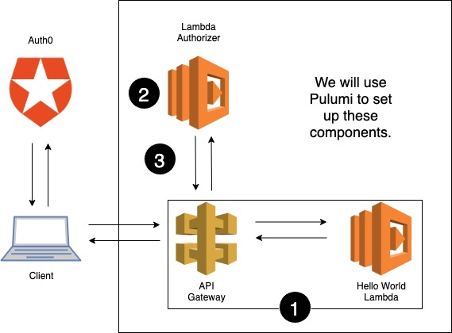

Creating serverless applications just got even easier! You can now
protect your application APIs in just three easy steps. We've already
posted about how [easy it is to create serverless apps in Pulumi]().
Now, we're helping you simplify protecting those apps with API
Gateway and Lambda authorizers.

With Pulumi's new [AWSX](https://github.com/pulumi/pulumi-awsx) package, you
can quickly define a Lambda and an AWS Lambda authorizer to protect it.
We're once again harnessing the power of [Lambdas as Lambdas]()
to allow developers to focus on writing code.

Today, we will walkthrough creating a simple serverless app using AWS
and Pulumi. We will simplify implementing the OAuth protocol by using
[Auth0](https://auth0.com/) and AWS Lambda authorizers to authorize
users. Auth0 provides a universal authentication and authorization
platform for applications. It has become an extremely popular platform
for user management because Auth0 makes OAuth easy.
<!--more-->

## Concepts

Before we get started, let's go over some concepts we'll be using.

### API Gateway

An API Gateway takes clients requests and then re-routes them to the
appropriate backend service. Typically, a gateway serves as the "front
door" for an API and is used for traffic management as well as flexible
security controls.

Using AWS API Gateway, you can build a fully managed collection of
resources which integrate with AWS Lambda and various other AWS
resources. To control who can call your API, you can use IAM
permissions, an Amazon Cognito User Pool or set up custom logic using a
Lambda authorizer.

### OAuth

OAuth is an industry-standard for token-based authorization. Using
OAuth, users can grant third-party applications or websites access to
their information on another website without disclosing their password.
Google and Facebook are two very common examples of sites that permit
users to share their personal information with websites or applications
using OAuth.

### Lambda Authorizers

An [AWS Lambda authorizer](https://docs.aws.amazon.com/apigateway/latest/developerguide/apigateway-use-lambda-authorizer.html)
is a Lambda that provides access control to an API. It contains custom
logic for authorizing requests to an endpoint. If a Lambda authorizer is
configured, API Gateway routes a client's call to the Lambda first. The
Lambda authorizer runs its custom logic and returns a Policy and
principal ID, which are used by API Gateway to determine if the call to
the backend is allowed.

## Step-by-Step Guide To Creating a Lambda Authorizer

Using a Lambda authorizer, we can implement the authorization flow using
Auth0 to handle our Access Tokens.

API Gateway can be used to protect many different resources, and in the
following example we will front an AWS Lambda. Users authenticate with
Auth0 and then use the token they've obtained to make a request to our
Lambda via our API Gateway, which authorizes the request by validating
the token with Auth0. Some of the code examples have been stubbed or
shortened for this blog post. The full code example can be found in our
[Pulumi examples repo](https://github.com/pulumi/examples/blob/master/aws-ts-apigateway-auth0/index.ts).

Below is a diagram of the architecture we will set up. In Step 1, we
will create our API Gateway and Hello World Lambda. In Step 2, we will
set up the logic for our Lambda authorizer. And finally in Step 3, we
will bring it all together by telling API Gateway to use our authorizer.



### 1 - Define Your Routes

Using Pulumi's [AWSX](https://github.com/pulumi/pulumi-awsx) package,
you can easily define routes to serverless apps as well as routes to
static resources. We will create a very simple `Hello world!` backend
Lambda, but in practice you can have this do much more interesting
things.

```typescript
import * as awsx from "@pulumi/awsx";

// Create our API and reference the Lambda authorizer
const api = new awsx.apigateway.API("myapi", {
    routes: [{
        path: "/hello",
        method: "GET",
        eventHandler: async () => {
            return {
                statusCode: 200,
                body: "<h1>Hello world!</h1>",
            };
        },
    }],
});
```

### 2 - Write Your Custom Auth Logic

Just as Pulumi allows you to define your Lambda inline, you can define
your custom authorization code. We will define a small wrapper for our
custom logic and write the rest of the code as a function called
`authenticate`. Pulumi will package up all our *runtime* code and create
an AWS Lambda for us.

```typescript
import * as awsx from "@pulumi/awsx";
import * as pulumi from '@pulumi/pulumi';
 
import * as jwksClient from 'jwks-rsa';
import * as jwt from 'jsonwebtoken';
import * as util from 'util';
 
const config = new pulumi.Config();
const jwksUri = config.require("jwksUri");
const audience = config.require("audience");
const issuer = config.require("issuer");
 
const authorizerLambda = async (event: awsx.apigateway.AuthorizerEvent) => {
    try {
        return await authenticate(event);
    }
    catch (err) {
        console.log(err);
        // Tells API Gateway to return a 401 Unauthorized response
        throw new Error("Unauthorized");
    }
}
 
/**
     * Below is all code that gets added to the Authorizer Lambda. The code was copied and
     * converted to TypeScript from
     * [Auth0's GitHub Example](https://github.com/auth0-samples/jwt-rsa-aws-custom-authorizer)
     */
 
function getToken(event: awsx.apigateway.AuthorizerEvent): string {
    // Stubbed function to extract and return the Bearer Token from the Lambda event parameter
}
 
// Check if the Token is valid with Auth0
async function authenticate(event: awsx.apigateway.AuthorizerEvent): Promise<awsx.apigateway.AuthorizerResponse> {
    const token = getToken(event);
 
    const decoded = jwt.decode(token, { complete: true });
    if (!decoded || typeof decoded === "string" || !decoded.header || !decoded.header.kid) {
        throw new Error('invalid token');
    }
 
    const client = jwksClient({
        cache: true,
        rateLimit: true,
        jwksRequestsPerMinute: 10, // Default value
        jwksUri: jwksUri
    });
 
    const key = await util.promisify(client.getSigningKey)(decoded.header.kid);
    const signingKey = key.publicKey || key.rsaPublicKey;
    if (!signingKey) {
        throw new Error('could not get signing key');
    }
 
    const verifiedJWT = await jwt.verify(token, signingKey, { audience, issuer });
    if (!verifiedJWT || typeof verifiedJWT === "string" || !isVerifiedJWT(verifiedJWT)) {
        throw new Error('could not verify JWT');
    }
    return awsx.apigateway.authorizerResponse(verifiedJWT.sub, 'Allow', event.methodArn);
}
```

### 3 - All Together Now

Now let's tie it all together! We will modify the route we created in
Step 1 to include our authorizer.

```typescript
import * as awsx from "@pulumi/awsx";
 
// Create our API and reference the Lambda authorizer
const api = new awsx.apigateway.API("myapi", {
    routes: [{
        path: "/hello",
        ...
        authorizers: awsx.apigateway.getTokenLambdaAuthorizer({
            authorizerName: "jwt-rsa-custom-authorizer",
            header: "Authorization",
            handler: authorizerLambda,
            identityValidationExpression: "^Bearer [-0-9a-zA-Z._]*$",
            authorizerResultTtlInSeconds: 3600,
        }),
    }],
});
```

### The Finished Product

When we run `pulumi up`, Pulumi will create our resources and provide us
with our protected endpoint.

```
$ pulumi up
...
     Type                                Name                                         Status      Info
 +   pulumi:pulumi:Stack                 lambda-authorizer-dev                        created     1 message
 +   ├─ aws:apigateway:x:API             myapi                                        created
 +   │  ├─ aws:iam:Role                  myapifc45ff03                                created
 +   │  ├─ aws:iam:RolePolicyAttachment  myapifc45ff03-32be53a2                       created
 +   │  ├─ aws:lambda:Function           myapifc45ff03                                created
 +   │  ├─ aws:apigateway:RestApi        myapi                                        created
 +   │  ├─ aws:apigateway:Deployment     myapi                                        created
 +   │  ├─ aws:lambda:Permission         myapi-62a1b306                               created
 +   │  └─ aws:apigateway:Stage          myapi                                        created
 +   ├─ aws:iam:Role                     jwt-rsa-custom-authorizer-authorizer-role    created
 +   ├─ aws:iam:Role                     jwt-rsa-custom-authorizer                    created
 +   ├─ aws:iam:RolePolicyAttachment     jwt-rsa-custom-authorizer-32be53a2           created
 +   ├─ aws:lambda:Function              jwt-rsa-custom-authorizer                    created
 +   └─ aws:iam:RolePolicy               jwt-rsa-custom-authorizer-invocation-policy  created
 
Outputs:
    url: "https://XXXXX.execute-api.us-west-2.amazonaws.com/stage/"
 
Resources:
    + 14 created
 
Duration: 28s
```

You'll notice there's a ton of resources we didn't explicitly define.
AWSX provisions the appropriate Lambdas, roles, and more for you. If
required, all of these resources can be overridden in your Pulumi
program by explicitly defining them.

Let's give try out our new API.

We can now curl our endpoint without a token and should get a 401
Unauthorized response.

    $ curl $(pulumi stack output url)hello
    {"message":"Unauthorized"}

We can curl our endpoint with an invalid token and should once again get
a 401 Unauthorized response.

    $ curl $(pulumi stack output url)hello -H "Authorization: Bearer invalid"
    {"message":"Unauthorized"}

Finally, we expect a 200 response when we obtain a token from Auth0 and
use it to call our API. We can get a token by visiting the API Details
page for our API and clicking the Test tab. This provides us with a
valid token for testing purposes only. The way tokens are acquired by
users or client apps will depend on the type of application (i.e. native
mobile app, single-page app, web app, etc.) being developed. For more
information on authenticating users, visit [Auth0's documentation](https://auth0.com/docs).

Using the test access token, the API will return a 200 response: Hello
world!

    $ curl $(pulumi stack output url)hello -H "Authorization: Bearer <VALID_TOKEN>"
    <h1>Hello world!</h1>

For the complete code example, visit our [examples repo](https://github.com/pulumi/examples/tree/master/aws-ts-apigateway-auth0).

## Keep It Going

While we used OAuth and Auth0 in this blog post, AWS Lambda authorizers
are an extremely flexible tool that allow you to implement whatever
custom authorization logic you require. AWS also supports Cognito
Authorizers, which use AWS Cognito User Pools, and we will share even
more examples soon.

There are a vast amount of resources for deploying your code into the
cloud, and we want to make it easier for developers to make the most of
those resources. Pulumi's AWSX package provides reusable abstractions to
enable developers to get their code production ready faster.

Get going with these resources:

- [Getting Started]()
- [Serverless REST API on AWS](https://github.com/pulumi/examples/tree/master/aws-ts-apigateway)

To learn more about using Pulumi and Lambda authorizers
[here](https://github.com/pulumi/pulumi-awsx/tree/master/nodejs/awsx/apigateway#lambda-authorizers).
