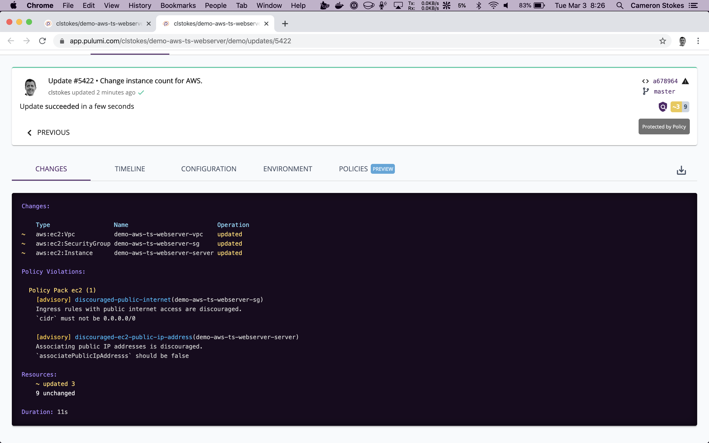

It's been a few months since we announced the Pulumi 2.0 roadmap and we've been hard at work ever since. The .NET and Go SDKs are more idiomatic and easier to use, Policy as Code is ready for prime-time, and many other useful features and foundational improvements have launched. As we get closer to Pulumi 2.0 GA, I wanted to take a moment to highlight these improvements. Please don't hold back on the feedback &mdash; we want to make sure 2.0 is the best it can be for you!

<!--more-->

## .NET

We're almost there for [our .NET SDK](). We recently tidied up the API surface area to feel more familiar to .NET developers, added C# getting started guides for [AWS](), [Azure](), [GCP](), and [Kubernetes](), and added many new examples. We also closed the gap on all Pulumi features missing from the initial release, including [aliases](), [transformations](), [StackReference](), and .NET versions of the [Kubernetes](https://github.com/pulumi/pulumi-kubernetes), [Docker](https://github.com/pulumi/pulumi-docker), and [Terraform remote state](https://github.com/pulumi/pulumi-terraform) packages.

The remaining areas to improve for 2.0 include making the API documentation available in C# (details ar below in the "still to come" section), migrating to .NET Core 3.1, and enabling you to more easily test your infrastructure using familiar C# tools.

## Go

We've overhauled [our Go SDK ]()to be more idiomatic and easier to use. The changes here are a major improvment as you can see [in this before/after PR](https://github.com/pulumi/examples/commit/b88f385a8951f81fe41cb4f40eb940b074e9263b#diff-07803f7bc3bff97871e6e3eea7287cb8). We previously used `map[string]interface{}` types in many places instead of properly-typed data structures. Not any more &mdash; now you get strong typing for all Go resource APIs across all providers, including AWS, Azure, GCP, and Kubernetes. Examples and documentation have been converted to this new style. [This blog post]() provides an overview of this new programming model approach.

Although we've had GoDoc support for some time now, we never linked to them! [Now we do.]() We've also added Go versions to our getting started guides for [AWS](), [Azure](), and [GCP](), and have many more improvements on the way.

There are a few core features still remaining to flesh out. The biggest one is retiring Dep in favor of Go modules everywhere. We are also adding support for aliases, transformations, and improved API projections, such as supporting union types. Finally, we'll be adding Go support for our Kubernetes, Docker, and Terraform remote state packages.

## Policy as Code

[CrossGuard, our Policy as Code framework](), is now ready to take for a serious test drive. This feature enables you to write policies in real code and enforce them during updates. Policies can check for anything, however common checks include security, compliance, cost management, and general and team best practices. You can write your own policy packages or use off-the-shelf policy packs like our own AWSGuard package.

CrossGuard is open source and the functionality is behind [the new `pulumi policy` command](), as well as [the new `--policy-pack` flag]() for the `preview` and `up` commands. You can use this on any edition of Pulumi, without restriction, including the offline backends.

If you choose to use CrossGuard with the Enterprise Edition of Pulumi, however, you'll get some added functionality. This includes server-side enforcement of policies and organizational policies, including "policy groups" which let you group and apply many policies together to your stacks, such as for instance applying different policies to production than development environments.

We recently added the ability to tag policy packs with a semantic version so that you can easily manage and apply packs using user-friendly versions instead of auto-generated numbers.

The remaining areas of focus between now and launch include:

* Enabling policy pack authoring in Python. Policies can already apply to stacks written in any language, no matter the language of the policy pack itself, but today policy packs are authored in Node.js. Python is coming soon and Go and .NET will follow afterward.

* Allowing policy packs to be configured. This will let you selectively enable or disable specific rules, and/or set configuration variables on them, that influence their behavior, on a per stack or policy group basis.

* Reference policy packs for AWS, Azure, GCP, and Kubernetes. These packs will be usable out-of-the-box with a collection of some of the most important configurable rules we've seen, in addition to being a starting point for creating your own packs.

[CrossGuard is ready to try today]() and [we've begun blogging about some example use cases]() that you may find interesting.

## Other Goodies

In addition to the major areas above, we've continued to ship many other improvements:

* [Stack export for the CLI and in the service](), enabling you to export any past version of a stack's state file. This is helpful for debugging, restoring or rolling back changes, or even just for historical reporting purposes.

* [Many other quality of life improvements in the Pulumi SaaS Console](), including stack tagging, grouping, and sorting; deep linking into CI/CD systems; infrastructure configuration pretty-printing; reverse stack membership lookups; performance improvements; and more.

* [Full audit logs for Pulumi Enterprise Edition](), enabling you to go back in time and figure out who, when, and why something about your organization, project, or stack changed.

* [Pulumi runtime mocking for infrastructure testing](https://github.com/pulumi/pulumi/pull/3738), developed in partnership with several of our customers leading the charge on "test driven infrastructure." Look for more end-to-end docs and guidance soon!

* [We've been slowly adding more and more providers and now have over 30 of them](), including Aiven, Cloudflare, Consul, Datadog, DigitalOcean, DNSimple, F5 BIG-IP, Fastly, GitLab, Kafka, Linode, MySQL, New Relic, Okta, Packet, PostgreSQL, RabbitMQ, SignalFX, Vault, and more.

## Goodies Still to Come

Our API docs are getting a major overhaul! This includes a more resource-oriented view which will make it much easier to navigate and find what you're looking for, including code samples. This will also bring all languages on equal footing in terms of how documentation is presented and coverage of code samples. Expect to see some of this land and evolve in the weeks to come.

We continue to make progress on our multi-language library sharing capabilities. These will enable us to bring your favorite packages like EKS and AWSX to new languages, including Python, C#, and Go, in addition to letting you write your own. This has entailed some gnarly engineering work but will [give you access to our EKS in Python](https://github.com/pulumi/pulumi-eks) to start.

Our [`tf2pulumi` tool](https://github.com/pulumi/tf2pulumi), which converts any Terraform HCL to Pulumi code, is currently getting a fresh coat of paint. This includes HCL2 support and Python code-generation.

We've made progress improving performance and have other improvements in the works. The changes already made include reducing overall network bandwidth used by an average update by 100x in some common cases and minimizing startup time. The net result is that you'll see fewer delays during updates and an overall snappier CLI experience.

## Next Steps

We appreciate all the feedback you've given us that is helping to make sure 2.0 is a major step function in overall features, quality, and capabilities. We're almost there, but it's not too late to let us know what you think. [Give Pulumi a try]() today, [drop into our Community Slack](https://slack.pulumi.com) to share your feedback, and make sure to [file any suggestions or improvements we can make on GitHub](https://github.com/pulumi/pulumi/issues/new).
