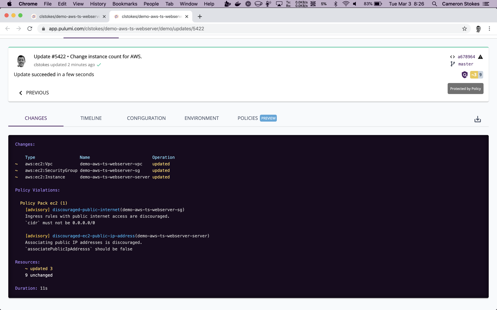

2020 is off to a big start for us! The .NET and Go SDKs are now more idiomatic and easier to use, Policy as Code is ready for prime-time, and many other useful features and foundational improvements have been released. I'd like to take a moment to highlight these improvements and ask for feedback &mdash; we want to make sure these new features work great for you!

<!--more-->

## .NET

[Our .NET SDK]() has come a long way. We recently tidied up the API surface area to feel more familiar to .NET developers, added C# getting started guides for [AWS](), [Azure](), [GCP](), and [Kubernetes](), and added many new examples. We also closed the gap on core Pulumi features missing from the initial release, including [aliases](), [transformations](), [StackReference](), and .NET versions of the [Kubernetes](https://github.com/pulumi/pulumi-kubernetes), [Docker](https://github.com/pulumi/pulumi-docker), and [Terraform remote state](https://github.com/pulumi/pulumi-terraform) packages.

The remaining areas to improve for the .NET SDK include making the API documentation available in C# (details are below in the "still to come" section), migrating to .NET Core 3.1, and enabling you to test your infrastructure using familiar C# tools more easily.

## Go

We completely overhauled [our Go SDK]() to be more idiomatic and easier to use. [This blog post]() provides an overview of this new programming model.

The major change in the Go SDK is that we previously used `map[string]interface{}` types in many places instead of properly-typed data structures. No more! Instead, you now get strong typing for all Go resource APIs across all providers, including AWS, Azure, GCP, and Kubernetes. The improvements here are huge, as you can see [in this before/after PR](https://github.com/pulumi/examples/commit/b88f385a8951f81fe41cb4f40eb940b074e9263b#diff-07803f7bc3bff97871e6e3eea7287cb8). Examples and documentation have been updated to this new style.

[GoDocs are now here]() for all of our providers and we've also added Go versions to our getting started guides for [AWS](), [Azure](), and [GCP](), and have many more improvements on the way.

We've also added support for core Pulumi features, including [aliases]() and [transformations](). A few remain to flesh out like adding Go support for our Kubernetes, Docker, and Terraform remote state packages. The biggest change to come is retiring Dep in favor of Go modules everywhere.

## Policy as Code

[CrossGuard, our Policy as Code framework](), is now ready to take for a serious test drive. CrossGuard lets you to write policies in real code and enforce them during updates. Policies can check for anything; however, common checks include security, compliance, cost management, and general and team best practices. You can write your policy packages or use off-the-shelf policy packs like our [AWSGuard]() package.

CrossGuard is open source and the functionality is behind [the new `pulumi policy` command](), as well as [the new `--policy-pack` flag]() for the `preview` and `up` commands. You can use these features with any edition of Pulumi, without restriction, including the offline backends.

If you choose to use CrossGuard with the Enterprise Edition of Pulumi, however, you'll get some added functionality. This includes server-side enforcement of policies and organizational policies, including "policy groups" which let you group and apply many policies together to your stacks, such as applying different policies to production than development environments.

We recently added the ability to tag policy packs with a semantic version so that you can easily manage and apply packs using user-friendly versions instead of auto-generated numbers.

The remaining areas of focus between now and launch include:

* Enabling policy pack authoring in Python. Policies can already apply to stacks written in any language, no matter the language of the policy pack itself, but today policy packs are authored in Node.js. Python is coming soon, with Go and .NET following afterward.

* Allowing policy packs to be configured. Configuring policy packs will let you selectively enable or disable specific rules, and/or set configuration variables on them that influence their behavior, on a per stack or policy group basis.

* Making reference policy packs available for AWS, Azure, GCP, and Kubernetes. These packs will be usable out-of-the-box with a collection of some of the most important configurable rules we've seen, in addition to being a starting point for creating your packs.

[CrossGuard is ready to try today](), and [we've begun blogging about some example use cases]() that you may find interesting.

## Other Goodies

In addition to the major areas above, we've continued to ship many other improvements. Here are some of our favorite ones:

* [Stack export for the CLI and in the service](), enabling you to export any past version of a stack's state file. This helps you debug, restore, or roll back changes, or even just for historical reporting purposes.

* [Many quality-of-life improvements in the Pulumi SaaS Console](), including stack tagging, grouping, and sorting; deep linking into CI/CD systems; infrastructure configuration pretty-printing; reverse stack membership lookups; performance improvements; and more.

* [Full audit logs for Pulumi Enterprise Edition]() enable you to go back in time and figure out who, when, and why something about your organization, project, or stack changed.

* [Pulumi runtime mocking for infrastructure testing](https://github.com/pulumi/pulumi/pull/3738), developed in partnership with several of our customers leading the charge on "test-driven infrastructure." Look for more end-to-end docs and guidance soon!

* [The ability to generate Kubernetes YAML]() gives you infrastructure authoring capabilities in your language of choice, while still letting you drive deployments using other YAML-based tools, such as `kubectl`.

* [We've been steadily adding more and more providers and now have over 30 of them](), including Aiven, Cloudflare, Consul, Datadog, DigitalOcean, DNSimple, F5 BIG-IP, Fastly, GitLab, Kafka, Linode, MySQL, New Relic, Okta, Packet, PostgreSQL, RabbitMQ, SignalFX, Vault, and more.

## Goodies Still to Come

Our API docs are getting a major overhaul! The new design uses a more resource-oriented view, which will make it much easier to navigate and find what you need. This will also ensure all languages are uniform in terms of how documentation is presented as well as coverage of code samples. Expect to see some of this land and evolve in the days to come.

We continue to make progress on our multi-language library architecture. This will enable us to bring your favorite packages like EKS and AWSX to new languages, including Python, C#, and Go, in addition to eventually letting you write your own. This has been a long journey as we figure out how to correctly build this capability, however we will be bringing [EKS](https://github.com/pulumi/pulumi-eks) to Python first.

Our [`tf2pulumi` tool](https://github.com/pulumi/tf2pulumi), which converts any Terraform HCL to Pulumi code, is currently getting a fresh coat of paint. Look for HCL2 support and Python code-generation soon.

We've made some significant performance improvements and have others still in the works. Recent changes have reduced overall network bandwidth used by an average update in some cases by 100x, as well as reducing startup times by multiple seconds. The net result is that you'll see fewer delays during updates and an overall snappier CLI experience.

## Next Steps

A lot of good work has already landed in 2020 &mdash; and there is a lot more on its way, including a few surprises!

We appreciate all the feedback you've given us that is helping to make sure our work in early 2020 is a major step function in overall features, quality, and capabilities. We're always looking for feedback so please let us know what you think. [Give Pulumi a try]() today, [drop into our Community Slack](https://slack.pulumi.com) to share your feedback, and make sure to [file any suggestions or improvements we can make on GitHub](https://github.com/pulumi/pulumi/issues/new).
