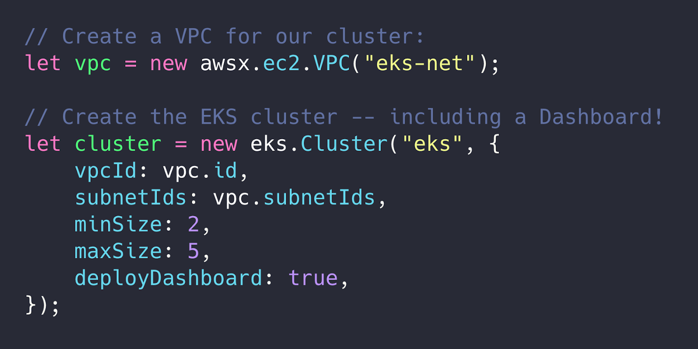
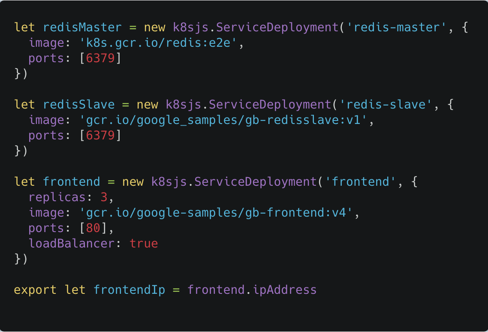
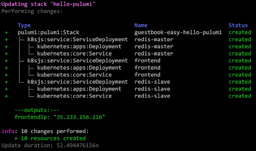
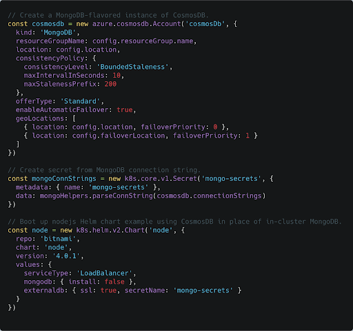
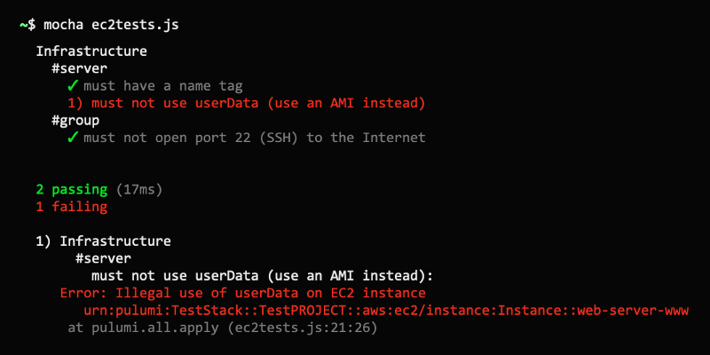

Kubernetes is a powerful container orchestrator that is being adopted
rapidly across the industry. At the same time, it is notoriously complex
and presents a steep learning curve for newcomers. Nobody likes
programming in YAML, and templates [make it even harder](https://github.com/helm/charts/blob/cb3dcd7f1e0e6a152d110bcb776523856468e670/stable/cert-manager/templates/deployment.yaml).
It's difficult to understand the state of the cluster --
[Did my deployment succeed]()?
Why isn't my app working? And we often need to manage hosted cloud
resources in addition to Kubernetes ones.

In this post, we will see how [Pulumi](/) can help you
tame these issues and make Kubernetes more accessible, using familiar
languages and your favorite tools. It's simply
[Kubernetes made easy]()!
<!--more-->

## Clusters as code

Pulumi can seamlessly manage multiple layers of your stack, from the raw
infrastructure to Kubernetes resources, and all the way up to
[serverless app]()
code. Rather than gluing together yet another set of tools, you can
[create managed Kubernetes clusters]()
with [GKE](https://github.com/pulumi/examples/tree/master/gcp-ts-gke),
[EKS]() or
[AKS]()
and then reference them directly in your Pulumi code!

## Apps as code (not YAML!)

Pulumi exposes the full API surface of Kubernetes as classes in your
SDK, so you can manage any k8s resource (including CRDs and related
CustomResources) in your Pulumi code. Stop [trying to work
around](https://ksonnet.io/) the [limitations of YAML](https://arp242.net/yaml-config.html) with
[templates](https://helm.sh/docs/chart_template_guide/#the-chart-template-developer-s-guide),
and reap the benefits of real software development practices:
[abstraction](),
conditionals, looping, library support,
[packaging](),
[testing](),
debugging, and more! From the obvious
([use variables to manage resource metadata]()),
to the more esoteric
([gate a canary deployment with Prometheus](),
Pulumi keeps the simple things simple, and makes the hard things possible.

## Integrate with existing Helm charts or manifests

Most projects aren't greenfield apps, and we know it's critical to
support an incremental transition when you switch tools. Our SDKs allow
you to import [Helm charts]()
and [YAML manifests]()
and then mix and match these resources within your Pulumi program. While
you can keep it simple and just import the resources, you have the full
power of a programming language at your disposal. Why fight with a
[complicated YAML templating scheme](https://helm.sh/docs/chart_template_guide/#the-chart-template-developer-s-guide)
when you can accomplish the same thing (and much more) with a real
programming language? Take advantage of 60 years of software engineering
know-how to
[make your deployments more reproducible]()
and maintainable.

## Make full use of your cloud

While you can run stateful workloads on Kubernetes using StatefulSets,
it's often better to use a managed service from your cloud provider.
Since Pulumi can [manage cloud resources as well as k8s resources]()
it's easy to bridge that gap! Try adding in a [managed database](https://github.com/pulumi/examples/tree/master/azure-ts-aks-mean),
[message queue]()
or [object store](https://github.com/pulumi/examples/tree/master/kubernetes-ts-s3-rollout),
and see how much simpler your k8s app can be. When your app is already
running in the cloud, think outside of k8s, and use the power of the
cloud! It's far easier to maintain an app at scale if you strategically
mix in managed cloud resources.

## Debugging failures

It can be daunting to troubleshoot failures in Kubernetes, especially
for new users. What happens after I run `kubectl apply`?
[Why is my app not working]()?
Even with a detailed guide to follow, it can feel like playing 20
questions with `kubectl` to get the answers you need. Pulumi's
Kubernetes provider includes [sophisticated logic]()
to [check resource readiness](),
and proactively surfaces errors during updates. With Pulumi, it's far
easier to understand the state of your k8s resources, and
[get the information you need]() to
make changes when something goes wrong.

## Integrating with CI/CD

Kubernetes uses an eventual consistency model that can be difficult to
integrate with CI/CD systems. How do you know when your application is
ready? Common workflows involve [scripting kubectl calls](https://kubernetes.io/docs/reference/kubectl/conventions/#using-kubectl-in-reusable-scripts)
and parsing JSON output in Bash. This approach is brittle, and the
process is a little different for every Kubernetes resource type.
Pulumi's [state reconciliation model]() is a
[natural fit for CI/CD systems](): review changes with a
preview, and then proceed with confidence once an update succeeds. This
is great for GitOps and [ChatOps]()
workflows. You don't have to be an expert on the inner workings of
Kubernetes to be productive with Pulumi.

Since you can [manage a full infrastructure stack]()
with Pulumi, you can
[create infrastructure on demand])
(k8s cluster, databases, networking, object storage, etc.), spin up your
application, run tests, and then tear the whole stack back down! This
saves you money and builds confidence that you can recover from disaster
scenarios.

## Learn more

If you'd like to learn about Pulumi and how to manage your
infrastructure and Kubernetes through code,
[click here to get started today](). Pulumi is open source and free to
use.

As always, you can check out our code on
[GitHub](https://github.com/pulumi), follow us on
[Twitter](https://twitter.com/pulumicorp), subscribe to our
[YouTube channel](https://www.youtube.com/channel/UC2Dhyn4Ev52YSbcpfnfP0Mw), or
join our [Community Slack](https://slack.pulumi.io/) channel if you have
any questions, need support, or just want to say hello.

If you'd like to chat with our team, or get hands-on assistance with
migrating your existing configuration code (including ksonnet programs)
to Pulumi, [please don't hesitate to drop us a line]().
