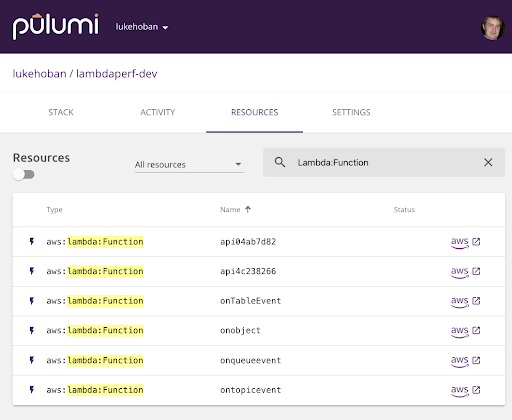
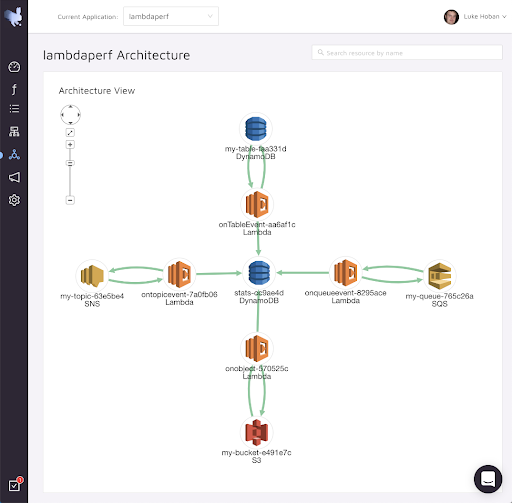
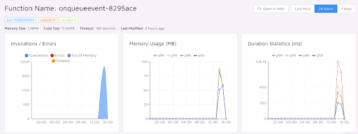
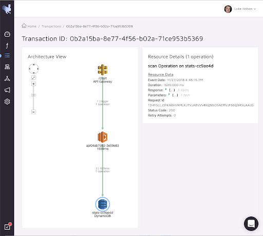

[Pulumi](/) makes it incredibly easy to use serverless
functions within your cloud infrastructure and applications - an AWS
Lambda is as simple as writing a JavaScript lambda!

    const bucket = new aws.s3.Bucket("my-bucket");
    bucket.onObjectCreated("onNewObject", async (ev) => console.log(ev));

By making it so easy to introduce serverless functions into cloud
infrastructure, Pulumi programs often incorporate many Lambdas, all
wired together as part of a larger set of infrastructure and application
code.
<!--more-->

[Epsagon is a serverless monitoring solution](https://epsagon.com/) that
lets users observe entire serverless applications composed of many
functions and other AWS infrastructure, instead of just looking at
individual functions one at a time. This is a great fit for Pulumi
applications!

Pulumi users can use the
[`@pulumi/epsagon`](https://www.npmjs.com/package/@pulumi/epsagon)
package to automatically get the benefits of Epsagon monitoring for all
of the serverless functions defined in their Pulumi applications. By
just adding two lines of code - every AWS Lambda created from a
JavaScript callback (like in the example above) will automatically get
instrumented with
[Epsagon's monitoring library](https://www.npmjs.com/package/epsagon).

    const epsagon = require("@pulumi/epsagon");
    epsagon.install(pulumi, { appName: "my-example" });

## Monitoring a Serverless Pulumi Application

I have a [small Pulumi application](https://github.com/lukehoban/lambdaperf) I used to compare
the latency of various Lambda event sources. In about 200 lines of code,
it does the following:

- Provisions required infrastructure for various AWS event sources
- Hooks up Lambda event handlers to this infrastructure
- Describes the code to run in those event handlers (using JavaScript
  callbacks)
- Creates shared infrastructure for storing test results, and uses it
  inside the event handlers (via a generic test harness)
- Creates and exposes a REST API for kicking off tests and viewing
  graphs of test results

Each test case looks like this (you can see more details in
[the README](https://github.com/lukehoban/lambdaperf)):

    // Test for SNS Topic
    const topic = new aws.sns.Topic("my-topic");
    function sendTopicValue(val: number) {
        return (new aws.sdk.SNS()).publish({
            TopicArn: topic.arn.get(),
            Message: val.toString(),
        }).promise();
    }
    const topicSubscription = topic.onEvent("ontopicevent", (ev, ctx) => {
        return harness("sns", Number(ev.Records[0].Sns.Message), sendTopicValue);
    });

All up, it creates 6 Lambda functions connected to a variety of event
sources.

I add the two lines of code above to add Epsagon, and set a config
secret for the Epsagon API token:

    pulumi config set –secret epsagon:token <my-epsagon-token>

Then, after kicking off a test using the REST API exposed by my Pulumi
application, I go over to the Epsagon console for my project to see what
happened. First, I can get a birds-eye view of my overall architecture.
This provides a great visualization of how my resources are related at
runtime. Each event source triggers a lambda attached to it, which both
triggers that same event source again, and also logs to a central
datastore that keeps track of statistics.

I can also drill in and see details about each piece of this, and what
performance looked like across all of these.

And finally, I can see what chain of events in my infrastructure led to
an operation occurring in DynamoDB - in this case, a REST API was
handled by a Lambda, which invoked a Table scan.

## Conclusion

Together, Pulumi and Epsagon make it easy to build truly serverless
applications -- not just a single Lambda, but a whole application made
up of many small event driven callbacks that run on-demand. Pulumi makes
it easy to author and deploy these kinds of architectures, and Epsagon
makes it easy to monitor them. Users get an application-centric view
across their full serverless application infrastructure.

Checkout the quickstart guides for [Pulumi]()
and [Epsagon](https://docs.epsagon.com/#/quick-start-guide) now!
