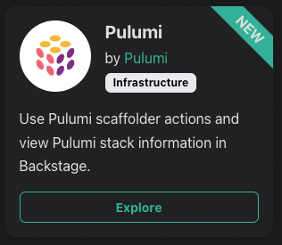
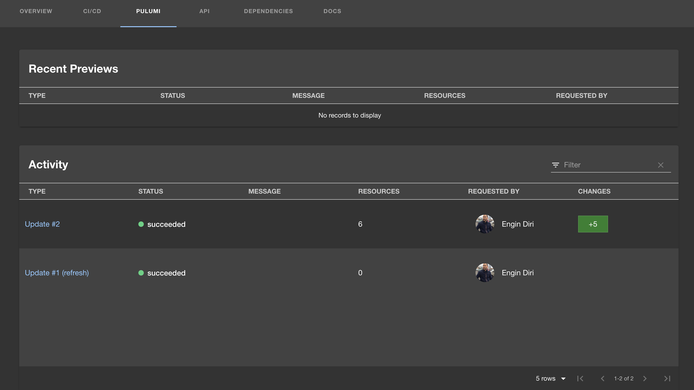
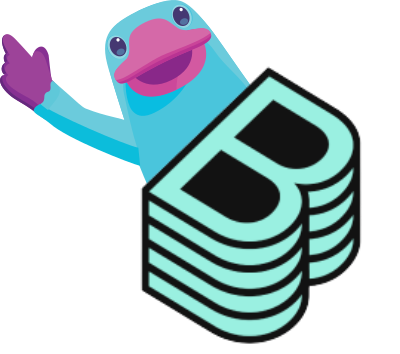
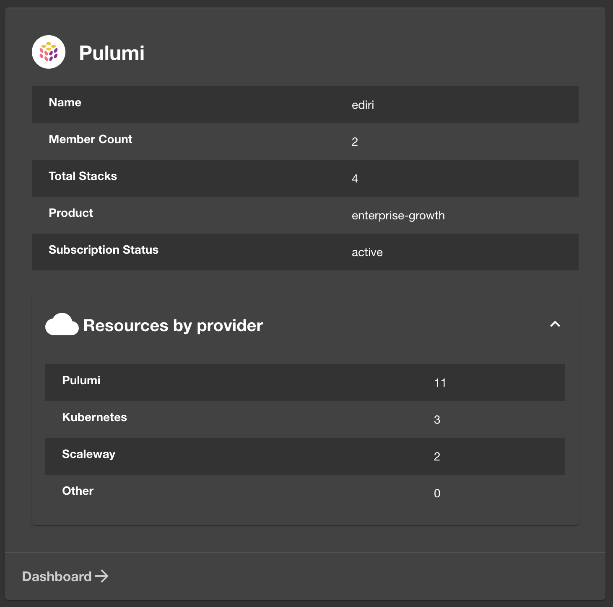
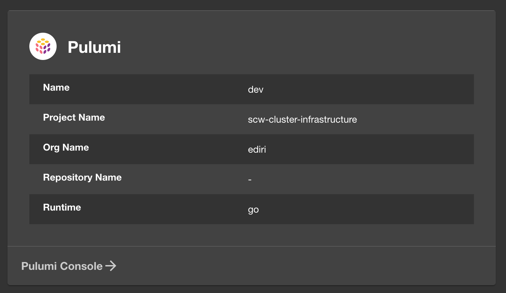

[Backstage](https://backstage.io/) is an open source framework for building developer portals, created at Spotify and donated to the CNCF. It allows engineers to create their own development portal internally. Backstage makes it easy for teams to create a unified portal for their infrastructure tooling, software templates, services, documentation and [plugins](https://backstage.spotify.com/plugins/) for external tools.

<!--more-->

## What are Backstage plugins?

Backstage plugins typically include functions from another application or platform and place them in context in Backstage. This adds functionality within the development environment and helps centralize critical developer functions. Backstage provides a marketplace where developers can review plugins and implement them into their own applications.

## Pulumi Joins the Stage

Today we are announcing a new [Pulumi Plugin](https://github.com/pulumi/pulumi-backstage-plugin) for [Backstage](https://backstage.io/). Using the Pulumi Backstage Plugin, you can create a new Pulumi project from an organization template stored in Pulumi, you can run previews and updates, and you can run and view Deployment.

## How to get started with the Pulumi Backstage Integration

The Pulumi Backstage integration has two independent components:

* Pulumi Scaffolder Backend Module
* Pulumi Backstage Plugin

## What is Scaffolding in Backstage?

The Backstage Scaffolder is a core part of the Backstage developer portal. Using standardized templates, developers can create new components (services, libraries, websites, or other software).  With a few clicks, developers can create new software projects provisioned with best practices, with code managed in the right repositories, and with the right configurations, all from a self-service UI.

## Pulumi Extends Backstage Scaffolding

The **Pulumi Scaffolder Backend Module** extends the scaffolding with two new actions: **pulumi:new and pulumi:up**

With the new **Pulumi Scaffolder Backend Module**, organizations can standardize infrastructure creation through their own custom templates. This enables a consistent approach for every new project while minimizing manual setup and configuration by developers and platform teams.

The next component of the Pulumi Backstage integration is the **Pulumi Plugin**. Backstage Plugins are extensions or add-ons to the core Backstage application that allow you to integrate additional tools, services, and functionalities into the platform, enhancing its capabilities and customizing it to meet the specific needs of your development environment.

The Pulumi plugin extends Backstage by displaying essential details like the Pulumi stack, organization, project name, and description, as well as providing an activity view with aggregated information from the Pulumi Cloud.

## Connecting Pulumi Cloud with Backstage with the Pulumi Backstage plugin

The Pulumi plugin extends Backstage by displaying essential details like the Pulumi stack, organization, project name, and description, as well as providing an activity view for the entity with aggregating information from the Pulumi Cloud.

Utilizing the **Pulumi Backstage** integration, including its plugin and scaffolder, brings forth many benefits that streamline infrastructure management, enhance developer experience, and foster a well-orchestrated DevOps culture. See the key benefits below.

## Key Benefits of the Pulumi Backstage Plugin

By integrating with Backstage, Pulumi is simplifying a common scenario that many of our users encounter: empowering developers to self-service new infrastructure while enforcing common standards and best prctices. A few benefits of this integration are:

**Consolidated View**: Obtain a singular view of your infrastructure and application status, merging Pulumi’s infrastructure-as-code (IaC) capabilities with the Backstage developer portal.

**Simplified Navigation**: Manage both applications and infrastructure from a single pane of glass - even for complex multi-cloud deployments.

**Transparent Communication**: Facilitate seamless communication across development, operations, and infrastructure teams by providing a shared view and management platform.

**Knowledge Sharing**: Enable teams to share infrastructure code, configurations, and status transparently, fostering collective knowledge and expertise.

**IaC Adoption**: Leverage Pulumi’s infrastructure-as-code capabilities to define, deploy, and manage infrastructure efficiently.

**Automated Scaffolding**: Utilize the Backstage scaffolder to automate the creation and management of Pulumi projects and stacks.

**Self-Service Operations**: Empower developers with the ability to provision, configure, and manage infrastructure independently, reducing dependencies on operations teams.

**Accelerated Development**: Enhance the speed and agility of development cycles by providing developers with the tools to manage their infrastructure needs autonomously.

**Standardized Workflows**: Employ consistent and standardized workflows for infrastructure provisioning and management across all development teams.

**Best Practices**: Promote the usage of best practices in infrastructure management and application deployment through pre-defined templates and configurations.

## How to Get the Pulumi Backstage Plugin

There are two ways to get the **Pulumi Backstage Plugin**:
First, if you are hosting Backstage yourself, you can find the plugin in our [GitHub repo](https://github.com/pulumi/pulumi-backstage-plugin).

Secondly, if you are using the [Roadie managed Backstage](https://roadie.io/) service, you can follow [these instructions](https://roadie.io/backstage/plugins/pulumi/) to use the Pulumi plugin with Roadie.

## Conclusion

The **Pulumi Backstage Plugin** brings simplicity and power to developers by combining Pulumi's infrastructure management with the user-friendly Backstage developer portal. It makes managing apps and infrastructure easy, all from one place, boosting teamwork and making developers' lives simpler. With straightforward tools and automated setups, developers can work faster and smarter, managing their projects with fewer hurdles and more clarity.

In short, it's not just a plugin; it's a step towards smoother, more integrated development workflows for everyone involved.
