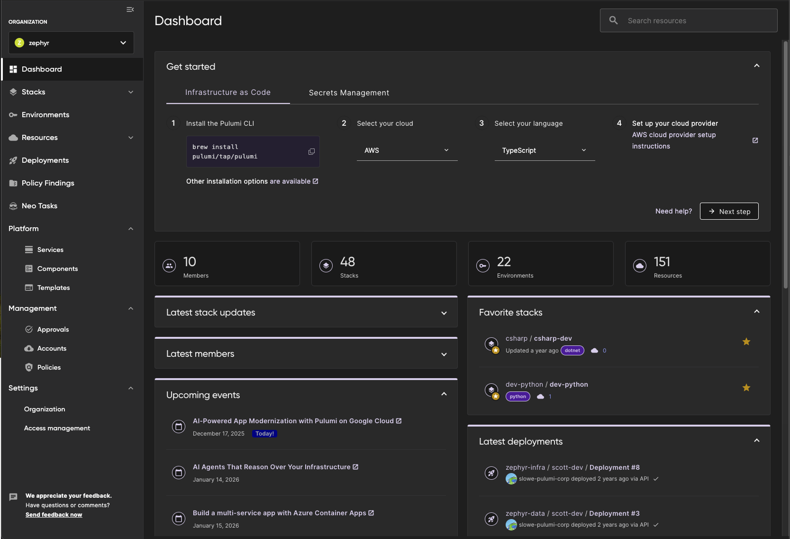
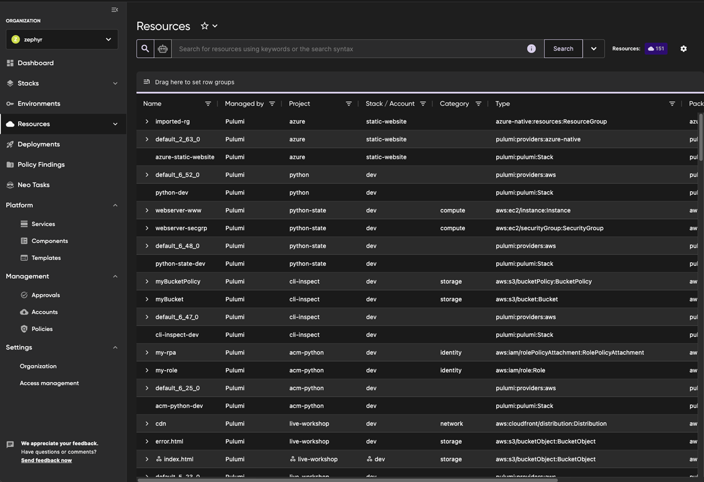
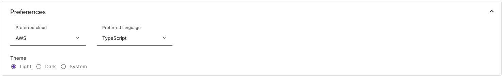

[Pulumi Cloud](/product/pulumi-cloud/) is the smartest and easiest way to automate, secure, and manage everything you run in the cloud. It stores infrastructure state, centralizes secrets management, provides search and clear visibility into all your clouds, runs remote deployments, integrates with CI/CD pipelines, and enforces security and compliance policies. Now, you can explore everything Pulumi Cloud has to offer using a dark theme.

<!--more-->
Dark mode allows you to opt into a theme that uses lighter text and graphics on a darker background.  You can also choose to keep the current theme, now known as light mode, or follow your system preferences.

For nearly as long as Pulumi Cloud has existed, users have been requesting a darker theme. Recent efforts from our User Experience team to implement a design system for the Cloud have finally enabled us to support theming across Pulumi Cloud.

Want to try dark mode out for yourself? [Sign in](https://app.pulumi.com) to your Pulumi Cloud account or if you are new to Pulumi, [create a free account](https://app.pulumi.com/signup).

## Update your default theme

To update your theme, navigate to your Account Settings by selecting your profile image at the top right of your browser window.  In the preferences section, you can select the theme of your choice.  Light mode will be selected by default if you do not update your preferences.  These preferences will affect your account's view of Pulumi Cloud for all organizations you are a member of.

## Try out Dark Mode today

We'd love for you to try out theming in Pulumi Cloud today!  Don't hesitate to reach out on the [Pulumi Community Slack](https://slack.pulumi.com/?_gl=1*abbv2y*_ga*MTgxNzE0MTI3LjE2NDM3MzcwNTU.*_ga_FQHG5CVY2D*MTY1NzY0ODc4NC4xMzMuMC4xNjU3NjQ4Nzg0LjYw) about any feedback you have about these changes or any and all things Pulumi! We also have a [public GitHub repo](https://github.com/pulumi/pulumi-cloud-requests/issues) to track any requests related to the Cloud.

We look forward to hearing what you think of these changes!
