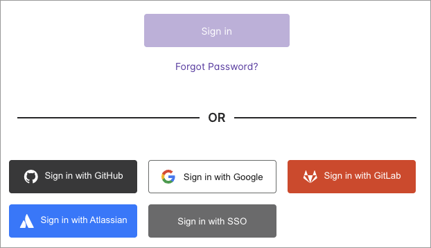
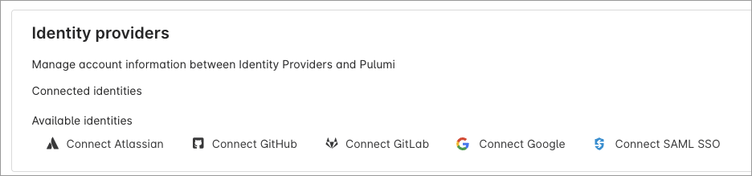

Many developers and platform engineers already use Google accounts daily for email, cloud console access, and collaboration. Until now, signing in to Pulumi Cloud required a [GitHub](https://github.com/), [GitLab](https://gitlab.com/), or [Atlassian](https://id.atlassian.com/) account, or an email/password combination. Today, we're adding Google as a first-class identity provider, so you can sign in to Pulumi Cloud with the same Google account you already use for everything else.

<!--more-->

## Why Google sign-in

Adding Google as an identity provider brings several benefits:

* Use the account you already have. If your team already lives in [Google Workspace](https://workspace.google.com/), you can sign in to Pulumi Cloud with a single click, no new credentials required.
* Inherit your existing security policies. If you've already configured two-factor authentication, device management, and other protections in a Google Workspace, you can carry them over to Pulumi Cloud automatically.

## How it works

### Signing up or signing in

On the Pulumi Cloud sign-in page, you'll see a new **Sign in with Google** button alongside the existing GitHub, GitLab, and Atlassian options. Select it, authenticate with your Google account, and you're in.

If you're a new user, Pulumi Cloud will create an account for you automatically using your Google profile information.

### Connecting Google to an existing account

If you already have a Pulumi Cloud account, you can link your Google identity from your account settings:

1. Navigate to your [Account Settings](https://app.pulumi.com/account/settings).
1. Scroll to the **Identity providers** section.
1. Under **Available identities**, select **Connect Google**.

Once connected, you can use Google to sign in to your existing Pulumi Cloud account.

### Google sign-in vs. SAML SSO

Google sign-in lets you authenticate with Pulumi Cloud using your individual Google account. It does not enable Google as a single sign-on (SSO) identity provider for your Pulumi Cloud organization.

If your team uses Google Workspace and needs centralized membership governance for Pulumi Cloud, configure [SAML SSO with Google Workspace](/docs/administration/access-identity/saml/gsuite/) instead. SAML SSO is available on Pulumi Enterprise and Business Critical editions.

## Get started

Google sign-in is available now for all new and existing Pulumi Cloud users:

- **New users**: [Sign up with Google](https://app.pulumi.com/signup) on the Pulumi Cloud sign-up page.
- **Existing users**: [Connect your Google account](https://app.pulumi.com/account/settings) in your account settings.

For more details, see the [Pulumi Cloud accounts documentation](/docs/administration/organizations-teams/accounts/).

We'd love to hear your feedback. Join the conversation in the [Pulumi Community Slack](https://slack.pulumi.com) or open an issue on [GitHub](https://github.com/pulumi/pulumi-cloud-requests/issues/new/choose).
