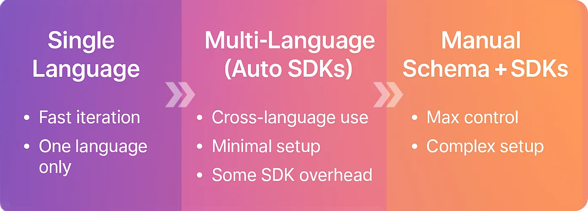

Pulumi Components enable you to create, share, and consume reusable infrastructure building blocks across your organization and the broader community. Today, we're excited to announce significant enhancements to Pulumi Components that make them more powerful, accessible, and easier to use than ever before.

<!--more-->

With this release, we've made it possible to author components in one language and consume them in any other Pulumi language—including Pulumi YAML. This breakthrough enables platform teams to build sophisticated infrastructure abstractions in their preferred programming language while application developers can easily consume these components using simpler interfaces or even YAML, all without sacrificing type safety or functionality.

For platform teams, the new Pulumi Components offer a more intuitive, more secure way to codify organizational standards. For developers, it's a straightforward way to pull in platform-approved abstractions without having to worry about all the underlying details. It's a win-win that drastically accelerates innovation and drives productivity across your teams.

## Understanding Pulumi Components

At their core, [Pulumi Components](/docs/iac/concepts/resources/components/) are logical groupings of resources that encapsulate infrastructure patterns and best practices. Unlike standard resources that map directly to cloud provider resources, components are higher-level abstractions that can contain multiple child resources working together to implement a specific capability. While similar in concept to Terraform modules, Pulumi Components offer more power through full programming language capabilities, stronger typing, and now, cross-language support.

For example, a `SecureBucket` component might include a bucket, versioning configuration, encryption settings, and tagging policies—all bundled together as a single, reusable unit that enforces your organization's security and compliance standards.

Pulumi has always supported creating components within a single language - you can simply create a class that extends `ComponentResource` in your language of choice and use it within programs written in that same language. This approach works well for teams working within a single language ecosystem, requiring no additional setup beyond standard programming patterns. However, these traditional single-language components can't be consumed from other Pulumi languages, limiting their shareability across teams with different language preferences.

## What's New with Pulumi Components

Our latest enhancements focus on making components more accessible and easier to share:

1. **Cross-language consumption**: Components authored in one language can now be consumed in any Pulumi language, now including Pulumi YAML.

2. **Simplified sharing**: Share components by simply pushing code to a git repository - no need to manually publish SDKs.

3. **Streamlined consumption**: Use the `pulumi package add` command with any git URL (like `github.com/org/repo`) to easily incorporate any components into your projects.

4. **YAML authoring support**: For the first time, you can now author components directly in YAML, making it easier for teams with limited programming experience to create and maintain reusable infrastructure patterns.

## How It Works

### Creating Components

The code for creating a [cross-language component](/docs/iac/using-pulumi/extending-pulumi/build-a-component/) starts similarly to a single-language component: define a class that extends `ComponentResource`:



{}

```typescript
import * as pulumi from "@pulumi/pulumi";
import * as aws from "@pulumi/aws";

export interface SecureBucketArgs {
    bucketName?: pulumi.Input<string>;
    versioning?: pulumi.Input<boolean>;
    encryption?: pulumi.Input<boolean>;
    tags?: { [key: string]: pulumi.Input<string> };
}

export class SecureBucket extends pulumi.ComponentResource {
    public readonly bucket: aws.s3.BucketV2;
    public readonly bucketName: pulumi.Output<string>;

    constructor(name: string, args: SecureBucketArgs = {}, opts?: pulumi.ComponentResourceOptions) {
        super("mycomponents:index:SecureBucket", name, {}, opts);

        // Create an S3 bucket with best practices by default
        this.bucket = new aws.s3.BucketV2(`${name}`, {
            bucket: args.bucketName,
            tags: {
                ManagedBy: "Pulumi",
                ...args.tags,
            },
        }, { parent: this });

        // Conditionally enable versioning
        if (args.versioning !== false) {
            new aws.s3.BucketVersioningV2(`${name}-versioning`, {
                bucket: this.bucket.id,
                versioningConfiguration: {
                    status: "Enabled",
                },
            }, { parent: this });
        }

        // Conditionally enable encryption
        if (args.encryption !== false) {
            new aws.s3.BucketServerSideEncryptionConfigurationV2(`${name}-encryption`, {
                bucket: this.bucket.id,
                rules: [{
                    applyServerSideEncryptionByDefault: {
                        sseAlgorithm: "AES256",
                    },
                }],
            }, { parent: this });
        }

        this.bucketName = this.bucket.id;

        this.registerOutputs({
            bucket: this.bucket,
            bucketName: this.bucketName,
        });
    }
}
```

{}

{}

```python
import pulumi
import pulumi_aws as aws
from typing import Optional, Dict, Any, Mapping

class SecureBucketArgs(TypedDict):
    bucket_name: Optional[pulumi.Input[str]]
    versioning: Optional[bool]
    encryption: Optional[bool]
    tags: Optional[Mapping[str, pulumi.Input[str]]]

class SecureBucket(pulumi.ComponentResource):
    bucket_name: pulumi.Output[str]
    def __init__(self, name: str, args: SecureBucketArgs, opts: Optional[pulumi.ResourceOptions] = None):
        super().__init__('mycomponents:index:SecureBucket', name, {}, opts)
        
        args = args or SecureBucketArgs()
        
        # Create an S3 bucket with best practices by default
        bucket = aws.s3.BucketV2(
            f"{name}",
            bucket=args.get("bucket_name"),
            tags={
                "ManagedBy": "Pulumi",
                **args.get("tags", {})
            },
            opts=pulumi.ResourceOptions(parent=self)
        )
        
        # Conditionally enable versioning
        if args.get("versioning", True):
            aws.s3.BucketVersioningV2(
                f"{name}-versioning",
                bucket=bucket.id,
                versioning_configuration=aws.s3.BucketVersioningV2VersioningConfigurationArgs(
                    status="Enabled"
                ),
                opts=pulumi.ResourceOptions(parent=self)
            )
            
        # Conditionally enable encryption
        if args.get("encryption", True):
            aws.s3.BucketServerSideEncryptionConfigurationV2(
                f"{name}-encryption",
                bucket=bucket.id,
                rules=[aws.s3.BucketServerSideEncryptionConfigurationV2RuleArgs(
                    apply_server_side_encryption_by_default=aws.s3.BucketServerSideEncryptionConfigurationV2RuleApplyServerSideEncryptionByDefaultArgs(
                        sse_algorithm="AES256"
                    )
                )],
                opts=pulumi.ResourceOptions(parent=self)
            )
            
        self.bucket_name = bucket.id
        
        self.register_outputs({
            "bucketName": self.bucket_name
        })
```

{}

{}

```csharp
using System.Collections.Generic;
using Pulumi;
using Pulumi.Aws.S3;
using Pulumi.Aws.S3.Inputs;

namespace MyComponents
{
    public class SecureBucketArgs : ResourceArgs
    {
        [Input("bucketName")]
        public Input<string>? BucketName { get; set; }

        [Input("versioning")]
        public bool? Versioning { get; set; }

        [Input("encryption")]
        public bool? Encryption { get; set; }

        [Input("tags")]
        public Dictionary<string, Input<string>>? Tags { get; set; }
    }

    public class SecureBucket : ComponentResource
    {
        [Output("bucketName")]
        public Output<string> BucketName { get; private set; }

        public SecureBucket(string name, SecureBucketArgs? args, ComponentResourceOptions? opts = null)
            : base("mycomponents:index:SecureBucket", name, opts)
        {
            args ??= new SecureBucketArgs();
            
            // Create an S3 bucket with best practices by default
            var tags = new InputMap<string>
            {
                { "ManagedBy", "Pulumi" }
            };
            
            if (args.Tags != null)
            {
                foreach (var tag in args.Tags)
                {
                    tags[tag.Key] = tag.Value;
                }
            }

            var bucket = new BucketV2($"{name}", new BucketV2Args
            {
                Bucket = args.BucketName,
                Tags = tags
            }, new CustomResourceOptions { Parent = this });

            // Conditionally enable versioning
            if (args.Versioning != false)
            {
                new BucketVersioningV2($"{name}-versioning", new BucketVersioningV2Args
                {
                    Bucket = bucket.Id,
                    VersioningConfiguration = new BucketVersioningV2VersioningConfigurationArgs
                    {
                        Status = "Enabled"
                    }
                }, new CustomResourceOptions { Parent = this });
            }

            // Conditionally enable encryption
            if (args.Encryption != false)
            {
                new BucketServerSideEncryptionConfigurationV2($"{name}-encryption", new BucketServerSideEncryptionConfigurationV2Args
                {
                    Bucket = bucket.Id,
                    Rules = new[]
                    {
                        new BucketServerSideEncryptionConfigurationV2RuleArgs
                        {
                            ApplyServerSideEncryptionByDefault = new BucketServerSideEncryptionConfigurationV2RuleApplyServerSideEncryptionByDefaultArgs
                            {
                                SseAlgorithm = "AES256"
                            }
                        }
                    }
                }, new CustomResourceOptions { Parent = this });
            }

            BucketName = bucket.Id;

            RegisterOutputs(new Dictionary<string, object?>
            {
                { "BucketName", BucketName }
            });
        }
    }
}
```

{}

{}

```go
package components

import (
	"github.com/pulumi/pulumi-aws/sdk/v6/go/aws/s3"
	"github.com/pulumi/pulumi/sdk/v3/go/pulumi"
)

// SecureBucketArgs contains the arguments for creating a SecureBucket
type SecureBucketArgs struct {
	BucketName pulumi.StringInput            `pulumi:"bucketName,optional"`
	Versioning *bool                         `pulumi:"versioning,optional"`
	Encryption *bool                         `pulumi:"encryption,optional"`
	Tags       map[string]pulumi.StringInput `pulumi:"tags,optional"`
}

// SecureBucket is a component that creates an S3 bucket with security best practices
type SecureBucket struct {
	pulumi.ResourceState

	BucketName pulumi.StringOutput `pulumi:"bucketName"`
}

// NewSecureBucket creates a new SecureBucket component
func NewSecureBucket(ctx *pulumi.Context, name string, args SecureBucketArgs, opts ...pulumi.ResourceOption) (*SecureBucket, error) {
	component := &SecureBucket{}
	err := ctx.RegisterComponentResource("mycomponents:index:SecureBucket", name, component, opts...)
	if err != nil {
		return nil, err
	}

	// Create an S3 bucket with best practices by default
	tags := pulumi.StringMap{
		"ManagedBy": pulumi.String("Pulumi"),
	}
	if args.Tags != nil {
		for k, v := range args.Tags {
			tags[k] = v
		}
	}

	bucket, err := s3.NewBucketV2(ctx, name, &s3.BucketV2Args{
		Bucket: args.BucketName,
		Tags:   tags,
	}, pulumi.Parent(component))
	if err != nil {
		return nil, err
	}

	// Conditionally enable versioning
	if args.Versioning != nil && !*args.Versioning {
		// Skip versioning
	} else {
		_, err = s3.NewBucketVersioningV2(ctx, name+"-versioning", &s3.BucketVersioningV2Args{
			Bucket: bucket.ID(),
			VersioningConfiguration: &s3.BucketVersioningV2VersioningConfigurationArgs{
				Status: pulumi.String("Enabled"),
			},
		}, pulumi.Parent(component))
		if err != nil {
			return nil, err
		}
	}

	// Conditionally enable encryption
	if args.Encryption != nil && !*args.Encryption {
		// Skip encryption
	} else {
		_, err = s3.NewBucketServerSideEncryptionConfigurationV2(ctx, name+"-encryption", &s3.BucketServerSideEncryptionConfigurationV2Args{
			Bucket: bucket.ID(),
			Rules: s3.BucketServerSideEncryptionConfigurationV2RuleArray{
				&s3.BucketServerSideEncryptionConfigurationV2RuleArgs{
					ApplyServerSideEncryptionByDefault: &s3.BucketServerSideEncryptionConfigurationV2RuleApplyServerSideEncryptionByDefaultArgs{
						SseAlgorithm: pulumi.String("AES256"),
					},
				},
			},
		}, pulumi.Parent(component))
		if err != nil {
			return nil, err
		}
	}

	component.BucketName = bucket.ID().ToStringOutput()
	return component, nil
}

```

{}

{}

```java
package io.mikhail.components;

import com.pulumi.core.Output;
import com.pulumi.aws.s3.BucketV2;
import com.pulumi.aws.s3.BucketV2Args;
import com.pulumi.aws.s3.BucketVersioningV2;
import com.pulumi.aws.s3.BucketVersioningV2Args;
import com.pulumi.aws.s3.inputs.BucketVersioningV2VersioningConfigurationArgs;
import com.pulumi.aws.s3.BucketServerSideEncryptionConfigurationV2;
import com.pulumi.aws.s3.BucketServerSideEncryptionConfigurationV2Args;
import com.pulumi.aws.s3.inputs.BucketServerSideEncryptionConfigurationV2RuleArgs;
import com.pulumi.aws.s3.inputs.BucketServerSideEncryptionConfigurationV2RuleApplyServerSideEncryptionByDefaultArgs;
import com.pulumi.resources.ComponentResource;
import com.pulumi.resources.ComponentResourceOptions;
import com.pulumi.resources.CustomResourceOptions;
import com.pulumi.core.annotations.Export;
import java.util.Map;
import java.util.HashMap;
import java.util.List;

public class SecureBucket extends ComponentResource {
    @Export
    public final Output<String> bucketName;

    public SecureBucket(String name, SecureBucketArgs args, ComponentResourceOptions options) {
        super("mycomponents:index:SecureBucket", name, options);

        // Create an S3 bucket with best practices by default
        Map<String, Output<String>> tags = new HashMap<>();
        tags.put("ManagedBy", Output.of("Pulumi"));
        if (args.tags() != null && !args.tags().isEmpty()) {
            tags.putAll(args.tags());
        }

        var bucket = new BucketV2(name, BucketV2Args.builder()
                .bucket(args.bucketName())
                //.tags(tags)
                .build(),
                CustomResourceOptions.builder().parent(this).build());

        // Conditionally enable versioning
        if (args.versioning() != Boolean.FALSE) {
            new BucketVersioningV2(name + "-versioning", BucketVersioningV2Args.builder()
                    .bucket(bucket.id())
                    .versioningConfiguration(BucketVersioningV2VersioningConfigurationArgs.builder()
                            .status("Enabled")
                            .build())
                    .build(),
                    CustomResourceOptions.builder().parent(this).build());
        }

        // Conditionally enable encryption
        if (args.encryption() != Boolean.FALSE) {
            new BucketServerSideEncryptionConfigurationV2(name + "-encryption", 
                    BucketServerSideEncryptionConfigurationV2Args.builder()
                            .bucket(bucket.id())
                            .rules(List.of(BucketServerSideEncryptionConfigurationV2RuleArgs.builder()
                                    .applyServerSideEncryptionByDefault(
                                            BucketServerSideEncryptionConfigurationV2RuleApplyServerSideEncryptionByDefaultArgs.builder()
                                                    .sseAlgorithm("AES256")
                                                    .build())
                                    .build()))
                            .build(),
                    CustomResourceOptions.builder().parent(this).build());
        }

        this.bucketName = bucket.id();

        this.registerOutputs(Map.of(
                "bucketName", this.bucketName
        ));
    }
}
```

```java
package io.mikhail.components;

import com.pulumi.core.Output;
import com.pulumi.resources.ResourceArgs;
import com.pulumi.core.annotations.Import;

import java.util.Map;
import java.util.HashMap;

public class SecureBucketArgs extends ResourceArgs {
    @Import(name="bucketName")
    private Output<String> bucketName;

    public Output<String> bucketName() {
        return this.bucketName;
    }

    @Import(name="versioning")
    private Boolean versioning;

    public Boolean versioning() {   
        return this.versioning;
    }

    @Import(name="encryption")
    private Boolean encryption;

    public Boolean encryption() {
        return this.encryption;
    }

    @Import(name="tags")
    private Map<String, Output<String>> tags = new HashMap<>();

    public Map<String, Output<String>> tags() {
        return this.tags;
    }

    private SecureBucketArgs() {}

    public SecureBucketArgs(Output<String> bucketName, Boolean versioning, Boolean encryption, Map<String, Output<String>> tags) {
        this.bucketName = bucketName;
        this.versioning = versioning;
        this.encryption = encryption;
        this.tags = tags;
    }
}
```

{}

{}

```yaml
# YAML doesn't directly support authoring complex components
# For a complete component, you'd typically write it in another language
# This is a simplified component without conditionals or tags merges
runtime: yaml
name: my-components
components:
  SecureBucket:
    inputs:
      bucketName:
        type: string
    resources:
      bucket:
        type: aws:s3/bucketV2:BucketV2
        properties:
          bucket: ${bucketName}
          tags:
            ManagedBy: Pulumi

      bucketVersioning:
        type: aws:s3/bucketVersioningV2:BucketVersioningV2
        properties:
          bucket: ${bucket.id}
          versioningConfiguration:
            status: Enabled

      bucketEncryption:
        type: aws:s3/bucketServerSideEncryptionConfigurationV2:BucketServerSideEncryptionConfigurationV2
        properties:
          bucket: ${bucket.id}
          rules:
            - applyServerSideEncryptionByDefault:
                sseAlgorithm: AES256

    outputs:
      bucketName: ${bucket.id}
```

{}



This file tells Pulumi that this directory is a component package that can be consumed across languages (it is not required for a single language component), rather than a standard Pulumi program. In it, you define the language runtime needed to load the plugin:



{}

```yaml
runtime: nodejs
```

{}

{}

```yaml
runtime: python
```

{}

{}

```yaml
runtime: dotnet
```

{}

{}

```yaml
runtime: go
```

{}

{}

```yaml
runtime: java
```

{}

{}

```yaml
runtime: yaml
```

{}



For other languages, you'd use the appropriate runtime value. This file is the key that enables Pulumi to generate SDKs in other languages from your component code.

### Define an Entry Point

The entrypoint analyzes components to automatically build a schema, and interact with the Pulumi engine to mange the component lifecycle.



{}

Not required for TypeScript.

{}
{}

1. Create a `_main_.py` file in your component directory
2. In the `main` function, add a call to `component_provider_host`, specifying a list of components for the `components` argument

```python
from pulumi.provider.experimental import Metadata, component_provider_host
from staticpage import MyComponent

if __name__ == "__main__":
    component_provider_host(name="python-components", components=[MyComponent])
```

{}
{}

1. Define a `main.go` file
2. Declare an instance of `NewProviderBuilder`,  passing in a name, namespace and the components being built

```go
package main

import (
    "github.com/pulumi/pulumi-go-provider/infer"
)

func main() {
    err := infer.NewProviderBuilder().
            WithName("go-components").
            WithNamespace("your-org-name").
            WithComponents(
                infer.Component(MyComponent),
            ).
            BuildAndRun()

    if err != nil {
        panic(err)
    }
}
```

{}
{}

1. Create a `Program.cs` file
2. Add an entry point that calls the `ComponentProviderHost`

```csharp
using System.Threading.Tasks;

class Program
{
    public static Task Main(string []args) =>
        Pulumi.Experimental.Provider.ComponentProviderHost.Serve(args);
}
```

{}
{}

1. Create an `App.java` file
2. Create a new instance of `ComponentProviderHost` in the entry point

```java
package com.example.components;

import java.io.IOException;
import com.pulumi.provider.internal.Metadata;
import com.pulumi.provider.internal.ComponentProviderHost;

public class App {
    public static void main(String[] args) throws IOException, InterruptedException {
        new ComponentProviderHost("java-components", App.class.getPackage()).start(args);
    }
}
```

{}



### Sharing Components

Pulumi Components new capability is designed to make sharing infrastructure building blocks as easy as possible, whether you're publishing them to a Git repository or referencing them from a local folder in a monorepo.

#### Publishing to Git

Once you've authored your component, sharing it is as simple as pushing your code to a Git repository and optionally tagging a release. From there, anyone (including you) can pull it down and use it in their own Pulumi projects.

For example, after pushing your SecureBucket to GitHub and tagging it as v1.0.0, others can consume it by running:

```bash
pulumi package add github.com/myorg/secure-s3-component@v1.0.0
```

Under the hood, Pulumi:

1. Fetches your code from GitHub
2. Auto-generates a local SDK from the component's schema
3. Makes it available to your Pulumi program in your chosen language

#### Referencing Components Locally

For scenarios like monorepos, rapid development iterations, or when you're working with components that don't need to be published to a repository, you can reference local source code directly:

```bash
pulumi package add ./components/secure-s3-component
```

Pulumi will identify the folder as a Pulumi component project, generate a local SDK, and make it available for import in your program—even if your consumer program is in a different language. Both relative paths (as shown above) and absolute paths (like /path/to/local/secure-s3-component) are supported, giving you flexibility for different project layouts.

### Consuming Components Across Languages

The real power comes in how these components can now be consumed in any Pulumi language:



{}

```typescript
import * as pulumi from "@pulumi/pulumi";
import { SecureBucket } from "@myorg/secure-s3-component";

const secureBucket = new SecureBucket("my-secure-bucket", {
    bucketName: "my-company-secure-assets",
    tags: {
        Environment: "production",
        Department: "engineering",
    },
});

export const bucketName = secureBucket.bucketName;
```

{}

{}

```python
import pulumi
from myorg_secure_s3_component import SecureBucket

secure_bucket = SecureBucket("my-secure-bucket",
    bucket_name="my-company-secure-assets",
    tags={
        "Environment": "production",
        "Department": "engineering",
    })

pulumi.export("bucket_name", secure_bucket.bucket_name)
```

{}

{}

```csharp
using System.Collections.Generic;
using Pulumi;
using MyOrg.SecureS3Component;

return await Deployment.RunAsync(() =>
{
    var tags = new Dictionary<string, string>
    {
        { "Environment", "production" },
        { "Department", "engineering" }
    };
    
    var secureBucket = new SecureBucket("my-secure-bucket", new SecureBucketArgs
    {
        bucketName = "my-company-secure-assets",
        Tags = tags
    });

    // Export the bucket name
    return new Dictionary<string, object?>
    {
        ["BucketName"] = secureBucket.BucketName
    };
});
```

{}

{}

```go
package main

import (
	"github.com/pulumi/pulumi/sdk/v3/go/pulumi"
	secure "github.com/myorg/secure-s3-component/sdk/go/secure-s3-component"
)

func main() {
	pulumi.Run(func(ctx *pulumi.Context) error {
		tags := make(map[string]string)
		tags["Environment"] = "production"
		tags["Department"] = "engineering"
		
		secureBucket, err := secure.NewSecureBucket(ctx, "my-secure-bucket", &secure.SecureBucketArgs{
			BucketName: pulumi.String("my-company-secure-assets"),
			Tags:       pulumi.ToStringMap(tags),
		})
		if err != nil {
			return err
		}
		
		ctx.Export("bucketName", secureBucket.BucketName)
		return nil
	})
}
```

{}

{}

```java
package mypackage;

import com.pulumi.Pulumi;
import com.pulumi.core.Output;
import com.myorg.secures3component.SecureBucket;
import com.myorg.secures3component.SecureBucketArgs;

import java.util.Map;

public class App {
    public static void main(String[] args) {
        Pulumi.run(ctx -> {
            var tags = Map.of(
                "Environment", "production",
                "Department", "engineering"
            );
            
            var bucketArgs = SecureBucketArgs.builder()
                .bucketName("my-company-secure-assets")
                .tags(tags)
                .build();
                
            var secureBucket = new SecureBucket("my-secure-bucket", bucketArgs);
            
            ctx.export("bucketName", secureBucket.bucketName());
        });
    }
}
```

{}

{}

```yaml
name: my-infrastructure
runtime: yaml
description: A stack that uses SecureBucket component

packages:
  secure-s3-component: github.com/myorg/secure-s3-component@v1.0.0
  
resources:
  secureBucket:
    type: secure-s3-component:SecureBucket
    properties:
      bucketName: my-company-secure-assets
      tags:
        Environment: production
        Department: engineering

outputs:
  bucketName: ${secureBucket.bucketName}
```

{}



## See It In Action

Check out this video of authoring components in Java and consuming them in YAML to see Pulumi Components in action:



## Pro Tips

- **Tagging Releases**: If you're working with Git-based components, you can tag version releases (both stable and preview versions). This ensures downstream users can easily choose specific versions without chasing a moving target.

- **Managing Dependencies**: Once you've added an entry to the `packages` section of your Pulumi.yaml file, you can run `pulumi install` to generate a local SDK in your project. This command will process all packages listed in your Pulumi.yaml and create the necessary SDK files. Check in these files if you want fully reproducible builds; or add them to `.gitignore` if you prefer to regenerate them on each checkout. When using `.gitignore`, team members will need to run `pulumi install` after checkout to regenerate the SDK.

- **Leveraging Private Repos**: If you need to keep your components private, you can still point to a Git source in a private repository. Just make sure the correct access tokens are set in the environment [as described in our package management documentation](/docs/iac/using-pulumi/extending-pulumi/build-a-component/#sharing-via-git).

## The Spectrum of Pulumi Components You Can Build



You can use Pulumi Components with more flexibility and control depending on your use case. This table shows the variety of use cases:

| Feature | Single language | Multi-language with Auto-Generated SDKs | Manual Schema and SDKs |
|---------|--------------------------|-------------------------------------------|--------------------------|
| **Best for** | Quick development within a single language ecosystem | Cross-language teams needing to share components | More flexibility and control needed or strict API requirements |
| **Cross-language consumption** | No - limited to original language | Yes - consume in any Pulumi language | Yes - consume in any Pulumi language |
| **Setup complexity** | Minimal - standard programming patterns | Minimal - just requires package management | High - requires schema authoring and validation |
| **Development workflow** | Fast iteration with direct code changes | Fast, requires SDK regeneration when component changes | Complex with schema updates and SDK publishing |
| **API control** | Full control within your language | Moderate - auto-generated from source | Full - ship the same interface to all consumers |
| **Version management** | Simple - standard code versioning | Moderate - requires careful API changes | Complex - strict semantic versioning needed |
| **Typical user** | Individual developers or same-language teams | Platform teams sharing with developers | Enterprise teams with strict requirements or package publishers |
| **Ideal use cases** | • Rapid prototyping<br>• Single team projects<br>• Simple components | • Organization-wide libraries<br>• Platform engineering<br>• Multi-language environments | • Published packages<br>• Complex validation needs |
| **Limitations** | • Single language only<br>• No additional setup required | • SDK regeneration overhead<br>• Runtime dependencies<br>• Some translation limitations | • Complex setup<br>• Steep learning curve<br>• Slower iteration |

## Conclusion

The ability to author components in one language and consume them in any other Pulumi language—including YAML—provides unprecedented flexibility and collaboration opportunities between platform teams and application developers.

To learn more about Pulumi Components, check out our documentation on [components](/docs/iac/concepts/resources/components/), [building a component](/docs/iac/using-pulumi/extending-pulumi/build-a-component/), [packaging and publishing components](/docs/iac/using-pulumi/extending-pulumi/publishing-packages/), and [component schemas](/docs/iac/using-pulumi/extending-pulumi/schema/).

We're excited to see what you build with Pulumi Components! Share your feedback with us on the [Pulumi Community Slack](https://slack.pulumi.com/) or open an issue in the [pulumi/pulumi GitHub repository](https://github.com/pulumi/pulumi).
