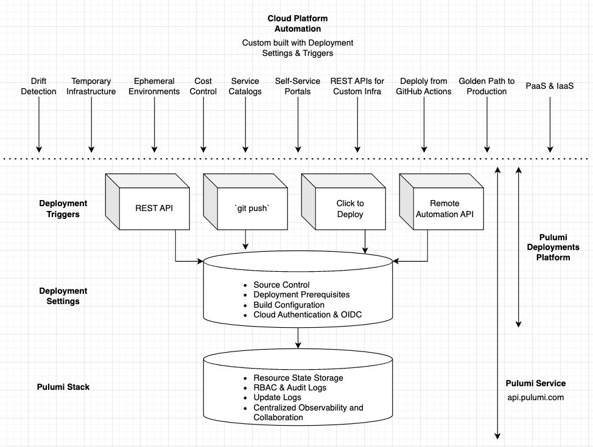
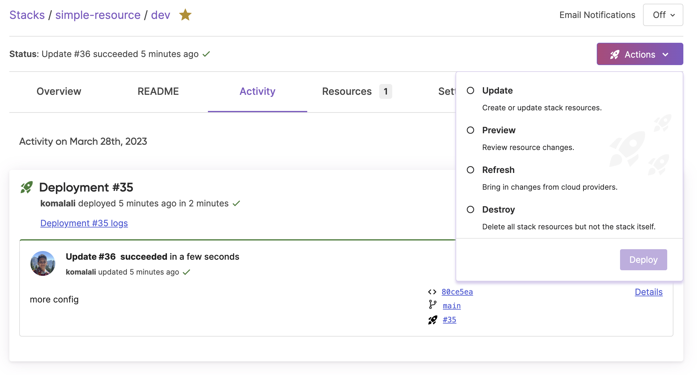

Delivering software has been conventionally driven by CI/CD workflows. A single commit is merged into a codebase, and a small, and static set of workflow runs are triggered by the CI system to update the appropriate environments (Dev -> Staging -> Production). This may have been fine when the only product a company had to offer was a single stateless web service, but increasingly companies are called upon to deliver cloud infrastructure as a product.

There are obvious forms of this, such as IaaS companies building database-as-a-service offerings and SaaS companies deploying self-hosted installations into customer environments. But there are less apparent forms like internal platform teams that are chartered with enabling self-service of Kubernetes clusters configured with best practices to thousands of application engineers within an enterprise. In any of these cases, engineers are delivering infrastructure as the product but only have conventional tools like gitops and CI/CD to reach for.

The assumptions that CI/CD systems make are limiting for infrastructure. We are not pushing a single application commit across three environments. We are templating infrastructure hundreds and thousands of times. Once that infrastructure is templated, we’re responsible for ensuring it is secure, up-to-date, and can be customized by self-service users. CI/CD is a poor fit due to the design choices that are locked in around source control and source events. CI/CD is typically configured via templated YAML that is checked into source control, with no way to create or customize behavior dynamically from a REST API. And beyond configuration, there aren’t REST APIs for triggering updates and workflow runs. The best you can expect is the ability to add more YAML to configure a cron job. What do you do if you need to create a self-service platform, or configure CI/CD across thousands of projects across your organization?

Today we’re excited to announce the release of a new version of Pulumi Deployments, a fully managed platform for shipping infrastructure at scale. It provides:

- **Compute** - run infrastructure deployments and workloads (i.e. `pulumi up`) on fully managed, secure, and elastic compute.
- **Configuration** - A simple, centralized format for specifying everything you need to deploy your infrastructure at the stack level. Source code, cloud credentials, OpenID Connect (OIDC), environment variables, build prerequisites, and dependencies are bundled in an atomic unit.
- **Composition** - Trigger deployments via our REST API, click to deploy in the Pulumi Service UI, Git Push to Deploy, Remote Automation API, and other programmatic building blocks that you can compose to build custom cloud automation.



Pulumi Deployments is built on top of a powerful set of public REST APIs. Unlike any other platform, Deployments lets you configure CI/CD settings programmatically. Service-catalog scenarios and guard rails that enforce CI/CD best practices across thousands of projects are far easier to achieve when you have REST APIs that you can build software on top of. No more generating and templating YAML to configure infrastructure deployments at scale.

## Deployment Settings and Triggers

Deployments can be configured at a stack level via Deployment Settings in three ways:

1. **The Pulumi Service UI** enables setting up OIDC and `git push` to deploy in just a few clicks
2. **[The Pulumi Service Provider](https://github.com/pulumi/pulumi-pulumiservice)** lets you define deployment configuration as Pulumi code in you language of choice, reviewed and managed in source control.
3. **The Deployment Settings REST API** provides programmatic access to configure Deployments and CI/CD dynamically, without needing to generate or check in YAML.

```ts
import * as pulumi from "@pulumi/pulumi";
import * as service from "@pulumi/pulumiservice";

const config = new pulumi.Config();

// deployment settings configured via a pulumi program
const settings = new service.DeploymentSettings("deployment_settings", {
    organization: "service-provider-test-org",
    project: "test-deployment-settings-proj",
    stack: "dev",
    operationContext: {
        environmentVariables: {
            TEST_VAR: "foo",
            SECRET_VAR: config.requireSecret("my_secret"),
        }
    },
    sourceContext: {
        git: {
            repoUrl: "https://github.com/pulumi/deploy-demos.git",
            branch: "refs/heads/main",
            repoDir: "pulumi-programs/simple-resource"
        }
    }
});
```

Each stack configured with Pulumi Deployments gets access to a number of triggers that can be used to start a Pulumi operation (i.e. `pulumi up`):

1. **Deployments REST API** - an endpoint available at api.pulumi.com that can trigger a variety of pulumi (`up/destroy/refresh/preview`) operations. Calls to this trigger can override individual settings to customize deployment behavior (i.e. - deploy a different branch, or override a particular environment variable).
2. **`git push` to Deploy** - Deep integration with the Pulumi GitHub App that enables automatic previews on every pull request, and an automated update whenever code is pushed to the target branch.
3. **Click to Deploy** - trigger a deployment from the Pulumi Service Console with the push of a button. Very useful for day-to-day operational activities such as debugging a stuck stack, or rectifying drift via a refresh without having to pull a stack and its accompanying source code onto your machine.
4. **[Remote Automation API](https://github.com/pulumi/automation-api-examples)** - Your favorite strongly typed Pulumi orchestration tool, Automation API, lets you offload update workloads into the cloud. Write deployment scripts that update thousands of environments simultaneously without worrying about compute.

You can mix, match, and compose Deployment Settings and Triggers to create a golden path to production that is perfect for your enterprise’s needs.

## Example: Building RESTful Infrastructure APIs

Increasingly, infrastructure updates happen in response to user action and not source control events like a git commit. For instance, a SaaS database company might need to spin up dedicated compute and storage when a customer puts in a credit card and self-serves onto a specific SKU. This signup workflow might happen hundreds or even thousands of times an hour. Traditional deployment systems are optimized for infrastructure that spans, at most, a handful of environments (dev/staging/production).

Leading SaaS and infrastructure companies want the best of both worlds:

1. Custom, domain-specific REST APIs to create infrastructure on demand.
2. Desired state configuration that keeps track of what is deployed, and where.

You can build on top of the Deployments REST API to build your own infrastructure APIs. Here we have a simple Go web server that offers a RESTful interface over top of a static website. Users can create, update, and delete static websites, specifying the content for the site in the POST payload. Here's our web server:

```go
	router := httprouter.New()
	router.POST("/sites", server.create)
	router.GET("/sites/:id", server.get)
	router.POST("/sites/:id", server.update)
	router.DELETE("/sites/:id", server.delete)

	http.ListenAndServe(*addr, router)

```

Within the `create` handler, we first dynamically configure Deployment Settings for the stack, including the branch of the Pulumi program to be deployed, the AWS OIDC provider used for cloud credentials, and the configuration of `git push` Deployment Triggers`:

```go
	err := s.client.patchDeploymentSettings(r.Context(), s.org, s.project, stack, DeploymentSettings{
		SourceContext: &sourceContext{
			Git: gitContext{
				Branch:  s.branch,
				RepoDir: s.dir,
			},
		},
		OperationContext: &operationContext{
			Environment: map[string]string{
				"AWS_REGION": s.region,
			},
			OIDC: &oidcContext{
				AWS: &awsOIDCContext{
					RoleARN:     s.roleARN,
					SessionName: s.sessionName,
				},
			},
		},
		GitHub: &gitHubContext{
			Repository:          s.repository,
			Paths:               paths,
			DeployCommits:       true,
			PreviewPullRequests: false,
		},
	})

```

These settings configure the stack to trigger an update when new commits are pushed to the branch. In addition, our create handler also kicks off the initial update to create the infrastructure:

```go
err = s.client.createDeployment(ctx, s.org, s.project, stack, createDeploymentRequest{
		DeploymentSettings: DeploymentSettings{
			OperationContext: &operationContext{
				Environment: map[string]string{
					"SITE_CONTENT": content,
				},
			},
		},
		InheritSettings: true,
		Operation:       "update",
	})

```

Notice how this REST API call specifies `InheritSettings: true` so that Deployment Settings are read from the Pulumi Service and merged with the incoming request payload to create deployment configuration for this run. This stack also has to Click to Deploy via the Pulumi Service UI, so operational tasks like refreshing the stack can be done on demand without pulling down source code onto your local machine.



The Deployments Platform does all of the heavy lifting of managing deployment compute, providing asynchronous workflow orchestration,  queueing, status and logging API access, and more. At the end, you get a Pulumi Stack and state file containing a manifest of all cloud resources and their properties managed by the Pulumi Service.

Deployment Settings and Triggers can be combined to ship infrastructure in novel ways with just a few lines of code. See the full [RESTful infrastructure API example](https://github.com/pulumi/deploy-demos/tree/main/deployment-drivers/go/http) to try it out yourself.

## Pave your Golden Path Today

Pulumi Deployments is the platform for shipping infrastructure at scale. It gives you the programmatic building blocks you need to deliver infrastructure on demand in a large organization. Get started with Deployments today. Happy automating!

- [Deployments Documentation](https://pulumi.com/docs/pulumi-cloud/deployments/)
- [Deployment Demo Repo](https://github.com/pulumi/deploy-demos)
