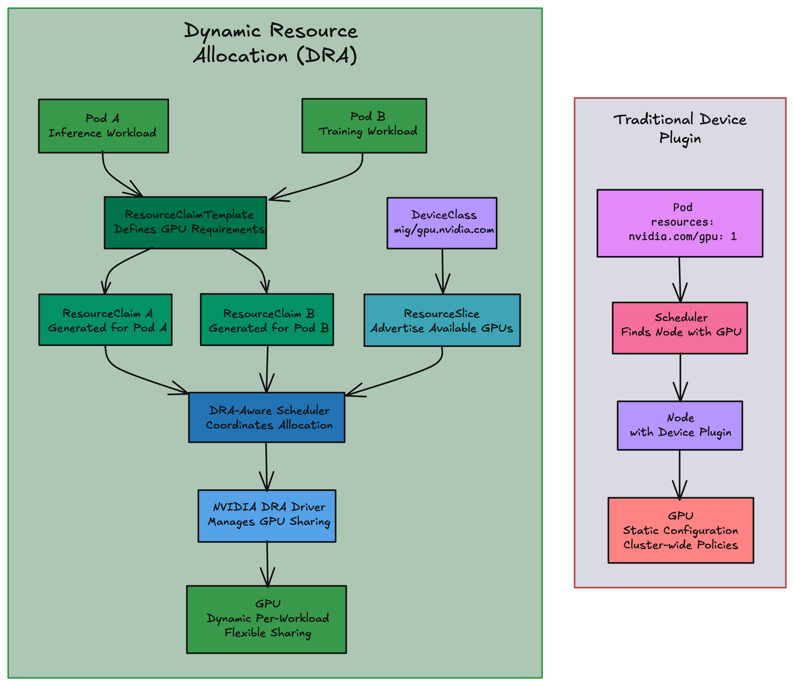
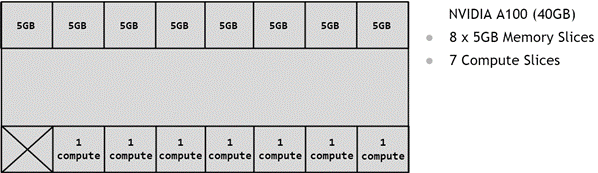
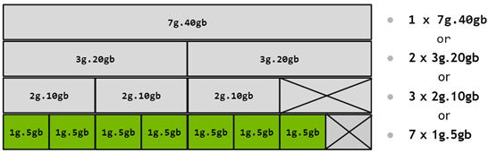
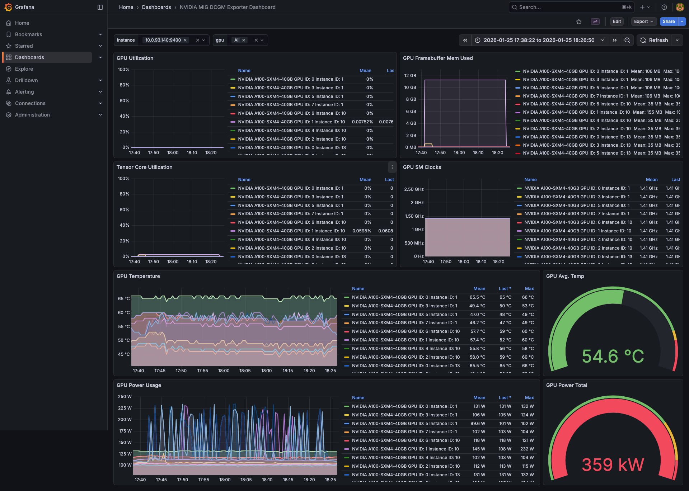

GPU scheduling in Kubernetes has always felt like buying a mansion when you need a studio apartment. A small inference workload that needs 2GB of GPU memory gets scheduled on an entire 80GB A100, and there's nothing you can do about it. The [device plugin model](https://kubernetes.io/docs/concepts/extend-kubernetes/compute-storage-net/device-plugins/) that Kubernetes introduced back in version 1.8 treats GPUs as indivisible units: one pod, one GPU, no exceptions. For years, platform teams have watched expensive hardware sit idle while data scientists wait in queue for their turn.

<!--more-->

NVIDIA tried to address this with [Multi-Instance GPU (MIG)](https://docs.nvidia.com/datacenter/tesla/mig-user-guide/) technology, which can physically partition an A100 or H100 into up to seven isolated instances. But the Kubernetes scheduler didn't understand MIG. You could partition the hardware, but getting workloads onto those partitions required awkward workarounds and custom tooling.

That changed with Kubernetes 1.34, where Dynamic Resource Allocation (DRA) went GA. DRA replaces the "give me one GPU" model with structured, attribute-based requests. You can now ask for "a 10GB MIG partition with at least 1/7th compute" and the scheduler knows what to do with that request. Device plugins just count GPUs. DRA actually knows what's inside them.

This post walks through building GPU infrastructure on Amazon EKS with Pulumi that puts DRA and MIG to work. We'll set up a cluster with GPU node groups that partition A100 GPUs into different-sized slices, then deploy mixed workloads (training jobs and inference services) that share a single GPU with full hardware isolation. Along the way, we'll cover real-world implementation challenges including GPU compatibility, Spot capacity constraints, AL2023 AMI configuration, and MIG strategy pitfalls.

## How DRA works

### The problem with device plugins

The device plugin API was added to Kubernetes in version 1.8 to handle hardware like GPUs. It works, but it has a fundamental limitation: devices are opaque integers. When you write this:

```yaml
resources:
  limits:
    nvidia.com/gpu: 1
```

Kubernetes sees "1" and nothing else. It doesn't know what kind of GPU, how much memory it has, whether it supports MIG, or what interconnects it has. The scheduler counts GPUs the same way it counts CPU millicores - as fungible units. This works fine when all your GPUs are identical and you always need a whole one. It falls apart when you have mixed GPU types, need partial GPUs, or want topology-aware placement.

Device plugins also can't express relationships between devices. If you need two GPUs connected via NVLink for a training job, there's no way to say that. You get two GPUs, and you hope they're connected.

### How DRA changes the model

[DRA](https://kubernetes.io/docs/concepts/scheduling-eviction/dynamic-resource-allocation/) flips the model. Instead of counting GPUs like CPU cores, the scheduler now sees what each device actually is. A DRA driver publishes memory size, compute capability, MIG profiles, interconnect topology. The scheduler matches workloads to devices based on real requirements, not just "give me one."

Here's what the components look like:

**ResourceSlice** - The DRA driver on each node publishes ResourceSlices to advertise what's available. Here's what one looks like from a running cluster with MIG-partitioned A100s:

```yaml
apiVersion: resource.k8s.io/v1
kind: ResourceSlice
metadata:
  name: ip-10-0-170-169.ec2.internal-gpu.nvidia.com-qbgxv
  ownerReferences:
  - apiVersion: v1
    kind: Node
    name: ip-10-0-170-169.ec2.internal
spec:
  devices:
  - name: gpu-0-mig-19-2-1
    attributes:
      architecture:
        string: Ampere
      brand:
        string: Nvidia
      cudaComputeCapability:
        version: 8.0.0
      cudaDriverVersion:
        version: 13.0.0
      driverVersion:
        version: 580.126.9
      productName:
        string: NVIDIA A100-SXM4-40GB
      profile:
        string: 1g.5gb
      type:
        string: mig
      uuid:
        string: MIG-53146931-c7ac-5a72-878e-15adb49f83ff
    capacity:
      memory:
        value: 4864Mi
      multiprocessors:
        value: "14"
```

The scheduler sees everything: it's an Ampere A100-SXM4-40GB, partitioned as a `1g.5gb` MIG instance with 4864Mi memory and 14 multiprocessors. The `profile` attribute is what you'll match in CEL expressions.

**[DeviceClass](https://kubernetes.io/docs/concepts/scheduling-eviction/dynamic-resource-allocation/#deviceclass)** - A DeviceClass is like a StorageClass but for devices. It defines a category of hardware that workloads can request. Cluster admins create DeviceClasses to expose different tiers of resources: "give me any GPU" vs "give me a small MIG partition" vs "give me a full A100 for training."

The NVIDIA DRA driver creates a `gpu.nvidia.com` DeviceClass automatically:

```yaml
apiVersion: resource.k8s.io/v1
kind: DeviceClass
metadata:
  name: gpu.nvidia.com
spec:
  selectors:
  - cel:
      expression: device.driver == 'gpu.nvidia.com' && device.attributes['gpu.nvidia.com'].type == 'gpu'
```

The `selectors` field uses CEL expressions to define which devices from ResourceSlices are available through this class. When a ResourceClaim references a DeviceClass, Kubernetes only considers devices that match the class's selectors. The claim can add more selectors to narrow things down further, but it can't escape the class's constraints.

This is where platform teams set guardrails. Create a `mig-small.nvidia.com` class that only matches `1g.5gb` profiles, and users requesting from that class can't accidentally (or intentionally) grab a full GPU.

**ResourceClaim** - Workloads request devices through ResourceClaims. Unlike the device plugin model where you ask for a count, claims use [CEL (Common Expression Language)](https://kubernetes.io/docs/reference/using-api/cel/) to express requirements:

```yaml
apiVersion: resource.k8s.io/v1
kind: ResourceClaim
metadata:
  name: my-inference-gpu
spec:
  devices:
    requests:
    - name: gpu
      exactly:
        deviceClassName: mig.nvidia.com
        count: 1
        selectors:
        - cel:
            expression: |
              device.attributes["gpu.nvidia.com"].type == "mig" &&
              device.attributes["gpu.nvidia.com"].profile == "1g.5gb"
```

The `exactly` block specifies that the claim needs exactly 1 device matching the criteria. The CEL expression filters for MIG devices with the `1g.5gb` profile. You can write more complex requirements: "a GPU with Ampere architecture" or "two GPUs on the same PCIe root."

A ResourceClaim exists independently of any pod. You create it once, and multiple pods can reference the same claim to share access to the allocated device. Think shared inference servers where several client pods hit the same GPU. The lifecycle is manual: you create the claim, pods use it, you delete it when done.

**ResourceClaimTemplate** - For Deployments and StatefulSets, you typically use templates so each pod gets its own claim:

```yaml
apiVersion: resource.k8s.io/v1
kind: ResourceClaimTemplate
metadata:
  name: inference-gpu-template
spec:
  spec:
    devices:
      requests:
      - name: gpu
        exactly:
          deviceClassName: mig.nvidia.com
          count: 1
          selectors:
          - cel:
              expression: |
                device.attributes["gpu.nvidia.com"].type == "mig" &&
                device.attributes["gpu.nvidia.com"].profile == "1g.5gb"
```

The CEL expression matches the `type` and `profile` attributes from the ResourceSlice. Checking for `type == "mig"` ensures you get a MIG partition, not a full GPU.

Unlike a ResourceClaim, a ResourceClaimTemplate doesn't allocate anything by itself. When a pod references the template, Kubernetes generates a new ResourceClaim for that pod. Each replica in a Deployment gets its own claim, its own device. When the pod terminates, Kubernetes cleans up the generated claim.

**The short version**: ResourceClaim = shared device, manual lifecycle. ResourceClaimTemplate = dedicated device per pod, automatic lifecycle.

### The allocation flow



When you deploy a pod that references a ResourceClaim, here's what happens:

1. **Scheduling** - The scheduler reads the claim's requirements and evaluates them against all ResourceSlices in the cluster. It finds nodes where matching devices are available. This is different from device plugins, where the scheduler just checks if `nvidia.com/gpu >= 1`.

2. **Allocation** - Once a node is selected, the scheduler marks specific devices as allocated in the ResourceClaim's status. The claim now has a binding to actual hardware.

3. **Node preparation** - The kubelet on the selected node calls the DRA driver to prepare the device. For GPUs, this might mean configuring MIG partitions, setting up container device interface (CDI) specs, or configuring CUDA visible devices.

4. **Container startup** - The container runs with the allocated device exposed according to the CDI spec. The workload sees exactly the GPU resources it requested.

5. **Cleanup** - When the pod terminates, the driver releases the allocation. The device goes back into the pool for other workloads.

Notice that allocation happens at scheduling time, not runtime. The scheduler knows exactly which device a pod will get before it even starts. No more race conditions when multiple pods compete for GPUs.

## GPU sharing strategies

Before diving into MIG, it helps to understand [what else is out there](https://docs.nvidia.com/datacenter/cloud-native/gpu-operator/latest/gpu-sharing.html):

| Strategy                        | Isolation                           | Use case                             | Overhead |
| ------------------------------- | ----------------------------------- | ------------------------------------ | -------- |
| **Time-slicing**                | None - processes share the full GPU | Development, batch jobs              | Low      |
| **MPS (Multi-Process Service)** | Memory limits only                  | Training jobs with similar workloads | Medium   |
| **MIG (Multi-Instance GPU)**    | Full hardware isolation             | Production inference, multi-tenant   | Low      |

**Time-slicing** rapidly switches between processes on the same GPU. Good for dev environments, but there's no isolation. One workload can hog all GPU memory and crash everyone else.

**MPS** is CUDA-level sharing. Better utilization than time-slicing, but memory isolation is soft limits only. Fine for training jobs that play nice together.

**MIG** partitions the GPU at the hardware level. Each partition has its own compute units, memory, and memory bandwidth. If one partition crashes, the others keep running. This is what you want for production and multi-tenant setups.

## MIG: actual hardware partitioning

[MIG (Multi-Instance GPU)](https://docs.nvidia.com/datacenter/tesla/mig-user-guide/) carves supported GPUs into up to seven isolated instances. The isolation runs deep: each instance gets its own processors with separate paths through the entire memory system, including dedicated crossbar ports, L2 cache banks, memory controllers, and DRAM address buses. One workload can't impact another's scheduling or performance. This hardware-level isolation is what makes MIG suitable for multi-tenant environments where you need guaranteed QoS.

### How MIG partitions the GPU

MIG works by slicing the GPU into two types of resources that get combined to create isolated instances:

**GPU Instances (GI)** combine memory slices with compute slices to create partitioned GPU resources. A GPU Instance includes a fraction of the GPU's memory, streaming multiprocessors (SMs), and other execution engines. Each GI provides memory Quality of Service with dedicated memory bandwidth and cache allocation.

**Compute Instances (CI)** can further subdivide a GPU Instance's SM resources. A Compute Instance contains a subset of the parent GPU instance's SMs while sharing memory and engines. For most inference workloads, you'll use one CI per GI.

Take the A100-40GB: it divides into **8 memory slices** (5GB each) and **7 SM slices**. You combine these to create profiles, but there's a constraint: valid combinations can't overlap vertically in NVIDIA's profile layout diagram.



The diagram above shows how the A100 hardware divides. Each vertical column represents a memory slice, and the horizontal bands represent SM slices. When you create a MIG profile, you're selecting which slices to group together.

### Understanding MIG profile names

MIG profiles follow a naming convention: `<compute>g.<memory>gb`

- The first number indicates the fraction of streaming multiprocessors (SMs) allocated
- The memory amount follows in gigabytes
- For example, `1g.5gb` means 1/7th of the SMs and 5GB of memory

**Profile suffixes** modify capabilities:
- **`+me`** profiles include at least one media engine (NVDEC, NVENC, NVJPG, or OFA)
- **`+gfx`** adds graphics API support (Blackwell architecture only)
- **`+me.all`** allocates all available media engines
- **`-me`** excludes media engines for compute-only workloads

For inference workloads, you typically use the base profiles without suffixes since you need compute and memory but not video encoding.

### Available MIG profiles

For an A100 40GB GPU (used in p4d.24xlarge instances), the available profiles are:

| Profile | GPU Memory | Compute Units | Max instances | Use case                          |
| ------- | ---------- | ------------- | ------------- | --------------------------------- |
| 1g.5gb  | 5 GB       | 1/7           | 7             | Small inference models, development |
| 2g.10gb | 10 GB      | 2/7           | 3             | Medium models, batch inference    |
| 3g.20gb | 20 GB      | 3/7           | 2             | Large models, mixed workloads     |
| 4g.20gb | 20 GB      | 4/7           | 1             | Compute-heavy with moderate memory |
| 7g.40gb | 40 GB      | 7/7           | 1             | Full GPU for training or large models |

For an A100 80GB GPU, you get larger memory profiles:
- `1g.10gb` - 7 instances available
- `2g.20gb` - 3 instances available
- `3g.40gb` - 2 instances available
- `4g.40gb` - 1 instance available
- `7g.80gb` - 1 instance available (full GPU)

For inference, the `1g.5gb` profile (A100 40GB) or `1g.10gb` (A100 80GB) works well for small models. One A100 40GB can run seven inference services at once, each with hardware isolation.



The diagram shows all valid profile combinations. Notice how larger profiles (like `3g.20gb` and `4g.20gb`) can coexist because they don't vertically overlap, but some combinations aren't allowed due to how the memory and compute slices align.

### MIG isolation advantages

MIG provides superior isolation compared to CUDA Streams and Multi-Process Service (MPS). Here's what you get that other GPU sharing methods can't provide:

Each partition has dedicated compute units that can't be preempted by other partitions. Memory boundaries are hardware-enforced, so one partition can't access another's memory. Dedicated memory controllers ensure predictable bandwidth per partition. And if one MIG instance crashes, the others keep running.

This is what makes MIG work for production multi-tenant environments where you need guaranteed QoS and security isolation between workloads.

### GPU architecture support

Here's the catch: [not all NVIDIA GPUs support MIG](https://docs.nvidia.com/datacenter/tesla/mig-user-guide/supported-gpus.html). MIG requires compute capability 8.0 or higher, which means Ampere architecture and later. But even within Ampere, not every GPU has it.

**Ampere (different max instances):**
- A100-SXM4/PCIe (40GB or 80GB): up to 7 instances
- A30 (24GB): up to 4 instances

**Hopper:**
- H100-SXM5/PCIe (80GB or 94GB): up to 7 instances
- H200-SXM5/NVL (141GB): up to 7 instances
- H20 (96GB): up to 7 instances

**Blackwell:**
- B200 (180GB): up to 7 instances
- GB200 (186GB): up to 7 instances

The A10G (g5 instances) is Ampere but doesn't support MIG. This trips people up. For MIG on AWS, you need p4d (A100) or p5 (H100) instances.

## What you need

The complete code for this example is available on GitHub:



**Prerequisites:**

- [EKS v1.34+](https://docs.aws.amazon.com/eks/latest/userguide/kubernetes-versions.html) (DRA went GA in Kubernetes 1.34)
- [Pulumi CLI](/docs/iac/download-install/) and AWS credentials
- [Pulumi EKS Provider v3+](/registry/packages/eks/)
- [NVIDIA GPU Operator v25.10.0+](https://docs.nvidia.com/datacenter/cloud-native/gpu-operator/latest/)
- [NVIDIA DRA Driver v25.8.0+](https://github.com/NVIDIA/k8s-dra-driver)

> [!WARNING]  
> p4d.24xlarge capacity is scarce in most AWS regions. Spot looks cheap ($2.48/hr vs $32/hr On-Demand in us-east-1a) but good luck actually getting it. On-Demand is more reliable but expensive.

## Building the infrastructure

The stack has a VPC, an EKS cluster with GPU node groups, and the NVIDIA components for DRA. We're using [Pulumi AWSX](/registry/packages/awsx/) for the VPC and the [Pulumi EKS provider](/registry/packages/eks/) for the cluster. Let's walk through it.

### VPC and cluster setup

First, create the VPC and EKS cluster:

```typescript
import * as pulumi from "@pulumi/pulumi";
import * as aws from "@pulumi/aws";
import * as awsx from "@pulumi/awsx";
import * as eks from "@pulumi/eks";
import * as k8s from "@pulumi/kubernetes";

const config = new pulumi.Config();
const clusterName = config.get("clusterName") || "gpu-dra-cluster";

// VPC with required EKS subnet tags
const vpc = new awsx.ec2.Vpc("gpu-vpc", {
    enableDnsHostnames: true,
    cidrBlock: "10.0.0.0/16",
    subnetSpecs: [
        {
            type: awsx.ec2.SubnetType.Public,
            tags: {
                [`kubernetes.io/cluster/${clusterName}`]: "shared",
                "kubernetes.io/role/elb": "1",
            },
        },
        {
            type: awsx.ec2.SubnetType.Private,
            tags: {
                [`kubernetes.io/cluster/${clusterName}`]: "shared",
                "kubernetes.io/role/internal-elb": "1",
            },
        },
    ],
    subnetStrategy: "Auto",
});

// EKS cluster without Auto Mode
// We'll use managed node groups for system workloads and GPU workloads
const cluster = new eks.Cluster("gpu-cluster", {
    name: clusterName,
    vpcId: vpc.vpcId,
    publicSubnetIds: vpc.publicSubnetIds,
    privateSubnetIds: vpc.privateSubnetIds,
    authenticationMode: eks.AuthenticationMode.Api,
    skipDefaultNodeGroup: true,
    version: "1.34",
});

// Kubernetes provider for deploying resources
const k8sProvider = new k8s.Provider("k8s-provider", {
    kubeconfig: cluster.kubeconfigJson,
    enableServerSideApply: true,
});

export const kubeconfig = pulumi.secret(cluster.kubeconfig);
```

### Creating node groups

We'll create two node groups: one for system workloads and one for GPU workloads.

```typescript
// IAM role for managed node groups
const nodeRole = new aws.iam.Role("system-node-role", {
    assumeRolePolicy: JSON.stringify({
        Version: "2012-10-17",
        Statement: [{
            Action: "sts:AssumeRole",
            Effect: "Allow",
            Principal: { Service: "ec2.amazonaws.com" },
        }],
    }),
});

// Attach required policies for EKS worker nodes
const nodeRolePolicies = [
    "arn:aws:iam::aws:policy/AmazonEKSWorkerNodePolicy",
    "arn:aws:iam::aws:policy/AmazonEKS_CNI_Policy",
    "arn:aws:iam::aws:policy/AmazonEC2ContainerRegistryReadOnly",
];

nodeRolePolicies.forEach((policyArn, index) => {
    new aws.iam.RolePolicyAttachment(`system-node-policy-${index}`, {
        role: nodeRole.name,
        policyArn: policyArn,
    });
});

// System node group for control plane workloads
const systemNodeGroup = new eks.ManagedNodeGroup("system-nodes", {
    cluster: cluster,
    nodeGroupName: "system-nodes",
    nodeRole: nodeRole,
    instanceTypes: ["m6i.large"],
    capacityType: "ON_DEMAND",
    scalingConfig: {
        desiredSize: 2,
        minSize: 1,
        maxSize: 4,
    },
    labels: { "node-role": "system" },
    taints: [],
}, { dependsOn: [cluster] });

// GPU node group with p4d.24xlarge (A100 40GB GPUs)
// Note: SPOT capacity for p4d.24xlarge is extremely limited and often unavailable
// Using ON_DEMAND for more reliable (though expensive) capacity
const gpuNodeGroup = new eks.ManagedNodeGroup("gpu-nodes", {
    cluster: cluster,
    nodeGroupName: "gpu-nodes",
    nodeRole: nodeRole,
    instanceTypes: ["p4d.24xlarge"],
    capacityType: "ON_DEMAND",  // SPOT often fails with UnfulfillableCapacity
    scalingConfig: {
        desiredSize: 1,
        minSize: 0,
        maxSize: 2,
    },
    diskSize: 100,
    amiType: "AL2023_x86_64_NVIDIA",  // EKS-optimized Amazon Linux 2023 with NVIDIA drivers
    labels: {
        "node-role": "gpu",
        "nvidia.com/gpu.present": "true",
        "nvidia.com/mig.config": "all-balanced",  // Configure all GPUs with balanced MIG profiles
    },
    taints: [{
        key: "nvidia.com/gpu",
        value: "true",
        effect: "NO_SCHEDULE",  // Prevent non-GPU workloads from scheduling
    }],
}, { dependsOn: [cluster] });
```

The GPU node group uses the `AL2023_x86_64_NVIDIA` AMI type, which includes pre-installed NVIDIA drivers and Container Toolkit. The `nvidia.com/mig.config` label tells the MIG Manager how to partition the GPUs when they come online.

A note on capacity: p4d.24xlarge instances are in high demand. Spot looks attractive on paper (92% savings) but frequently fails with `UnfulfillableCapacity` errors. On-Demand is more reliable but runs $32/hr per instance in us-east-1. For production, capacity reservations help. Checking multiple regions helps more.

### Installing the NVIDIA GPU Operator

The [GPU Operator](https://docs.nvidia.com/datacenter/cloud-native/gpu-operator/latest/) manages NVIDIA software components on your cluster. When using the AL2023_x86_64_NVIDIA AMI, you must disable driver and toolkit installation since they're pre-installed:

```typescript
// NVIDIA GPU Operator with DRA configuration
const gpuOperatorNamespace = new k8s.core.v1.Namespace("gpu-operator-ns", {
    metadata: { name: "gpu-operator" },
}, { provider: k8sProvider });

const gpuOperator = new k8s.helm.v3.Release("gpu-operator", {
    chart: "gpu-operator",
    namespace: gpuOperatorNamespace.metadata.name,
    repositoryOpts: {
        repo: "https://helm.ngc.nvidia.com/nvidia",
    },
    version: "v25.10.1",
    skipAwait: true,  // GPU Operator takes time to roll out across nodes
    values: {
        // AL2023_x86_64_NVIDIA AMI has pre-installed drivers
        driver: { enabled: false },
        // AL2023_x86_64_NVIDIA AMI has pre-installed toolkit
        toolkit: { enabled: false },
        // Disable traditional device plugin - DRA handles allocation
        devicePlugin: { enabled: false },
        // Set containerd as the runtime
        operator: {
            defaultRuntime: "containerd",
        },
        // Enable Node Feature Discovery for GPU detection
        nfd: { enabled: true },
        // Configure MIG strategy for heterogeneous profiles
        mig: {
            strategy: "mixed",
        },
        // Enable MIG Manager to apply MIG configurations
        migManager: {
            enabled: true,
            env: [{
                name: "WITH_REBOOT",
                value: "true",  // Allow node reboots if needed for MIG changes
            }],
        },
        // Enable DCGM Exporter for GPU metrics
        dcgmExporter: {
            enabled: true,
            serviceMonitor: { enabled: true },
        },
    },
}, { provider: k8sProvider, dependsOn: [gpuNodeGroup] });
```

A few things to watch here: you must set `driver.enabled: false` and `toolkit.enabled: false` when using the AL2023_x86_64_NVIDIA AMI, or you'll get conflicts with the pre-installed drivers. The `mig.strategy: "mixed"` is required because `all-balanced` creates heterogeneous MIG slice sizes. And `operator.defaultRuntime: "containerd"` is required for AL2023's cgroup v2 setup.

### Understanding MIG configuration

That `nvidia.com/mig.config: "all-balanced"` label on line 435 does more than you might think. MIG Manager runs as a controller in your cluster, watching for this label on GPU nodes. When it spots it, the reconfiguration happens automatically: GPU workloads stop, `nvidia-mig-parted` applies the new geometry, the node reboots if necessary, then everything comes back up with the new partitioning.

The label value has to match a profile name in the `default-mig-parted-config` ConfigMap. The GPU Operator creates this ConfigMap with pre-defined configurations for different GPU models:

```bash
pulumi env run pulumi-idp/auth -- kubectl get configmap -n gpu-operator default-mig-parted-config -o yaml
```

For A100-40GB GPUs (p4d.24xlarge), you get these options:

- `all-1g.5gb` creates 7 identical 1g.5gb slices per GPU (56 total across 8 GPUs)
- `all-2g.10gb` creates 3 identical 2g.10gb slices per GPU
- `all-3g.20gb` creates 2 identical 3g.20gb slices per GPU
- `all-balanced` creates a mix: 2× 1g.5gb + 1× 2g.10gb + 1× 3g.20gb per GPU

The `all-balanced` profile is more useful than uniform slicing. You get small slices for inference, medium slices for training, and larger slices for bigger models, all on the same GPU with hardware isolation. Real workloads aren't all the same size, so why partition like they are?

### Understanding MIG strategy: single vs mixed

The `mig.strategy` setting controls how GPU Feature Discovery (GFD) advertises MIG devices to Kubernetes. Get this wrong and your GPU nodes show `nvidia.com/gpu.product=NVIDIA-A100-SXM4-40GB-MIG-INVALID` with zero resources available. We spent an hour debugging this one.

| Strategy | When to use | What it does |
|----------|-------------|--------------|
| `single` | Uniform profiles (`all-1g.5gb`, `all-2g.10gb`) | Expects all MIG devices to be the same type. Advertises as `nvidia.com/gpu`. |
| `mixed` | Heterogeneous profiles (`all-balanced`) | Supports multiple MIG device types. Advertises as `nvidia.com/mig-1g.5gb`, `nvidia.com/mig-2g.10gb`, etc. |

Here's the thing that tripped us up: `all-balanced` creates different MIG slice sizes (1g.5gb, 2g.10gb, 3g.20gb) on the same GPU. If you use `strategy: "single"` with `all-balanced`, GFD sees multiple MIG types and marks everything invalid:

```text
Invalid configuration detected for mig-strategy=single: more than one MIG device type present on node
```

Use `mixed` whenever your MIG configuration creates different slice sizes. Use `single` only with uniform profiles like `all-1g.5gb` where every slice is identical.

One clarification: `single` doesn't mean all GPUs must have the same profile. It means all MIG slices across the node must be the same type. GPU 0 and GPU 1 both running `all-1g.5gb`? That's fine with `single` because all slices are 1g.5gb. But `all-balanced` creates 1g.5gb, 2g.10gb, and 3g.20gb slices on every GPU, so you need `mixed`.

For the test workload we're building, `all-balanced` demonstrates the actual value of MIG with DRA: different workload sizes sharing the same GPU.

### Installing the NVIDIA DRA Driver

The [DRA driver](https://github.com/NVIDIA/k8s-dra-driver) publishes GPU resources to Kubernetes and handles the allocation lifecycle:

```typescript
// NVIDIA DRA Driver for GPU allocation
const draDriverNamespace = new k8s.core.v1.Namespace("dra-driver-ns", {
    metadata: { name: "nvidia-dra-driver" },
}, { provider: k8sProvider });

const draDriver = new k8s.helm.v3.Release("nvidia-dra-driver", {
    chart: "nvidia-dra-driver-gpu",
    namespace: draDriverNamespace.metadata.name,
    repositoryOpts: {
        repo: "https://helm.ngc.nvidia.com/nvidia",
    },
    version: "v25.8.1",
    skipAwait: true,
    values: {
        // Set driver root for host-installed drivers (AL2023 AMI)
        nvidiaDriverRoot: "/",
        // Enable GPU resources override for proper DRA functionality
        gpuResourcesEnabledOverride: true,
        resources: {
            gpus: { enabled: true },
            computeDomains: { enabled: false },
        },
        // Configure kubelet plugin to tolerate GPU node taints
        kubeletPlugin: {
            tolerations: [{
                key: "nvidia.com/gpu",
                operator: "Exists",
                effect: "NoSchedule",
            }],
        },
        // Schedule DRA controller on system nodes (not GPU nodes)
        controller: {
            affinity: {
                nodeAffinity: {
                    requiredDuringSchedulingIgnoredDuringExecution: {
                        nodeSelectorTerms: [{
                            matchExpressions: [{
                                key: "node-role",
                                operator: "In",
                                values: ["system"],
                            }],
                        }],
                    },
                },
            },
        },
    },
}, { provider: k8sProvider, dependsOn: [gpuOperator] });
```

Put the DRA controller on system nodes, not GPU nodes. You don't want resource allocation conflicts. The kubelet plugin still runs on GPU nodes as a DaemonSet to handle device preparation.

The DRA driver creates two DeviceClasses automatically when `resources.gpus.enabled: true` is set:
- `gpu.nvidia.com` for full GPU allocations
- `mig.nvidia.com` for MIG partition allocations

## Understanding ResourceClaimTemplates

ResourceClaimTemplates define how pods request specific GPU resources. The CEL expression in the selector determines which devices match. For a workload that needs a small MIG partition:

```yaml
apiVersion: resource.k8s.io/v1
kind: ResourceClaimTemplate
metadata:
  name: mig-small-template
spec:
  spec:
    devices:
      requests:
      - name: mig-gpu
        exactly:
          deviceClassName: mig.nvidia.com
          count: 1
          selectors:
          - cel:
              expression: |
                device.attributes["gpu.nvidia.com"].type == "mig" &&
                device.attributes["gpu.nvidia.com"].profile == "1g.5gb"
```

The CEL expression filters for MIG devices with the `1g.5gb` profile. For different profiles, change the profile value to `2g.10gb`, `3g.20gb`, etc.

## Real-world workload demonstration: Fashion-MNIST training and inference

To demonstrate MIG running different workload types on the same GPU, we deployed three PyTorch workloads using the Fashion-MNIST dataset: a large training job, a medium training job, and a small inference service, all sharing a single A100 GPU.

[Fashion-MNIST](https://github.com/zalandoresearch/fashion-mnist) is a dataset of 70,000 grayscale images (60,000 training, 10,000 test) showing clothing items across 10 categories: t-shirts, trousers, pullovers, dresses, coats, sandals, shirts, sneakers, bags, and ankle boots. Created by Zalando Research as a drop-in replacement for the classic MNIST handwritten digits dataset, it provides a more challenging classification task while maintaining the same 28x28 pixel format. It's commonly used for benchmarking ML frameworks and testing GPU workloads because it's large enough to stress hardware but small enough to iterate quickly.

### The workloads

With the `all-balanced` MIG configuration, each A100 40GB GPU provides:
- 2× `1g.5gb` partitions (small inference workloads)
- 1× `2g.10gb` partition (medium training)
- 1× `3g.20gb` partition (large training)

Here's what we deployed:

**Large training workload (3g.20gb)**: ResNet-18 training on Fashion-MNIST with 256-batch size, using ~11GB GPU memory.

**Medium training workload (2g.10gb)**: Custom CNN training with 128-batch size, using ~5GB GPU memory.

**Small inference workload (1g.5gb)**: Continuous inference loop using ~0.01GB memory.

### ConfigMap with training scripts

First, create a ConfigMap containing the Python scripts for each workload:

```typescript
const fashionMnistScripts = new k8s.core.v1.ConfigMap("fashion-mnist-scripts", {
    metadata: {
        name: "fashion-mnist-scripts",
        namespace: migTestNamespace.metadata.name,
    },
    data: {
        "large-training-script.py": `import torch
import torch.nn as nn
import torch.optim as optim
from torchvision import datasets, transforms, models

print("Starting Large Training Workload (3g.20gb MIG)")
print(f"PyTorch version: {torch.__version__}")
print(f"CUDA available: {torch.cuda.is_available()}")
print(f"CUDA device: {torch.cuda.get_device_name(0) if torch.cuda.is_available() else 'N/A'}")

transform = transforms.Compose([
    transforms.Resize(224),
    transforms.Grayscale(3),
    transforms.ToTensor(),
    transforms.Normalize((0.5,), (0.5,))
])

train_dataset = datasets.FashionMNIST('./data', train=True, download=True, transform=transform)
train_loader = torch.utils.data.DataLoader(train_dataset, batch_size=256, shuffle=True)

model = models.resnet18(pretrained=False, num_classes=10).cuda()
optimizer = optim.Adam(model.parameters(), lr=0.001)
criterion = nn.CrossEntropyLoss()

print("Starting training loop...")
for epoch in range(20):
    model.train()
    total_loss = 0
    correct = 0
    total = 0

    for batch_idx, (data, target) in enumerate(train_loader):
        data, target = data.cuda(), target.cuda()
        optimizer.zero_grad()
        output = model(data)
        loss = criterion(output, target)
        loss.backward()
        optimizer.step()

        total_loss += loss.item()
        pred = output.argmax(dim=1)
        correct += pred.eq(target).sum().item()
        total += target.size(0)

    accuracy = 100. * correct / total
    avg_loss = total_loss / len(train_loader)
    print(f"Epoch {epoch+1}/20 | Loss: {avg_loss:.4f} | Accuracy: {accuracy:.2f}% | GPU Mem: {torch.cuda.memory_allocated()/1e9:.2f}GB")

print("Training complete!")`,

        "medium-training-script.py": `import torch
import torch.nn as nn
import torch.optim as optim
from torchvision import datasets, transforms

print("Starting Medium Training Workload (2g.10gb MIG)")
print(f"PyTorch version: {torch.__version__}")
print(f"CUDA available: {torch.cuda.is_available()}")
print(f"CUDA device: {torch.cuda.get_device_name(0) if torch.cuda.is_available() else 'N/A'}")

transform = transforms.Compose([
    transforms.Resize(32),
    transforms.ToTensor(),
    transforms.Normalize((0.5,), (0.5,))
])

train_dataset = datasets.FashionMNIST('./data', train=True, download=True, transform=transform)
train_loader = torch.utils.data.DataLoader(train_dataset, batch_size=128, shuffle=True)

# Custom CNN with 4 conv layers + 2 FC
model = nn.Sequential(
    nn.Conv2d(1, 64, kernel_size=3, padding=1),
    nn.ReLU(),
    nn.MaxPool2d(2),
    nn.Conv2d(64, 128, kernel_size=3, padding=1),
    nn.ReLU(),
    nn.MaxPool2d(2),
    nn.Conv2d(128, 256, kernel_size=3, padding=1),
    nn.ReLU(),
    nn.MaxPool2d(2),
    nn.Conv2d(256, 512, kernel_size=3, padding=1),
    nn.ReLU(),
    nn.AdaptiveAvgPool2d(1),
    nn.Flatten(),
    nn.Linear(512, 256),
    nn.ReLU(),
    nn.Dropout(0.5),
    nn.Linear(256, 10)
).cuda()

optimizer = optim.Adam(model.parameters(), lr=0.001)
criterion = nn.CrossEntropyLoss()

print("Starting training loop...")
for epoch in range(15):
    model.train()
    total_loss = 0
    correct = 0
    total = 0

    for batch_idx, (data, target) in enumerate(train_loader):
        data, target = data.cuda(), target.cuda()
        optimizer.zero_grad()
        output = model(data)
        loss = criterion(output, target)
        loss.backward()
        optimizer.step()

        total_loss += loss.item()
        pred = output.argmax(dim=1)
        correct += pred.eq(target).sum().item()
        total += target.size(0)

    accuracy = 100. * correct / total
    avg_loss = total_loss / len(train_loader)
    print(f"Epoch {epoch+1}/15 | Loss: {avg_loss:.4f} | Accuracy: {accuracy:.2f}% | GPU Mem: {torch.cuda.memory_allocated()/1e9:.2f}GB")

print("Training complete!")`,

        "small-inference-script.py": `import torch
import torch.nn as nn
from torchvision import datasets, transforms

print("Starting Small Inference Workload (1g.5gb MIG)")
print(f"PyTorch version: {torch.__version__}")
print(f"CUDA available: {torch.cuda.is_available()}")
print(f"CUDA device: {torch.cuda.get_device_name(0) if torch.cuda.is_available() else 'N/A'}")

transform = transforms.Compose([
    transforms.ToTensor(),
    transforms.Normalize((0.5,), (0.5,))
])

test_dataset = datasets.FashionMNIST('./data', train=False, download=True, transform=transform)
test_loader = torch.utils.data.DataLoader(test_dataset, batch_size=32, shuffle=False)

model = nn.Sequential(
    nn.Flatten(),
    nn.Linear(28*28, 512),
    nn.ReLU(),
    nn.Linear(512, 256),
    nn.ReLU(),
    nn.Linear(256, 10)
).cuda()

model.eval()

print("Starting continuous inference loop...")
iteration = 0
while True:
    for data, target in test_loader:
        data, target = data.cuda(), target.cuda()
        with torch.no_grad():
            output = model(data)
            pred = output.argmax(dim=1)

        if iteration % 50 == 0:
            print(f"Iteration {iteration} | GPU Mem: {torch.cuda.memory_allocated()/1e9:.2f}GB")

        iteration += 1`,
    },
}, { provider: k8sProvider });
```

### ResourceClaimTemplates for different MIG profiles

Create three ResourceClaimTemplates, one for each MIG profile:

```typescript
// Large training: 3g.20gb MIG profile
const migLargeClaimTemplate = new k8s.apiextensions.CustomResource("mig-large-template", {
    apiVersion: "resource.k8s.io/v1",
    kind: "ResourceClaimTemplate",
    metadata: {
        name: "mig-large-template",
        namespace: migTestNamespace.metadata.name,
    },
    spec: {
        spec: {
            devices: {
                requests: [{
                    name: "mig-large",
                    exactly: {
                        deviceClassName: "mig.nvidia.com",
                        count: 1,
                        selectors: [{
                            cel: {
                                expression: 'device.attributes["gpu.nvidia.com"].type == "mig" && device.attributes["gpu.nvidia.com"].profile == "3g.20gb"',
                            },
                        }],
                    },
                }],
            },
        },
    },
}, { provider: k8sProvider, dependsOn: [draDriver] });

// Medium training: 2g.10gb MIG profile
const migMediumClaimTemplate = new k8s.apiextensions.CustomResource("mig-medium-template", {
    apiVersion: "resource.k8s.io/v1",
    kind: "ResourceClaimTemplate",
    metadata: {
        name: "mig-medium-template",
        namespace: migTestNamespace.metadata.name,
    },
    spec: {
        spec: {
            devices: {
                requests: [{
                    name: "mig-medium",
                    exactly: {
                        deviceClassName: "mig.nvidia.com",
                        count: 1,
                        selectors: [{
                            cel: {
                                expression: 'device.attributes["gpu.nvidia.com"].type == "mig" && device.attributes["gpu.nvidia.com"].profile == "2g.10gb"',
                            },
                        }],
                    },
                }],
            },
        },
    },
}, { provider: k8sProvider, dependsOn: [draDriver] });

// Small inference: 1g.5gb MIG profile
const migSmallClaimTemplate = new k8s.apiextensions.CustomResource("mig-small-template", {
    apiVersion: "resource.k8s.io/v1",
    kind: "ResourceClaimTemplate",
    metadata: {
        name: "mig-small-template",
        namespace: migTestNamespace.metadata.name,
    },
    spec: {
        spec: {
            devices: {
                requests: [{
                    name: "mig-small",
                    exactly: {
                        deviceClassName: "mig.nvidia.com",
                        count: 1,
                        selectors: [{
                            cel: {
                                expression: 'device.attributes["gpu.nvidia.com"].type == "mig" && device.attributes["gpu.nvidia.com"].profile == "1g.5gb"',
                            },
                        }],
                    },
                }],
            },
        },
    },
}, { provider: k8sProvider, dependsOn: [draDriver] });
```

### Deploying the workload pods

Finally, create three pods that run the workloads:

```typescript
// Large training pod (3g.20gb)
const migLargeTrainingPod = new k8s.core.v1.Pod("mig-large-training", {
    metadata: {
        name: "mig-large-training-pod",
        namespace: migTestNamespace.metadata.name,
    },
    spec: {
        restartPolicy: "Never",
        tolerations: [{
            key: "nvidia.com/gpu",
            operator: "Exists",
            effect: "NoSchedule",
        }],
        nodeSelector: {
            "node-role": "gpu",
            "nvidia.com/gpu.present": "true",
        },
        containers: [{
            name: "training",
            image: "nvcr.io/nvidia/pytorch:25.12-py3",
            command: ["python", "/scripts/large-training-script.py"],
            volumeMounts: [{
                name: "scripts",
                mountPath: "/scripts",
                readOnly: true,
            }],
            resources: {
                claims: [{ name: "mig-large" }],
            },
        }],
        resourceClaims: [{
            name: "mig-large",
            resourceClaimTemplateName: "mig-large-template",
        }],
        volumes: [{
            name: "scripts",
            configMap: {
                name: fashionMnistScripts.metadata.name,
            },
        }],
    },
}, { provider: k8sProvider, dependsOn: [migLargeClaimTemplate, fashionMnistScripts] });

// Medium training pod (2g.10gb)
const migMediumTrainingPod = new k8s.core.v1.Pod("mig-medium-training", {
    metadata: {
        name: "mig-medium-training-pod",
        namespace: migTestNamespace.metadata.name,
    },
    spec: {
        restartPolicy: "Never",
        tolerations: [{
            key: "nvidia.com/gpu",
            operator: "Exists",
            effect: "NoSchedule",
        }],
        nodeSelector: {
            "node-role": "gpu",
            "nvidia.com/gpu.present": "true",
        },
        containers: [{
            name: "training",
            image: "nvcr.io/nvidia/pytorch:25.12-py3",
            command: ["python", "/scripts/medium-training-script.py"],
            volumeMounts: [{
                name: "scripts",
                mountPath: "/scripts",
                readOnly: true,
            }],
            resources: {
                claims: [{ name: "mig-medium" }],
            },
        }],
        resourceClaims: [{
            name: "mig-medium",
            resourceClaimTemplateName: "mig-medium-template",
        }],
        volumes: [{
            name: "scripts",
            configMap: {
                name: fashionMnistScripts.metadata.name,
            },
        }],
    },
}, { provider: k8sProvider, dependsOn: [migMediumClaimTemplate, fashionMnistScripts] });

// Small inference pod (1g.5gb)
const migSmallInferencePod = new k8s.core.v1.Pod("mig-small-inference", {
    metadata: {
        name: "mig-small-inference-pod",
        namespace: migTestNamespace.metadata.name,
    },
    spec: {
        restartPolicy: "Never",
        tolerations: [{
            key: "nvidia.com/gpu",
            operator: "Exists",
            effect: "NoSchedule",
        }],
        nodeSelector: {
            "node-role": "gpu",
            "nvidia.com/gpu.present": "true",
        },
        containers: [{
            name: "inference",
            image: "nvcr.io/nvidia/pytorch:25.12-py3",
            command: ["python", "/scripts/small-inference-script.py"],
            volumeMounts: [{
                name: "scripts",
                mountPath: "/scripts",
                readOnly: true,
            }],
            resources: {
                claims: [{ name: "mig-small" }],
            },
        }],
        resourceClaims: [{
            name: "mig-small",
            resourceClaimTemplateName: "mig-small-template",
        }],
        volumes: [{
            name: "scripts",
            configMap: {
                name: fashionMnistScripts.metadata.name,
            },
        }],
    },
}, { provider: k8sProvider, dependsOn: [migSmallClaimTemplate, fashionMnistScripts] });
```

### Deployment results

After deploying with `pulumi up`, the three workloads scheduled onto the same physical GPU:

```text
NAME                      READY   STATUS      RESTARTS   AGE
mig-large-training-pod    1/1     Running     0          21m
mig-medium-training-pod   0/1     Completed   0          21m
mig-small-inference-pod   1/1     Running     0          20m
```

The logs confirm each workload got its allocated MIG partition:

**Medium training** (completed 15 epochs):

```text
Starting Medium Training Workload (2g.10gb MIG)
CUDA device: NVIDIA A100-SXM4-40GB MIG 2g.10gb
Epoch 1/15 | Loss: 0.7649 | Accuracy: 71.21% | GPU Mem: 0.05GB
...
Epoch 15/15 | Loss: 0.0827 | Accuracy: 96.95% | GPU Mem: 0.05GB
Training complete!
```

**Large training** (20 epochs with ResNet-18):

```text
Starting Large Training Workload (3g.20gb MIG)
CUDA device: NVIDIA A100-SXM4-40GB MIG 3g.20gb
Epoch 1/20 | Loss: 0.4476 | Accuracy: 83.35% | GPU Mem: 0.26GB
...
Epoch 20/20 | Loss: 0.0183 | Accuracy: 99.36% | GPU Mem: 0.26GB
Training complete!
```

**Small inference** (continuous operation):

```text
Starting Small Inference Workload (1g.5gb MIG)
CUDA device: NVIDIA A100-SXM4-40GB MIG 1g.5gb
Iteration 260000 | GPU Mem: 0.01GB
```

The medium training finished in about 21 minutes with 96.95% accuracy. The large training job completed 20 epochs, reaching 99.36% accuracy. The inference pod continues running, now past 576,000 iterations.

## Monitoring MIG with Grafana

With [DCGM Exporter](https://github.com/NVIDIA/dcgm-exporter) enabled in the GPU Operator, you can visualize MIG partition metrics in Grafana. The screenshot below shows an NVIDIA MIG dashboard displaying metrics for multiple MIG instances on an A100 GPU:



The dashboard breaks down metrics by MIG partition: GPU utilization, memory consumption, SM clock speeds, and temperature. Useful for spotting underutilized partitions or memory pressure before they become problems.

## Why platform engineers should care

If you're running a shared GPU cluster, you've probably dealt with the politics of GPU allocation. Team A wants dedicated hardware. Team B complains their jobs keep getting killed. Nobody trusts the "fair share" scheduler. MIG with DRA sidesteps a lot of this because the isolation is in the hardware, not a software policy that can be argued with.

The cost math is also hard to ignore. Seven `1g.5gb` inference services on one A100 versus seven separate GPU instances? That's not a small difference on the AWS bill.

And there's the self-service angle. Once you've set up DeviceClasses and ResourceClaimTemplates, ML teams can request what they need without filing tickets. They pick a claim template, and the cluster figures out where to put the workload. You define the guardrails once; they stay out of your queue.

If you want to go further, [Pulumi CrossGuard](/docs/iac/using-pulumi/crossguard/) can enforce policies on GPU allocation. Here's a policy that blocks full GPU profiles while allowing the balanced MIG partitions:

```typescript
import * as policy from "@pulumi/policy";

const allowedMigProfiles = ["1g.5gb", "2g.10gb", "3g.20gb"];
const blockedMigProfiles = ["4g.20gb", "7g.40gb", "7g.80gb"];

new policy.PolicyPack("mig-policy", {
    policies: [
        {
            name: "enforce-balanced-mig-profiles",
            description: "Prevents full GPU allocations while allowing balanced MIG profiles (1g.5gb, 2g.10gb, 3g.20gb)",
            enforcementLevel: "mandatory",
            validateResource: (args, reportViolation) => {
                const resource = args.props as any;

                if (args.type !== "kubernetes:resource.k8s.io/v1:ResourceClaimTemplate") {
                    return;
                }

                const spec = resource.spec;
                if (!spec?.spec?.devices?.requests) return;

                for (const request of spec.spec.devices.requests) {
                    const selectors = request.exactly?.selectors || [];
                    for (const selector of selectors) {
                        const expression = selector.cel?.expression;
                        if (!expression) continue;

                        for (const blocked of blockedMigProfiles) {
                            if (expression.includes(`"${blocked}"`)) {
                                reportViolation(
                                    `ResourceClaimTemplate '${resource.metadata?.name}' requests ` +
                                    `blocked profile '${blocked}'. Allowed: ${allowedMigProfiles.join(", ")}`
                                );
                            }
                        }
                    }
                }
            },
        },
    ],
});
```

Run it with `pulumi preview --policy-pack ./mig-policy`. If someone tries to request a `7g.80gb` profile (the full GPU), the preview fails:

```
Policies:
    ❌ mig-policy@v1.0.0 (local: mig-policy)
        - [mandatory]  enforce-small-mig-profiles  (kubernetes:resource.k8s.io/v1:ResourceClaimTemplate: mig-invalid-template)
          Prevents using large MIG profiles (4g.20gb and above) to maximize GPU utilization for inference workloads
          ResourceClaimTemplate 'mig-invalid-template' requests blocked MIG profile '7g.80gb'. Only small profiles are allowed: 1g.5gb, 2g.10gb, 3g.20gb. Large profiles waste GPU resources for inference workloads.
```

The usual policy-as-code workflow, but applied to hardware allocation.



## Capacity planning

The cluster is running. Someone asks: "Can I get three more MIG slices for my inference service?" You should be able to answer that without guessing.

### Checking capacity with kubectl

The quickest way is `kubectl` against ResourceSlices and ResourceClaims:

```bash
# See all available MIG devices across the cluster
kubectl get resourceslices -o jsonpath='{range .items[*]}{.metadata.name}{"\n"}{range .spec.devices[*]}  {.name}: {.attributes.profile.string}{"\n"}{end}{end}'

# Count total vs allocated MIG slices
kubectl get resourceslices -o json | jq '[.items[].spec.devices[]] | length'
kubectl get resourceclaims -A -o json | jq '[.items[] | select(.status.allocation != null)] | length'

# See which claims are pending (waiting for capacity)
kubectl get resourceclaims -A -o json | jq '.items[] | select(.status.allocation == null) | .metadata.name'
```

On our test cluster with one p4d.24xlarge (8x A100 40GB GPUs, each with the `all-balanced` profile creating 4 slices: 2× 1g.5gb, 1× 2g.10gb, 1× 3g.20gb), the output shows:

```text
Total MIG slices: 32
Allocated: 3
Available: 29
```

### Monitoring with Prometheus and Grafana

DCGM Exporter (enabled in our GPU Operator config) pushes metrics to Prometheus. Some queries worth having:

```promql
# Available GPU memory per MIG instance
DCGM_FI_DEV_FB_FREE{gpu=~".*MIG.*"}

# GPU utilization per MIG partition
DCGM_FI_DEV_GPU_UTIL{gpu=~".*MIG.*"}

# Count of active MIG devices
count(DCGM_FI_DEV_GPU_UTIL{gpu=~".*MIG.*"})
```

Wire these into a Grafana dashboard. You'll want to know when you're running low before someone's deployment gets stuck pending.

### Direct node inspection

When kubectl and Prometheus disagree, SSH into the GPU node and check with `nvidia-smi`:

```bash
# List all GPU instances and their status
nvidia-smi mig -lgi

# Show compute instances within each GPU instance
nvidia-smi mig -lci

# Detailed view with memory and compute info
nvidia-smi -L
```

This is the ground truth. If the hardware says seven slices but Kubernetes only sees five, you know where to start debugging.

## What we learned the hard way

Here's what bit us during implementation:

### GPU compatibility (this one got us)

Not all NVIDIA GPUs support MIG. We initially tried g5 instances with A10G GPUs. They're Ampere architecture, so MIG should work, right? Wrong. MIG requires compute capability 8.0+, but that's necessary, not sufficient. The A10G doesn't have the hardware partitioning silicon. Check the [supported GPUs list](https://docs.nvidia.com/datacenter/tesla/mig-user-guide/supported-gpus.html) before picking instance types. On AWS, p4d (A100) and p5 (H100) work. g5 (A10G) doesn't.

### Spot capacity is a mirage

On paper, Spot pricing for p4d.24xlarge looks amazing: $2.48/hr versus $32/hr for On-Demand. That's 92% savings. In practice? We spent hours watching `UnfulfillableCapacity` errors scroll by.

The p4d.24xlarge packs 8x A100 40GB GPUs, 1.1TB RAM, and 400Gbps networking. Everyone wants these. Spot pools are perpetually exhausted.

What actually works: start with On-Demand (yes, it's expensive), check capacity across regions (us-west-2, eu-west-1, and ap-southeast-1 tend to have better availability), and use [capacity reservations](https://docs.aws.amazon.com/AWSEC2/latest/UserGuide/ec2-capacity-reservations.html) for anything critical. Don't plan to scale from zero to ten GPU nodes quickly. The capacity probably isn't there.

If you do get Spot capacity, spread instances across availability zones, implement graceful shutdown handlers for the [2-minute warning](https://docs.aws.amazon.com/AWSEC2/latest/UserGuide/spot-instance-termination-notices.html), and keep a small On-Demand node group as fallback. [EventBridge](https://docs.aws.amazon.com/eventbridge/latest/userguide/aws-events.html) can give you advance notice of interruptions.

### AL2023 AMI quirks

The `AL2023_x86_64_NVIDIA` AMI comes with NVIDIA drivers and Container Toolkit pre-installed. This is convenient until you realize the GPU Operator will try to install them again. Disable both (`driver.enabled: false`, `toolkit.enabled: false`) or watch things break mysteriously. Also set `operator.defaultRuntime: "containerd"` for cgroup v2 support.

### MIG strategy mismatch

This one had us scratching our heads. The GPU node came up, MIG Manager reported success, but the node label showed `NVIDIA-A100-SXM4-40GB-MIG-INVALID` and Kubernetes saw zero GPU resources. The culprit: we had `mig.strategy: "single"` but were using `all-balanced`, which creates multiple slice types. GFD expects uniform slices with `single` and marks anything else as invalid. Switch to `strategy: "mixed"` for heterogeneous profiles. Check with `kubectl logs -n gpu-operator -l app=gpu-feature-discovery` if you hit this.

### DRA API changes from beta

Kubernetes 1.34 promoted DRA to GA, which means breaking changes from v1beta1. ResourceClaimTemplate now requires an `exactly` block with a `count` field. DeviceClass and ResourceClaim moved from `v1beta1` to `v1`. If you're migrating from an earlier setup, your manifests need updating.

## Where to go from here

DRA with MIG solves a problem that's been frustrating platform teams for years: how do you share expensive GPU hardware without losing isolation? The answer turns out to be hardware partitioning plus a scheduler that actually understands what it's allocating.

The setup isn't trivial. Between GPU compatibility gotchas, Spot capacity constraints, AL2023 AMI configuration, and MIG strategy mismatches, there's real complexity here. But once it's running, your ML teams can request GPU resources without filing tickets, and you can stop watching $32/hr hardware sit 90% idle.

The code in this post is available to adapt for your own infrastructure. For more details, see the [Kubernetes DRA documentation](https://kubernetes.io/docs/concepts/scheduling-eviction/dynamic-resource-allocation/), the [AWS Labs DRA guide](https://awslabs.github.io/ai-on-eks/docs/guidance/dynamic-resource-allocation), and the [NVIDIA GPU Operator docs](https://docs.nvidia.com/datacenter/cloud-native/gpu-operator/latest/). The [NVIDIA DRA Driver repo](https://github.com/NVIDIA/k8s-dra-driver) has more CEL expression examples. If you're exploring other EKS deployment options, check out our post on [Amazon EKS Auto Mode](/blog/aws-eks-auto-mode/).

Questions? Find us on [Community Slack](https://slack.pulumi.com/).
