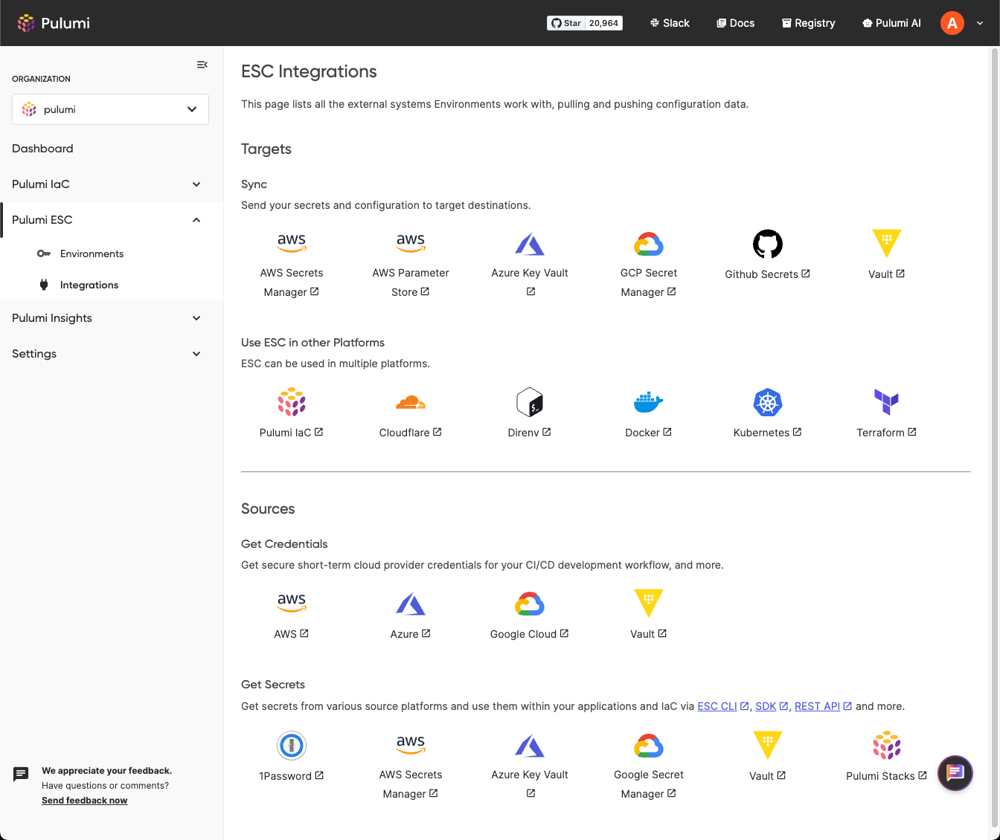
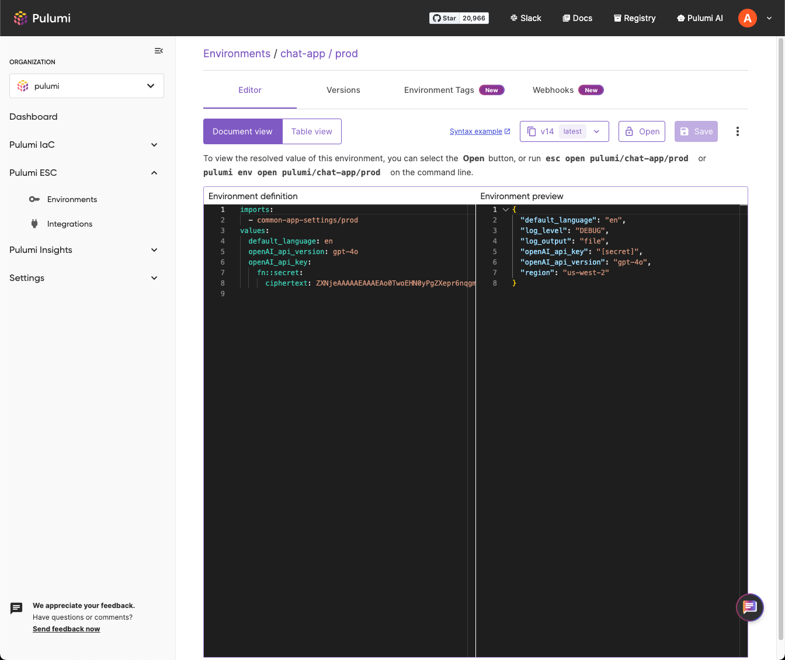

At Pulumi, we've been at the forefront of revolutionizing infrastructure management and DevOps processes. We've built the industry's most comprehensive [secrets management solution for IaC](/docs/iac/concepts/secrets/), securing production cloud credentials and secrets for countless organizations. Now, we're taking that expertise and applying it to the broader challenges of managing secrets at scale with an open ecosystem approach. 

Pulumi Environments, Secrets, and Configuration ([Pulumi ESC](/product/secrets-management/)), launched in [preview](/blog/environments-secrets-configurations-management/) in October 2023, is now generally available.

This next-generation secrets management and orchestration service is built with a robust software engineering approach, designed to bring security and simplicity to even the most complex secrets management needs.

<!--more-->

## Challenges in Secrets Management

In today's cloud-native world, secrets are the keys to the cloud estate, but managing them effectively is a growing challenge. Modern applications rely on a complex web of secrets, but traditional approaches to [secrets management](/what-is/what-is-secrets-management/) are struggling to keep pace. This complexity creates major challenges for security and engineering teams:

- **Secrets Sprawl**:  Secrets scattered across numerous systems and platforms make it nearly impossible to track their usage, enforce consistent security policies, and prevent unauthorized access, significantly increasing the likelihood of a breach.
- **Long-Lived Credentials**: Storing long-lived credentials, especially locally, creates a significant security liability. If these credentials are compromised, they can grant attackers prolonged access to sensitive systems.
- **The Trade-off Between Speed and Security**: Many security measures designed to safeguard secrets can inadvertently impede development velocity. Complex storage and retrieval processes create unnecessary friction, leading to frustration and delays.
- **Insecure .env File Sharing**: Developers often copy/paste secrets across many different files, including formats like `.env` files stored locally on their machine or shared through insecure channels (like Slack), creating blind spots for security teams and increasing the risk of data leaks.

## Introducing Pulumi ESC: A Modern Approach to Environments, Secrets, and Configuration

Pulumi ESC is the modern secret management platform designed to streamline and secure how you manage environments, secrets, and configuration across your entire organization. Built with flexibility and security at its core, Pulumi ESC empowers you to:

#### Centralize and Simplify Secrets Management:

- **Unify Your Secrets**: Say goodbye to secrets scattered across systems. Pulumi ESC lets you pull and synchronize secrets from any source—[HashiCorp Vault](/docs/esc/integrations/dynamic-secrets/vault-secrets/), [AWS Secrets Manager](/docs/esc/integrations/dynamic-secrets/aws-secrets/), [Azure Key Vault](/docs/esc/integrations/dynamic-secrets/azure-secrets/), [1Password](/docs/esc/integrations/dynamic-secrets/1password-secrets/), and more—and consume them securely from anywhere.
- **Streamline Access and Control**: Access secrets seamlessly via [CLI](/docs/esc/cli/), [API](/docs/pulumi-cloud/reference/cloud-rest-api/#environments), [Kubernetes operator](https://external-secrets.io/latest/provider/pulumi/), the intuitive Pulumi Cloud UI, or directly within your code using our TypeScript, Python, and Go [SDKs](/docs/esc/development/languages-sdks/). Robust [RBAC](/docs/esc/environments/access-control/) ensures the right people have the right access at all times.
- **Eliminate .env File Risks**: Stop sharing secrets through insecure channels. Pulumi ESC provides a secure and centralized way to manage and access secrets, eliminating the need for risky .env files.

#### Boost Developer Velocity and Security:
- **Empower Developers, Not Slow Them Down**: Pulumi ESC is designed for developer convenience without compromising security. Access secrets programmatically, integrate with your existing workflows, and leverage flexible authoring options: Pulumi Cloud Editor, VS Code Plugin, SDKs, the Pulumi Service Provider, and our REST API - the choice is yours!
- **Gain Complete Visibility and Control**: Track all secret access and changes with detailed audit logs. Understand the downstream impact of changes and ensure your secrets are used securely and consistently across your organization.
- **Secrets as Code**: Pulumi ESC supports flexible composition of environments by allowing [imports](/docs/esc/get-started/import-environments/) between one another. Construct hierarchical environments that avoid the need to copy/paste secrets and configurations, ensuring that changes are consistently propagated across all related environments.

#### Built for the Modern Cloud, Open by Design:
- **Use It Your Way**: Pulumi ESC integrates seamlessly with other Pulumi products and features such as Pulumi IaC and Pulumi Deployments for a unified infrastructure management experience. But its flexibility extends to any platform or toolset, including HashiCorp Terraform.
- **Embrace the Open Ecosystem**: We believe in freedom of choice. That's why Pulumi ESC is built on an open-source foundation (Apache 2.0 license) and designed to retrieve and synchronize secrets with various platforms seamlessly. We empower our customers to choose the best tools for their needs and supercharge their workflows with Pulumi ESC.



## Customer Stories

Since launch, we’ve seen an exponential increase in our customers using Pulumi ESC. Our users have reduced the duplication of their configuration and secrets by over <b>90%</b> and made Pulumi ESC a core part of running and managing their mission-critical infrastructure and applications. 

Hear from our customers directly what they had to say about Pulumi ESC: 

<i>
“With Pulumi ESC, our developers get dynamic AWS and Azure credentials on-demand, that removes the need for long-lived tokens and enhances security. Onboarding new developers is quick and secure, with no more manually filling in .env templates, since a common ESC dev environment with RBAC is all we need. The integration with the Pulumi SDKs is a <b>huge productivity boost</b>, and allows us to integrate secrets seamlessly across all of our development workflows." states <b>Liam White, Platform Lead at Tetrate</b>.”

“Pulumi ESC has been a <b>lifesaver</b> for us”; said <b>JK Jensen, Team Lead at Mysten Labs</b>, “it’s nice to throw everything behind an ESC environment and eliminate one-off granting IAM permissions and other issues related to static credentials. It gives us peace of mind knowing that we can grant permissions quickly and revoke easily, limiting the blast radius for any access.”

“With Pulumi ESC, our developers get dynamic AWS/GCP credentials on-demand; that <b>removes the need for long-lived tokens</b> and enhances security. ESC allows for Pulumi programs to share secure credentials and access secrets in their given cloud environments. ESC is a great configuration ‘/and secrets management sharing tool to allow for a DRY (Don't Repeat Yourself) approach to development,” says <b>Richard Genthner, Lead DevOps Engineer at Boost Insurance</b>.
</i>

Watch the snippet from our [PulumiUP Keynote](/pulumi-up/) that walks you through how to achieve all these benefits our customers have experienced. [Sign-up](https://conference.pulumi.com/schedule/?utm_source=PulumiUp&utm_medium=web&utm_campaign=FY2025Q1_Event_PulumiUP) here to watch the full keynote. 



### Beyond Preview: The Evolution of Pulumi ESC

Since the launch of Pulumi ESC in preview, over the last 11 months, we have launched numerous features and enhancements driven by our customers. Some of the major ones include: 

- [**SDKs**](/blog/esc-sdk-launch/) for TypeScript, Python, and Go to leverage Pulumi ESC within all your applications
- [**Versioning**](/blog/esc-versioning-launch/) that maintains full history of the changes you have made to your secrets and configuration and rollback to specific versions when needed
- [**Version Tags**](/docs/esc/environments/versioning/#tagging-versions) allow you to assign tags and import specific versions by tags within your applications such that moving tags across versions changes the configuration but requires zero changes in your application code 
- [**Syncing your secrets**](/blog/esc-sync-with-iac/) to several external sources including GitHub and AWS SecretsManager
- [**Kubernetes secrets operator**](https://external-secrets.io/latest/provider/pulumi/) to use Pulumi ESC within your Kubernetes applications to retrieve secrets and configuration using external secrets operator during runtime
- [**VS Code Extension**](/blog/pulumi-vscode-extension/) to author and view your environments directly from where you code 
- [**Webhooks**](/blog/esc-webhooks-launch/) to trigger your automated CI/CD workflows, restart applications with the latest secrets and configuration, notify your teams 
- [**Pulumi OIDC Trust relationship**](/blog/oidc-trust-relationships/) to get Pulumi short-term credentials using your existing Identity provider 
- [**Projects and Environment Tags**](/blog/esc-projects-environment-tags-launch/) to help you organize your Pulumi ESC environments and allow them to scale as your organization evolves 
- [**1Password integration**](/blog/pulumi-esc-public-preview-for-1password-support/) to pull secrets stored in 1Password during runtime 
- [**In-built Document Editor Enhancements**](/blog/esc-editor-enhancements/) to ease authoring with Pulumi Cloud
- [**Table Editor**](/blog/esc-key-value-table-editor-launch/) to support users who prefer point-and-click UI-driven method to secrets management 
- [**Pulumi Stack reference provider**](/docs/esc/integrations/infrastructure/pulumi-iac/pulumi-stacks/) offering tighter integration with Pulumi IaC 
- [**Files**](/blog/esc-kubernetes-cluster-and-app/) support that allows getting Kubernetes credentials dynamically 
- [**Audit logs**](/docs/pulumi-cloud/admin/audit-logs/) to monitor your environments 

## Pricing 

Starting <b>October 1st, 2024</b>, Pulumi ESC will be billed per secret. We have heard from customers that this is a familiar pricing dimension that aligns to the value customers get out of ESC. To help you get started, we have included a generous free tier of secrets and API calls.

|                     | Free            | Team           | Enterprise        | Business Critical |
|---------------------|-----------------|----------------|-------------------|-------------------|
| **Price per secret/month**  | 25 free              | $0.50            | $0.75 / Custom         | Custom            |
| **Price per plaintext config** | Free            | Free           | Free              | Free              |
| **Price per 10K API calls**    |  10K free          | $0.10             | $0.10             | $0.10             |
| **Commitment discounts**       |                 |                | ✔                 | ✔                 |

Check out our [pricing](/pricing/) page for more information about the various packages available. [Contact us](/contact/?form=sales) if you are interested in a demo, have any questions, or would like to discuss volume discounts.

## Conclusion 

Pulumi ESC represents a significant advancement in secrets and config management. By addressing the challenges faced by organizations today, such as secrets sprawl and the trade-off between speed and security, Pulumi ESC offers a modern, flexible solution. Its unique features, including support for dynamic, short-lived credentials and seamless integration with major cloud providers, GitHub, etc. make it an invaluable asset for teams looking to maintain agility without compromising on security. Pulumi ESC is set to redefine the standards of secrets management, enabling organizations to achieve their security and operational goals more effectively.

We can’t wait to see how you leverage Pulumi ESC. [Sign-up](https://app.pulumi.com/signup?_gl=1*u5yfkh*_gcl_au*NTc2MTc3MzIwLjE3MjY1MzU3OTI.) for Pulumi Cloud to start using Pulumi ESC and check out our [getting started](/docs/esc/get-started/) guide to learn more about Pulumi ESC.
