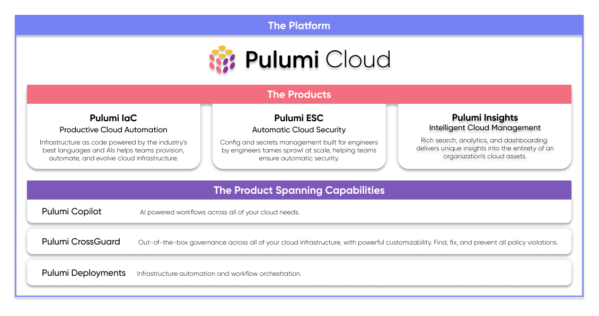

Pulumi is excited to be at [AWS re:Invent](/reinvent/) this week, where we’re showcasing our broad and deep support for AWS across all our products. From automating infrastructure with Pulumi IaC to securing secrets with Pulumi ESC to managing cloud assets with Pulumi Insights, Pulumi makes AWS a competitive advantage. Whether you’re a developer, DevOps pro, or platform engineer, Pulumi delivers the tools you need to build and manage modern cloud applications with ease.

Stop by the Pulumi re:Invent booth #370 this week to chat with experts on the Pulumi team. If you can’t make it to re:Invent, join our workshop, [_Accelerating Platform Engineering with Pulumi on AWS_](/resources/aws-immersion-day-platform-engineering/), on December 11, 2024, to see how Pulumi can enhance your cloud operations on AWS.

<!--more-->

## Why Pulumi for AWS?

Pulumi empowers organizations to automate AWS cloud infrastructure through code, tame secrets sprawl through centralized secrets management, and manage cloud assets and compliance with the help of AI. Pulumi encourages infrastructure, platform, development, DevOps, and security teams to collaborate and accelerates time to market with greater control and minimized risk.

Pulumi will speed up your deployments and time to value, and it provides you with an approach to open source and community that provides stability and choice. It will also increase your productivity and velocity through better tooling. Lastly, Pulumi uses software engineering to tackle the scale of infinite combinations of cloud architectures. Read more about why [engineers and developers switch to Pulumi.](/blog/why-switch-to-pulumi/)

## Pulumi for AWS Over the Years

Pulumi was founded back in 2017 to tackle the mounting challenges of modern cloud applications, which have grown increasingly intricate, spanning multiple environments and relying on numerous cloud resources and SaaS services. This complexity creates significant challenges for managing infrastructure. Legacy tools are designed for “two virtual machines with a database” and not thousands or millions of resources across many clouds and accounts. Teams waste time wrestling with excessive YAML configurations, resorting to copy-paste solutions, or using limited domain-specific languages (DSLs) that fail to scale effectively.

The fragmentation between development, infrastructure, and security teams only compounds these challenges. Pulumi's founding vision addresses these pain points by enabling teams to build and manage cloud infrastructure through [infrastructure as code](/what-is/what-is-infrastructure-as-code/) using familiar programming languages and tools. [Pulumi Infrastructure as Code](/product/infrastructure-as-code/) (IaC) was launched with strong support of the AWS cloud. We wanted to be the best way for you to manage and scale your AWS infrastructure through code. Over the years, we launched many AWS specific features to simplify how to manage AWS infrastructure at scale.

### Well-Architected AWS Best Practices as a Component

One of the first innovations made for AWS was [Pulumi Crosswalk for AWS](/docs/iac/clouds/aws/guides/), a collection of libraries that use automatic well-architected best practices to make common infrastructure-as-code tasks in AWS easier and more secure. Released in 2019, Crosswalk for AWS supports “day one” tasks, such as creating your initial container-based workloads using Amazon Elastic Container Service (ECS)—including Fargate or Kubernetes (EKS)—and creating serverless workloads using Amazon API Gateway and AWS Lambda. Secure and cost-conscious defaults are chosen so that simple programs automatically use best practices for the underlying infrastructure, enabling better productivity with confidence.

Crosswalk for AWS also supports “day two and beyond” tasks, such as scaling your workload, securing and integrating it with your existing infrastructure, or going to production in multiple complex environments. This includes Amazon Virtual Private Cloud (VPC) for network isolation, AWS Auto Scaling for dynamic scaling, and AWS Identity and Access Management (IAM) for securing your infrastructure.

Earlier this month at KubeCon 2024, we launched the Pulumi Elastic Kubernetes Service (EKS) Provider v3.0.0, which is one of the Crosswalk libraries that makes Kubernetes management on AWS even easier. This release simplifies multi-cluster deployments, improves resource handling, and offers enhanced compatibility with the latest AWS EKS features.

[Read more about the Pulumi EKS Provider 3.0.0](/blog/eks-v3-release/)

### AWS Policies as Code

We released [Pulumi CrossGuard](/crossguard/) to enforce your organization's cloud governance — security, compliance, cost controls, and more. This enables Policy as Code within your organization so that you can define guardrails for your infrastructure, ensuring engineers are following best practices and putting security first. CrossGuard helps your organization prevent mistakes before they occur and respond rapidly to any incidents.

### Building Controls Planes

Many AWS customers build [internal developer platforms](/product/internal-developer-platforms/) (IDP) for developers to self-service infrastructure. In 2020, [Pulumi Automation API](/automation/) was created to help automate infrastructure for these IDP control planes. Automation API exposes the full power of infrastructure as code through a programmatic interface, instead of through CLI commands, and it lets you use the Pulumi engine as an SDK, enabling you to create software that can create, update, configure, and destroy infrastructure dynamically. This enables you to use Pulumi to build IDPs that are custom tailored to your team, organization, or customers.

### Cloud Control API

In 2021, AWS launched Cloud Control API as a standard set of APIs to Create, Read, Update, Delete, and List (CRUDL) resources across hundreds of AWS Services. Pulumi supported that launch with a native provider called the Pulumi Cloud Control Provider, formerly known as AWS Native. The provider is now generally available, enabling day 1 support for new AWS resources, seamless compatibility with Pulumi IaC projects that currently use the Pulumi AWS provider, and extended support for third-party resources.

[Read more about the Pulumi AWS Cloud Control Provider](/blog/pulumi-aws-cloudcontrol-provider/)

### AWS CDK for Pulumi

In 2022, Pulumi brought the ability to use AWS Cloud Development Kit (CDK) constructs from within a Pulumi deployment. For users already using AWS CDK, this provides Pulumi as a new option for orchestrating deployments in place of CloudFormation, offering improved deployment speed, integration with the full set of features of the Pulumi Platform. Even better, you can also now combine AWS CDK and Pulumi resources in a single Pulumi infrastructure as code project - passing outputs from Pulumi resources into AWS CDK constructs, and outputs from AWS CDK constructs into Pulumi resources.

AWS Cloud Development Kit (CDK) on Pulumi is now generally available. This powerful integration includes:

* Full support for CDK features like assets, custom resources, aspects, and context values/methods.
* Coverage for 19 of the top 20 construct libraries, thoroughly validated through testing.
* Support for Docker assets, so you can build/push Docker images to ECR, streamlining  the delivery of containerized applications.

[Read more about AWS CDK on Pulumi](/blog/aws-cdk-on-pulumi-1.0/)

## Beyond Pulumi IaC

Over the last few years, our customers have shared a clear message:  IaC alone is insufficient. The complexities of modern cloud environments demand more than just IaC to manage cloud resources, improve security, and ensure compliance. In response, Pulumi's offerings have expanded into a comprehensive suite of tools that go beyond IaC.

### Pulumi Insights: Intelligent Cloud Management

[Pulumi Insights](/product/pulumi-insights/) empowers organizations to tackle cloud complexity by delivering visibility, actionable insights, and AI-assisted optimization for their infrastructure. With Pulumi Insights, companies can scan and sync their entire AWS resource inventory – including resources not managed with Pulumi IaC – ensuring a complete picture of their cloud assets. Compliance checks can be run against standards such as PCI DSS, ISO 27001, and CIS benchmarks, helping maintain regulatory compliance and mitigate risks. The AI-powered [Pulumi Copilot](/product/copilot/) provides an interactive assistant to gain visibility into a team's activity, discover cost saving opportunities, get compliant, and debug cloud failures. Pulumi Insights enables companies to discover, understand, manage, and improve their cloud infrastructure on their journey towards intelligent infrastructure management.

### Pulumi ESC: Centralized Secrets Management

Secrets sprawl, long-lived static credentials, and passing around secrets in plaintext to developers expose organizations to security vulnerabilities. [Pulumi ESC](/product/secrets-management/) addresses these challenges by offering seamless two-way integration – both pull and sync – with AWS Secrets Manager and other popular secrets stores, as well as the capability to consume secrets securely across any applications, tools, and CI/CD platform. Developers gain easy, secure access to secrets via CLI, API, Kubernetes operators, and SDKs – eliminating the need for .env files and reducing the security risks associated with them. Additionally, Pulumi Insights can issue dynamic, short-lived AWS authentication tokens on demand via OpenID Connect (OIDC), reducing the risks that come with long-lived access tokens, while RBAC, versioning, and a detailed audit log let you trust (and prove) your secrets are secure.

## Try Pulumi Cloud Today

[Check out the Pulumi roadmap](https://github.com/orgs/pulumi/projects/44/views/1) for upcoming features, let us know your feature requests by [creating an issue on GitHub](https://github.com/pulumi/pulumi/issues), connect with the [Pulumi community on Slack](https://slack.pulumi.com/), and if you haven’t yet, [sign-up for Pulumi Cloud](https://app.pulumi.com/signup) to get access to our full suite of products – Pulumi IaC, Pulumi ESC, and Pulumi Insights – so you can automate, secure, and manage everything you run in the cloud.

Meta image credit:  [ESO/M. Zamani](https://www.eso.org/public/images/potw2229a/)
