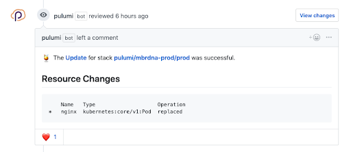
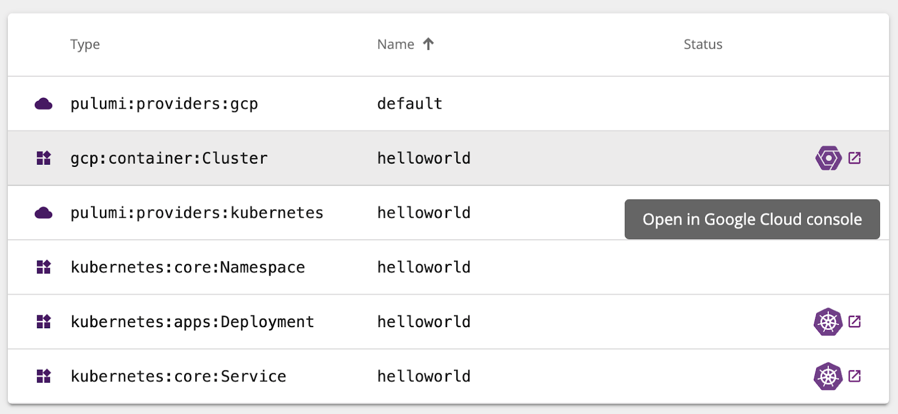

Google Cloud is one of the most exciting cloud platforms available
today, with a breadth of powerful infrastructure services from Google
Container Engine (GKE) and Google Cloud Functions to Cloud Firestore and
Cloud Spanner.

[Pulumi](/) is the most productive tooling available
today for teams building cloud applications and infrastructure, in your
favorite languages. Add them together, and teams can easily take maximum
advantage of Google Cloud Platform's rich features, productively, with
a combined platform that makes it easy to collaborate, share, and reuse.

In this post, we'll highlight some of the top features of Pulumi that
make it a joy to work with Pulumi + Google Cloud.
<!--more-->

## Infrastructure as Code for the Full Google Cloud Platform

Pulumi lets you define and deploy infrastructure as code using your
favorite programming languages, including JavaScript, Python, and Go.
Pulumi provides access to the full Google Cloud Platform -- every
resource (including beta resources!) is available directly in your
programming language and IDE. This delivers the software engineering
benefits of your programming language, combined with the reliable and
repeatable deployments of infrastructure as code.

In this example, we define a new network, firewall, and compute
instance, using Python:

```typescript
import pulumi
from pulumi_gcp import compute
 
disk = {
    'initializeParams': {
        'image': "centos-cloud/centos-7-v20190116"
    }
}
 
addr = compute.address.Address(resource_name='poc')
 
network = compute.Network("network")
network_interface = [
    {
        'network': network.id,
        'accessConfigs': [{'nat_ip': addr.address}],
    }
]
 
firewall = compute.Firewall("firewall", network=network.self_link, allows=[{
    'protocol': "tcp",
    'ports': ["22", "80"]
}])
 
instance = compute.Instance('poc', name='poc', boot_disk=disk, machine_type="f1-micro",
                            network_interfaces=network_interface)
 
pulumi.export('external_ip', addr.address)
```

Infrastructure can be deployed and updated using the `pulumi` CLI, with
each update driving toward the desired state declared by the Pulumi
program. Before each update, you can see a preview of the changes that
will be made to your target infrastructure, and only after confirming
will it proceed (with a full audit history):

    $ pulumi update
    Previewing update (luke):
     
         Type                     Name                     Plan        Info
         pulumi:pulumi:Stack      gcp-instance-nginx-luke              
     ~   ├─ gcp:compute:Firewall  firewall                 update      [diff: ~allows]
     +-  └─ gcp:compute:Instance  poc                      replace     [diff: ~bootDisk,name]
     
    Resources:
        ~ 1 to update
        +-1 to replace
        2 changes. 3 unchanged
     
    Do you want to perform this update? Yes
    ...

Learn more about working with Pulumi and Google Cloud infrastructure in
this [GCE Web Server]()
tutorial.

## Working with Kubernetes and Google Container Engine (GKE)

Pulumi also makes it easy to deploy resources to Kubernetes with access
to the full Kuberentes API, across all object types and versions, using
the same programming language and IDE experience. You no longer have to
switch tooling at the boundary between GCP and Kubernetes. Instead,
Pulumi gives you a single programming model for both.

In addition to the preview and auditing mentioned above, the Pulumi CLI
also provides rich status and repeatable deployments to Kubernetes
through its support for dependency-based orchestration of deployments:


And if you need a Kubernetes cluster, spinning one up with GKE using
Pulumi is a breeze. Best of all you have easy access to the full breadth
of configurability you might need: networking configuration, multiple
`NodePool`s, or clusters in multiple regions/zones. And you can easily
add additional GCP infrastructure like managed databases, DNS
configuration, or other resources needed to have a fully functional
Kubernetes compute environment.

This example spins up a GKE cluster and uses Pulumi's configuration
system for easy parameterization:

```python
from pulumi import Config
from pulumi_gcp.container import Cluster
 
# Read in some configurable settings for our cluster:
config = Config(None)
 
# nodeCount is the number of cluster nodes to provision. Defaults to 3 if unspecified.
NODE_COUNT = config.get('node_count') or 3
# nodeMachineType is the machine type to use for cluster nodes. Defaults to n1-standard-1 if unspecified.
# See https://cloud.google.com/compute/docs/machine-types for more details on available machine types.
NODE_MACHINE_TYPE = config.get('node_machine_type') or 'n1-standard-1'
# username is the admin username for the cluster.
USERNAME = config.get('username') or 'admin'
# password is the password for the admin user in the cluster.
PASSWORD = config.require('password')
 
# Now, actually create the GKE cluster.
k8s_cluster = Cluster('gke-cluster',
    initial_node_count=NODE_COUNT,
    node_version='latest',
    min_master_version='latest',
    master_auth={ 'username': USERNAME, 'password': PASSWORD },
    node_config={
        'machine_type': NODE_MACHINE_TYPE,
        'oauth_scopes': [
            'https://www.googleapis.com/auth/compute',
            'https://www.googleapis.com/auth/devstorage.read_only',
            'https://www.googleapis.com/auth/logging.write',
            'https://www.googleapis.com/auth/monitoring'
        ],
    },
)
```

Learn more about using Pulumi with Kubernetes and GKE in this
[Hello GKE]() tutorial.

## Super Simple Serverless with Google Cloud Functions

Serverless has never been simpler than it is with Pulumi + Google Cloud
Functions. Thanks to Pulumi's
["magic functions"](),
we can write callbacks in our language of choice, using a natural
event-driven style, and Pulumi will handle the rest.

For example, want to serve a simple HTTP API with no fixed costs? It's
just a few lines of code:

```typescript
import * as gcp from "@pulumi/gcp";
 
let greeting = new gcp.cloudfunctions.HttpCallbackFunction("greeting", (req, res) => {
    res.send(`Greetings from ${req.body.name || 'Google Cloud Functions'}!`);
});
 
export let url = greeting.httpsTriggerUrl;
```

Or perhaps a pubsub topic that runs some custom code on every message
received:

```typescript
// Create a PubSub Topic
let requests = new gcp.pubsub.Topic("requests");
// Print out a log message for every message on the Topic
requests.onMessagePublished("newMessage", (data) => {
    console.log(Buffer.from(data.data, "base64").toString());
});
```

And for quick inner loop development, the
[`pulumi logs`]()
command supports pulling logs for your Google Cloud Functions from
StackDriver, aggregating all compute logs in your program into one
unified stream:

    $ pulumi logs
    Collecting logs for stack dev since 2019-04-08T12:02:48.000-07:00.
     
     2019-04-08T12:37:34.000-07:00[            newMessage-9d41c7a] Function execution started
     2019-04-08T12:37:34.000-07:00[            newMessage-9d41c7a] {"hello": "world"}
     2019-04-08T12:37:34.000-07:00[            newMessage-9d41c7a] Function execution took 70 ms, finished with status: 'ok'

Learn more about Pulumi support for Google Cloud Functions in this
[Simple Serverless Slackbot](https://github.com/pulumi/examples/tree/master/gcp-ts-slackbot)
example.

## Continuous Delivery with Google Cloud Build

Because Pulumi is infrastructure-as-code, the projects you deploy with
Pulumi are robust and repeatable. Spinning up a testing or staging
environment is simple, and continuously deploying infrastructure changes
from commits and pull requests to your code is as easy as adding a few
lines to your CI/CD system.

For teams working with Google Cloud Build, Pulumi deployments can be
integrated into your continuous delivery with just
[a few steps](). And
for teams working with GitHub, Pulumi's GitHub App gives you rich
feedback on what changes will be deployed as part of a Pull Request, so
you can see and approve infrastructure changes before they happen:



Learn more about integrating Pulumi with CI/CD in our
[continuous delivery]() documentation.

## Managing Deployment with the Pulumi Console

In addition to the `pulumi` CLI for deploying and updating GCP
infrastructure, Pulumi is always connected to the [Pulumi Console](https://app.pulumi.com), which provides a rich interface for
viewing the history of your stacks and deployments, management of access
controls for teams, and details of all resources under management.

With deep links into the Google Cloud Console, Pulumi provides quick
access to all resources in your project.



And because Pulumi works with both Google Cloud and Kubernetes resources
at the same time, it's just as easy to deep link into resources in the
Kubernetes console as well!

You can check out the Pulumi Console at <https://app.pulumi.com> and
create your first Pulumi GCP project with just a few clicks, with an
array of New Project options to get you up and running quickly.

## Next Steps

Here at Pulumi, we love working with GCP and Kubernetes, and we are
constantly working on ways to make Pulumi the most productive (and most
fun!) way to program the Google Cloud Platform.

Pulumi is free and open source. You can get started with Pulumi today.

Here are a few resources to learn more about working with Pulumi and
GCP:

- [Google Cloud Platform Getting Started Guide]()
- [GKE Tutorial]()
- [GCE Tutorial]()
- Example: [Serverless Slackbot with Cloud Functions in JavaScript](https://github.com/pulumi/examples/tree/master/gcp-ts-slackbot)
- Example: [GKE + Kubernetes Pod Deployment in Python](https://github.com/pulumi/examples/tree/master/gcp-py-gke)
- [Pulumi Community Slack](https://slack.pulumi.io/)
