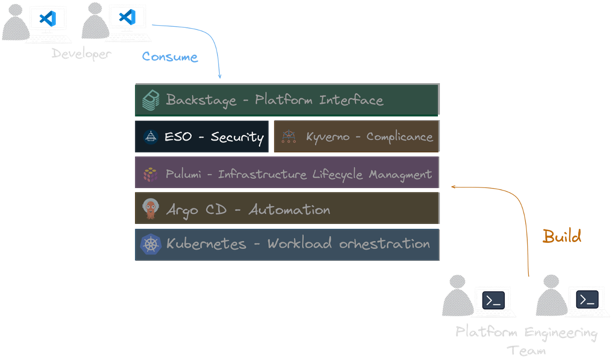

In today's complex digital landscape, organizations are increasingly turning
to [platform engineering](https://www.pulumi.com/what-is/what-is-platform-engineering/) to optimise their
software delivery processes and maximize efficiency. The growing complexity of modern applications, coupled with the
need for rapid, secure, and scalable deployments, has created a pressing demand for robust Internal Developer
Platforms (IDPs).

IDPs are a key component of modern platform engineering strategies. An IDP is a self-service layer that sits on top of
an organization's infrastructure, abstracting away complexity and providing developers with the tools and environments
they need to build, test, and deploy applications efficiently.

Key features of an [IDP](/blog/why-switch-to-pulumi#why-pulumi-for-internal-developer-platforms):

* **Developer Control Plane**. Curated experiences that empower developers by meeting them at their level of expertise,
  whether it's an abstracted developer portal, custom CLI, or shared IaC templates.

* **Integration & Delivery**. Automations to version control, test, trace, and deploy all infrastructure from resources,
  configurations, environments, and secrets as well as orchestration automations to manage provisioning workflows.

* **Monitoring & Logging**. Components to log, monitor, and observe all infrastructure for greater operational control as
  well as optimize against unnecessary costs.

* **Security & Identity**. Security and compliance guardrails that regulate every piece of infrastructure from policies to
  fine-grained access controls to secrets.

* **Resources**. Providers that support modern cloud architectures such as Kubernetes, containers, serverless, generative
  AI, machine learning, data lakes, hybrid cloud/on-premises, and more.

By implementing an IDP, organizations can significantly reduce cognitive load on developers, accelerate time-to-market,
improve security and compliance, and foster a culture of innovation. IDPs act as a force multiplier, allowing
development teams to focus on creating business value while the platform handles the underlying complexity of
cloud-native infrastructure.

The [Cloud Native Computing Foundation](https://www.cncf.io/) (CNCF) landscape offers a large ecosystem of tools and
technologies that can be leveraged to build these platforms from scratch. However, the sheer number of options can be
overwhelming, making it difficult for organizations to determine the best combination of tools for their specific needs.

At Pulumi's Customer Experience Team, we've observed that adopting Infrastructure as Code often serves as a catalyst for
organizations to reassess their entire software delivery process. This reassessment frequently leads to the
implementation of more streamlined, automated, and secure methodologies – the core principles of platform engineering
mentioned above.

To provide guidance for our customers, we have created a reference architecture called the `KEBAP` stack, this stack
offers a structured approach to integrate these technologies into an effective platform engineering solution
using [Pulumi](/).

## The KEBAP Stack Reference Architecture

The `KEBAP` stack consists of the following (most commonly used) CNCF projects:

- **K**ubernetes (with Kyverno as a bonus)
- **E**xternal Secrets Operator
- **B**ackstage
- **A**rgo CD
- **P**ulumi

Have a look on the high-level architectural diagram of the `KEBAP` stack to get a first idea of what we are going
to talk about in the following sections:


## Breaking Down the KEBAP Stack

Let's take a closer look at each component of the `KEBAP` stack and understand what their role. The `KEBAP` is layered
in such a way that each component builds on the capabilities of the previous one. The five layers of the `KEBAP` stack
are designed to address different capabilities of our internal developer platform:

### Kubernetes


{}
In modern cloud computing, the [hub-and-spoke architecture](https://open-cluster-management.io/docs/concepts/architecture/)
pattern is widely used to manage multiple [Kubernetes](https://www.pulumi.com/docs/clouds/kubernetes/) clusters. In this pattern, a central
control plane (hub) manages a set of clusters (spokes) that run applications and services. The hub provides a unified
view of the entire infrastructure, enabling centralized management, monitoring, and security.
{}

The control plane cluster in the `KEBAP` stack is the hub cluster and contains the control plane logic for the entire
IDP.

### Pulumi


{}
Pulumi manages the lifecycle of all cloud infrastructure, providing developers with self-service capabilities. It allows
you to use familiar programming languages to define your infrastructure as code, offering more flexibility and power
than traditional YAML or domain-specific languages.
{}

The [Pulumi Kubernetes Operator](https://github.com/pulumi/pulumi-kubernetes-operator) enables you to manage your
infrastructure directly from within Kubernetes, seamlessly integrating with your existing Kubernetes workflows.

Since we use GitOps as our deployment method, we define the infrastructure in a Git repository and then
let [Argo CD](#argo-cd) deploy it to the hub cluster. As soon as the infrastructure definition is deployed, the Pulumi
Kubernetes Operator will take over and create the defined resources in the selected cloud provider.

Here is an example Pulumi definition of a new Kubernetes cluster using `DigitalOcean`:

```yaml
apiVersion: pulumi.com/v1
kind: Program
metadata:
  name: ${{values.name}}
program:
  variables:
    clusterName: "do-cluster"
    clusterRegion: "nyc1"
    nodePoolName: "default"
    nodeCount: 1
    version: 1.30.1-do.0

  resources:
    do_cluster:
      type: digitalocean:KubernetesCluster
      properties:
        name: "${clusterName}"
        region: "${clusterRegion}"
        version: "${version}"
        destroyAllAssociatedResources: true
        nodePool:
          name: "${nodePoolName}"
          size: "s-2vcpu-2gb"
          nodeCount: "${nodeCount}"
    # cut for brevity
---
apiVersion: pulumi.com/v1
kind: Stack
metadata:
  name: ${{values.name}}
spec:
  stack: ${{values.stack}}
  envRefs:
    DIGITALOCEAN_TOKEN:
      type: Env
      env:
        name: DIGITALOCEAN_TOKEN
  programRef:
    name: ${{values.name}}
  destroyOnFinalize: false
```

### Argo CD


{}
[Argo CD](https://argo-cd.readthedocs.io/en/stable/) handles the deployment layer, ensuring that the current deployment
matches what is declaratively defined in the source. It's emerging as the de facto standard due to its rich front-end
and powerful features. Argo CD implements the GitOps model, continuously monitoring your Git repositories and
automatically updating the deployed applications to match the desired state.
{}

In the `KEBAP` stack, we use Argo CD to deploy the Pulumi infrastructure defined in the Git repository to our hub
cluster.

```yaml
apiVersion: argoproj.io/v1alpha1
kind: Application
metadata:
  name: ${{values.name}}-${{values.stage}}-${{ (values.owner | parseEntityRef).name }}
  namespace: argocd
spec:
  destination:
    namespace: pulumi-operator
    server: https://kubernetes.default.svc
  project: ${{ (values.owner | parseEntityRef).name }}
  source:
    path: "gitops/teams/clusters/${{values.name}}-${{values.stage}}-cluster"
    directory:
      recurse: false
      exclude: '{catalog-info.yaml}'
    targetRevision: main
    repoURL: https://github.com/my-backstage-demo/backstage-infrastructure-provisioning-templates-workshop.git
  syncPolicy:
    automated:
      prune: true
      selfHeal: true
    syncOptions:
    - ServerSideApply=true
    - CreateNamespace=true
```

### External Secrets Operator (ESO)



{}
The External Secrets Operator (ESO) addresses the challenge of securely managing secrets in Kubernetes. It integrates
with various secret stores (such as Pulumi ESC, AWS Secrets Manager, HashiCorp Vault, Google Secrets Manager, Azure Key
Vault). This allows you to configure access to the secret store once for all your required secrets, enhancing security
and simplifying management.
{}

We even take it a step further by using ESO to manage the secrets
from [Pulumi ESC (Environments, Secrets, and  Configurations)](https://www.pulumi.com/product/esc/) with
the [Pulumi Provider](https://external-secrets.io/latest/provider/pulumi/) for ESO. This way, we use the Pulumi not only
for the infrastructure but also for the secrets management reducing the number of tools we need to manage.

To give the Pulumi Kubernetes Operator access to the secrets, we create following `ClusterSecretStore` object:

```yaml
apiVersion: external-secrets.io/v1beta1
kind: ClusterSecretStore
metadata:
  name: secret-store
spec:
  provider:
    pulumi:
      organization: <org>
      environment: <env>
      accessToken:
        secretRef:
          name: pulumi-access-token
          key: PULUMI_ACCESS_TOKEN
          namespace: argocd
```

And then we can define the `ExternalSecret` with all the secrets that we want to manage and pass to our Operator as
environment variables `extraEnv`:

```yaml
apiVersion: external-secrets.io/v1beta1
kind: ExternalSecret
metadata:
  name: pulumi-operator-secrets
spec:
  refreshInterval: 20s
  secretStoreRef:
    kind: ClusterSecretStore
    name: secret-store
  data:
  - secretKey: pulumi-access-token
    remoteRef:
      key: "backstage.pulumi-pat"
  - secretKey: do-token
    remoteRef:
      key: "backstage.do"
```

### Backstage


{}
Backstage is an open platform for building developer portals. It provides a centralized place for managing software
catalogs, documentation, and tooling. This layer helps in organizing microservices and infrastructure, streamlining the
process for developers to create, manage, and explore services.
{}

In our `KEBAB` stack, we installed the [Pulumi plugin](https://github.com/pulumi/pulumi-backstage-plugin) for Backstage,
which allows us to manage our infrastructure as code directly from the Backstage UI by cookie-cutting the Pulumi project
and making the result available in our source control repository. From there, Argo CD takes over and deploys the
definition to the hub cluster as described above.

```yaml
apiVersion: scaffolder.backstage.io/v1beta3
kind: Template
metadata:
  name: kubernetes-template
  title: Kubernetes Cluster
  description: |
    A template for creating a new Kubernetes Cluster.
  tags:
  - pulumi
  - kubernetes
spec:
  steps:
  - id: pulumi-new-component
    name: Cookie cut the component Pulumi project
    action: pulumi:new
    input:
      name: "${{ parameters.component_id }}-infrastructure"
      description: ${{ parameters.description | dump }}
      organization: ediri
      stack: ${{ parameters.stack }}
      template: "https://github.com/my-silly-organisation/microservice-civo/tree/main/infrastructure-${{ parameters.cloud }}-${{ parameters.language }}"
      config:
        "node:node_count": "${{ parameters.nodeCount }}"
      folder: .
```

### Bonus: Kyverno


{}
[Kyverno](https://kyverno.io/) can be used to enforce policies and automate security and operational best practices in
Kubernetes clusters. Kyverno is a policy engine designed for Kubernetes that allows you to define policies as code and
enforce them at runtime. This ensures that your Kubernetes clusters are secure and compliant with your organization's
policies.
{}

In the `KEBEP` stack, we use Kyverno to create a `ClusterPolicy` object to automatically add `vCluster` clusters to the
Argo CD as spoke clusters. This will generate a `Secret` object in the `argocd` namespace for each `vCluster` cluster
the dev teams create.

```yaml
apiVersion: kyverno.io/v1
kind: ClusterPolicy
metadata:
  name: sync-secret-vcluster
  annotations:
    argocd.argoproj.io/sync-wave: "5"
spec:
  generateExistingOnPolicyUpdate: true
  rules:
  - name: sync-secret-vcluster-nonprod
    match:
      any:
      - resources:
          names:
          - "*-dev-*"
          - "*-staging-*"
          - "*-prod-*"
          kinds:
          - Secret
    exclude:
      any:
      - resources:
          namespaces:
          - kube-system
          - default
          - kube-public
          - kyverno
    context:
    - name: namespace
      variable:
        value: "{{ request.object.metadata.namespace }}"
    - name: name
      variable:
        value: "{{ request.object.metadata.name }}"
    - name: ca
      variable:
        value: "{{ request.object.data.\"certificate-authority\" }}"
    - name: cert
      variable:
        value: "{{ request.object.data.\"client-certificate\" }}"
    - name: key
      variable:
        value: "{{ request.object.data.\"client-key\" }}"
    - name: vclusterName
      variable:
        value: "{{ replace_all(name, 'vc-', '') }}"
        jmesPath: 'to_string(@)'
    - name: stage
      variable:
        value: "{{ split(vclusterName, '-')[2] }}"
        jmesPath: 'to_string(@)'
    - name: team
      variable:
        value: "{{ split(vclusterName, '-')[3] }}"
        jmesPath: 'to_string(@)'
    generate:
      kind: Secret
      apiVersion: v1
      name: "{{ vclusterName }}"
      namespace: argocd
      synchronize: true
      data:
        kind: Secret
        metadata:
          labels:
            argocd.argoproj.io/secret-type: cluster
            clusterType: "vcluster"
            env: "{{ stage }}"
            team: "{{ team }}"
        stringData:
          name: "{{ vclusterName }}"
          server: "https://{{ vclusterName }}.{{ namespace }}:443"
          config: |
            {
              "tlsClientConfig": {
                "insecure": false,
                "caData": "{{ ca }}",
                "certData": "{{ cert }}",
                "keyData": "{{ key }}"
              }
            }
```

## Putting all the Pieces Together

As we have seen, each component of the `KEBAP` stack plays a crucial role in the overall architecture. Let's how the
different workflows look like when we put all the pieces together. We go through the following scenarios:

- Ignite the Control Plane Cluster With Pulumi
- Ordering a New Development Kubernetes Cluster
- Ordering a New Production Kubernetes Cluster
- Ordering Other Infrastructure

#### Ignite the Control Plane Cluster With Pulumi


We use Pulumi code to create the control plane cluster in our cloud provider of choice. After the creation of the
control plane, we install the Argo CD in a very bare-bones way:

```typescript
const argocd = new ArgoCD("argocd", {
    initialObjects: initialObjects
}, {
    providers: {
        kubernetes: k8sProvider,
    },
});
```

The idea is to let then Argo CD fetch the rest of the configuration from the Git repository and apply it to the cluster.
And here comes the power of GitOps: It will also manage the Argo CD itself. This way, we separated the workload running
on the cluster from the creation of the cluster itself.

#### Ordering a New Development Kubernetes Cluster


Starting point is Backstage, where we can order a new development Kubernetes cluster. As we want to keep the costs low
for development cluster, we opted here for the [vCluster](https://www.vcluster.com/) project. The vCluster project
allows us to create a Kubernetes cluster on demand, which runs as containers on the control plane cluster. The moment
the cluster is created, we add it to the Argo CD as spoke cluster. This way, we can roll out applications to the
development cluster in the same way as we would do for production clusters.

See the definition of the `ClusterPolicy` object in the [Kyverno](#bonus-kyverno) section.

#### Ordering a New Production Kubernetes Cluster


The Backstage catalog is again the starting point to order a new production Kubernetes cluster. This time, we use the
Pulumi code to create the cluster in the cloud provider of choice. After the creation of the cluster, we add it to the
Argo CD as a production cluster. This way, we can roll out applications to the production cluster in the same way as we
would do for development clusters.

#### Ordering Other Infrastructure


Any other infrastructure components such as databases, message queues, and storage will be also ordered via Backstage.
And similar to the ordering of a new production Kubernetes cluster, we use Pulumi to create the cloud infrastructure.

## Conclusion

A lot of organizations are building their internal developer platforms using CNCF projects to fulfill the needs of their
internal customers. The `KEBAP` stack provides a structured approach to integrate these technologies into an effective
platform engineering solution. We also saw that Pulumi plays a crucial role in this stack by taking care of the
management of the cloud infrastructure.

This `KEBAP` stack offers several benefits, including:

1. A secure, automated, and auditable environment
2. Reproducible and programmable infrastructure-as-code
3. Unified management of cloud resources, Kubernetes, and application deployments
4. Faster onboarding for new team members
5. Easier compliance with regulatory requirements due to increased auditability

But there is also a downside: The `KEBAP` stack requires a significant investment in time and resources to set up and
maintain as you are in full charge of the integration of the components as well as operating them. All the projects
under the umbrella of CNCF are not automatically implying that they are compatible with each other out of the box. Any
platform engineering team will need to invest continuously time and resources to keep the stack up-to-date and running.
This is a not negligible investment to consider for any organization.

For this reason, we have another [reference architecture](https://www.pulumi.com/blog/pulumi-patterns-and-practices/) that uses components from all of the Pulumi Platform for an end to end fully-managed solution. This solution takes care of the integration of the different components of an internal
developer portal and provides a carefree experience of managing your infrastructure at scale.

Continue to upskill and learn about platform engineering:

- Read [Pulumi Patterns and Practices (P3): A Pulumi-based reference architecture for large-scale organizations](https://www.pulumi.com/blog/pulumi-patterns-and-practices/)
- [Learn how to build Developer Portals with Pulumi](https://www.pulumi.com/docs/pulumi-cloud/developer-portals/).
- Register for one of our [Platform Engineering or DevOps workshops](https://www.pulumi.com/resources/#upcoming).
