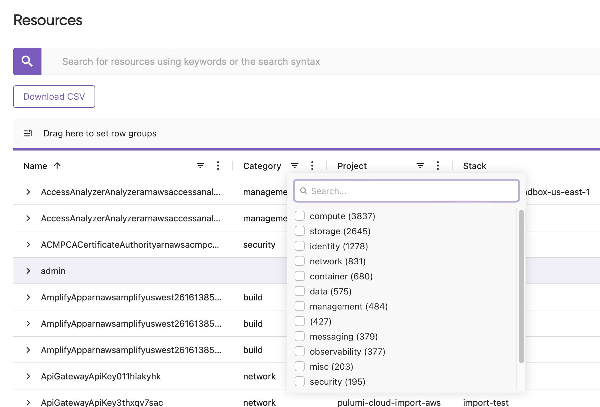
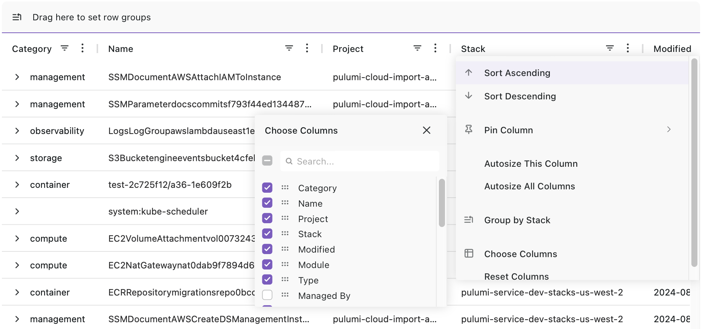
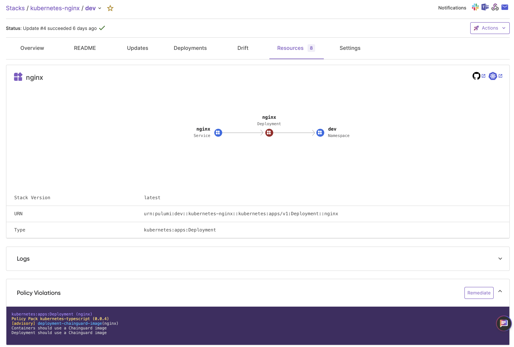
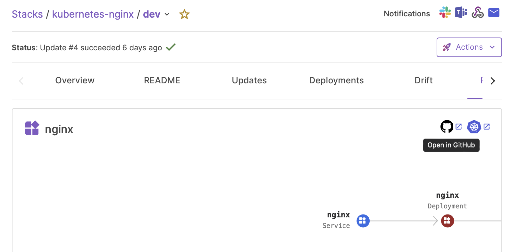
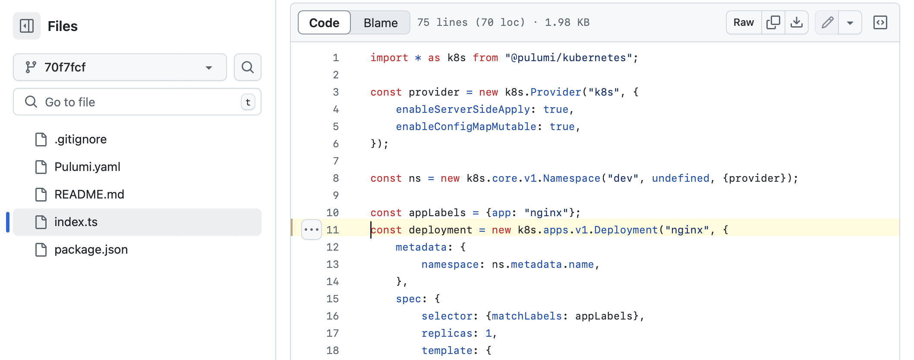
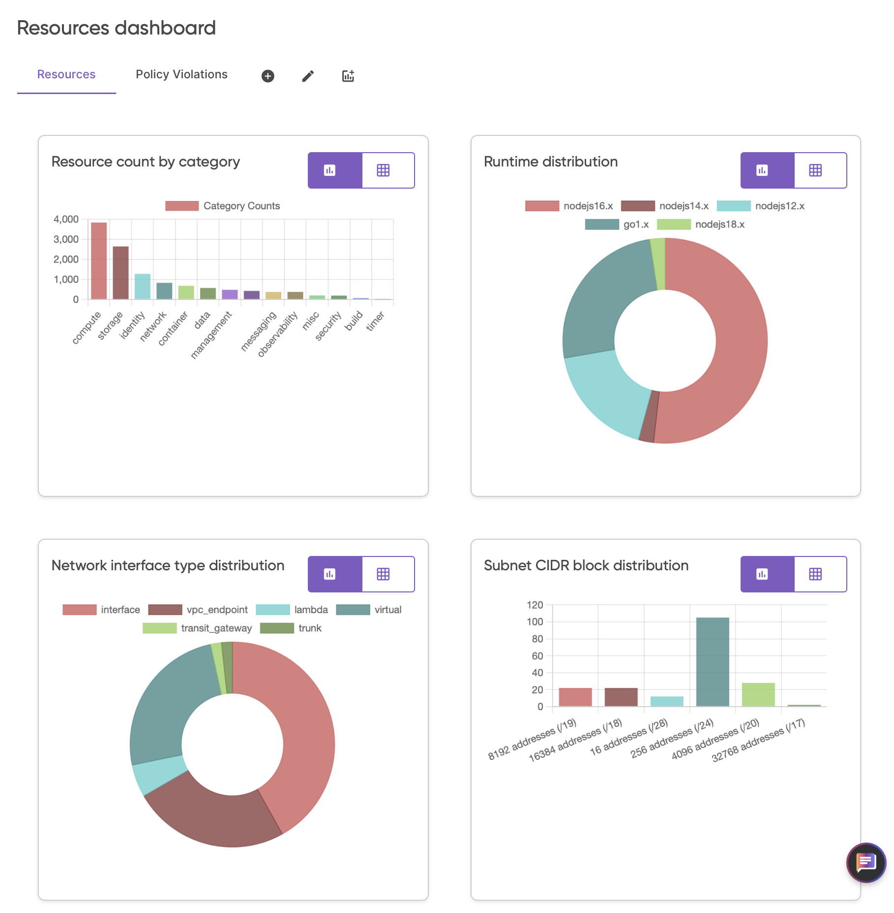
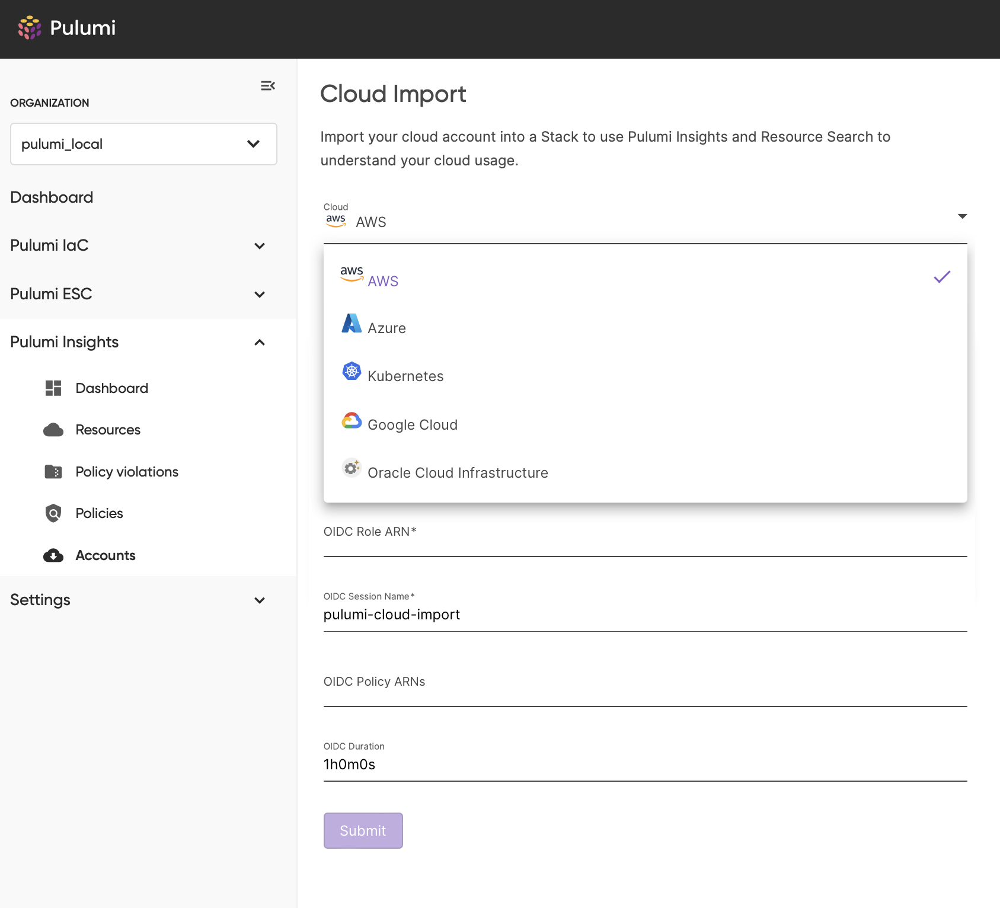
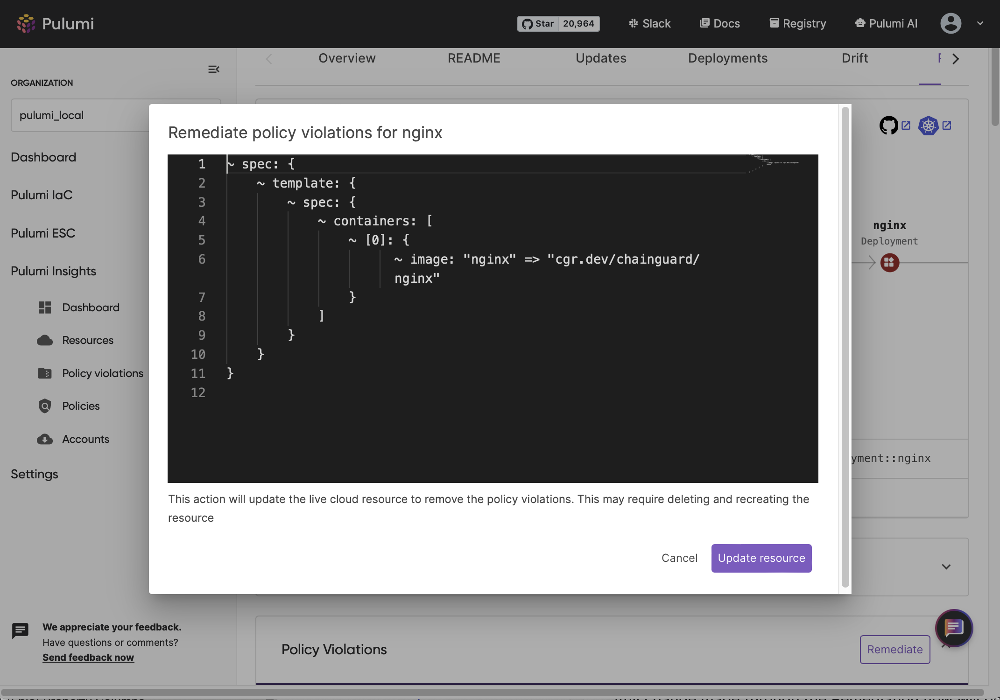

Pulumi Insights 2.0 brings the power of Insights to all of your cloud infrastructure, not just the infrastructure managed by Pulumi IaC. Insights 2.0 also brings an exciting new suite of tools that make it easy to discover your entire infrastructure, assess security and efficiency of it, and bring it under management of IaC for best-in-class infrastructure management practices.

<!--more-->

Today we are outlining our vision for Pulumi Insights 2.0, and the features that are part of Insights 2.0 will be released over the coming weeks and months. [Get started with Pulumi Insights 2.0](/docs/insights/get-started/).

Since the initial launch of Pulumi Insights, customers have used these tools to gain valuable awareness into their IaC platform resources through the flexibility of [Resource Search](/blog/resource-search/) and the power of [Pulumi CrossGuard](/crossguard/). Insights 2.0 builds on this previous generation of tools to provide a range of new capabilities:

* Bring visibility to your entire infrastructure by enabling you to scan and import all of your resources
* Add rich new visual explorers, structured graphs and dashboards for understanding and managing your entire infrastructure
* Extends Pulumi CrossGuard to provide direct remediation of discovered policy violations inside the Pulumi Cloud
* Integrates Pulumi IaC to make it easy to incrementally bring your infrastructure under management with Pulumi IaC in just a few clicks
* Brings Pulumi Copilot to your entire infrastructure for intelligent insight discovery and analysis

## Resources 2.0

The updated Resources page provides a customizable experience for grouping, filtering, sorting and visualizing your resources to help you manage scope and discover new insights about your infrastructure.

**Grouping:** To group by a particular column, drag and drop the column header to the grouping control in the top left of the grid. You can group by multiple columns and can control the order of the grouping by reordering them in the grouping control. Grouping enables you to factor your resources in different ways to help you understand the scope and uncover issues within your infrastructure.



**Filtering:** Adding filters to each column can be done by selecting the filter icon in the column header. A filter dialog will be displayed based on the type of data present in the column. Adding a column filter will add the specific filter to the Resource Search query enabling you to use the grid as a form of query builder.



**Sorting:** To sort your resources by a particular column, click once on the column header to sort in ascending order and click a second time to sort in descending order.

**Column Selection:** To add or remove columns from the grid, select the ‘Choose Columns’ menu item from the column menu selector. This presents a pop up to allow you to add, remove or rearrange the order of columns in the grid.



**Column Resize:** You can resize the width of a column by clicking and dragging on the column boundary line on the right side of the column header. To automatically resize the column to the width of the widest cell contents, double click on the boundary line.

**Copy Contents:** You can copy the contents of a cell to the clipboard by right clicking on the cell and selecting Copy. This is particularly useful for resource values you need to use in other contexts like the Name or URN.

## Policy Violations

The Policy Violations page provides a comprehensive view of all policy violations across your organization, helping you maintain visibility and control over your infrastructure. See the [Policy Violations](/blog/centralized-policy-violations/) blog post for more information.

## Resource Structure Graph

The new resource structure graph provides a visual representation of the relationships for a selected resource. This provides the additional context needed to understand the structure around the resource and what actions might need to be taken.

Within this view you can navigate the relationships by clicking on the related resources. When a resource is clicked, the Resource Detail view navigates to the selected resource to give you the details needed to understand that context.

Policy violations are indicated on the Resource Structure graph to quickly highlight when an insight has been detected and what related nodes are affected.



## Goto Definition

For any resource that is Pulumi IaC managed, the Resource Details page will contain a link to the file and line of code in your source code provider that defines the given resource.



Selecting this link will take you to the file and line making it easy for you to quickly see and edit the IaC code for the given resource.



## User Customizable Dashboard

Pulumi Cloud will provide a rich, user customizable dashboard that enables you to define views of any aspect of your infrastructure. This provides a powerful overview of your infrastructure and lets you easily track progress of any project.

The dashboard supports defining multiple pages so you can create separate dashboards for each application, each department, or any configuration that maps to your configuration.

Each dashboard page enables you to add, remove, rearrange and create new cards. Each new card can be customized to show the aggregate results of a resource field or property including related policy violation fields. The card can be configured to use a variety of different chart and graph visualizations that best suit the associated data.



## Infrastructure Account Scanning

We are excited to introduce Infrastructure Account Scanning (IAS). IAS fundamentally transforms Pulumi Cloud into an Intelligent Cloud Management platform that brings all of the Pulumi Insights capabilities to your entire infrastructure. With IAS, Pulumi can scan your entire infrastructure, even resources that are not IaC managed. This enables you to leverage all of the new tools like, the Resource Explorer with Resource Structure Graphs, Pulumi CrossGruard with Auto Remediation and the Policy Violations Explorer, and the User Customizable Dashboard to manage all of your cloud resources.

IAS leverages the rich ecosystem of Pulumi Platform Providers to discover and read your resources independently of whether they have been moved to IaC.

With IAS Account management you can quickly configure how Pulumi Cloud is enabled to discover new or changed resources keeping your customized Resources, Policy Violations and Dashboard views up to date with your physical infrastructure.



## Auto Remediation

Insights 2.0 provides you the tools needed to understand your infrastructure and uncover issues to ensure you can maintain a secure and efficient cloud platform. In addition to these tools, Pulumi Cloud will also give you the context and tools needed to remediate the issues.

When a policy violation occurs for a given resource and that policy is an [Auto Remediation](/blog/remediation-policies/) policy, a ‘Remediate’ button will be displayed in the Resource Details page. When selected, the Remediate button will run the remediation and show a diff of the infrastructure changes that will be applied in order to remediate targeted insight. If approved, Pulumi Cloud will apply the changes defined by the diff to your infrastructure using the associated Pulumi Providers.

Any change made through the Remediation flow will be tracked and auditable using the Pulumi Audit tools to give you confidence and tracking of the changes made to your infrastructure. In addition, this Remediation flow will provide a warning if the Resource is IaC managed as this change would cause drift with the underlying IaC code. For IaC managed resources it is recommended that you use the new Goto Definition feature to jump to the IaC code for the resource to apply the necessary remediation in the code.



## CLI Resource Query Import

Being able to browse your entire infrastructure and discover new opportunities to move your platform forward enables you to understand and build plans to move your infrastructure forward. However, leveraging Pulumi IaC for managing your resources gives you the best in class tools to ensure your infrastructure is delivering on your strategic goals. Insights 2.0 significantly simplifies the process of migrating your resources to IaC management by making it easy to find the resources needed and create resource queries to define those groups.

The Pulumi cli import command will now support passing a Resource Query as a parameter, simplifying the process of finding, grouping and importing the resources you want. The results of this query will be used to get the resource IDs and types needed to be able to import the resources into your IaC program. The result of the command is the source code needed to construct each of the resources defined by the query.

```shell
pulumi import \-q ‘.volumeType:Standard’
...
import * as pulumi from "@pulumi/pulumi";
import * as aws_native from "@pulumi/aws-native";

const EC2Volumevol0a789ea1874bfac61 = new aws_native.ec2.Volume("EC2Volumevol0a789ea1874bfac61", {
    autoEnableIo: true,
    availabilityZone: "us-west-2b",
    encrypted: false,
    multiAttachEnabled: false,
    size: 8,
    snapshotId: "snap-0d017523dfd31e801",
    tags: [],
    volumeType: "standard",
}, {
    protect: true,
});
...

```

## Visual Resource Import

In addition to the powerful command line tools for simplifying the process of importing your resources into Pulumi IaC, Insights 2.0 will provide an integrated UI workflow for finding and importing resources into IaC. The workflow leverages the rich Insights explorer tools for finding and grouping your resources, then enabling you to automatically create a PR with the generated IaC code for the resource group, all with a click of a button.

## Conclusion

Insights 2.0 provides you the set of tools needed to understand the chaos of modern enterprise clouds and to bring that chaos under control. The ability to scan your entire infrastructure enables you to leverage the rich visualization, remediation, and IaC migrations tools for all aspects of your infrastructure and gives you the insights needed to enable you to deliver on your strategic objectives.

[Get started with Pulumi Insights 2.0](/docs/insights/get-started/).
