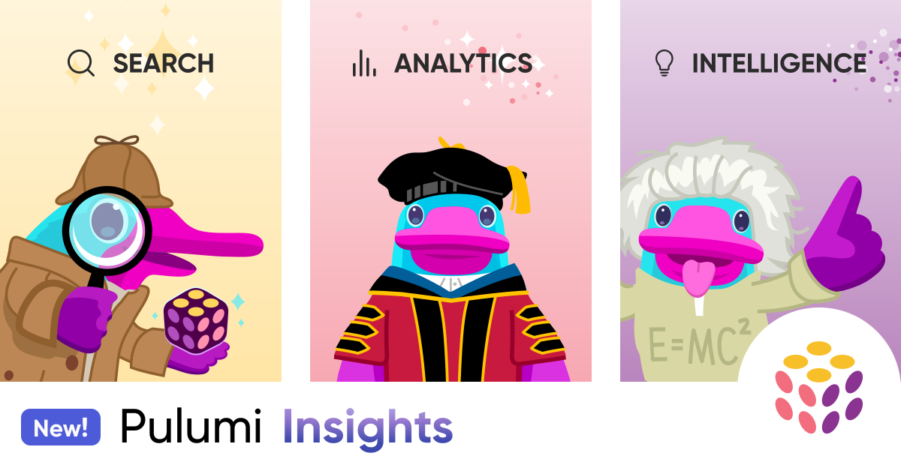
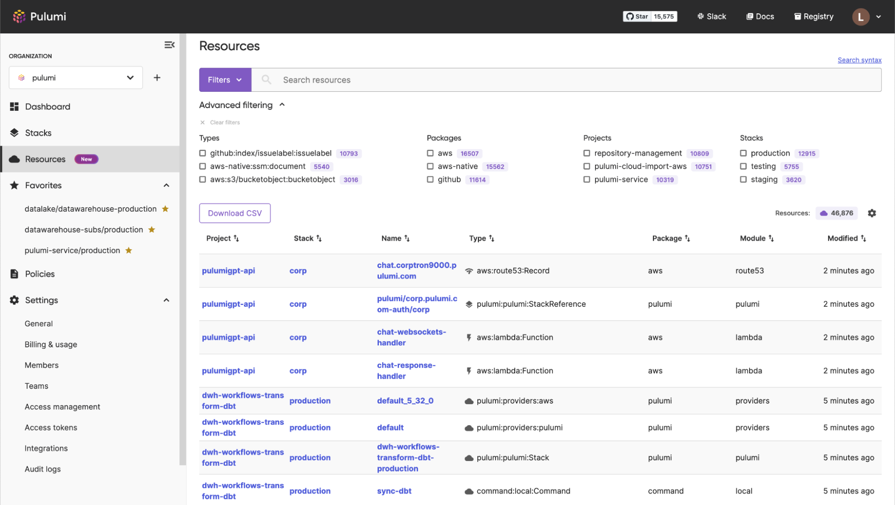
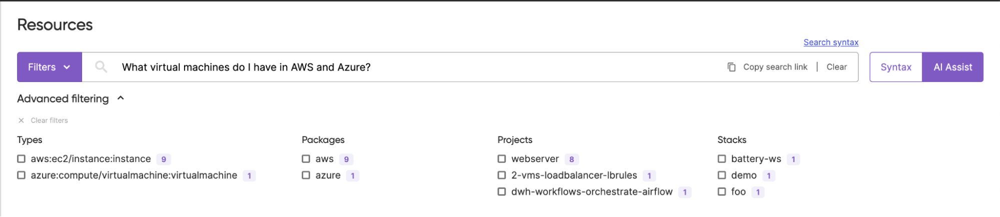
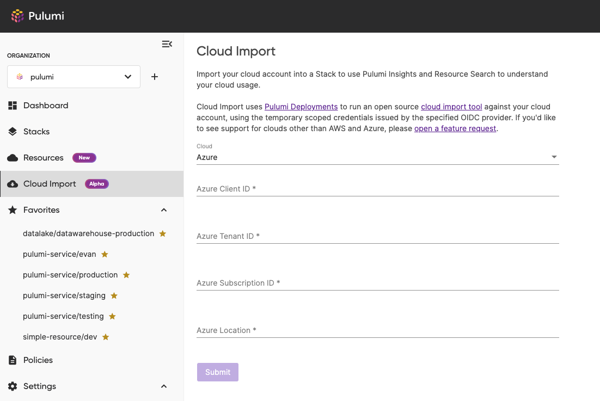
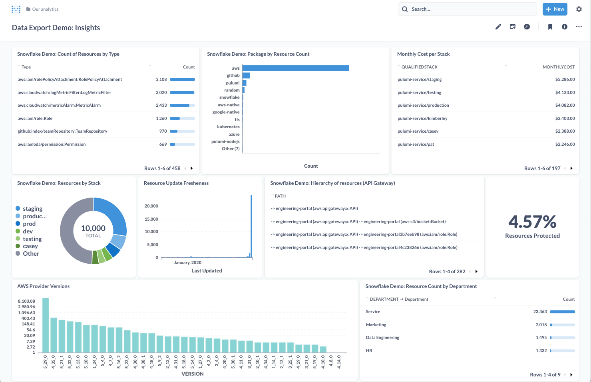

We've seen incredible acceleration of cloud adoption over the past 5 years. Pulumi’s flagship open source IaC solution gives engineers great tools to scale up their cloud infrastructure using the same programming languages and tools they already know and love. As a result, thousands of companies of every size and scale have adopted Pulumi as a lynchpin of their cloud infrastructure strategy.

Today we're excited to announce **Pulumi Insights**, the next major productivity enhancement for infrastructure as code. Pulumi Insights provides intelligence, search, and analytics over any infrastructure, in any cloud across your organization, leveraging the latest advances in generative AI and Large Language Models (LLMs). Whether you have an AWS VPC, a Kubernetes CRD, or a DataDog alarm definition, Pulumi Insights enables you to intelligently find and interact with all of your resources from within the Pulumi Cloud.

<!--more-->

Pulumi Insights was born from partnering with our community and observing their struggles to make sense of millions of cloud resources and resource updates per month, across hundreds of clouds, regions, and accounts. With Pulumi Insights, we now help teams manage cloud footprints of any size with the following key components:

* __🧠 Intelligence__: New AI-powered tool for learning, discovering and building cloud infrastructure with Pulumi, using the power of generative AI and Large Language Models (LLMs).
* __🔎 Search__: Multi-cloud resource search, powered by the Pulumi resource supergraph, which surfaces rich metadata and relationships between cloud infrastructure.
* __📊 Analytics__: Visualize Pulumi resource data with your favorite BI tools, including Excel, Tableau and others, using your own data warehouse for reporting on cost, compliance, and other operational use cases.

All of these features work across Pulumi’s 130+ supported cloud providers, including AWS, Azure, Google Cloud, Cloudflare, and Kubernetes, and can be defined in any programming language, including TypeScript, Python, .NET, Go, Java and YAML.

Pulumi Insights is available for all Pulumi Cloud users today.

## Intelligence - Productivity with the Power of AI

The scale of Cloud APIs is often intimidating for new and even seasoned cloud engineers. At Pulumi, we provide access to hundreds of clouds, tens-of-thousands of resources and hundreds-of-thousands of resource properties. Pulumi has many thousands of examples showing how to solve specific problems, and yet developers still sometimes struggle to find the perfect code snippet that addresses their exact set of requirements.

Our new [Pulumi AI](/ai) is an assistant purpose-built for creating cloud infrastructure using Pulumi. It builds on the power of Large Language Models and GPT to dramatically reduce the time it takes to discover, learn and use new cloud infrastructure APIs. Because Pulumi uses popular programming languages that GPT has already been trained on, Pulumi AI understands how to solve complex Cloud Infrastructure problems.

Using natural language, you can ask to accomplish a specific Cloud Infrastructure goal, and receive a Pulumi program in your favorite language. In addition, Pulumi AI supports iterating on your cloud infrastructure allowing the addition of new features, improving security and performance, fixing correctness issues and clarifying requirements.

The open source [`pulumi-ai`](https://github.com/pulumi/pulumi-ai) CLI takes these ideas even further, by interactively deploying any cloud infrastructure you request using natural language prompts. You can build arbitrarily complex cloud infrastructure, without requiring detailed knowledge of specific APIs! Of course, since we're using Pulumi’s Automation API under the hood, you can go to the Pulumi Cloud console to see everything that has been deployed, and even jump straight into your Cloud Console to inspect the results.

Pulumi AI will enhance your team's ability to go from concept to product. This demo shows Pulumi AI taking natural language input and deploying cloud infrastructure and services which are exposed live on the internet, constantly updating as you refine your request.

Check out Pulumi AI today at [pulumi.com/ai](/ai).

## Search - Find Anything in Any Cloud

Teams don't use just a single cloud or a single cloud account. Indeed, many teams manage resources across dozens of clouds and hundreds of accounts! It can be almost impossible to aggregate and search your infrastructure across these accounts, since every cloud and every account is (by design!) a walled garden.

Pulumi Resource Search offers multi-cloud search and analytics across every environment in your organization. You can issue queries that find all of your AWS VPCs, or all of your VPCs in AWS and Azure, or all resources with the "production" tag across all cloud environments. You also have access to statistics about cloud usage, including a breakdown by cloud provider, resource type, and department. Resource search enables you to find the needle within your cloud haystack and visualize cloud consumption trends.

Infrastructure can be discovered interactively with a rich, structured query language, for example:

* `package:snowflake`
* `data-warehouse stack:production package:aws modified:>=2023-03-21`
* `stack:production type:”github:index/issuelabel:IssueLabel”`
* `package:aws project:pulumi-cloud-import-aws stack:-staging-us-west-2`

Search is powered by the Pulumi resource supergraph, which exposes rich metadata around cloud infrastructure resources and models relationships between resources, such as the project and stack they are deployed from, the components they are part of, the provider used to manage them.  Pulumi enables faceted search, which allows users to specify criteria by applying multiple filters based on classification of resources.

### AI Assist for Search

We are also making available today a private preview of AI Assist for resource search that enables natural language queries. You can provide a plain English (or Spanish, or French, or Japanese!) request, to express queries where you might not know the exact syntax, type tokens, or package names. AI Assist makes it easier to gain insight over infrastructure.  You can [join the waitlist](/product/private-previews/#preview-assist) now for access to this additional functionality for search.

### Cloud Import

While all resources managed by Pulumi are part of the resource supergraph, you can also bring resources defined and managed outside of Pulumi into the graph to make them available for Insights. We're also opening up a private preview of Pulumi Cloud Import, a feature that lets you apply Search and Insights to resources created outside of Pulumi, whether via ClickOps or through other tools like Terraform, CloudFormation, ARM or Kubernetes YAML. You can [join the waitlist](/product/private-previews/#preview-import) for access to these new features today.

Login to the [Pulumi Cloud](https://app.pulumi.com) to start using Resource Search today!

## Analytics - Deeper Insights for Cloud Infrastructure

We are also making the data in the Pulumi supergraph available for export into other Business Intelligence tools for deeper analysis in combination with other key business data. You can visualize resource data with your favorite BI tools, including Excel, Tableau, Looker, PowerBI and others, using your own data warehouse, such as Snowflake, Redshift, Databricks and more, and create reporting on cost, compliance, and many other operational use cases.

The ability to join Pulumi resource data with other key business data in your data warehouse enables users to address a broad range of key business needs - answering questions like:

* _What infrastructure is stale and possibly orphaned / contributing to our cost?_
* _Where are we spending the most, broken down by department or environment?_
* _Are all my primary data stores marked as protected to avoid unintentional deletion?_
* _What are my most commonly used clouds? What are the most common resource types?_
* _Who has performed the most updates across my organization?_

For example, here is a dashboard in Metabase, created by combining Pulumi resource data with cost and department data in a Snowflake data warehouse.

Pulumi resource Data Export is available today both interactively in the console and via REST API . Learn more about these features in the [Pulumi Data Export](/docs/pulumi-cloud/insights/export/) documentation.

## Conclusion

We'd like to express our thanks to the entire community that helped us design, develop, test and ship this incredible release. From Intelligence to Search to Analytics, the new features in Pulumi Insights will make all of us more productive. We’re incredibly excited by the use cases we’ve already seen our customers build, and we can’t wait to see what you build on top of these foundations!

To get started with Pulumi Insights today:

* Sign up or log in to [Pulumi Cloud](https://app.pulumi.com)
* Try out [Pulumi AI](/ai)
* Watch the videos for [Pulumi Insights](https://www.youtube.com/watch?v=MTHGyed3Ef8), [Pulumi AI](https://youtu.be/xdTUEStC8I0) and [Pulumi Search](https://youtu.be/e1u-P9bnEA4)
* Check out the [Pulumi Insights Documentation](/docs/pulumi-cloud/insights/)
* Join the [Pulumi Community Slack](https://slack.pulumi.com/)
