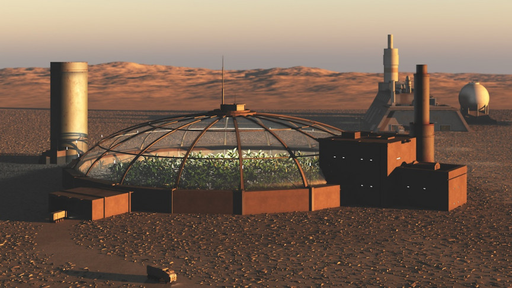

Earth is just the beginning. We are putting down the foundations of space so our children can build their future.  At Pulumi, we are committed to making life multi-planetary. We are excited to announce Pulumi Interstellar, a collection of resource providers that will help us reach the future of a space-faring and multi-planet species.

<!--more-->

For our first offering of space related resource providers, we have aligned closely with the current priorities in the space industry today:

1. Getting to New Planets
1. Making Planets Habitable

We believe that solving those two areas for our customers will enable people to build the future they imagine, on the planets they desire to inhabit. One challenging aspect of achieving our goals is that each new planet represents a different operational environment.

One might think the right solution for provisioning and managing resources in space would be a proprietary domain-specific language designed from the ground up to operate in these new environments. However 10 out of 10 leading rocket scientists confirm that the heterogeneous diversity of existing programming languages allows us to move faster and with less frustration.

In the following sections we will take a closer look at the two main areas defined above and how you too can begin building the future in a familiar programming language like JavaScript, TypeScript, Python, Go, or .NET.

## Rockets As Code

Rockets are the first step to making humans a multi-planet species, they enable you and your resources to travel to new planets. Today, we are extremely excited to introduce the Pulumi Rocket Provider, which allows users to configure rocket fuel requirements, initiation sequences, configure deployment payloads, reserve seats, and much more.

In the initial release of the Rocket Provider we are happy to enable two key use cases: Resource Deployment and Planetary Travel.

### Resource Deployment



{}

```typescript
import * as tyrell from "@pulumi/tyrell"

const engineId = tyrell.rocket.getEngine({
   owners: ["420"],
   mostRecent: true,
   filters: [{name: "SuperDraco", values: ["tyrell/engines/super-draco-15.03-*"]}],
});

const spaceship = new tyrell.spaceship.Instance("Edward Isreal", {
   instanceType: tyrell.spaceship.InstanceTypes.interplanetary,
   engine: engineId,
   capability: "kuiper_belt",
}];
```

{}

{}

```python
from pulumi_tyrell import rocket, spaceship

engine_id = rocket.getEngine(
    owners=["420"],
    most_recent=true,
    filters="""[
        {name: "SuperDraco", values: ["tyrell/engines/super-draco-15.03-*"]}
    ]""",
)

spaceship = spaceship.Instance("Edward Isreal",
    instanceType=spaceship.instance_types.interplanetary,
    engine=engineId,
    capability="kuiper_belt"
)
```

{}

{}

```csharp
using Pulumi;
using Tyrell = Pulumi.Tyrell;

class MyStack : Stack
{
    public MyStack()
    {
        var engineId = new Tyrell.Rocket.GetEngine(new Tyrell.Rocket.GetEngineArgs
        {
            Owners =
            {
                "420",
            }
            MostRecent = true,
            Filters = {
                { "name": "SuperDraco", "values": ["tyrell/engines/super-draco-15.03-*"] },
            }
        });

        var spaceship = new Tyrell.Spaceship.Instance("", new Tyrell.Spaceship.InstanceArgs{
            InstanceType = Tyrell.Spaceship.InstanceTypes.Interplanetary,
            EngineId = engineId,
            Capability = "kuiper_belt",
        });
    }

}
```

{}

{}

```go
package main

import (
	"github.com/pulumi/pulumi-tyrell/sdk/v3/go"
	"github.com/pulumi/pulumi/sdk/v2/go/pulumi"
)

func main() {
	pulumi.Run(func(ctx *pulumi.Context) error {
        engineId, err := tyrell.Rocket.GetEngine(&tyrell.Rocket.GetEngineArgs{
            Owners:     []string{"420"},
            MostRecent: true,
            Filters:    []RocketEngineFilter{
                RocketEngineFilter{
                    Name:   "SuperDraco",
                    Values: []string{"tyrell/engines/super-draco-15.03-*"},
                },
            },
        })
        if err != nil {
            return err
        }

        spaceship, err := tyrell.Spaceship.Instance("Edward Isreal", &tyrell.Spaceship.InstanceArgs{
            InstanceType: tyrell.Spaceship.InstanceTypes.Interplanetary,
            EngineId:     engineId,
            Capability:   "kuiper_belt",
        })
        if err != nil {
            return err
        }

		return nil
	})
}
```

{}



On Day 1 you can deploy resources via reusable rockets. By declaring a payload on your Rocket, you tell Pulumi to deliver the payload to the location specified. Resource Deployments will be particularly useful when configuring a new planet in the initial stages, as you can deploy new resources and terraforming equipment in a consistent, repeatable, and scalable manner.

Once the rocket arrives at its destination, Pulumi’s Space AI Assistant, nicknamed IRWIN, will take control to ensure your resources are deployed efficiently and correctly. By using Resource Deployments you can ensure your infrastructure and workloads are up and running before arriving on your new planet.


### Planetary Travel



{}

```typescript
const config = pulumi.Config();
const passengers = config.require("passengers");

const seats = tyrell.tyrell.PassengerGroup("Robinsons", {
   spaceshipId: spaceship.then(it => it.id),
   seats: passengers,
   departure: "Luna",
   destination: "Mars",
   berth: "Colonist",
}];
```

{}

{}

```python
config = pulumi.Config()
passengers = config.require("passengers")

seats = tyrell.tyrell.PassengerGroup("Robinsons",
    spaceshipId=spaceship.id,
    seats=passengers,
    departure="Luna",
    destination="Mars",
    berth="Colonist",
)
```

{}

{}

```csharp
var config = Pulumi.Config();
var passengers = config.require("passengers");

var seats = new Tyrell.Tyrell.PassengerGroup("Robinsons", new Tyrell.Tyrell.PassengerGroupArgs
{
    SpaceshipId = spaceship.id,
    Seats = passengers,
    Departure = "Luna",
    Destination = "Mars",
    Berth = "Colonist",
});
```

{}

{}

```go
config := pulumi.Config()
passengers := config.require("passengers")

seats, err := tyrell.PassengerGroup("Robinsons", &tyrell.PassengerGroupArgs{
    SpaceshipId: spaceship.id,
    Seats:       passengers,
    Departure:   "Luna",
    Destination: "Mars",
    Berth:       "Colonist",
})
```

{}



Once a planet is habitable and configured to your specifications, you will need a way to travel to your new home. Simply adding a `seats` argument to any Rocket will reserve those seats (as they eventually become available).

When your program completes deployment, you will receive a reservation confirmation via the email you used to register for the Pulumi Service. If you are an open source user, you will need to provide a valid email address via the `--confirmation-email` flag to receive your confirmation email.

## Terraforming As Code

One of the most challenging obstacles preventing humans from becoming a multi-planet species is that Earth is the only planet in the known solar system that supports life. While there are many options for making other planets liveable, the team at Pulumi believes in the two step model towards habitability.

First, we need to provision dome-based communities in a repeatable and scalable manner. Once we have established our dome communities, we can then terraform any planet using the latest technology, i.e., nuclear missiles.

### Dome-Based Communities



{}

```typescript
import * as weyland from "@pulumi/weyland-yutani"

const domeId = weyland.dome.getDome({
    owners: ["099720109477"],
    mostRecent: true,
    filters: [{ name: "name", values: ["weyland-yutanu/terraforming/acheron-*"] }],
}).then(it => it.id);

const terradome = weyland.dome,Instance("Hadley's Hope", {
   instanceType: weyland.dome.InstanceType.LV_246,
   dome: domeId,
   type: "atmospheric-processor",
}];
```

{}

{}

```python
from pulumi_weyland_yutani import dome

dome = dome.get_dome(
    owners=["099720109477"],
    most_recent=true,
    filters="""[
        {name: "BasicDome", values: ["weyland-yutanu/terraforming/acheron-*"]}
    ]""",
)

terradome = dome.Instance("Hadley's Hope",
    instance_type=dome.instance_type.lv_246,
    dome=dome.id,
    type="atmospheric-processor",
)
```

{}

{}

```csharp
using Pulumi;
using WeylandYutani = Pulumi.WeylandYutani;

class MyStack : Stack
{
    public MyStack()
    {
        var dome = new WeylandYutani.Dome.GetDome(new WeylandYutani.Dome.GetDomeArgs
        {
            Owners =
            {
                "099720109477",
            }
            MostRecent = true,
            Filters = {
                { "name": "BasicDome", "values": ["weyland-yutanu/terraforming/acheron-*"] },
            }
        });

        var terradome = new WeylandYutani.Dome.Instance("Hadley's Hope", new Weyland.Yutani.Dome.InstanceArgs
        {
            InstanceType = Weyland.Dome.InstanceType.LV_246,
            Dome = dome.Id,
            Type = "atmospheric-processor",
        });
    }

}
```

{}

{}

```go
package main

import (
	"github.com/pulumi/pulumi-weyland-yutani/sdk/v3/go"
	"github.com/pulumi/pulumi/sdk/v2/go/pulumi"
)

func main() {
	pulumi.Run(func(ctx *pulumi.Context) error {
        dome, err := weyland.Dome.GetDome(&weyland.Dome.GetDomeArgs{
            Owners:     []string{"099720109477"},
            MostRecent: true,
            Filters:    []RocketEngineFilter{
                RocketEngineFilter{
                    Name:   "BasicDome",
                    Values: []string{"weyland-yutanu/terraforming/acheron-*"},
                },
            },
        })
        if err != nil {
            return err
        }

        terradome, err := weyland.Dome.Instance("", &weyland.Dome.InstanceArgs{
            InstanceType: weyland.Dome.InstanceType.LV_246,
            Dome:         dome.Id,
            Type:         "atmospheric-processor",
        })
        if err != nil {
            return err
        }

        return nil
	})
}
```

{}



The first step to establish humanity on other planets is to provision dome-based communities and build critical infrastructure and resources while we work to terraform the planet. Out of the box, Pulumi provides boilerplate communities that are flexible and resilient enough to support any use case.



### Nuclear Terraforming

While we will not be able to support nuclear terraforming on Day 1, we are working extremely diligently to ensure our customers have access to state of the art terraforming techniques. We hope to bring a preview of Nuclear Terraforming to customers in early Q3 of 2022. Be on the lookout for monthly updates as we develop this new groundbreaking technology.


## How To Get Started

Getting started is as simple as getting started with any other Pulumi resource provider, you just need to download the package with your preferred language’s package manager, configure the provider, and then start building. All space resources are billed via Dogecoin, so you will need to provide a wallet address in your provider’s arguments.

```bash
$ pulumi config set --secret doge DilB3JrTyGm55FiMyRlhM7NZmfj0J9QVX
```

Don't worry, we'll encrypt your wallet address. Your Dogecoin wallet will go straight to your provider and Pulumi never receives or handles your secrets.

## Summary

Today is one of the most exciting days in Pulumi's short history and we are incredibly excited to partner with our customers and leading space companies to make our multi-planetary dreams a reality. We cannot wait to see what you’ll build!

<div class="rounded shadow-md" style="position: relative; padding-bottom: 56.25%; height: 0; overflow: hidden;">
    <iframe
        src="//www.youtube.com/embed/oHg5SJYRHA0?rel=0"
        style="position: absolute; top: 0; left: 0; width: 100%; height: 100%; border:0;"
        title="Pulumi Interstellar"
        srcdoc="<style>*{padding:0;margin:0;overflow:hidden}html,body{height:100%}img{position:absolute;width:100%;top:0;bottom:0;margin:auto}</style><a href=https://www.youtube.com/embed/oHg5SJYRHA0?autoplay=1></a>"
    ></iframe>
</div>
